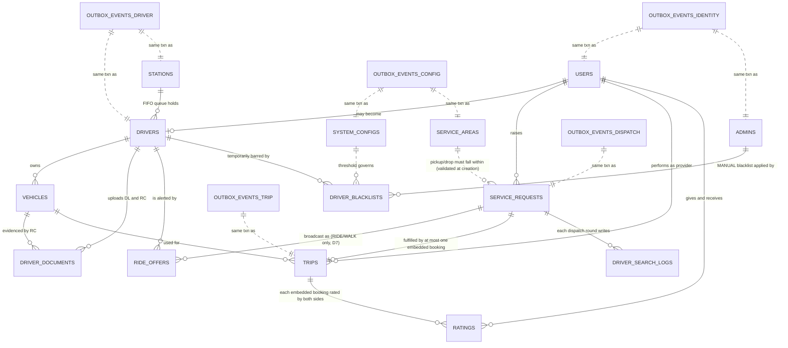

# Tutem — MongoDB Schema Design (Agent 1: Schema Architect)

> **Status:** DRAFT — awaiting Schema Reviewer (Agent 2) and Architecture Consistency Checker (Agent 3).
> **Role boundary:** this document designs the MongoDB data model **only**. It does not add, remove, or
> rename a service, a Kafka topic, an event class, a consumer group, or a partition key. Every service
> name, table-ownership assignment, event class, topic name and partition key below is copied **verbatim**
> from the approved documents and is treated as immutable input, per the orchestrator's rulings R1–R6.
> **Inputs read in full:** `../use-case.md`, `../NewSchema.md`, `../Kafka/00-architecture-baseline.md`,
> `../Kafka/02-kafka-topics.md`, `../Kafka/03-kafka-events.md`, `../Kafka/05-consumers.md`,
> `../Kafka/06-producers.md`, `../Kafka/ADR-Kafka-Architecture.md`, `../Prompts/mongo-schema-prompt.md`.
> **Engine target:** MongoDB 7.0+, replica-set-backed from day one (transactions require it), sharding
> introduced only where §7 (H6/H7) justifies it.

---

## 0. Orchestrator rulings applied (R1–R6) — restated as design constraints

| Ruling | How this document honours it |
|---|---|
| R1 — one database `tutem`, many collections | Single logical database `tutem`; every collection below lives in it. No per-service physical database. |
| R2 — the approved 8 service names | `api-gateway`, `realtime-gateway`, `identity-service`, `driver-service`, `dispatch-service`, `trip-service`, `notification-service`, `config-service`. The prompt's "User/Ride/Carpool/Walk Service" example is **rejected** as conflicting with these. |
| R3 — unified `service_request`/`trip`/`booking` model | Preserved. No `carpools`/`walk_requests`/`ride_requests` collections. `booking` is **not** its own top-level collection — see §4.3 (H4) for why it is embedded inside `trip` instead, which is a *stronger*, not weaker, form of the same "one structural decision" NewSchema §1.3 asks to keep. |
| R4 — table ownership 1:1 | `users`, `admins`→identity-service; `drivers`, `vehicles`, `driver_documents`, `driver_blacklists`, `stations`→driver-service; `service_requests`, `ride_offers`, `driver_search_logs`→dispatch-service; `trips`, `ratings`→trip-service; `system_configs`, `service_areas`→config-service. `api-gateway`, `realtime-gateway`, `notification-service` own **no** domain collection, exactly as baseline §2.0/§4 states. |
| R5 — outbox is infrastructure, one per owning service | 5 outbox collections (`outbox_events_identity`, `outbox_events_driver`, `outbox_events_dispatch`, `outbox_events_trip`, `outbox_events_config`), mirroring the 5 owning-service Postgres outbox schemas 1:1. See §8. |
| R6 — user decisions D4–D7 | Carpool never produces a `ride_offer` document (D7); "full" (`seatsBooked == seatsTotal`) is computed, never stored as a status (D6); blacklist evidence reads `status IN ('REJECTED','EXPIRED')`, never `WITHDRAWN` (D4); Walk is paid, `fareAmount`/`paymentStatus` apply uniformly to RIDE/CARPOOL/WALK (D5); every user alert is dual-path (WebSocket + FCM) — this is a notification-delivery concern, not a schema concern, and is not re-litigated here. |

**AUDIT-FIX (post-review addendum).** The old-schema audit (`Mongo/old-schema-audit.md`) flagged three
capabilities the monolith had that this document's first draft silently dropped rather than deliberately
cutting: an admin/RBAC account model (old `AdminLog`), fixed-station/geofence reference data (old
`BitsLocation`/`MumbaiBoundary`/`Station`/`FifoStationData`), and a dispatch-search audit trail (old
`DriverSearchLog`). All three are genuine product gaps, not intentional simplifications like the CTRG domain
or location-history breadcrumbs (§4's "Deliberately left out" reasoning does not apply to any of them), so
four collections are added below: `admins`, `service_areas`, `stations`, `driver_search_logs` — designed in
§4.11–§4.14, following the exact same validator/index/ownership discipline as every other collection in this
document, never bolted on as an afterthought.

**Final collection list — 14 domain collections + 5 outbox collections + 5 outbox-sequence-counter
collections = 24 collections, one database.** (GAP-FIX: the original draft mis-stated this as
"11 domain / 21 total" against a table that actually showed 10/20, and the first AUDIT-FIX pass propagated
that off-by-one forward instead of correcting it — the figures above are the corrected, table-verified
count.) (The 5 counter collections are AGENT-4 CRITICAL-2's fix —
see §5.1 and decision AGENT4-D2 in §19 — added so that the sharded-counter mechanism has its own
single-owner collection per service, exactly mirroring the outbox split, instead of one shared collection
that no single service would own.)

| # | Collection (snake_case, plural) | Owning service | Origin table(s) |
|---|---|---|---|
| 1 | `users` | identity-service | `app_user` |
| 2 | `admins` | identity-service | `AdminLog` (AUDIT-FIX, §4.11) |
| 3 | `drivers` | driver-service | `driver` |
| 4 | `vehicles` | driver-service | `vehicle` |
| 5 | `driver_documents` | driver-service | `driver_document` |
| 6 | `driver_blacklists` | driver-service | `driver_blacklist` |
| 7 | `stations` | driver-service | `Station` + `BitsLocation` + `FifoStationData` (AUDIT-FIX, §4.13) |
| 8 | `service_requests` | dispatch-service | `service_request` |
| 9 | `ride_offers` | dispatch-service | `ride_offer` |
| 10 | `driver_search_logs` | dispatch-service | `DriverSearchLog` (AUDIT-FIX, §4.14) |
| 11 | `trips` | trip-service | `trip` **+ `booking` embedded** (§4.3) |
| 12 | `ratings` | trip-service | `rating` |
| 13 | `system_configs` | config-service | `system_config` |
| 14 | `service_areas` | config-service | `MumbaiBoundary` (AUDIT-FIX, §4.12) |
| 15 | `outbox_events_identity` | identity-service | infrastructure |
| 16 | `outbox_events_driver` | driver-service | infrastructure |
| 17 | `outbox_events_dispatch` | dispatch-service | infrastructure |
| 18 | `outbox_events_trip` | trip-service | infrastructure |
| 19 | `outbox_events_config` | config-service | infrastructure |
| 20 | `outbox_seq_counters_identity` | identity-service | infrastructure (AGENT-4 CRITICAL-2, §5.1) |
| 21 | `outbox_seq_counters_driver` | driver-service | infrastructure (AGENT-4 CRITICAL-2, §5.1) |
| 22 | `outbox_seq_counters_dispatch` | dispatch-service | infrastructure (AGENT-4 CRITICAL-2, §5.1) |
| 23 | `outbox_seq_counters_trip` | trip-service | infrastructure (AGENT-4 CRITICAL-2, §5.1) |
| 24 | `outbox_seq_counters_config` | config-service | infrastructure (AGENT-4 CRITICAL-2, §5.1) |

`admins`, `service_areas`, and `stations` each publish through their owning service's **existing** outbox
collection (`outbox_events_identity`/`outbox_events_config`/`outbox_events_driver` respectively) — none of
them needs a 25th/26th outbox collection of its own, since R5's "one outbox per owning service", not "one per
collection", is what the ruling actually requires. `driver_search_logs` is the one exception: it is a
write-only diagnostic trail with no downstream Kafka consumer, so it deliberately does **not** go through the
outbox at all — see §4.14 for why that is a considered decision, not an oversight.

`booking` does **not** get its own top-level collection. This is the one deliberate structural departure
from a literal 1:1 table mapping, justified in full in §4.3 (H4) and directly supported by the Kafka ADR's
own aggregate registry, which already states: *"`Booking` is an entity of the `Trip` aggregate: one
transaction covers the trip row and its bookings"* (`00-architecture-baseline.md` §0.2.1). MongoDB lets that
statement become the literal physical model instead of an application-enforced convention.

---

## 1. ID strategy — decisive choice: UUID string as `_id`

**Decision: every `_id` and every cross-document reference field (`riderId`, `driverId`, `requestId`,
`tripId`, `vehicleId`, `bookingId`, …) is a canonical 36-character UUID v4 string, generated by the
application (`UUID.randomUUID().toString()`), never MongoDB's native `ObjectId` generator.**

| Option | Verdict | Why |
|---|---|---|
| Native `ObjectId` | Rejected | The Kafka envelope contract is **already approved and immutable**: `aggregateId`, `eventId`, and every business id in every one of the 39 events' payload tables are typed `UUID` (`03-kafka-events.md` §0, §1–§6, verbatim). An `ObjectId`-keyed domain would force a translation layer at every publish and every consume, in every one of the 5 outbox relays and 30 consumer groups, for no benefit — and one that is easy to get subtly wrong (`ObjectId.toHexString()` is 24 hex chars, not a UUID; ordering semantics differ). |
| UUID as BSON `Binary` subtype 4 | Rejected (for now) | Correct and compact (16 bytes vs 36), but every service, every log line, every Kafka payload field, and every REST path already carries the **canonical hyphenated string form** per `00-architecture-baseline.md` §0.9/§0.10. Binary subtype 4 buys index-size savings at the cost of a driver-level (de)serialization step at *every* boundary — Mongo shell inspection, `mongoexport`, Compass, and ad-hoc debugging all show raw bytes or require the exact same UUID codec configured identically across 8 services. For a 3-developer team this is a real, recurring footgun for a savings that only matters once write volume is much higher than today's ~1,300–1,500 msg/s cluster-wide figure (`01-kafka-architecture.md` §2.1, referenced transitively). **Flagged as the first thing to revisit if index-size profiling on `service_requests`/`ride_offers`/`trips` ever becomes a bottleneck** — the migration path is additive (a `$binary` codec on the driver, no schema change) and does not require a data rewrite if UUIDs are stored as `Binary` subtype 4 from day one behind a driver-level codec that (de)serializes transparently to/from the string form the rest of the stack already expects. Not adopted now because it adds an operational dependency (every service must configure the same UUID-to-Binary codec) for a cost that is not yet demonstrated. |
| UUID string | **Adopted** | Zero-translation match to the immutable Kafka envelope and partition-key contracts; human-readable in `mongosh`/Compass/logs; identical to what every REST path and every event payload already carries. Cost: ~3x the index-entry size of `ObjectId` (36 bytes vs 12) — accepted, quantified per-collection in §7. |

**Flutter/Mongoose legacy-id compatibility — flagged, not decided (per the prompt's explicit instruction).**
The orchestrator's brief states the existing Flutter clients were built against a Node/Mongoose backend,
so `ObjectId`-shaped ids (24 hex characters) may already be hard-coded into client-side validation or
routing. This is an **input the Orchestrator is gathering, not something this document can resolve**, but
the two candidate outcomes are both compatible with the choice above without touching the approved Kafka
contract:
- **If Flutter has no `ObjectId`-format assumption** (most likely for a fresh Tutem-only rebuild — the CTRG
  project and "other unnecessary modules" are being removed per `CLAUDE.md`): UUID strings work as-is, no
  shim needed.
- **If Flutter does assume 24-hex-char ids somewhere**: the fix belongs at `api-gateway`, as a
  presentation-layer id-format shim on the public REST surface only — **never** inside the domain schema or
  the Kafka envelope, both of which are already approved and must not be redesigned to satisfy a client
  detail. This keeps the escalation contained to one edge component if it turns out to be needed.

**`_id` is therefore always the aggregate's own natural UUID** — `users._id` = `userId`, `drivers._id` =
`driverId` (mirroring NewSchema's own `driver.user_id AS PRIMARY KEY`, NewSchema §4.2), `trips._id` =
`tripId`, etc. No collection introduces a synthetic surrogate key on top of the UUID it already has.

---

## 2. Collection relationship diagram



**Note on `DRIVER_SEARCH_LOGS`:** the diagram edge above is drawn `||--o{` (a real one-to-many) purely for
readability — the collection carries no schema-level `ref`/FK back to `service_requests` and is never
`.populate()`-style joined; `requestId` is an optional, unenforced correlation field (§4.14), matching the
old audit's own honesty about which relationships are "real" versus application-inferred (§3 of
`old-schema-audit.md`).

**Note on `TRIPS ||--o| SERVICE_REQUESTS`:** unlike the SQL ER diagram, there is no separate `BOOKING`
entity node here — a `trip` document's `bookings[]` array *is* the booking relationship, embedded. This is
the H4/R3 decision explained in §4.3.

---

## 3. The seven hard problems

### H1 — The accept race

NewSchema §4.6 settles "only one driver can accept" with partial unique index `uq_offer_single_accept` on
`ride_offer(request_id) WHERE status='ACCEPTED'`, one conditional `UPDATE`, no locks. MongoDB reproduces
this **exactly**, with one genuinely new subtlety that Postgres's single-index design does not have.

**Indexes on `ride_offers`:**

```js
// ► the core invariant — at most one ACCEPTED offer per request
db.ride_offers.createIndex(
  { requestId: 1 },
  { unique: true, partialFilterExpression: { status: "ACCEPTED" }, name: "uq_offer_single_accept" }
);

// a driver considers one alert at a time
db.ride_offers.createIndex(
  { driverId: 1 },
  { unique: true, partialFilterExpression: { status: "SENT" }, name: "uq_offer_one_pending" }
);

// a driver is offered a given request at most once
db.ride_offers.createIndex(
  { requestId: 1, driverId: 1 },
  { unique: true, name: "uq_offer_once" }
);
```

**The accept command — one statement, no lock, identical shape to the SQL:**

```js
const now = new Date();
const result = await db.ride_offers.findOneAndUpdate(
  { _id: offerId, status: "SENT", expiresAt: { $gt: now } },
  { $set: { status: "ACCEPTED", respondedAt: now } },
  { returnDocument: "after" }
);
// result === null → the driver was too slow, or another driver already won → "ride already taken"
// result !== null → this driver won; in the SAME multi-document transaction (see H3) create the trip
//                    document, set request.status='MATCHED', and mark sibling offers 'WITHDRAWN'
```

**The subtlety `uq_offer_single_accept` alone does not cover, and why the index still saves it.** Two
*different* documents (different drivers' offers, same `requestId`) can each independently satisfy their
own `findOneAndUpdate` filter (`_id: ownOfferId, status: "SENT"`) at the same instant — nothing in that
filter looks at sibling documents. Under Postgres, `uq_offer_single_accept` is a single, global partial
unique index across the whole table, so the second `UPDATE` fails outright inside its own statement.
**MongoDB's behaviour is the same, but the failure surfaces differently**: `findOneAndUpdate` on driver B's
own document *succeeds at matching and applying the `$set`*, and it is the **partial unique index write
check** that then throws `E11000 duplicate key error` on `requestId` when B's document is persisted with
`status: "ACCEPTED"` while A's already holds that status for the same `requestId`. The application **must**
catch `E11000` on this specific write and treat it identically to a `null` result — "someone else already
won" — never as an unhandled error. This is the one place a MongoDB port of a Postgres single-statement
guarantee needs an explicit two-branch error-handling contract instead of relying on the return value alone;
it is called out here so it is not silently missed in the trip-service/dispatch-service implementation.

**`uq_booking_request` — "a request is fulfilled at most once, ever":** since `booking` is embedded inside
`trip` (§4.3), this becomes a **multikey unique index** on the embedded array field, enforced
collection-wide across every `trips` document, not per-document:

```js
db.trips.createIndex(
  { "bookings.requestId": 1 },
  { unique: true, name: "uq_booking_request" }
);
```

MongoDB unique indexes on array fields index each array element as a separate key and enforce uniqueness
across the **entire collection** — this reproduces `uq_booking_request`'s "ever, across all trips" semantics
exactly, including for CARPOOL trips whose `bookings[]` array holds several entries.

**Verdict: all three SQL guarantees (`uq_offer_single_accept`, `uq_offer_one_pending`, `uq_booking_request`)
are fully expressible in MongoDB.** Nothing here is quietly dropped.

### H2 — The carpool corridor match (the biggest technical risk)

NewSchema §4.12-B needs: both pickup and drop within a detour corridor of the driver's route, **and**
pickup-before-drop along that route (direction), ordered by position along the route (which **is**
`booking.pickup_order`). PostGIS does this with `ST_DWithin` + `ST_LineLocatePoint`.

**Stated plainly, per the brief's instruction not to gloss over this: MongoDB's `2dsphere` index has no
equivalent of `ST_LineLocatePoint`.** `$geoWithin`/`$geoIntersects` can answer "is this point near the
corridor?" — a region test — but **cannot** answer "how far along the route is this point?", which is what
both the direction test and the pickup-ordering value require. No combination of native 2dsphere operators
computes a scalar linear-referencing position. This is not a query-tuning problem; the operator does not
exist.

**Chosen option: (a) + (b) combined — a precomputed corridor polygon for the coarse filter, plus a stored
ordered route-points array (with cumulative distance) for exact application-side projection maths.** Option
(d) — a dedicated PostGIS/geo microservice — is explicitly **not** chosen: it would add a 9th deployable and
a new service boundary, which is outside this agent's mandate and squarely one of the prompt's five human-
escalation triggers (§9.1, item 2). Option (c) (precompute a route-index per candidate *at match time*) is
subsumed by (a)+(b): the projection is computed at match time anyway, just cheaply, over a small
already-filtered candidate set instead of the whole `service_requests` collection.

**What is stored on the `trips` document at carpool-trip-creation time** (when the driver's route polyline
is fetched from the Routing API — a `[SYNC-CRITICAL]` step per the baseline, unaffected by this document):

| Field | Type | What it replaces |
|---|---|---|
| `routeLine` | GeoJSON `LineString` | Kept for display/detail rendering — direct analogue of `trip.route_line`. |
| `routePoints` | array of `{ seq: int, loc: GeoJSON Point, cumDistM: double }` | **New** — the driver's route densified to its constituent polyline vertices (typically tens of points, not hundreds), each carrying its cumulative distance from the route origin. This is the structure application code walks to compute "how far along the route is point P" by finding the nearest segment and linearly interpolating — the literal hand-written equivalent of `ST_LineLocatePoint` that NewSchema §4.12 itself names as "the cost being avoided" by using PostGIS, now paid deliberately as the accepted cost of moving to MongoDB. |
| `corridorPolygon` | GeoJSON `Polygon` | **New** — the route buffered by `carpool.max_detour_km` (from `system_configs`), computed once at trip-creation time using a geometry library (e.g. JTS) in trip-service's own code, **not** by MongoDB. This is the coarse spatial filter — MongoDB's job is only to answer "is this point inside this precomputed polygon?", which `2dsphere`/`$geoWithin` does natively and efficiently. |

**The matching query — coarse filter in MongoDB, exact ordering in application code:**

**AGENT-4 fix (INCONSISTENCY-1, Agent 3 ownership violation).** The pseudocode below was corrected: `trip`
is a `trips` document owned by **trip-service**; `dispatch-service` (the `carpool-matching` module) is a
**different owning service** and must never read another service's collection directly — this is exactly
the rule the baseline states verbatim (`00-architecture-baseline.md` §2.5: "`trip.route_line` is fetched by
trip-service, which owns the column… dispatch-service reads the finished route line from trip-service", and
the baseline diagram's `DSP -->|"read trip.route_line for §4.12-B (sync, internal)"| TRP` edge). The
`routePoints`/`corridorPolygon` fields are the MongoDB-shaped superset of that same `route_line`, so the
same rule applies to them without exception. **Corrected shape: `trip` below is obtained via a synchronous
internal API call from dispatch-service to trip-service**, mirroring the already-approved
`POST /internal/v1/drivers/nearby` pattern (driver-service → dispatch-service, same style of internal
sync hop). **The exact endpoint/shape is itself an INHERITED-OPEN item, not invented here** — it is listed
verbatim as open in `05-consumers.md` §7 item 4 ("`dispatch-service.carpool-matching.v1` (§3.2) reads
`trip.route_line` via an internal-API hop to trip-service… dispatch-service never reads `trip` columns
[directly]"), so this document deliberately does **not** name a concrete route/response contract for it —
that is trip-service's and dispatch-service's own API-design decision to make, outside this schema
document's mandate.

```js
// Step 1 — MongoDB: cheap corridor containment filter, index-assisted, on service_requests
// (service_requests is dispatch-service's own collection — this read is same-service, no violation)
const candidates = await db.service_requests.find({
  status: "SEARCHING",
  mode: "CARPOOL",
  seatsRequested: { $lte: seatsAvailable },
  pickupPoint: { $geoWithin: { $geometry: corridorPolygon } },
  dropPoint:   { $geoWithin: { $geometry: corridorPolygon } }
}).limit(200).toArray(); // generous pre-filter cap; corridor width bounds real candidate count far below this

// Step 1b — SYNCHRONOUS INTERNAL API CALL to trip-service (never a direct read of the `trips` collection):
// trip = await tripServiceClient.getRouteForCarpoolMatch(tripId)   // exact endpoint/contract: INHERITED-OPEN,
//                                                                     see 05-consumers.md §7 item 4 — not decided here
// trip.routePoints / trip.corridorPolygon come back over this internal call, not from db.trips.findOne(...)

// Step 2 — application code (dispatch-service, `matching` module): exact projection + direction + order
function projectOntoRoute(point, routePoints) { /* nearest-segment projection + linear interpolation
                                                     of cumDistM — the ST_LineLocatePoint equivalent */ }

const ordered = candidates
  .map(r => ({
     request: r,
     pickupPos: projectOntoRoute(r.pickupPoint, trip.routePoints),   // trip fetched via internal API, Step 1b
     dropPos:   projectOntoRoute(r.dropPoint,   trip.routePoints)
  }))
  .filter(x => x.pickupPos < x.dropPos)        // direction test — replaces the ST_LineLocatePoint compare
  .sort((a, b) => a.pickupPos - b.pickupPos)   // this ordering IS booking.pickupOrder
  .slice(0, 20);
```

**Cost/latency revisited.** Because `trip.routePoints`/`corridorPolygon` are now fetched over a network hop
rather than read from a local collection, the "Read-time cost" note further below no longer describes a pure
in-process computation — it is one internal-API round trip (intra-cluster, same-datacenter) plus the
projection maths. This still fits `dispatch-service.carpool-matching.v1`'s existing async-consumer budget
(it was never claimed to be a synchronous, user-facing-latency-critical path), but the cost line item is
correctly named as "one internal call + bounded computation," not "a local collection read," and should be
included in that consumer's own timeout/retry budget when trip-service implements the endpoint.

**Cost, stated honestly:**
- **Write-time cost:** one geometry-buffer computation (route → corridor polygon) and one polyline
  densification, both once per carpool trip creation, both in trip-service's own request path (bounded,
  cheap relative to the Routing API call already being made there).
- **Read-time cost:** a bounded, small in-memory projection computation per matching run
  (`dispatch-service.carpool-matching.v1`, already an async consumer per the Kafka ADR — this computation
  fits inside its existing budget), over a candidate set the corridor polygon has already narrowed down —
  never a full-collection scan.
- **Correctness cost / residual risk:** this is hand-written computational geometry (nearest-segment
  projection, linear interpolation) rather than a battle-tested PostGIS function. It needs real unit tests
  against curved/looping routes (a route that crosses itself can make "nearest segment" ambiguous — PostGIS's
  `ST_LineLocatePoint` has the same theoretical ambiguity and resolves it by always returning the *first*
  matching fraction; the Java implementation must adopt the identical tie-break rule so behaviour matches
  the originally-specified semantics). This is flagged as a testing investment, not a blocker.
- **No 2dsphere feature is being oversold here.** 2dsphere's only job in this design is the coarse
  `$geoWithin` polygon-containment filter — exactly what it is good at — and nothing more is claimed of it.
- **AGENT-4 MINOR-4 acknowledgement:** the Step-1 query above filters on **two** geo fields
  (`pickupPoint` and `dropPoint`) in one `find()`. MongoDB uses only **one** 2dsphere index to satisfy a
  query — it picks the more selective of `ix_req_open_pickup`/`ix_req_open_drop`, and evaluates the other
  `$geoWithin` predicate as an in-memory filter over the index-selected candidates. This is not incorrect
  (both predicates are still enforced, correctness is unaffected), but only one of the two is truly
  index-assisted; the other is a filter pass over an already-small set. Stated here rather than implied.

### H3 — Multi-document atomicity

Three flows need cross-document consistency. Each is evaluated on its own merits rather than reaching for a
transaction by default.

**1. Accepting a RIDE/WALK offer** (creates `trips` doc + sets `service_requests.status='MATCHED'` +
withdraws sibling `ride_offers`) — **spans two collections owned by two different services**
(`ride_offers`/`service_requests` = dispatch-service; `trips` = trip-service), exactly mirroring the SQL
design's own two-transaction shape (`06-producers.md` §3/§4): the accept transaction and the sibling-withdraw
happen inside **dispatch-service's own** multi-document transaction (its two collections, one replica set,
same physical deployment — a legitimate use of Mongo transactions), and `trip-service`'s trip creation
happens **separately**, in its own transaction, triggered asynchronously by consuming `RideOfferAccepted`
(`trip-service.trip-provisioning.v1`) — never a single cross-service transaction, because Kafka is the
integration seam between owning services and no distributed transaction crosses it (matches the ADR's own
"choreographed, not orchestrated" statement, §3 of the ADR, verbatim).

- *dispatch-service's transaction:* `ride_offers.findOneAndUpdate` (winner, H1) + `ride_offers.updateMany`
  (siblings → `WITHDRAWN`) + `service_requests.updateOne` (→ `MATCHED`) + `outbox_events_dispatch.insertMany`
  (one row per fact published) — **4–5 document writes across 2+1 collections, one replica-set transaction.**
- *trip-service's transaction:* `trips.insertOne` (the trip document, with its first `bookings[]` element
  already embedded — RIDE/WALK create trip+booking together, D6/D7) + `outbox_events_trip.insertOne` — **2
  document writes, one replica-set transaction.** Idempotency backstop on redelivery: `uq_booking_request`
  and a partial-unique `uq_trip_one_live_per_provider` (H1-style) reject a duplicate insert outright, exactly
  matching the SQL design's own stated backstop (`05-consumers.md` §4.3).

**2. Carpool seat reservation** (check seats → increment `seats_booked` → append a booking) — **this is the
case the brief specifically invites re-evaluating as a single-document atomic update, and it is the better
MongoDB answer here.** Because bookings are embedded (§4.3), the entire "check-then-reserve" operation is
**one atomic `findOneAndUpdate` on a single `trips` document** — no transaction needed for the
domain-consistency part at all:

```js
const result = await db.trips.findOneAndUpdate(
  {
    _id: tripId,
    status: "ASSIGNED",
    $expr: { $lte: [{ $add: ["$seatsBooked", seatsRequested] }, "$seatsTotal"] }   // ck_trip_seats, enforced at write time
  },
  {
    $push: { bookings: newBookingSubdoc },
    $inc:  { seatsBooked: seatsRequested }
  },
  { returnDocument: "after" }
);
// result === null → not enough seats left (or trip no longer ASSIGNED) → reject, no partial state possible
// result !== null → reservation is real; if result.seatsBooked === result.seatsTotal, this write ALSO
//                    just produced the derived "full" fact (D6) — compute TripSeatsExhausted from this
//                    same result document, never from a second read
```

**F5 fix — the two-branch contract this `$push` needs, mirroring H1's accept-race handling exactly.** The
`result === null` branch above only covers the capacity/status guard (`$expr`/`status: "ASSIGNED"`). It does
**not** cover a **retried or redelivered** seat-reservation event carrying a `requestId` that was already
successfully applied: `uq_booking_request` (the multikey unique index on `bookings.requestId`, §H1) will
reject the second `$push` with `E11000` even though the filter (`_id`, `status`, `$expr`) matched and the
document write was attempted. Left unhandled, this surfaces as an application error on a message that should
be a no-op. The required contract:

```js
try {
  const result = await db.trips.findOneAndUpdate(
    { _id: tripId, status: "ASSIGNED",
      $expr: { $lte: [{ $add: ["$seatsBooked", seatsRequested] }, "$seatsTotal"] } },
    { $push: { bookings: newBookingSubdoc }, $inc: { seatsBooked: seatsRequested } },
    { returnDocument: "after" }
  );
  // result === null → capacity/status guard failed → reject, "not enough seats" / "trip no longer open"
  // result !== null → reservation applied for the first time → publish BookingConfirmed (and
  //                    TripSeatsExhausted if seatsBooked === seatsTotal)
} catch (e) {
  if (e.code === 11000 && e.keyPattern && e.keyPattern["bookings.requestId"]) {
    // this exact requestId's booking is ALREADY embedded in some trip document — a retried/redelivered
    // seat-reservation event, not a capacity conflict. Treat as already-applied: look the booking up by
    // requestId (uq_booking_request guarantees at most one match) and re-emit the same outbox fact
    // idempotently if it was not yet published, never surface this as an unhandled error.
  } else {
    throw e;   // any other error is a genuine failure, not a known idempotent-replay case
  }
}
```

**F6 fix — the cancellation path (return seats + set booking status), as one atomic `findOneAndUpdate`, never
two calls.** Splitting "set `bookings.$[elem].status = 'CANCELLED'`" and "`$inc: { seatsBooked: -seats }`"
into two separate statements reopens exactly the race `ck_trip_seats`/H3 exist to close — a concurrent seat
reservation could read `seatsBooked` between the two writes and oversell. Both mutations belong in the same
document, so they are one `findOneAndUpdate`, combining `arrayFilters` and `$inc`:

```js
const result = await db.trips.findOneAndUpdate(
  { _id: tripId, "bookings.bookingId": bookingId, "bookings.status": { $in: ["CONFIRMED", "ONBOARD"] } },
  {
    $set: {
      "bookings.$[elem].status": "CANCELLED",
      "bookings.$[elem].cancelledBy": cancelledBy,
      "bookings.$[elem].cancelReason": cancelReason
    },
    $inc: { seatsBooked: -cancelledSeats }   // cancelledSeats = the booking's own `seats` value
  },
  { arrayFilters: [ { "elem.bookingId": bookingId } ], returnDocument: "after" }
);
// result === null → booking not found, or already in a terminal state (not CONFIRMED/ONBOARD) → no-op /
//                    reject as "already cancelled" or "not cancellable", never a partial seat-return
// result !== null → booking cancelled AND seats returned atomically in the same document write — no window
//                    in which seatsBooked and bookings[].status can be observed inconsistent
```

This is the same single-document-atomicity argument as the seat-reservation `$push` above: MongoDB's
per-document atomicity makes the "cancel status write succeeded but seat return was lost" failure mode
structurally impossible, without needing a transaction for this one document.

This is strictly *stronger* than the SQL version in one respect: Postgres needs `ck_trip_seats` as a
**backstop** against an application bug in a check-then-write pair of statements; MongoDB's single atomic
document operation makes the over-sell impossible **by construction**, with the `$expr` guard as an
additional belt-and-braces check evaluated in the same atomic operation, not as a separate statement that a
bug could skip.

**The outbox consequence.** The seat reservation itself needs no transaction (one document, one operation).
Producing `BookingConfirmed` (and, when applicable, `TripSeatsExhausted`) still requires writing to the
separate `outbox_events_trip` collection — that pairing (`trips.findOneAndUpdate` + `outbox_events_trip`
insert) **is** wrapped in a short multi-document transaction, purely to keep the domain write and its outbox
row atomic (never "reservation succeeded but no fact will ever be published"). This transaction is cheap: 2
documents, same replica set, and — per §6's shard-key analysis — `trips` is recommended to stay **unsharded**
at launch, so this is a single-shard transaction, the cheapest case MongoDB offers.

**3. Every state change + its outbox row, in general.** The uniform pattern across all 5 owning services is:
one domain-collection write + one outbox-collection insert, wrapped in a MongoDB multi-document
**ACID transaction** on that service's own replica set (never spanning collections owned by two different
services — that boundary is always Kafka, never a shared transaction). This is the direct MongoDB analogue
of the Postgres "domain write + `outbox_event` INSERT, same commit" pattern already approved in
`01-kafka-architecture.md` §4 and restated verbatim in the ADR §5 — nothing new is invented, only the storage
engine underneath it changes.

### H4 — Embed vs. reference

| Relationship | Decision | Why |
|---|---|---|
| `booking` inside `trip` | **Embed** (array field `bookings[]`) | Bounded (≤8 seats per NewSchema `ck_trip_seats`; RIDE/WALK always exactly 1 element per `uq_booking_exclusive_trip`'s equivalent, enforced in §5.8's validator); always read together with the trip for every in-flight operation (seat check, OTP verify, cancellation); and is what makes H3's atomic seat reservation a single-document operation instead of a transaction. The Kafka ADR's own aggregate registry already treats `Booking` as an entity of the `Trip` aggregate, not its own consistency boundary (`00-architecture-baseline.md` §0.2.1) — embedding makes that statement the physical schema, not just a code convention. **Rider-history-by-`rider_id` need (the counter-argument for a separate collection) is answered without one**: a compound multikey index on `bookings.riderId`+`bookings.confirmedAt` (§4.3/§5.8, `ix_trip_booking_rider_history`) lets `db.trips.find({"bookings.riderId": riderId}).sort({"bookings.confirmedAt": -1})` serve the `ix_booking_rider_history` read pattern **sorted by booking-level `confirmed_at`, matching NewSchema's `(rider_id, confirmed_at DESC)` exactly** (AGENT-4 MAJOR-3 fix — the original draft sorted by trip-level `createdAt`, which for CARPOOL mis-ranks a recently-booked seat on an older trip; MongoDB indexes paired fields of the same array element together, so this compound multikey index reproduces the correct per-booking sort key). **F3 fix:** the read is cursor-paginated, so the query itself must use
`$elemMatch` (not two independent dot-notation predicates) to avoid mismatching a rider's booking on one
element against a cursor bound satisfied by a *different* element on a multi-rider CARPOOL trip — and the
projection uses an aggregation `$filter` (extracting matched elements as a scalar sort key, sorting/limiting
at the trip-document level, and only then `$unwind`-ing the already-limited page), not `$unwind`-first (which
would break the page-size bound) and not a bare `$` positional projection (which silently drops a second
matching element). The exact pipeline is given in §4.3's read-patterns section. This is the one place R3's
"keep the unified model" ruling and H4's embedding question point at the *same* answer. |
| `ride_offer` per `service_request` | **Reference** (own collection, `requestId` foreign field) | Unbounded-in-principle across repeated dispatch rounds (`dispatch.max_drivers_per_round` × however many rounds a request goes through before match/expiry); embedding these inside `service_requests` would risk exactly the unbounded-array anti-pattern the brief calls out, and `ride_offers` already needs its own high-churn status-transition writes (H1) that are cleaner as independent documents. |
| `vehicle`, `driver_document` per `driver` | **Reference** (own collections, `driverId` foreign field) | Each is its own Kafka aggregate token with its own topic and its own event-class prefix (`Vehicle`, `DriverDocument` — `00-architecture-baseline.md` §0.2.1); keeping them as separate collections gives each a natural 1:1 mapping to its own event stream and avoids rewriting the (potentially large, `parivahan_details` JSON-bearing) `driver` document on every unrelated vehicle change. Bounded per driver in practice, but referenced anyway for clean lifecycle independence, not because of size. |
| `driver_blacklist` per `driver` | **Reference** (own collection) | Rare, but modelled as an append-only history exactly like NewSchema — the *effect* (`blacklistedUntil`) is denormalised onto `drivers` for the hot go-online/nearby-search check, while the record of *why* stays in its own collection, matching NewSchema §1's "Driver online-state ... columns, `driver_blacklist` for the rare rows" split precisely. |
| `rating` per `user`/`driver`/`booking` | **Reference** (own collection) | Explicitly flagged in the brief as an unbounded-array risk: a long-lived driver or a frequent rider can accumulate thousands of ratings over a platform's lifetime, which would eventually blow past a reasonable working-set size for the parent document (and, at the extreme, the 16MB document cap). Kept as its own collection exactly as NewSchema does; the *rollup* (`ratingAvg`/`ratingCount`) is denormalised onto `users`/`drivers` (mirroring NewSchema's own denormalised columns), refreshed by the same `rating-average-recompute` consumers already specified in the Kafka design — no new consumer logic invented here. |
| Driver location **history** | **Not modelled at all** | NewSchema §6 deliberately leaves this out ("GPS breadcrumb table... add when you need to replay routes"); `drivers.currentLocation`/`locationUpdatedAt` stay single-valued fields, updated in place — never an appended array. This is the clearest unbounded-array anti-pattern in the whole domain and this document does not reintroduce it, per `CLAUDE.md`'s explicit instruction not to smuggle back complexity NewSchema cut on purpose. |

### H5 — Validation: the full constraint-mapping table

See §6 for the complete table (every `CHECK`/`UNIQUE` constraint in NewSchema §4, mapped to its MongoDB
mechanism). Summary of the method used:

- **Single-field / simple type/range rules** → `$jsonSchema` (`bsonType`, `enum`, `minimum`/`maximum`,
  `pattern`, `required`).
- **Cross-field conditionals expressible as boolean/arithmetic comparisons within one document** →
  `$jsonSchema` **combined with `$expr`** in the same `validator` (MongoDB 3.6+ supports compound validators;
  `$expr` evaluates aggregation-style expressions across sibling fields at write time). This covers more of
  NewSchema's cross-field `CHECK`s than a naïve read of "`$jsonSchema` can't do cross-field" would suggest —
  e.g. `ck_trip_walk_veh`, `ck_driver_vehicle`, `ck_booking_paid`, `ck_bl_temporary` (date arithmetic via
  `$dateAdd`) are **all expressible** this way and are specified as such in §6.
- **Uniqueness rules, including conditional ("partial") ones** → partial unique indexes (§4 above), with a
  documented workaround (a maintained boolean flag field) wherever the original Postgres partial index used
  an inequality or an `IN (...)` predicate, because `partialFilterExpression` only supports equality,
  `$exists`, `$gt`/`$gte`/`$lt`/`$lte`, `$type`, and top-level `$and` — **not** `$ne`/`$in` directly.
- **Rules genuinely inexpressible in a document validator** → application layer, named individually in §6
  with the residual risk stated. The one rule this document flags as **truly** inexpressible, not merely
  inconvenient: `ck_req_distinct` (`ST_Distance(pickup_point, drop_point) >= 50` metres) needs a geodesic
  distance computation with no equivalent among `$expr`'s aggregation operators, and MongoDB's only
  general-purpose escape hatch (`$function`/`$where`, server-side JavaScript) is deprecated in intent, a
  known performance and security liability, and disabled outright on many managed MongoDB offerings — **not
  used anywhere in this design**. This one constraint moves to application-layer validation with a stated
  residual risk (§6).

### H6 — Shard keys, and where they conflict with a unique index

**MongoDB rule applied throughout this section:** a unique index on a **sharded** collection must be
prefixed by the collection's full shard key, or MongoDB cannot guarantee the uniqueness globally (only
per-shard). Every collection below is checked against this rule before a shard key is recommended.

| Collection | Recommended shard key | Sharded at launch? | Conflict with a unique/partial-unique index? |
|---|---|---|---|
| `users` | `{ _id: "hashed" }` | **No — unsharded** | None. Low relative write volume; revisit only if profiling says so. |
| `drivers` | `{ _id: "hashed" }` (= `driverId`) | **Yes — the one collection that must shard at launch (H7)** | None. `drivers` carries no cross-driver unique index — every constraint (`ck_driver_*`) is single-document. `ix_driver_available` (2dsphere, partial) is **not unique**, so it has no shard-key-prefix requirement at all. |
| `vehicles` | — | **No — unsharded (recommended permanently unless volume forces otherwise)** | **Conflict, flagged:** `uq_vehicle_reg` (global uniqueness on `registrationNo`) is not prefixed by any natural high-cardinality shard key candidate (`driverId`) — a plate number has no relationship to which driver owns it. Sharding by `driverId` would make `registrationNo` uniqueness only *per-shard*-enforceable, silently weakening the guarantee. Recommendation: leave unsharded; vehicle-document volume is bounded by driver count, not by ride/location traffic, so there is no scale pressure to shard this collection at all. |
| `driver_documents` | — | **No — unsharded** | **Same conflict, same reasoning** as `vehicles`: `uq_doc_number` (global `docType`+`docNumber` uniqueness where `VERIFIED`) has no relationship to any natural shard key. Unsharded. |
| `driver_blacklists` | — | **No — unsharded** | Rare-write table; no conflict, no scale pressure. |
| `service_requests` | `{ riderId: "hashed" }` | Not required at launch; **recommended shard key if/when sharded** | `uq_req_one_live_per_rider` is on `riderId` (with the boolean-flag partial-filter workaround from H5) — **exactly the shard key**, so the prefix rule is satisfied cleanly if this collection is ever sharded. Trade-off accepted in exchange: the carpool corridor `$geoWithin` scan (H2) becomes a scatter-gather across all shards once sharded, since it does not filter on `riderId`. Acceptable — that scan already returns a small candidate set and runs from an async consumer, not a user-facing request path. |
| `ride_offers` | — | **No — unsharded (recommended, with the conflict stated in full)** | **The critical, easily-missed interaction the brief calls out by name.** `ride_offers` carries **two** single-field unique indexes on *different* fields — `uq_offer_single_accept` on `requestId` and `uq_offer_one_pending` on `driverId` — plus a compound one on both. No single shard key can prefix both single-field uniques simultaneously (a shard key of `requestId` satisfies the first but not the second; a shard key of `driverId` satisfies the second but not the first). **This is exactly the scenario the prompt warns "directly threatens H1's guarantees."** Resolution: **do not shard `ride_offers`.** It is the race arbiter (H1) — correctness there outranks horizontal write scale, mirroring the SQL design's own stated philosophy that the accept path "takes no locks" *because* it can rely on one global index; splitting that guarantee across shards is not an acceptable trade for a table whose write volume (offers per dispatch round × rounds) is an order of magnitude below the location-ping volume that actually drives the 50k-user target (H7). If this collection ever needs to shard under real load, `uq_offer_one_pending` must be the one downgraded to an application-layer + Redis single-flight check (the `tutem:dispatch:alerted:<requestId>` key already exists in the approved Redis inventory for a related purpose, `00-architecture-baseline.md` §0.8) — never `uq_offer_single_accept`, which is the one guarantee this whole system is built around. |
| `trips` | — | **No — unsharded (recommended, with the same class of conflict stated)** | `uq_trip_one_live_per_provider` (partial unique on `providerId`) and `uq_booking_request` (multikey unique on `bookings.requestId`) again want two unrelated shard keys — a `providerId` shard key satisfies the first but not the second (a request's id has no relationship to which provider ultimately serves it), and vice versa. Given trip/booking write volume is the same order of magnitude as `service_requests` (one trip per matched request, plus embedded booking writes bounded at ≤8 per trip) — far below location-ping volume — the recommendation is the same as `ride_offers`: **stay unsharded**, scale this one vertically plus with secondary read replicas, and revisit only if profiling on a live system says otherwise. If forced to shard later, `providerId` is the more defensible choice (keeps one provider's whole trip lifecycle on one shard, matching the Kafka `trip_id`/`booking`→`trip_id` co-location the ADR already relies on for ordering), with `uq_booking_request` downgraded from a DB-enforced global guarantee to the idempotency-key + `RideOfferAccepted`/dispatch-side `uq_req_one_live_per_rider` combination already doing most of that work upstream (residual risk noted in §6). |
| `ratings` | `{ bookingId: "hashed" }` | Not required at launch; safe to shard later with **no conflict** | `uq_rating_once` is a compound unique index on `(bookingId, raterId)` — `bookingId` is a genuine prefix of that compound key, and `bookingId` also matches the Kafka partition key for `RatingSubmitted` (`00-architecture-baseline.md` §0.6), so sharding by `bookingId` is conflict-free whenever volume justifies it. |
| `system_configs` | — | **No — unsharded, permanently** | ~10 documents. Sharding this collection would be pure overhead; not revisited. |
| `outbox_events_*` (×5) | — | **No — unsharded**, per-service, app-level shard-claim instead | Ordering is guaranteed by the **D10 sharded relay claim** already approved for the Postgres design (`06-producers.md` §9) — an **application-level** hash-modulo-shard claim over `aggregateId`, layered on top of a `findOneAndUpdate`-with-`$isolated`-equivalent claim (Mongo has no `SKIP LOCKED`; see §8.2 for the exact claim mechanism). This works identically against a single unsharded collection; native MongoDB sharding of the outbox table is neither needed nor recommended, since the claim discipline is already what does the sharding work, one layer up. |
| `admins` (AUDIT-FIX, §4.11) | — | **No — unsharded, permanently** | Tens-to-hundreds of documents for a 3-developer-team platform; no scale pressure conceivable. |
| `service_areas` (AUDIT-FIX, §4.12) | — | **No — unsharded, permanently** | Same profile as `system_configs` — a handful of named areas. |
| `stations` (AUDIT-FIX, §4.13) | — | **No — unsharded** | `uq_station_queue_driver_once` (multikey unique on `queue.driverId`) has no relationship to any natural shard key candidate (`stationId`/`_id` bears no relationship to which driver is queued where) — same class of conflict as `vehicles`/`driver_documents` in this table. Station/queue volume is physically bounded, so there is no scale pressure to shard regardless. |
| `driver_search_logs` (AUDIT-FIX, §4.14) | — | **No — unsharded** | No unique index at all (§4.14), so no shard-key-vs-uniqueness conflict is even possible; the TTL index already bounds steady-state size, removing the scale argument for sharding this collection that would otherwise apply to a high-write-volume log. |

**Overall H6 conclusion:** at launch, **`drivers` is the only collection that must be sharded.** Every other
collection either has no scale pressure that justifies the operational cost of sharding, or — more
importantly — has a unique-index-vs-shard-key conflict that a rushed sharding decision would silently break.
This mirrors NewSchema's and the ADR's own repeated philosophy: add horizontal-scaling complexity only when
real load data demands it, never pre-emptively.

### H7 — 50,000 concurrent users

**Dominant load:** driver location pings, ~1,250/s cluster-wide (NewSchema §"On the 50k-concurrent target",
restated in the Kafka baseline as ">80% of cluster traffic"). This is a `drivers`-collection write problem,
not a transactional-throughput problem elsewhere.

**Write model: in-place update, never an appended history — matches NewSchema design decision #2 exactly.**

```js
db.drivers.updateOne(
  { _id: driverId, locationUpdatedAt: { $lt: occurredAt } },   // conditional last-write-wins guard,
  { $set: { currentLocation: point, locationUpdatedAt: occurredAt } }   // by occurredAt, never publish time
);
```

This is the same conditional-`UPDATE`-as-last-write-wins-guard already specified for the Postgres consumer
(`05-consumers.md` §1.1) — no new idempotency mechanism is invented, only re-expressed as a single-document
Mongo update. One document per driver, updated in place, forever — no array growth, no unbounded collection
growth beyond one document per ever-registered driver.

**Sharding:** `drivers` shards on `{ _id: "hashed" }` (H6) so every location ping is a single-shard-targeted
write from the moment the collection is provisioned — horizontal write capacity scales by adding shards,
with no resharding of any *other* collection required, since no other collection's shard key depends on
`drivers`'.

**Index supporting the nearby-candidate query — the `ix_driver_available` equivalent:**

```js
db.drivers.createIndex(
  { currentLocation: "2dsphere" },
  { partialFilterExpression: { isOnline: true, verificationStatus: "VERIFIED" }, name: "ix_driver_available" }
);
```

Partial (not unique) — no shard-key-prefix requirement applies (§H6's rule is unique-index-specific), so
this index carries over to the sharded collection with no conflict.

**Read model — explicit division of responsibility with Redis, no duplicated role.** The approved
architecture already keeps `tutem:driver:geo:<active_mode>` as a Redis GEO index
(`00-architecture-baseline.md` §0.8) — this document does not re-litigate that, and does not propose Mongo
`$geoNear` as a replacement for it:

| Path | Used for | Latency profile | Source of truth? |
|---|---|---|---|
| **Redis `GEOSEARCH` on `tutem:driver:geo:<active_mode>`** | The **hot path** — every real-time nearby-driver/nearby-companion lookup a rider's app triggers | Sub-millisecond, in-memory | No — a derived, rebuildable mirror |
| **MongoDB `2dsphere`/`$geoNear` on `drivers.currentLocation`, via `ix_driver_available`** | (a) The **source of truth** for `driver.current_location`/`is_online`/`verification_status`/etc.; (b) the **rebuild source** when the Redis GEO set needs to be reconstructed (cold start, TTL eviction, a driver's `blacklistedUntil`/`verificationStatus` changing in a way the geo mirror must reflect); (c) the **fallback path** compound queries that Redis GEO alone cannot express (e.g. "online, verified, not blacklisted, pinged in the last 2 minutes, within radius" — Redis `GEOSEARCH` gives distance/radius only, the rest is a Mongo-side filter) | Single-digit to low-double-digit milliseconds, index-assisted | **Yes** |

Mongo is never asked to serve the sub-millisecond hot path at full 50k-concurrent-user load — that
remains Redis's job exactly as the ADR already states. This document's only addition is naming precisely
*which* Mongo index and query shape backs the rebuild/fallback/correctness role, so that role is not left
implicit.

---

## 4. (continued) Collection designs

Each collection below gives: Purpose, Owning Service, `$jsonSchema` validator, a sample document, validation
notes, indexes (exact `createIndex` specs), shard key, read patterns, write patterns, the exact Kafka event
classes/topics that read or write it, and future scalability notes.

### 4.1 `users`

| Aspect | Detail |
|---|---|
| **Purpose** | Every person on the platform — rider, driver, walk companion — one document, mirroring `app_user`'s "one row" design decision #1. |
| **Owning service** | identity-service |

```js
db.createCollection("users", { validator: { $and: [
  { $jsonSchema: {
    bsonType: "object",
    required: ["_id", "phone", "fullName", "status", "phoneVerified", "hasEmail", "ratingCount", "createdAt", "updatedAt"],
    properties: {
      _id:           { bsonType: "string", pattern: "^[0-9a-f]{8}-[0-9a-f]{4}-4[0-9a-f]{3}-[89ab][0-9a-f]{3}-[0-9a-f]{12}$" },
      phone:         { bsonType: "string", pattern: "^\\+?[0-9]{10,15}$" },
      email:         { bsonType: ["string", "null"], pattern: "^[^@\\s]+@[^@\\s]+\\.[^@\\s]+$" },   // GAP-FIX: same shape-check `admins.email` already carries (§4.11) — was inconsistently absent here
      fullName:      { bsonType: "string", minLength: 1, maxLength: 120 },
      gender:        { bsonType: ["string", "null"], enum: ["MALE", "FEMALE", "OTHER", null] },
      status:        { bsonType: "string", enum: ["ACTIVE", "SUSPENDED", "DELETED"] },
      phoneVerified: { bsonType: "bool" },
      hasEmail:      { bsonType: "bool" },   // maintained flag: true iff email is a non-null string — backs uq_user_email (AGENT-4 CRITICAL-1 fix)
      ratingAvg:     { bsonType: ["decimal", "null"], minimum: 1, maximum: 5 },
      ratingCount:   { bsonType: "int", minimum: 0 },
      createdAt:     { bsonType: "date" },
      updatedAt:     { bsonType: "date" }
    }
  }},
  { $expr: { $or: [ { $eq: ["$ratingAvg", null] }, { $and: [ { $gte: ["$ratingAvg", 1] }, { $lte: ["$ratingAvg", 5] } ] } ] } },
  { $expr: { $eq: [ "$hasEmail", { $ne: ["$email", null] } ] } }   // ck_user_hasemail_lockstep — hasEmail must always mirror "email is not null" in the SAME write
]}});
```

**Sample document**
```json
{
  "_id": "3f1a2b4c-6f0a-4e2b-9c3d-8a1b2c3d4e5f",
  "phone": "+919876543210",
  "email": "asha.rider@example.com",
  "fullName": "Asha Verma",
  "gender": "FEMALE",
  "status": "ACTIVE",
  "phoneVerified": true,
  "hasEmail": true,
  "ratingAvg": 4.8,
  "ratingCount": 12,
  "createdAt": { "$date": "2026-07-28T09:12:03Z" },
  "updatedAt": { "$date": "2026-07-28T09:12:03Z" }
}
```

**Validation** — `ck_user_phone`/`ck_user_status`/`ck_user_gender`/`ck_user_rating`/`ck_user_rcount` all map
to `$jsonSchema`; `uq_user_phone` maps to a plain unique index below. `uq_user_email` **cannot** use
`partialFilterExpression: { email: { $exists: true, $ne: null } }` — `partialFilterExpression` accepts only
equality, `$exists`, `$gt`/`$gte`/`$lt`/`$lte`, `$type`, and a top-level `$and`; `$ne` is rejected at
`createIndex` time and the index never gets created (AGENT-4 CRITICAL-1, adjudicated in §19). Nor is
`{ $exists: true }` alone sufficient: two documents both storing a literal `email: null` would still satisfy
`$exists: true` and collide on the unique index. **Fix — the same maintained-boolean-flag workaround already
used everywhere else in this document** (`isLive`, `isLiveTrip`, `isLiveRequest`): a `hasEmail` boolean field,
kept in lockstep with "`email` is not null" by the `ck_user_hasemail_lockstep` `$expr` guard in the validator
above (same write, same document, cannot drift), with the partial unique index filtering on `hasEmail: true`
(pure equality — always supported). Soft delete only
(`status='DELETED'`) is an **application-layer discipline** — MongoDB cannot forbid a `deleteOne()` call by
schema; it is enforced by never exposing a hard-delete code path in identity-service, exactly as it is an
application-layer discipline in the SQL design too (`ON DELETE RESTRICT` there is enforced by the *absence*
of a delete path in application code, not by the constraint alone, since the constraint only fires if
something tries to delete a *referenced* row — the schema-level protection NewSchema relies on has no Mongo
equivalent at all, see §6's residual-risk row for this).

**Indexes**
```js
db.users.createIndex({ phone: 1 }, { unique: true, name: "uq_user_phone" });
db.users.createIndex({ email: 1 }, { unique: true, partialFilterExpression: { hasEmail: true }, name: "uq_user_email" });
```

**Shard key** `{ _id: "hashed" }` — not sharded at launch (§H6).

**Read patterns** Own-profile fetch by `_id`; public-profile fetch by `_id` (name + rating only, PII-filtered
projection) for ride cards, backing the `tutem:identity:profile:<userId>` Redis cache's cold-start path.

**Write patterns** Insert on registration; update on profile edit (every write that sets/clears `email` sets
`hasEmail` in the same `$set`, never a separate statement); update `status='DELETED'` on account
deletion (never a real delete); `ratingAvg`/`ratingCount` updated by the rating-average-recompute consumer.

**Kafka events** Produces (identity-service's own outbox): `AppUserRegistered` →
`tutem.identity.user.registered.v1`; `AppUserProfileUpdated` → `tutem.identity.user.profile-updated.v1`;
`AppUserDeleted` → `tutem.identity.user.deleted.v1`. Written by: `identity-service.rating-average-recompute.v1`
consuming `RatingSubmitted` (`tutem.trip.rating.submitted.v1`), filtered on `rateeType='USER'`.

**Future scalability** Shard on `{ _id: "hashed" }` if/when user count and OTP/session churn justify it —
no unique-index conflict blocks this (both unique indexes are single-field on `phone`/`email`, unrelated to
`_id`, so they would need the same treatment as `vehicles`/`driver_documents` in §H6 if that day comes: stay
unsharded, or downgrade to app-layer uniqueness).

### 4.2 `drivers`

| Aspect | Detail |
|---|---|
| **Purpose** | Driver extension: kind, verification, **online state and live location as fields updated in place**, not a history — direct analogue of `driver`. |
| **Owning service** | driver-service |

```js
db.createCollection("drivers", { validator: { $and: [
  { $jsonSchema: {
    bsonType: "object",
    required: ["_id", "driverKind", "verificationStatus", "isOnline", "ratingCount", "totalTrips", "createdAt", "updatedAt"],
    properties: {
      _id:                 { bsonType: "string" },   // = userId, 1:1 with users._id — NewSchema's driver.user_id PK
      driverKind:          { bsonType: "string", enum: ["FULL_TIME", "CARPOOL"] },
      verificationStatus:  { bsonType: "string", enum: ["PENDING", "VERIFIED", "REJECTED"] },
      isOnline:            { bsonType: "bool" },
      activeMode:          { bsonType: ["string", "null"], enum: ["RIDE", "CARPOOL", "WALK", null] },
      activeVehicleId:     { bsonType: ["string", "null"] },
      currentLocation:     { bsonType: ["object", "null"] },   // GeoJSON Point
      locationUpdatedAt:   { bsonType: ["date", "null"] },
      ratingAvg:           { bsonType: ["decimal", "null"], minimum: 1, maximum: 5 },
      ratingCount:         { bsonType: "int", minimum: 0 },
      totalTrips:          { bsonType: "int", minimum: 0 },
      blacklistedUntil:    { bsonType: ["date", "null"] },
      createdAt:           { bsonType: "date" },
      updatedAt:           { bsonType: "date" }
    }
  }},
  { $expr: { $and: [
    // ck_driver_online: is_online = FALSE OR active_mode IS NOT NULL
    { $or: [ { $eq: ["$isOnline", false] }, { $ne: ["$activeMode", null] } ] },
    // ck_driver_vehicle: motorised modes need a vehicle on shift; WALK must not have one; offline has neither
    { $or: [
      { $and: [ { $in: ["$activeMode", ["RIDE", "CARPOOL"]] }, { $ne: ["$activeVehicleId", null] } ] },
      { $and: [ { $eq: ["$activeMode", "WALK"] }, { $eq: ["$activeVehicleId", null] } ] },
      { $and: [ { $eq: ["$activeMode", null] }, { $eq: ["$activeVehicleId", null] } ] }
    ]},
    // ck_driver_located: (current_location IS NULL) = (location_updated_at IS NULL)
    { $eq: [ { $eq: ["$currentLocation", null] }, { $eq: ["$locationUpdatedAt", null] } ] }
  ]}}
]}});
```

**Sample document**
```json
{
  "_id": "7e2b1c3d-4e5f-4a6b-8c9d-0e1f2a3b4c5d",
  "driverKind": "CARPOOL",
  "verificationStatus": "VERIFIED",
  "isOnline": true,
  "activeMode": "CARPOOL",
  "activeVehicleId": "9a11c2d3-4e5f-4a6b-8c9d-0e1f2a3b4c5d",
  "currentLocation": { "type": "Point", "coordinates": [72.8777, 19.0760] },
  "locationUpdatedAt": { "$date": "2026-07-28T12:00:04Z" },
  "ratingAvg": 4.6,
  "ratingCount": 214,
  "totalTrips": 187,
  "blacklistedUntil": null,
  "createdAt": { "$date": "2026-07-28T08:00:00Z" },
  "updatedAt": { "$date": "2026-07-28T12:00:04Z" }
}
```

**Validation** `ck_driver_kind`/`ck_driver_verif`/`ck_driver_mode`/`ck_driver_rating`/`ck_driver_counts` →
`$jsonSchema`. `ck_driver_online`, `ck_driver_vehicle`, `ck_driver_located` → the `$expr` block above — all
three are fully expressible cross-field conditionals, no residual risk. `active_vehicle_id` intentionally
has no referential-integrity check against `vehicles` (mirroring NewSchema's own note that it is
non-FK-by-design to avoid a circular reference) — validated in the service layer when the driver goes
online, exactly as NewSchema specifies.

**Indexes**
```js
db.drivers.createIndex(
  { currentLocation: "2dsphere" },
  { partialFilterExpression: { isOnline: true, verificationStatus: "VERIFIED" }, name: "ix_driver_available" }
);
```

**Shard key** `{ _id: "hashed" }` — **sharded at launch** (H7).

**Read patterns** Nearby-candidate query (`POST /internal/v1/drivers/nearby`, driver-service's sole
implementation of §4.12-A, per baseline §2.4) — reads `drivers` directly as the fallback/rebuild path behind
Redis (H7); go-online eligibility check (`verificationStatus`, `blacklistedUntil`); driver+vehicle snapshot
for a trip card.

**Write patterns** Location-ping in-place update (H7, dominant write); `isOnline`/`activeMode`/
`activeVehicleId` update on go-online/go-offline; `verificationStatus` update from the document-verification
recompute; `blacklistedUntil`/`isOnline=false` update from blacklist application; `totalTrips` increment on
trip completion; `ratingAvg`/`ratingCount` update from rating recompute.

**Kafka events** Produces (driver-service's own outbox): `DriverCreated`, `DriverWentOnline`,
`DriverWentOffline`, `DriverLocationUpdated` → their 4 respective `tutem.driver.driver.*.v1` topics. Written
by consumers: `driver-service.geo-index-maintenance.v1` (location), `driver-service.verification-status-
recompute.v1` (consuming `DriverDocumentVerified`/`Rejected`), `driver-service.blacklist-evaluation.v1`
(consuming `RideOfferRejected`/`RideOfferExpired`, writing `blacklistedUntil`/`isOnline`),
`driver-service.total-trips-increment.v1` (consuming `TripCompleted`), `driver-service.rating-average-
recompute.v1` (consuming `RatingSubmitted`, filtered `rateeType='DRIVER'`).

**F4 — inherited residual risk, not re-litigated here, carried to the architecture document's Risks
register (§17).** `driver-service.total-trips-increment.v1` increments `totalTrips` via `$inc`, with **no
DB-level backstop** — Redis `eventId` de-dup is the sole idempotency mechanism (`05-consumers.md`), so a
redelivered `TripCompleted` permanently inflates the counter. This document does not add a new mitigation
beyond what `06-producers.md` §9.5/`07-failure-design.md` already carry forward for the Postgres design;
see the architecture document's Risks entry for the accepted-as-is decision and its reasoning.

**Future scalability** Already sharded at launch; add shards horizontally as location-ping volume grows,
with zero resharding pressure from any other collection (no cross-collection shard-key dependency exists).

### 4.3 `trips` — the aggregate that embeds `bookings[]`

| Aspect | Detail |
|---|---|
| **Purpose** | A journey performed by a provider, **with its bookings embedded as the Kafka ADR's own aggregate boundary already implies** (§4/H3/H4). RIDE/WALK carry exactly one embedded booking; CARPOOL carries several, bounded by `seatsTotal ≤ 8`. |
| **Owning service** | trip-service |

```js
db.createCollection("trips", { validator: { $and: [
  { $jsonSchema: {
    bsonType: "object",
    required: ["_id", "providerId", "mode", "status", "seatsTotal", "seatsBooked", "createdAt", "bookings"],
    properties: {
      _id:               { bsonType: "string" },
      providerId:        { bsonType: "string" },
      vehicleId:         { bsonType: ["string", "null"] },
      mode:              { bsonType: "string", enum: ["RIDE", "CARPOOL", "WALK"] },
      status:            { bsonType: "string", enum: ["ASSIGNED", "ACTIVE", "COMPLETED", "CANCELLED"] },
      isLiveTrip:        { bsonType: "bool" },   // maintained flag: true iff status IN (ASSIGNED, ACTIVE) — backs uq_trip_one_live_per_provider
      seatsTotal:        { bsonType: "int", minimum: 1, maximum: 8 },
      seatsBooked:       { bsonType: "int", minimum: 0 },
      originPoint:       { bsonType: ["object", "null"] },
      destinationPoint:  { bsonType: ["object", "null"] },
      routeLine:         { bsonType: ["object", "null"] },
      routePoints:        { bsonType: ["array", "null"], maxItems: 5000, items: { bsonType: "object", required: ["seq", "loc", "cumDistM"] } },   // AGENT-4 MINOR-5: defensive bound, consistent with bookings' maxItems:8 pattern
      corridorPolygon:    { bsonType: ["object", "null"] },
      startedAt:         { bsonType: ["date", "null"] },
      endedAt:           { bsonType: ["date", "null"] },
      distanceKm:        { bsonType: ["decimal", "null"] },
      createdAt:         { bsonType: "date" },
      bookings: {
        bsonType: "array",
        maxItems: 8,
        items: {
          bsonType: "object",
          required: ["bookingId", "requestId", "riderId", "mode", "seats", "status", "paymentStatus", "confirmedAt"],
          properties: {
            bookingId:      { bsonType: "string" },
            requestId:      { bsonType: "string" },
            riderId:        { bsonType: "string" },
            mode:           { bsonType: "string", enum: ["RIDE", "CARPOOL", "WALK"] },
            seats:          { bsonType: "int", minimum: 1, maximum: 6 },
            pickupOrder:    { bsonType: ["int", "null"] },
            status:         { bsonType: "string", enum: ["CONFIRMED", "ONBOARD", "COMPLETED", "CANCELLED", "NO_SHOW"] },
            startOtp:       { bsonType: ["string", "null"] },
            fareAmount:     { bsonType: ["decimal", "null"], minimum: 0 },
            paymentMethod:  { bsonType: ["string", "null"], enum: ["CASH", "UPI", "CARD", "WALLET", null] },
            paymentStatus:  { bsonType: "string", enum: ["PENDING", "PAID", "FAILED", "REFUNDED"] },
            paymentRef:     { bsonType: ["string", "null"] },
            cancelledBy:    { bsonType: ["string", "null"], enum: ["RIDER", "PROVIDER", "SYSTEM", null] },
            cancelReason:   { bsonType: ["string", "null"] },
            confirmedAt:    { bsonType: "date" },
            pickedUpAt:     { bsonType: ["date", "null"] },
            droppedAt:      { bsonType: ["date", "null"] }
          }
        }
      }
    }
  }},
  { $expr: { $and: [
    { $lte: ["$seatsBooked", "$seatsTotal"] },                                    // ck_trip_seats
    { $eq: [ { $eq: ["$mode", "WALK"] }, { $eq: ["$vehicleId", null] } ] },        // ck_trip_walk_veh
    { $or: [ { $eq: ["$mode", "CARPOOL"] }, { $eq: ["$seatsTotal", 1] } ] },       // ck_trip_solo
    { $or: [ { $ne: ["$mode", "CARPOOL"] },
             { $and: [ { $ne: ["$originPoint", null] }, { $ne: ["$destinationPoint", null] } ] } ] }, // ck_trip_route
    { $or: [ { $eq: ["$routeLine", null] }, { $eq: ["$mode", "CARPOOL"] } ] },     // ck_trip_line
    { $or: [ { $eq: ["$endedAt", null] },
             { $and: [ { $ne: ["$startedAt", null] }, { $gt: ["$endedAt", "$startedAt"] } ] } ] }, // ck_trip_times
    { $or: [ { $ne: ["$status", "ACTIVE"] }, { $ne: ["$startedAt", null] } ] },    // ck_trip_active
    { $or: [ { $ne: ["$status", "COMPLETED"] }, { $ne: ["$endedAt", null] } ] }    // ck_trip_done
  ]}},
  // F8 fix — uq_booking_exclusive_trip ("RIDE/WALK carry exactly one booking, ever") restored as a DB-level
  // guarantee via a mode-conditional `oneOf`, not left as pure application discipline. $jsonSchema has no
  // if/then/else, but DOES support oneOf/allOf/anyOf, which is enough to express a mode-conditional
  // maxItems at near-zero cost — this narrows (never widens) the existing `bookings.maxItems: 8` bound
  // above, and is kept alongside, not instead of, the application-layer rule (§6).
  { $jsonSchema: { oneOf: [
    { properties: { mode: { enum: ["RIDE", "WALK"] }, bookings: { maxItems: 1 } } },
    { properties: { mode: { enum: ["CARPOOL"] } } }   // falls through to the maxItems:8 bound already declared above
  ] } }
]}});
```

**Sample document (CARPOOL, two riders booked)**
```json
{
  "_id": "c9d8e7f6-1a2b-4c3d-8e9f-0a1b2c3d4e5f",
  "providerId": "7e2b1c3d-4e5f-4a6b-8c9d-0e1f2a3b4c5d",
  "vehicleId": "9a11c2d3-4e5f-4a6b-8c9d-0e1f2a3b4c5d",
  "mode": "CARPOOL",
  "status": "ASSIGNED",
  "isLiveTrip": true,
  "seatsTotal": 4,
  "seatsBooked": 3,
  "originPoint": { "type": "Point", "coordinates": [72.8347, 19.1197] },
  "destinationPoint": { "type": "Point", "coordinates": [72.8777, 19.0760] },
  "routeLine": { "type": "LineString", "coordinates": [[72.8347, 19.1197], [72.8560, 19.0980], [72.8777, 19.0760]] },
  "routePoints": [
    { "seq": 0, "loc": { "type": "Point", "coordinates": [72.8347, 19.1197] }, "cumDistM": 0 },
    { "seq": 1, "loc": { "type": "Point", "coordinates": [72.8560, 19.0980] }, "cumDistM": 3120.5 },
    { "seq": 2, "loc": { "type": "Point", "coordinates": [72.8777, 19.0760] }, "cumDistM": 6410.2 }
  ],
  "corridorPolygon": { "type": "Polygon", "coordinates": [ [ [72.83, 19.12], [72.88, 19.12], [72.88, 19.07], [72.83, 19.07], [72.83, 19.12] ] ] },
  "startedAt": null,
  "endedAt": null,
  "distanceKm": null,
  "createdAt": { "$date": "2026-07-28T09:00:00Z" },
  "bookings": [
    {
      "bookingId": "b1a2c3d4-5e6f-4a7b-8c9d-0e1f2a3b4c5d",
      "requestId": "d4e5f6a7-1b2c-4d3e-8f9a-0b1c2d3e4f5a",
      "riderId": "3f1a2b4c-6f0a-4e2b-9c3d-8a1b2c3d4e5f",
      "mode": "CARPOOL",
      "seats": 2,
      "pickupOrder": 1,
      "status": "CONFIRMED",
      "startOtp": "482913",
      "fareAmount": 95.00,
      "paymentMethod": "UPI",
      "paymentStatus": "PENDING",
      "paymentRef": null,
      "cancelledBy": null,
      "cancelReason": null,
      "confirmedAt": { "$date": "2026-07-28T09:05:00Z" },
      "pickedUpAt": null,
      "droppedAt": null
    },
    {
      "bookingId": "b2b3c4d5-6f7a-4b8c-9d0e-1f2a3b4c5d6e",
      "requestId": "e5f6a7b8-2c3d-4e4f-9a0b-1c2d3e4f5a6b",
      "riderId": "4a2b3c5d-7f1b-5e3c-ad4e-9b2c3d4e5f6a",
      "mode": "CARPOOL",
      "seats": 1,
      "pickupOrder": 2,
      "status": "CONFIRMED",
      "startOtp": "119284",
      "fareAmount": 60.00,
      "paymentMethod": "CASH",
      "paymentStatus": "PENDING",
      "paymentRef": null,
      "cancelledBy": null,
      "cancelReason": null,
      "confirmedAt": { "$date": "2026-07-28T09:12:00Z" },
      "pickedUpAt": null,
      "droppedAt": null
    }
  ]
}
```

**Validation** Full mapping in §6. Note `ck_booking_paid`/`ck_booking_cash`/`ck_booking_order`/
`ck_booking_onboard`/`ck_booking_done`/`ck_booking_cancel`/`ck_booking_by` are all **per-array-element**
conditionals — `$jsonSchema`'s `items` keyword validates each element's own `bsonType`/`enum`/`required`
shape, but **cross-field conditionals *within* one array element are not reachable by `$expr` at the array
level** (MongoDB's `$expr` operators like `$map`/`$reduce` *can* technically walk the array, but expressing
one 6-clause conditional per element that way is fragile and unreadable). **Decision: these per-booking
cross-field rules move to the application layer** (trip-service's own booking-mutation code path, the single
place all booking-subdocument writes go through), not to the collection validator — named explicitly in §6
rather than silently dropped, with the residual risk being "a direct, validator-bypassing write to `trips`
could violate one of these" (mitigated by never granting any service other than trip-service write access to
this collection, per the ownership model, R4).

**Indexes**
```js
db.trips.createIndex({ "bookings.requestId": 1 }, { unique: true, name: "uq_booking_request" });
// F2 fix — six approved trip-service API operations address a booking by bookingId ALONE, no tripId in the
// path: GET /bookings/{bookingId}, POST /bookings/{bookingId}/pick-up|no-show|drop|cancel|pay (per
// ../Implementation/openapi/trip-service.yaml), plus the rating-existence check's booking lookup. Without
// this index every one of those calls is a full collection scan of the unsharded `trips` collection. Same
// reasoning as `uq_booking_request` above: a unique index on an array-of-subdocuments path enforces global,
// collection-wide uniqueness, exactly matching NewSchema's booking_id PRIMARY KEY.
db.trips.createIndex({ "bookings.bookingId": 1 }, { unique: true, name: "uq_booking_id" });
db.trips.createIndex({ providerId: 1 }, { unique: true, partialFilterExpression: { isLiveTrip: true }, name: "uq_trip_one_live_per_provider" });
db.trips.createIndex({ providerId: 1, createdAt: -1 }, { name: "ix_trip_provider_history" });
db.trips.createIndex({ "bookings.riderId": 1, "bookings.confirmedAt": -1 }, { name: "ix_trip_booking_rider_history" });
db.trips.createIndex({ routeLine: "2dsphere" }, { partialFilterExpression: { isLiveTrip: true }, name: "ix_trip_route" });
db.trips.createIndex({ corridorPolygon: "2dsphere" }, { partialFilterExpression: { mode: "CARPOOL", isLiveTrip: true }, name: "ix_trip_corridor" });
```

**Shard key** Unsharded at launch (§H6) — recommendation if forced to shard later: `{ providerId: "hashed" }`,
with `uq_booking_request`'s global guarantee then downgraded to a per-shard guarantee backstopped by the
idempotency-key mechanism already in the Kafka design (residual risk noted in §6).

**Read patterns** Active-trip lookup by `_id` (backs `tutem:trip:active-by-user:<userId>` cache); provider
trip history by `providerId`; **single-booking lookup by `bookingId` alone** (`GET /bookings/{bookingId}`,
`POST /bookings/{bookingId}/pick-up|no-show|drop|cancel|pay`, and the rating-existence check), index-assisted
by `uq_booking_id` (F2 fix — otherwise a full collection scan, since none of these six operations carry
`tripId` in the path); rider booking history via `$elemMatch` on the `bookings.riderId`+`bookings.confirmedAt`
compound multikey index, cursor-paginated — see the dedicated query shape below (F3 fix); `routePoints`/
`corridorPolygon` are read **only by trip-service itself**
(never directly by dispatch-service) and served to dispatch-service's carpool-matching module over trip-
service's own synchronous internal API, per the H2 fix above (AGENT-4, INCONSISTENCY-1) — `trips` has
exactly one reader service, matching R4.

**F3 fix — `GET /me/ride-history`'s exact query shape (cursor-paginated).** The compound multikey index
`{"bookings.riderId":1, "bookings.confirmedAt":-1}` is sound for an *equality-then-sort* read — both keys
belong to the same embedded array element, so MongoDB pairs each element's own values correctly (this is
**not** the classic parallel-array pitfall). But cursor pagination filters on **both** fields at once:
`riderId = X AND confirmedAt < cursor`. Plain dot-notation (`{"bookings.riderId": X, "bookings.confirmedAt":
{ $lt: cursor } }`) matches a document if *any* element satisfies the rider predicate and *any* — possibly
*different* — element satisfies the cursor predicate. On a multi-rider CARPOOL trip this can silently skip or
duplicate a rider's own booking across pages. The fix is `$elemMatch`, which requires one **single** array
element to satisfy both predicates together — the same compound index still supports it:

```js
// Step 1 — index-assisted candidate filter: $elemMatch, not two separate dot-notation predicates
db.trips.aggregate([
  { $match: { bookings: { $elemMatch: { riderId: riderId, confirmedAt: { $lt: cursor } } } } },

  // Step 2 — extract this rider's matching booking(s) as a scalar sort key WITHOUT unwinding yet.
  // Using $filter (not a bare $ positional projection) means that if a document ever DID contain more than
  // one matching element, all of them survive into Step 5 rather than one being silently dropped — $
  // positional projection returns only the FIRST matching array element per document, which would be a
  // silent under-count if a rider ever held two bookings on the same trip.
  { $addFields: {
      _matched: { $filter: { input: "$bookings", as: "b",
        cond: { $and: [ { $eq: ["$$b.riderId", riderId] }, { $lt: ["$$b.confirmedAt", cursor] } ] } } }
  } },
  { $addFields: { _sortKey: { $max: "$_matched.confirmedAt" } } },   // scalar, one per trip document

  // Step 3/4 — sort + limit at the TRIP-DOCUMENT level, still bounded by page size — this is the step a
  // pre-emptive $unwind would break, because $unwind multiplies out every matching trip's bookings BEFORE
  // $sort/$skip/$limit run, so a page-sized $limit no longer bounds the work done.
  { $sort: { _sortKey: -1 } },
  { $limit: pageSize },

  // Step 5 — only the already-limited page (≤ pageSize documents) is unwound, to flatten to a booking list
  { $unwind: "$_matched" },
  { $replaceRoot: { newRoot: { $mergeObjects: [
      "$_matched", { tripId: "$_id", providerId: "$providerId", mode: "$mode", vehicleId: "$vehicleId" }
  ] } } }
]);
```

**Decision: aggregation with `$filter`, not `$unwind`-first and not bare `$` positional projection.**
`$unwind`-before-sort is rejected because it explodes every candidate trip's `bookings[]` before `$sort`/
`$limit` apply, so a page-sized limit no longer bounds the aggregation's work — a rider with many bookings on
one trip (or, more realistically, a bug elsewhere producing more matches than expected) would fan out
unbounded work per page fetched. Bare `$` positional projection is rejected because it silently returns only
the *first* matching array element per document — correct **only if** at most one array element per document
can ever satisfy both predicates. **Whether a rider can hold two bookings on the same trip:** not
structurally forbidden by any index or validator here, but practically near-impossible given
`uq_req_one_live_per_rider` (a rider can have only one live `service_request` at a time) combined with
dispatch-service never re-matching an already-boarded rider onto a trip they are already booked on — this
document does not rely on that assumption for correctness, though, because the `$filter`-based shape above
surfaces every matching element regardless, at the cost of one extra `$addFields` stage over the (already
page-bounded) candidate set.

**Write patterns** Insert at trip creation (RIDE/WALK: trip+first booking together; CARPOOL: trip alone,
D6/D7); atomic seat reservation `findOneAndUpdate` (H3, with the F5 duplicate-`requestId` branch below);
booking-subdocument status transitions (`$set` with positional `bookings.$[elem].status`, using
`arrayFilters` on `elem.bookingId`); seat-count decrement on cancellation, same transaction as the
booking-status update ("or the offer leaks seats", per the Kafka ADR's own F-10 step 14 language) — shown as
one combined `findOneAndUpdate` in the F6 fix below, never split into two calls.

**Kafka events** Produces (trip-service's own outbox): `TripCreated`, `TripStarted`, `TripCompleted`,
`TripCancelled`, `TripSeatsExhausted` (derived, D6 — computed from the same write, never re-read),
`BookingConfirmed`, `BookingOnboard`, `BookingCompleted`, `BookingCancelled`, `BookingNoShow`, `BookingPaid`,
`BookingPaymentFailed`, `BookingRefunded` → the 13 respective `tutem.trip.trip.*.v1`/`tutem.trip.booking.*.v1`
topics. Written by: `trip-service.trip-provisioning.v1` (consuming `RideOfferAccepted`).

**Future scalability** The `routePoints`/`corridorPolygon` fields only apply to `CARPOOL` trips and are
`null` for RIDE/WALK — no wasted space there. If a single carpool trip's route ever needs finer-grained
`routePoints` than a typical polyline provides (very long inter-city carpool routes), the array stays well
within the 16MB document cap (a route with even several thousand points is kilobytes, not megabytes) — no
foreseeable pressure on the document-size ceiling from this field.

### 4.4 `ratings`

| Aspect | Detail |
|---|---|
| **Purpose** | Post-trip score, both directions — kept as its own collection specifically to avoid the unbounded-array anti-pattern of embedding into `users`/`drivers`/`trips` (H4). |
| **Owning service** | trip-service (`rating` module) |

```js
db.createCollection("ratings", { validator: { $and: [
  { $jsonSchema: {
    bsonType: "object",
    required: ["_id", "bookingId", "raterId", "rateeId", "rateeType", "score", "createdAt"],
    properties: {
      _id:        { bsonType: "string" },
      bookingId:  { bsonType: "string" },
      raterId:    { bsonType: "string" },
      rateeId:    { bsonType: "string" },
      rateeType:  { bsonType: "string", enum: ["USER", "DRIVER"] },
      score:      { bsonType: "int", minimum: 1, maximum: 5 },
      comment:    { bsonType: ["string", "null"], maxLength: 500 },
      createdAt:  { bsonType: "date" }
    }
  }},
  { $expr: { $ne: ["$raterId", "$rateeId"] } }   // ck_rating_self
]}});
```

**Sample document**
```json
{
  "_id": "f6a7b8c9-3d4e-4f5a-9b0c-1d2e3f4a5b6c",
  "bookingId": "b1a2c3d4-5e6f-4a7b-8c9d-0e1f2a3b4c5d",
  "raterId": "3f1a2b4c-6f0a-4e2b-9c3d-8a1b2c3d4e5f",
  "rateeId": "7e2b1c3d-4e5f-4a6b-8c9d-0e1f2a3b4c5d",
  "rateeType": "DRIVER",
  "score": 5,
  "comment": "Great ride, on time.",
  "createdAt": { "$date": "2026-07-28T10:15:00Z" }
}
```

**Validation** `ck_rating_score` → `$jsonSchema`; `ck_rating_self` → `$expr`; `uq_rating_once` → unique
compound index. `rateeType` is a field this document **adds** beyond a literal NewSchema mapping (NewSchema
derives it implicitly by checking whether `ratee_id` matches a `driver` row) — added for efficient consumer
filtering, matching the field the Kafka consumer document already assumes exists in the event payload
(`05-consumers.md` §1.7/§2.1's "Filters on `rateeType='DRIVER'/'USER'`") — trip-service sets it at write time
from its own knowledge of which side is the provider.

**Indexes**
```js
db.ratings.createIndex({ bookingId: 1, raterId: 1 }, { unique: true, name: "uq_rating_once" });
db.ratings.createIndex({ rateeId: 1, createdAt: -1 }, { name: "ix_rating_ratee_history" });
```

**Shard key** Unsharded at launch; `{ bookingId: "hashed" }` if sharded later — no conflict (§H6).

**Read patterns** Rating list/detail by `rateeId` (profile screen); existence check by `(bookingId,
raterId)` before allowing a new submission.

**Write patterns** Insert only — ratings are never updated or deleted, matching NewSchema's append-only
intent (no `updated_at` column existed there either).

**Kafka events** Produces (trip-service's own outbox): `RatingSubmitted` → `tutem.trip.rating.submitted.v1`.
Read by: `identity-service.rating-average-recompute.v1`, `driver-service.rating-average-recompute.v1` (both
consume, neither writes `ratings` itself — cross-service, so read-only via the event, never direct access,
per R4).

**Future scalability** Naturally append-only and unbounded over the platform's lifetime — this is expected
collection growth, not an anti-pattern, precisely because it was never embedded into a bounded parent.
Archive/cold-storage policy (e.g. move ratings older than N years to a separate archive collection) is a
future concern, not a launch one.

### 4.5 `vehicles`

| Aspect | Detail |
|---|---|
| **Purpose** | Cars/bikes owned by a driver. |
| **Owning service** | driver-service |

```js
db.createCollection("vehicles", { validator: { $and: [
  { $jsonSchema: {
    bsonType: "object",
    required: ["_id", "driverId", "registrationNo", "category", "seatCapacity", "isActive", "createdAt"],
    properties: {
      _id:             { bsonType: "string" },
      driverId:        { bsonType: "string" },
      registrationNo:  { bsonType: "string", maxLength: 16 },
      category:        { bsonType: "string", enum: ["BIKE", "AUTO", "CAB"] },
      model:           { bsonType: ["string", "null"] },
      colour:          { bsonType: ["string", "null"] },
      seatCapacity:    { bsonType: "int", minimum: 1, maximum: 8 },
      isActive:        { bsonType: "bool" },
      createdAt:       { bsonType: "date" }
    }
  }},
  { $expr: { $or: [ { $ne: ["$category", "BIKE"] }, { $eq: ["$seatCapacity", 1] } ] } }   // ck_vehicle_bike
]}});
```

**Sample document**
```json
{
  "_id": "9a11c2d3-4e5f-4a6b-8c9d-0e1f2a3b4c5d",
  "driverId": "7e2b1c3d-4e5f-4a6b-8c9d-0e1f2a3b4c5d",
  "registrationNo": "MH01AB1234",
  "category": "CAB",
  "model": "Toyota Etios",
  "colour": "White",
  "seatCapacity": 4,
  "isActive": true,
  "createdAt": { "$date": "2026-07-28T08:05:00Z" }
}
```

**Indexes**
```js
db.vehicles.createIndex({ registrationNo: 1 }, { unique: true, name: "uq_vehicle_reg" });
db.vehicles.createIndex({ driverId: 1, isActive: 1 }, { name: "ix_vehicle_driver" });
```

**Shard key** Unsharded (H6 — conflict-flagged).

**Read patterns** Vehicle list per driver; vehicle-snapshot fetch (backs `tutem:trip:vehicle-snapshot:
<vehicle_id>`, a D9 Redis cache in the approved Kafka design, fed by `VehicleRegistered`/`VehicleDeactivated`).

**Write patterns** Insert on registration; `isActive=false` on deactivation.

**Kafka events** Produces (driver-service's own outbox): `VehicleRegistered`, `VehicleDeactivated` →
`tutem.driver.vehicle.registered.v1`, `tutem.driver.vehicle.deactivated.v1`.

**Future scalability** Volume is bounded by driver count × a handful of vehicles each — no scale concern
foreseen at any realistic Tutem size.

### 4.6 `driver_documents`

| Aspect | Detail |
|---|---|
| **Purpose** | DL & RC — image pointer + details + Parivahan verification result. |
| **Owning service** | driver-service |

```js
db.createCollection("driver_documents", { validator: { $and: [
  { $jsonSchema: {
    bsonType: "object",
    required: ["_id", "driverId", "docType", "docNumber", "imageUrl", "status", "isLive", "uploadedAt"],
    properties: {
      _id:                { bsonType: "string" },
      driverId:           { bsonType: "string" },
      vehicleId:          { bsonType: ["string", "null"] },
      docType:            { bsonType: "string", enum: ["DRIVING_LICENSE", "VEHICLE_RC"] },
      docNumber:          { bsonType: "string", maxLength: 40 },
      holderName:         { bsonType: ["string", "null"] },
      expiryDate:         { bsonType: ["date", "null"] },
      imageUrl:           { bsonType: "string", maxLength: 512 },
      parivahanDetails:   { bsonType: ["object", "null"] },
      status:             { bsonType: "string", enum: ["PENDING", "VERIFIED", "REJECTED"] },
      isLive:             { bsonType: "bool" },   // maintained flag: true unless status='REJECTED' — backs uq_doc_licence/uq_doc_rc
      rejectionReason:    { bsonType: ["string", "null"], maxLength: 255 },
      uploadedAt:         { bsonType: "date" },
      verifiedAt:         { bsonType: ["date", "null"] }
    }
  }},
  { $expr: { $and: [
    { $eq: [ { $eq: ["$docType", "VEHICLE_RC"] }, { $ne: ["$vehicleId", null] } ] },   // ck_doc_rc_vehicle
    { $eq: [ { $eq: ["$status", "VERIFIED"] }, { $ne: ["$verifiedAt", null] } ] },     // ck_doc_verified
    { $or: [ { $ne: ["$status", "REJECTED"] }, { $ne: ["$rejectionReason", null] } ] } // ck_doc_rejected
  ]}}
]}});
```

**Sample document**
```json
{
  "_id": "b1c2d3e4-5f6a-4b7c-8d9e-0f1a2b3c4d5e",
  "driverId": "7e2b1c3d-4e5f-4a6b-8c9d-0e1f2a3b4c5d",
  "vehicleId": "9a11c2d3-4e5f-4a6b-8c9d-0e1f2a3b4c5d",
  "docType": "VEHICLE_RC",
  "docNumber": "MH01AB1234-RC",
  "holderName": "Rakesh Kumar",
  "expiryDate": { "$date": "2030-01-01T00:00:00Z" },
  "imageUrl": "s3://tutem-docs/rc/b1c2d3e4.jpg",
  "parivahanDetails": { "verifiedOwner": "Rakesh Kumar", "fitnessValidUntil": "2028-06-01" },
  "status": "VERIFIED",
  "isLive": true,
  "rejectionReason": null,
  "uploadedAt": { "$date": "2026-07-28T08:10:00Z" },
  "verifiedAt": { "$date": "2026-07-28T08:40:00Z" }
}
```

**Indexes**
```js
db.driver_documents.createIndex({ driverId: 1 }, { unique: true, partialFilterExpression: { docType: "DRIVING_LICENSE", isLive: true }, name: "uq_doc_licence" });
db.driver_documents.createIndex({ vehicleId: 1 }, { unique: true, partialFilterExpression: { docType: "VEHICLE_RC", isLive: true }, name: "uq_doc_rc" });
db.driver_documents.createIndex({ docType: 1, docNumber: 1 }, { unique: true, partialFilterExpression: { status: "VERIFIED" }, name: "uq_doc_number" });
```

**Shard key** Unsharded (H6 — conflict-flagged, same reasoning as `vehicles`).

**Read patterns** Verification-status recompute reads all documents for a `driverId`; document detail by
`_id`.

**Write patterns** Insert on submission (`status='PENDING'`); `status`/`verifiedAt`/`parivahanDetails`
update from the Parivahan-verification consumer.

**Kafka events** Produces (driver-service's own outbox): `DriverDocumentSubmitted`, `DriverDocumentVerified`,
`DriverDocumentRejected` → the 3 `tutem.driver.document.*.v1` topics.

**Future scalability** No foreseeable scale concern; bounded per driver.

### 4.7 `driver_blacklists`

| Aspect | Detail |
|---|---|
| **Purpose** | Temporary bar, with trigger evidence snapshotted at the time it fired. |
| **Owning service** | driver-service |

```js
db.createCollection("driver_blacklists", { validator: { $and: [
  { $jsonSchema: {
    bsonType: "object",
    required: ["_id", "driverId", "reason", "blockedFrom", "blockedUntil", "isActive"],
    properties: {
      _id:              { bsonType: "string" },
      driverId:         { bsonType: "string" },
      reason:           { bsonType: "string", enum: ["EXCESSIVE_REJECTION", "LOW_RATING", "DOCUMENT_EXPIRED", "MANUAL"] },
      triggerDate:      { bsonType: ["date", "null"] },
      rejectionCount:   { bsonType: ["int", "null"] },
      threshold:        { bsonType: ["int", "null"] },
      appliedByAdminId: { bsonType: ["string", "null"] },   // GAP-FIX: which admins._id applied a MANUAL block — required iff reason='MANUAL', see ck_bl_manual_attribution
      blockedFrom:      { bsonType: "date" },
      blockedUntil:     { bsonType: "date" },
      isActive:         { bsonType: "bool" },
      notes:            { bsonType: ["string", "null"], maxLength: 300 }
    }
  }},
  { $expr: { $and: [
    { $gt: ["$blockedUntil", "$blockedFrom"] },                                                        // ck_bl_window
    { $lte: ["$blockedUntil", { $dateAdd: { startDate: "$blockedFrom", unit: "day", amount: 30 } }] },  // ck_bl_temporary
    { $or: [
      { $ne: ["$reason", "EXCESSIVE_REJECTION"] },
      { $and: [ { $ne: ["$triggerDate", null] }, { $gte: ["$rejectionCount", "$threshold"] } ] }
    ]},                                                                                                 // ck_bl_trigger
    { $eq: [ { $eq: ["$reason", "MANUAL"] }, { $ne: ["$appliedByAdminId", null] } ] }                   // ck_bl_manual_attribution (GAP-FIX)
  ]}}
]}});
```

**GAP-FIX rationale.** The ER diagram in §2 draws `ADMINS ||--o{ DRIVER_BLACKLISTS` as a solid (real,
enforced) relationship, matching this document's own convention that a solid edge means an actual schema
field backs it (stated explicitly in the diagram's `DRIVER_SEARCH_LOGS` note). `appliedByAdminId` is that
field: a `MANUAL` blacklist is now traceable to the exact admin who applied it, and `ck_bl_manual_attribution`
keeps the field in lockstep with `reason` the same way `ck_admin_hasmobile_lockstep`/`ck_user_hasemail_lockstep`
keep their own maintained fields honest.

**Sample document**
```json
{
  "_id": "c3d4e5f6-7a8b-4c9d-8e0f-1a2b3c4d5e6f",
  "driverId": "7e2b1c3d-4e5f-4a6b-8c9d-0e1f2a3b4c5d",
  "reason": "EXCESSIVE_REJECTION",
  "triggerDate": { "$date": "2026-07-28T00:00:00Z" },
  "rejectionCount": 5,
  "threshold": 5,
  "appliedByAdminId": null,
  "blockedFrom": { "$date": "2026-07-28T14:00:00Z" },
  "blockedUntil": { "$date": "2026-07-29T14:00:00Z" },
  "isActive": true,
  "notes": null
}
```

**Indexes**
```js
db.driver_blacklists.createIndex({ driverId: 1 }, { unique: true, partialFilterExpression: { isActive: true }, name: "uq_bl_one_active" });
db.driver_blacklists.createIndex({ driverId: 1, triggerDate: 1 }, { unique: true, partialFilterExpression: { reason: "EXCESSIVE_REJECTION" }, name: "uq_bl_one_per_day" });
db.driver_blacklists.createIndex({ appliedByAdminId: 1, blockedFrom: -1 }, { sparse: true, name: "ix_bl_admin_activity" });   // GAP-FIX: admin-activity/audit screen
```

**Shard key** Unsharded — rare-write collection.

**Read patterns** Never read externally (per baseline §2.0's table-ownership map) — effect surfaces only
via `drivers.blacklistedUntil`.

**Write patterns** Insert on blacklist application (`appliedByAdminId` set only for `reason='MANUAL'`,
`null` for the three automated triggers — a rule is never "applied by" anyone); `isActive=false` on expiry.

**Kafka events** Produces (driver-service's own outbox): `DriverBlacklistApplied`, `DriverBlacklistExpired`
→ the 2 `tutem.driver.blacklist.*.v1` topics.

**Future scalability** No concern — rare by design.

### 4.8 `service_requests`

| Aspect | Detail |
|---|---|
| **Purpose** | A rider's demand for a ride / carpool seat / walk companion. |
| **Owning service** | dispatch-service |

```js
db.createCollection("service_requests", { validator: { $and: [
  { $jsonSchema: {
    bsonType: "object",
    required: ["_id", "riderId", "mode", "status", "pickupPoint", "pickupAddress", "dropPoint", "dropAddress",
               "seatsRequested", "requestedAt", "expiresAt", "isLiveRequest"],
    properties: {
      _id:              { bsonType: "string" },
      riderId:          { bsonType: "string" },
      mode:             { bsonType: "string", enum: ["RIDE", "CARPOOL", "WALK"] },
      status:           { bsonType: "string", enum: ["SEARCHING", "MATCHED", "ONGOING", "COMPLETED", "CANCELLED", "EXPIRED", "NO_MATCH"] },
      isLiveRequest:    { bsonType: "bool" },   // maintained flag: true iff status IN (SEARCHING, MATCHED, ONGOING)
      pickupPoint:      { bsonType: "object" },   // GeoJSON Point
      pickupAddress:    { bsonType: "string", maxLength: 300 },
      dropPoint:        { bsonType: "object" },
      dropAddress:      { bsonType: "string", maxLength: 300 },
      seatsRequested:   { bsonType: "int", minimum: 1, maximum: 6 },
      vehicleCategory:  { bsonType: ["string", "null"], enum: ["BIKE", "AUTO", "CAB", null] },
      estDistanceKm:    { bsonType: ["decimal", "null"], exclusiveMinimum: 0 },
      estFare:          { bsonType: ["decimal", "null"], minimum: 0 },
      requestedAt:      { bsonType: "date" },
      expiresAt:        { bsonType: "date" },
      closedAt:         { bsonType: ["date", "null"] }
    }
  }},
  { $expr: { $and: [
    { $or: [ { $ne: ["$mode", "WALK"] }, { $and: [ { $eq: ["$seatsRequested", 1] }, { $eq: ["$vehicleCategory", null] } ] } ] },  // ck_req_walk
    { $gt: ["$expiresAt", "$requestedAt"] }   // ck_req_expiry
  ]}}
]}});
```

**Sample document**
```json
{
  "_id": "d4e5f6a7-1b2c-4d3e-8f9a-0b1c2d3e4f5a",
  "riderId": "3f1a2b4c-6f0a-4e2b-9c3d-8a1b2c3d4e5f",
  "mode": "RIDE",
  "status": "SEARCHING",
  "isLiveRequest": true,
  "pickupPoint": { "type": "Point", "coordinates": [72.8347, 19.1197] },
  "pickupAddress": "Andheri East, Mumbai",
  "dropPoint": { "type": "Point", "coordinates": [72.8777, 19.0760] },
  "dropAddress": "Worli, Mumbai",
  "seatsRequested": 1,
  "vehicleCategory": "CAB",
  "estDistanceKm": 6.2,
  "estFare": 145.00,
  "requestedAt": { "$date": "2026-07-28T09:29:50Z" },
  "expiresAt": { "$date": "2026-07-28T09:34:50Z" },
  "closedAt": null
}
```

**Validation** `ck_req_distinct` (`ST_Distance(pickup, drop) >= 50` metres) is the **one constraint this
document flags as genuinely inexpressible** in a MongoDB validator — no `$expr` aggregation operator computes
geodesic distance between two GeoJSON points outside of the `$geoNear` aggregation stage (which requires a
collection-level index scan context, not available inside a per-document validator). **Moves to the
application layer** (dispatch-service's request-creation code, using a geodesy library such as `JTS` or a
haversine calculation), with the residual risk stated in §6. **A second app-layer geo rule applies at the
same point in the code path:** `ck_req_within_service_area` (§4.12) rejects the request before insert if
`pickupPoint` falls outside every active `service_areas` polygon — checked against dispatch-service's own
in-process cache of that collection, never a live Mongo/cross-service read (§4.12's GAP-FIX). Both checks run
in the same request-creation function, back to back, before any `service_requests` document is constructed.

**Indexes**
```js
db.service_requests.createIndex({ riderId: 1 }, { unique: true, partialFilterExpression: { isLiveRequest: true }, name: "uq_req_one_live_per_rider" });
db.service_requests.createIndex({ pickupPoint: "2dsphere" }, { partialFilterExpression: { status: "SEARCHING" }, name: "ix_req_open_pickup" });
db.service_requests.createIndex({ dropPoint: "2dsphere" }, { partialFilterExpression: { status: "SEARCHING" }, name: "ix_req_open_drop" });
db.service_requests.createIndex({ riderId: 1, requestedAt: -1 }, { name: "ix_req_rider_history" });
```

**Shard key** Unsharded at launch; `{ riderId: "hashed" }` if sharded later — no conflict (§H6).

**Read patterns** Rider's own live request; carpool corridor candidate scan (H2, dispatch-service's
`carpool-matching` module); rider request history.

**Write patterns** Insert on request creation; `status` transitions through the lifecycle
(`SEARCHING→MATCHED→ONGOING→COMPLETED`, or `→CANCELLED`/`→EXPIRED`/`→NO_MATCH`), each transition also
maintaining `isLiveRequest` in the same `$set`.

**Kafka events** Produces (dispatch-service's own outbox): `ServiceRequestCreated`, `ServiceRequestMatched`,
`ServiceRequestExpired`, `ServiceRequestCancelled` → the 4 `tutem.dispatch.request.*.v1` topics. Written by:
`dispatch-service.user-deletion-cleanup.v1` (consuming `AppUserDeleted`), `dispatch-service.request-status-
sync.v1` (consuming 7 `trip.*`/`booking.*` topics).

**Future scalability** See §H6 for the sharding trade-off (scatter-gather corridor scan once sharded).

### 4.9 `ride_offers`

| Aspect | Detail |
|---|---|
| **Purpose** | One document per driver alerted for a RIDE/WALK request (D7: **never** created for CARPOOL). Settles the accept race (H1) and is the evidence for rejection counting. |
| **Owning service** | dispatch-service |

```js
db.createCollection("ride_offers", { validator: { $and: [
  { $jsonSchema: {
    bsonType: "object",
    required: ["_id", "requestId", "driverId", "status", "offeredAt", "expiresAt"],
    properties: {
      _id:           { bsonType: "string" },
      requestId:     { bsonType: "string" },
      driverId:      { bsonType: "string" },
      distanceKm:    { bsonType: ["decimal", "null"] },
      status:        { bsonType: "string", enum: ["SENT", "ACCEPTED", "REJECTED", "EXPIRED", "WITHDRAWN"] },
      offeredAt:     { bsonType: "date" },
      expiresAt:     { bsonType: "date" },
      respondedAt:   { bsonType: ["date", "null"] }
    }
  }},
  { $expr: { $and: [
    { $gt: ["$expiresAt", "$offeredAt"] },   // ck_offer_expiry
    { $eq: [ { $in: ["$status", ["SENT", "EXPIRED"]] }, { $eq: ["$respondedAt", null] } ] }   // ck_offer_resp
  ]}}
]}});
```

**Sample document**
```json
{
  "_id": "e5f6a7b8-2c3d-4e4f-9a0b-1c2d3e4f5a6b",
  "requestId": "d4e5f6a7-1b2c-4d3e-8f9a-0b1c2d3e4f5a",
  "driverId": "7e2b1c3d-4e5f-4a6b-8c9d-0e1f2a3b4c5d",
  "distanceKm": 1.8,
  "status": "SENT",
  "offeredAt": { "$date": "2026-07-28T09:30:02Z" },
  "expiresAt": { "$date": "2026-07-28T09:30:22Z" },
  "respondedAt": null
}
```

**Indexes** — see H1 for the full derivation:
```js
db.ride_offers.createIndex({ requestId: 1 }, { unique: true, partialFilterExpression: { status: "ACCEPTED" }, name: "uq_offer_single_accept" });
db.ride_offers.createIndex({ driverId: 1 }, { unique: true, partialFilterExpression: { status: "SENT" }, name: "uq_offer_one_pending" });
db.ride_offers.createIndex({ requestId: 1, driverId: 1 }, { unique: true, name: "uq_offer_once" });
db.ride_offers.createIndex({ driverId: 1, status: 1, offeredAt: -1 }, { name: "ix_offer_driver_status" });
```

**Shard key** Unsharded (H1/H6 — the deliberate, load-bearing recommendation).

**Read patterns** The daily rejection-count query for blacklist evaluation
(`{ driverId, status: { $in: ["REJECTED", "EXPIRED"] }, offeredAt: { $gte: startOfDay } }`, index-assisted by
`ix_offer_driver_status`) — D4's evidence path, `WITHDRAWN` never counted.

**Write patterns** Insert per candidate driver per dispatch round; the accept `findOneAndUpdate` (H1);
`REJECTED`/`EXPIRED`/`WITHDRAWN` transitions.

**Kafka events** Produces (dispatch-service's own outbox): `RideOfferCreated`, `RideOfferAccepted`,
`RideOfferRejected`, `RideOfferExpired`, `RideOfferWithdrawn` → the 5 `tutem.dispatch.offer.*.v1` topics.

**Future scalability** See §H6 — stays unsharded; if profiling ever forces a change, `uq_offer_one_pending`
is the one to downgrade, never `uq_offer_single_accept`.

### 4.10 `system_configs`

| Aspect | Detail |
|---|---|
| **Purpose** | Backend-tunable numbers (rejection threshold, radii, TTLs) — a ~10-document collection. |
| **Owning service** | config-service |

```js
db.createCollection("system_configs", { validator: { $jsonSchema: {
  bsonType: "object",
  required: ["_id", "configValue", "updatedAt"],
  properties: {
    _id:              { bsonType: "string", maxLength: 64 },   // = config_key, the natural key
    configValue:      { bsonType: "string", maxLength: 200 },
    description:      { bsonType: ["string", "null"], maxLength: 300 },
    updatedByAdminId: { bsonType: ["string", "null"] },   // GAP-FIX: admins._id of the last admin to change this key — nullable, see rationale below
    updatedAt:        { bsonType: "date" }
  }
}}});
```

**GAP-FIX — why `updatedByAdminId` is nullable, not required.** Unlike `driver_blacklists.appliedByAdminId`
(required exactly when `reason='MANUAL'`), this field is deliberately **not** in `required`: the initial
~10 config documents are bootstrap/seed-script writes with no admin session behind them, and forcing a
required field here would make the seed migration fight its own validator. The rule is enforced at the
write-path layer instead — config-service's admin-console update handler always sets this field on any
*admin-initiated* update; a `null` value after go-live means "never touched since seeding," which is itself
useful audit information, not a data-quality bug.

**Sample document**
```json
{
  "_id": "driver.rejection.daily_threshold",
  "configValue": "5",
  "description": "Rejections per day before a temporary blacklist",
  "updatedByAdminId": "a1b2c3d4-5e6f-4a7b-8c9d-0e1f2a3b4c5d",
  "updatedAt": { "$date": "2026-01-01T00:00:00Z" }
}
```

**Validation** Plain `$jsonSchema` — `config_value` stays a string, type-coerced per-key by each consumer,
exactly as `01-kafka-architecture.md`'s producer document already states ("`value` is transmitted as text
and type-coerced by each consumer per its own known key").

**Indexes** None beyond the default `_id` index — the natural key is already the primary key, exactly
mirroring `system_config.config_key PRIMARY KEY`.

**Shard key** Unsharded, permanently (§H6).

**Read patterns** Every service reads its own Redis snapshot (`tutem:config:snapshot`) as the hot path;
direct collection reads only on cache-miss/cold-start.

**Write patterns** Admin-driven update only, synchronous with the Redis snapshot refresh (not
outbox-transactional in the same sense as domain writes — the ADR's own producer document notes the Redis
refresh is "config-service's own separate, synchronous side effect... not enlisted in the outbox
transaction").

**Kafka events** Produces (config-service's own outbox): `SystemConfigChanged` →
`tutem.config.config.changed.v1` (the **one compacted topic** in the whole catalogue, keyed by `config_key`).

**Future scalability** None needed — this collection does not grow.

### 4.11 `admins` — AUDIT-FIX: admin/RBAC accounts (replaces old `AdminLog`)

| Aspect | Detail |
|---|---|
| **Purpose** | Backend/ops accounts that manage `system_configs`, `service_areas`, `stations`, manual driver blacklisting, and other privileged operations — direct replacement for the old monolith's `AdminLog` model (name/email/role/mobNo/bcrypt password), now given the same validator/index discipline as every rider/driver-facing collection instead of being the one hand-rolled exception. |
| **Owning service** | identity-service (it already owns the only other person-account collection, `users`, and already owns the auth/JWT machinery `AI_CHANGE_GUIDELINES.md`/`CLAUDE.md` describe — a second, competing "admin identity" service would violate R2/R4 for no benefit) |

```js
db.createCollection("admins", { validator: { $and: [
  { $jsonSchema: {
    bsonType: "object",
    required: ["_id", "email", "passwordHash", "fullName", "role", "status", "hasMobile", "createdAt", "updatedAt"],
    properties: {
      _id:           { bsonType: "string" },   // UUID v4 string, same convention as every other collection (§1)
      email:         { bsonType: "string", pattern: "^[^@\\s]+@[^@\\s]+\\.[^@\\s]+$" },
      passwordHash:  { bsonType: "string" },   // BCrypt only — never plaintext, never logged, never returned by any DTO (same rule CLAUDE.md states for OTP/MPIN)
      fullName:      { bsonType: "string", minLength: 1, maxLength: 120 },
      mobileNo:      { bsonType: ["string", "null"], pattern: "^\\+?[0-9]{10,15}$" },
      hasMobile:     { bsonType: "bool" },   // maintained flag: true iff mobileNo is non-null — backs uq_admin_mobile, same workaround pattern as users.hasEmail
      role:          { bsonType: "string", enum: ["SUPER_ADMIN", "OPS_ADMIN", "SUPPORT_ADMIN"] },
      status:        { bsonType: "string", enum: ["ACTIVE", "SUSPENDED", "DELETED"] },
      lastLoginAt:   { bsonType: ["date", "null"] },
      createdAt:     { bsonType: "date" },
      updatedAt:     { bsonType: "date" }
    }
  }},
  { $expr: { $eq: [ "$hasMobile", { $ne: ["$mobileNo", null] } ] } }   // ck_admin_hasmobile_lockstep
]}});
```

**Sample document**
```json
{
  "_id": "a1b2c3d4-5e6f-4a7b-8c9d-0e1f2a3b4c5d",
  "email": "ops.lead@tutem.in",
  "passwordHash": "$2b$12$KIXQ...redacted...",
  "fullName": "Priya Nair",
  "mobileNo": "+919812345678",
  "hasMobile": true,
  "role": "OPS_ADMIN",
  "status": "ACTIVE",
  "lastLoginAt": { "$date": "2026-08-04T07:15:00Z" },
  "createdAt": { "$date": "2026-01-10T00:00:00Z" },
  "updatedAt": { "$date": "2026-08-04T07:15:00Z" }
}
```

**Validation** Deliberately mirrors `users`' `hasEmail`/`ck_user_hasemail_lockstep` pattern exactly
(`hasMobile`/`ck_admin_hasmobile_lockstep`) rather than inventing a second workaround shape for the same
`partialFilterExpression`-cannot-do-`$ne` limitation (§H5). Soft delete only (`status='DELETED'`), same
application-layer discipline as `users` — an admin account is never hard-deleted, since blacklist/config
change history must remain attributable to *someone* even after that person leaves.

**Indexes**
```js
db.admins.createIndex({ email: 1 }, { unique: true, name: "uq_admin_email" });
db.admins.createIndex({ mobileNo: 1 }, { unique: true, partialFilterExpression: { hasMobile: true }, name: "uq_admin_mobile" });
```

**Shard key** Unsharded, permanently — an admin-account collection will never approach a scale where
sharding is relevant (tens to low hundreds of documents for a 3-developer-team-run platform).

**Read patterns** Login lookup by `email` (JWT issuance, same `shared/security/JwtService` mechanism as
`users`, with an `ROLE_<role>` authority derived from this document's `role` field rather than a rider/driver
role); authorization checks thereafter are served from the JWT's `role` claim, not a DB read per request.

**Write patterns** Insert on admin-account creation (`SUPER_ADMIN`-gated action only); `passwordHash`/`role`/
`status` update on credential rotation, role change, or deactivation; `lastLoginAt` update on each successful
login.

**Kafka events** Produces (via identity-service's **existing** `outbox_events_identity` — no new outbox
collection needed, per R5's "one per owning service" reading): `AdminAccountCreated`, `AdminRoleChanged`,
`AdminDeactivated` → `tutem.identity.admin.created.v1` / `.role-changed.v1` / `.deactivated.v1`. These three
event classes are **new relative to the approved Kafka catalogue** (`02-kafka-topics.md`/`03-kafka-events.md`
do not currently list an `admin.*` topic family) — flagged here explicitly as a downstream dependency this
document introduces: Agent 3's consistency pass, or a follow-up Kafka-design addendum, needs to register
these three topics/events before trip-service or driver-service code goes looking for them. Until that
registration happens, `admins` writes are still fully functional (the outbox row is written in the same
transaction as every other domain write, §H3's pattern #3), it is only the **topic names' formal approval**
that is outstanding, not the schema or the write path.

**Future scalability** None needed.

### 4.12 `service_areas` — AUDIT-FIX: campus/city serviceable-area boundaries (replaces old `MumbaiBoundary`)

| Aspect | Detail |
|---|---|
| **Purpose** | The polygon(s) Tutem actively serves — e.g. the IIT Bombay campus boundary, a city metro boundary — checked at request-creation time so a pickup/drop outside every known service area is rejected before it ever reaches dispatch-service's matching logic. Old `MumbaiBoundary` hardcoded one city (`enum ['MUMBAI']`) with a custom ≥3-point validator; this generalises to any number of named areas without a schema change. |
| **Owning service** | config-service (master/reference data, admin-managed, changes rarely — the same profile as `system_configs`, not a hot dispatch-path write) |

```js
db.createCollection("service_areas", { validator: { $and: [
  { $jsonSchema: {
    bsonType: "object",
    required: ["_id", "areaName", "areaType", "boundary", "priority", "isActive", "createdAt", "updatedAt"],
    properties: {
      _id:              { bsonType: "string", maxLength: 64 },   // natural key, e.g. "IITB_CAMPUS", "MUMBAI_METRO" — same convention as system_configs._id
      areaName:         { bsonType: "string", minLength: 1, maxLength: 120 },
      areaType:         { bsonType: "string", enum: ["CAMPUS", "CITY"] },
      boundary:         { bsonType: "object" },   // GeoJSON Polygon, required — 2dsphere index below
      priority:         { bsonType: "int", minimum: 0 },   // GAP-FIX: higher wins on overlap — see ck_area_priority note below
      isActive:         { bsonType: "bool" },
      updatedByAdminId: { bsonType: ["string", "null"] },   // GAP-FIX: same nullable admin-attribution pattern as system_configs
      createdAt:        { bsonType: "date" },
      updatedAt:        { bsonType: "date" }
    }
  }},
  { $expr: { $eq: ["$boundary.type", "Polygon"] } }   // ck_area_polygon — replaces old MumbaiBoundary's hand-rolled "≥3 points" custom validator
]}});
```

**GAP-FIX — `priority` resolves overlapping areas deterministically.** IIT Bombay campus sits *inside*
greater Mumbai, so a pickup point can legitimately match both `IITB_CAMPUS` and `MUMBAI_METRO` at once.
Without an explicit precedence, which one "wins" for fare/config purposes was undefined — whichever document
a `findOne`/scan happened to return first, non-deterministically. Convention: **higher `priority` wins**
(a `CAMPUS` area is always created with a higher number than the `CITY` area it sits inside); the
containment check below always sorts candidates by `priority` descending and takes the first.

**Sample document**
```json
{
  "_id": "IITB_CAMPUS",
  "areaName": "IIT Bombay Campus",
  "areaType": "CAMPUS",
  "boundary": { "type": "Polygon", "coordinates": [ [ [72.9105, 19.1360], [72.9200, 19.1360], [72.9200, 19.1270], [72.9105, 19.1270], [72.9105, 19.1360] ] ] },
  "priority": 10,
  "isActive": true,
  "updatedByAdminId": "a1b2c3d4-5e6f-4a7b-8c9d-0e1f2a3b4c5d",
  "createdAt": { "$date": "2026-01-01T00:00:00Z" },
  "updatedAt": { "$date": "2026-01-01T00:00:00Z" }
}
```

**Validation** `ck_area_polygon` catches the GeoJSON `type` mismatch; MongoDB's own geo-index build already
rejects a self-intersecting or under-specified ring (old `MumbaiBoundary`'s "≥3 points" hand-written
validator is subsumed by GeoJSON's own Polygon closure/ring rules, enforced when the `2dsphere` index is
built — a stricter, standards-based check than a custom minimum-point-count function). `ck_req_within_service_area`
(new, this document's addition — no NewSchema-derived predecessor since this whole capability was missing)
is enforced in **application code**, not a `service_requests` validator: dispatch-service's request-creation
path runs the containment check below and rejects the request before insert if nothing matches. This
mirrors `ck_req_distinct`'s own precedent (§6) of a geodesic/geometric rule that belongs at the application
layer because a single-document validator cannot query a *different* collection.

**GAP-FIX — this is a cache-backed in-process check, never a live cross-service Mongo read.** The first
draft of this section had dispatch-service running `db.service_areas.findOne(...)` directly against a
collection **owned by config-service**, which is exactly the cross-service-boundary violation H2 already
went to some trouble to eliminate for `trips.routePoints` (AGENT-4 INCONSISTENCY-1). The dataset here is
small and nearly static (tens of polygons, admin-edited), so — unlike `stations`' queue (§4.13), which
needs a real internal API because it churns constantly — the right fix is to extend the **already-approved**
config-snapshot pattern one step further, not to invent a new synchronous endpoint for a rare read:

```js
// config-service: on ServiceAreaCreated/Updated/Deactivated, republish the FULL active set to Redis —
// exactly the same "own Redis snapshot, refreshed on change" shape system_configs already uses.
// key: tutem:config:service-areas:active  →  JSON array of { _id, boundary, priority }, isActive:true only

// dispatch-service, request-creation path — loads/caches that Redis snapshot in-process, then does the
// containment test itself with a geometry library (JTS-equivalent) — NEVER a Mongo query against
// service_areas, and never a Redis GEOSEARCH either (Redis has no polygon-containment primitive; this is
// the same "app-side geometry math" precedent H2 already established for the carpool corridor).
const activeAreas = await serviceAreaCache.getSnapshot();               // in-process, Redis-backed, not Mongo
const match = activeAreas
  .filter(a => pointInPolygon(pickupPoint, a.boundary))                  // app-side containment test
  .sort((a, b) => b.priority - a.priority)[0];                           // ck_area_priority: highest priority wins
// match === undefined → reject with "outside serviceable area", never create the service_request
```

**Indexes**
```js
db.service_areas.createIndex({ boundary: "2dsphere" }, { name: "ix_area_boundary" });
```

This index is no longer on dispatch-service's hot path (the check moved to the in-process cache above) — it
exists for config-service's own admin-console tooling (e.g., "does this new polygon overlap an existing
one?" sanity checks at authoring time) and as the rebuild source for the Redis snapshot after a cold start,
the same dual role `ix_driver_available` plays for `drivers` in H7.

**Shard key** Unsharded, permanently — a handful of named areas, identical scale profile to `system_configs`.

**Read patterns** Every service that needs it reads its own in-process/Redis snapshot as the hot path
(mirroring `system_configs`' own "Redis snapshot hot path, direct read only on cache-miss/cold-start"
pattern exactly); a direct `db.service_areas.find(...)` happens only inside config-service itself, on
cache-miss/cold-start or from its own admin-console read paths — never from dispatch-service or any other
non-owning service.

**Write patterns** Admin-driven insert/update only (`admins`-gated, per §4.11, `updatedByAdminId` set on
every admin-initiated write); rare.

**Kafka events** Produces (via config-service's **existing** `outbox_events_config`): `ServiceAreaCreated`,
`ServiceAreaUpdated`, `ServiceAreaDeactivated` → `tutem.config.service-area.created.v1` / `.updated.v1` /
`.deactivated.v1` — see §8.1's consolidated pending-registration table.

**Future scalability** None needed at any realistic Tutem size (tens of named areas, not thousands).

### 4.13 `stations` — AUDIT-FIX: fixed pickup points + FIFO driver queues (replaces old `Station` + `BitsLocation` + `FifoStationData`)

| Aspect | Detail |
|---|---|
| **Purpose** | Fixed physical stops (campus gates, taxi stands) where drivers queue FIFO-style to be dispatched to the next waiting rider, and/or where a flat/overridden fare applies — consolidates three old near-duplicate models (`Station`'s `stationId`/`isFifo`/location; `BitsLocation`'s campus-specific `peopleAllowed`/flat fares; `FifoStationData`'s live `driverId`-keyed queue membership) into one collection instead of three that never referenced each other. |
| **Owning service** | driver-service — a station's FIFO queue is fundamentally *driver* state (which driver is waiting where), the same ownership logic that already puts `currentLocation`/`isOnline` on `drivers` in this same service. **GAP-FIX:** dispatch-service never touches this collection directly — it calls two internal endpoints driver-service exposes, `GET /internal/v1/stations/nearby` and `POST /internal/v1/stations/{id}/queue/dispatch-next`, mirroring the already-approved `POST /internal/v1/drivers/nearby` pattern exactly. The first draft of this section left that ambiguous ("reads it exactly the way it reads `drivers.currentLocation`") without naming the actual endpoint, which is the same class of gap H2 already had to correct once for `trips.routePoints` (AGENT-4 INCONSISTENCY-1) — named explicitly here so it isn't repeated a third time. |

```js
db.createCollection("stations", { validator: { $and: [
  { $jsonSchema: {
    bsonType: "object",
    required: ["_id", "stationName", "location", "category", "isFifo", "isActive", "queue", "createdAt", "updatedAt"],
    properties: {
      _id:                      { bsonType: "string" },   // natural stationId, e.g. "IITB_MAIN_GATE"
      stationName:              { bsonType: "string", minLength: 1, maxLength: 120 },
      location:                 { bsonType: "object" },   // GeoJSON Point, required — 2dsphere index below
      category:                 { bsonType: "string", enum: ["CAMPUS_STOP", "TAXI_STAND", "GENERAL"] },
      isFifo:                   { bsonType: "bool" },
      peopleAllowed:            { bsonType: ["int", "null"], minimum: 1 },     // campus-capacity concept, from old BitsLocation — CAMPUS_STOP only, see ck_station_campus_fields
      fareOverrideGeneral:      { bsonType: ["decimal", "null"], minimum: 0 }, // GAP-FIX: old BitsLocation.fareAmount — the general (to/from-campus) flat fare
      fareOverrideIntraCampus:  { bsonType: ["decimal", "null"], minimum: 0 }, // GAP-FIX: old BitsLocation.withinBitsFareAmount — the cheaper wholly-within-campus fare; the single fareOverride field in the first AUDIT-FIX draft collapsed these two into one and silently lost this distinction
      isActive:                 { bsonType: "bool" },
      updatedByAdminId:         { bsonType: ["string", "null"] },   // GAP-FIX: same nullable admin-attribution pattern as system_configs/service_areas
      queue: {
        bsonType: "array",
        maxItems: 30,   // bounded — a real-world taxi stand/campus gate queue is never in the hundreds; defensive bound, same pattern as trips.bookings/routePoints
        items: {
          bsonType: "object",
          required: ["driverId", "joinedAt"],   // GAP-FIX: no `status` field — see rationale below
          properties: {
            driverId: { bsonType: "string" },
            joinedAt: { bsonType: "date" }
          }
        }
      },
      createdAt:                { bsonType: "date" },
      updatedAt:                { bsonType: "date" }
    }
  }},
  { $expr: { $and: [
    { $or: [ { $eq: ["$isFifo", true] }, { $eq: [{ $size: "$queue" }, 0] } ] },   // ck_station_queue_fifo_only — a non-FIFO station never carries a queue
    // ck_station_campus_fields (GAP-FIX) — campus-only fields stay null everywhere else
    { $or: [ { $eq: ["$category", "CAMPUS_STOP"] },
             { $and: [ { $eq: ["$peopleAllowed", null] }, { $eq: ["$fareOverrideGeneral", null] }, { $eq: ["$fareOverrideIntraCampus", null] } ] } ] }
  ]}}
]}});
```

**GAP-FIX — why `queue[]` no longer has a `status` field.** The first AUDIT-FIX draft had `status: WAITING |
DISPATCHED`, with a dispatched entry left in place until some later cleanup removed it — but nothing in that
draft ever specified what did the removing, so `DISPATCHED` entries would accumulate indefinitely against the
`maxItems: 30` cap and eventually block new drivers from joining a queue that "looks" full but is actually
full of stale dispatched entries. Rather than add sweeper-job machinery to manage that, the field is removed
entirely: `queue[]` now means *only* "currently waiting," full stop. Dispatching a driver is a single atomic
pop — the driver is simultaneously read and removed in one `findOneAndUpdate` (see Write patterns below) —
so a dispatched driver is never represented in `stations` at all; their post-dispatch state lives in
`ride_offers`/`trips`, which already own that lifecycle. This deletes the stale-entry failure mode by
construction instead of managing it, the same philosophy H3/F6 already applies to the seat-cancellation path.

**Sample document**
```json
{
  "_id": "IITB_MAIN_GATE",
  "stationName": "IIT Bombay Main Gate",
  "location": { "type": "Point", "coordinates": [72.9128, 19.1334] },
  "category": "CAMPUS_STOP",
  "isFifo": true,
  "peopleAllowed": 4,
  "fareOverrideGeneral": 30.00,
  "fareOverrideIntraCampus": 15.00,
  "isActive": true,
  "updatedByAdminId": "a1b2c3d4-5e6f-4a7b-8c9d-0e1f2a3b4c5d",
  "queue": [
    { "driverId": "7e2b1c3d-4e5f-4a6b-8c9d-0e1f2a3b4c5d", "joinedAt": { "$date": "2026-08-05T08:00:00Z" } },
    { "driverId": "8f3c2d4e-5f6a-4b7c-9d0e-1f2a3b4c5d6e", "joinedAt": { "$date": "2026-08-05T08:03:00Z" } }
  ],
  "createdAt": { "$date": "2026-01-01T00:00:00Z" },
  "updatedAt": { "$date": "2026-08-05T08:03:00Z" }
}
```

**Validation** `ck_station_queue_fifo_only` is this document's own addition (no old-schema equivalent — the
old `FifoStationData`/`Station` split meant nothing ever enforced that a non-FIFO station couldn't
accidentally accumulate queue entries). `ck_station_campus_fields` (GAP-FIX) closes a matching gap for the
campus-only fields — nothing previously stopped a `TAXI_STAND`/`GENERAL` document from carrying a stray
`peopleAllowed`/fare override. `queue[].driverId` uniqueness **across the whole collection** — "a driver can
only be waiting at one station at a time" — is enforced the same way `uq_booking_request` enforces "a
request is fulfilled at most once, ever" (§H1/§4.3): a multikey unique index on the embedded array field.

**Indexes**
```js
db.stations.createIndex({ location: "2dsphere" }, { partialFilterExpression: { isActive: true }, name: "ix_station_location" });
db.stations.createIndex({ "queue.driverId": 1 }, { unique: true, name: "uq_station_queue_driver_once" });
```

**Shard key** Unsharded — bounded by physical station count (dozens, not thousands); no scale pressure.

**Read patterns** `GET /internal/v1/stations/nearby` (dispatch-service's only entry point into this
collection — `$geoNear`/`$geoWithin` on `location`, mirroring `ix_driver_available`'s pattern); front-of-queue
peek for FIFO dispatch is `queue[0]`, since array order **is** join order — the same "array position is
meaningful order" idiom `trips.bookings[].pickupOrder` already establishes, here for free from `$push`
append order.

**Write patterns** Admin CRUD on station master fields (rare, `updatedByAdminId` set on every admin write);
driver join-queue (`$push` to `queue`, guarded by `uq_station_queue_driver_once` — a driver already queued
elsewhere fails with `E11000`, handled identically to H1's accept-race two-branch contract: success path vs.
duplicate-key "already queued" path). **GAP-FIX — dispatch-next is one atomic pop, not a two-step
mark-then-remove:**

```js
// driver-service, POST /internal/v1/stations/{id}/queue/dispatch-next
// returnDocument:"before" gives us queue[0] (the driver being dispatched) in the SAME atomic operation
// that removes them — there is no window where a dispatched driver still appears "WAITING".
const before = await db.stations.findOneAndUpdate(
  { _id: stationId, "queue.0": { $exists: true } },
  { $pop: { queue: -1 } },
  { returnDocument: "before" }
);
// before === null → queue was empty, nothing to dispatch
// before !== null → before.queue[0] is the dispatched driver; hand them to dispatch-service's matching flow
```

**Kafka events** Produces (via driver-service's **existing** `outbox_events_driver`): `StationCreated`,
`StationDeactivated`, `DriverJoinedStationQueue`, `DriverLeftStationQueue` → the 4 respective
`tutem.driver.station.*.v1` topics — see §8's consolidated pending-registration table.

**Future scalability** None needed — station count and per-station queue depth are both physically bounded.

### 4.14 `driver_search_logs` — AUDIT-FIX: dispatch-search audit trail (replaces old `DriverSearchLog`/`DriverSearchLogBackup`)

| Aspect | Detail |
|---|---|
| **Purpose** | A write-only diagnostic record of every dispatch search attempt (radius used, candidates found, outcome) — kept so `dispatch.max_drivers_per_round`/search-radius `system_configs` values can be tuned from real data later. This is the one AUDIT-FIX collection that is **not** a corrected/consolidated version of live transactional state — it is closer in spirit to a metrics/analytics sink than a domain aggregate, and its design reflects that. |
| **Owning service** | dispatch-service (the service that actually runs each search, `service_requests`/`ride_offers`' own owner) |

```js
db.createCollection("driver_search_logs", { validator: { $jsonSchema: {
  bsonType: "object",
  required: ["_id", "riderId", "searchLocation", "radiusKm", "maxRadiusKm", "driversFoundCount", "status", "createdAt"],
  properties: {
    _id:                  { bsonType: "string" },   // UUID string, same convention as every other collection
    requestId:            { bsonType: ["string", "null"] },   // correlates to service_requests._id — nullable; see note below on why this is NOT a $ref/FK
    riderId:              { bsonType: "string" },
    searchLocation:       { bsonType: "object" },   // GeoJSON Point
    radiusKm:             { bsonType: "decimal", exclusiveMinimum: 0 },
    maxRadiusKm:          { bsonType: "decimal", exclusiveMinimum: 0 },
    roundNumber:          { bsonType: ["int", "null"], minimum: 1 },
    driversFoundCount:    { bsonType: "int", minimum: 0 },
    driversAlertedCount:  { bsonType: ["int", "null"], minimum: 0 },
    status:               { bsonType: "string", enum: ["SUCCESS", "NO_DRIVERS", "ERROR"] },
    message:              { bsonType: ["string", "null"], maxLength: 500 },
    createdAt:            { bsonType: "date" }
  }
}}});
```

**Sample document**
```json
{
  "_id": "e9f0a1b2-3c4d-4e5f-8a9b-0c1d2e3f4a5b",
  "requestId": "d4e5f6a7-1b2c-4d3e-8f9a-0b1c2d3e4f5a",
  "riderId": "3f1a2b4c-6f0a-4e2b-9c3d-8a1b2c3d4e5f",
  "searchLocation": { "type": "Point", "coordinates": [72.8347, 19.1197] },
  "radiusKm": 2.0,
  "maxRadiusKm": 5.0,
  "roundNumber": 1,
  "driversFoundCount": 6,
  "driversAlertedCount": 4,
  "status": "SUCCESS",
  "message": null,
  "createdAt": { "$date": "2026-08-05T09:30:01Z" }
}
```

**Validation** No cross-field `$expr` — this is an unopinionated audit record, not a state machine, and
imposing invariants here would only make legitimate diagnostic writes (e.g. an `ERROR` row with a partially
populated count) harder to insert. `requestId` deliberately has **no** `ref`-style enforcement and no
uniqueness constraint against it — old `DriverSearchLog` declared a schema-level `ref` on a related field
that was never `.populate()`d and, in one sibling model, pointed at a `Driver` model that didn't even exist
(old audit §6, issues 3–4); this design does not repeat that pattern of a decorative, unenforced reference.
`requestId` is a plain correlation field for manual/analytics joins only, honestly documented as such.

**Indexes**
```js
db.driver_search_logs.createIndex({ createdAt: 1 }, { expireAfterSeconds: 7776000, name: "ttl_search_log_90d" });
db.driver_search_logs.createIndex({ requestId: 1 }, { sparse: true, name: "ix_search_log_request" });
```

**The TTL index is the deliberate fix for old issue #10/#11** (old audit: inconsistent, hand-maintained
`*Backup` collections; no retention policy anywhere). A 90-day rolling window is long enough to inform a
`dispatch.max_drivers_per_round`/radius tuning decision without the collection growing unbounded forever —
adjust `expireAfterSeconds` if a longer analytics window is later needed; this is a config value, not a
structural constraint.

**Shard key** Unsharded — the TTL index caps steady-state size regardless of write rate, so there is no
long-term storage-growth argument for sharding this collection the way there is for `drivers`.

**Read patterns** None on any user-facing path — read only by whatever offline/analytics job computes
dispatch-tuning recommendations (a periodic aggregation query grouping by `status`/`radiusKm` ranges, run
ad hoc, not a service). This mirrors old `DriverSearchLog`'s own actual usage: logged on every search,
essentially never read back programmatically.

**Write patterns** Insert-only, once per dispatch search attempt, from dispatch-service's own
matching/search module — never updated, never deleted except by TTL expiry.

**Kafka events** **Deliberately none.** Unlike every other collection in this document, `driver_search_logs`
does not participate in the outbox pattern at all: nothing downstream consumes "a search happened" as a
domain fact, so writing an outbox row here would be dead infrastructure with no consumer, purely to satisfy a
mechanical rule. This is a considered exception to R5, not an inconsistency — R5 exists to guarantee reliable
event *delivery* for facts other services or the read side need to react to, and no such need exists for a
diagnostic log. Named explicitly here so it isn't mistaken for an omission in a future consistency pass.

**Future scalability** Bounded permanently by the TTL index; no other scalability concern.

---

## 5. Outbox collections — MongoDB implementation of R5

**Shape, identical across all 5 owning-service outbox collections** (mirrors the Postgres shape in the ADR
§5 field-for-field, with MongoDB-native types):

```js
db.createCollection("outbox_events_<service>", { validator: { $jsonSchema: {
  bsonType: "object",
  required: ["_id", "seqShard", "seq", "aggregateType", "aggregateId", "topic", "partitionKey", "eventType",
             "payload", "headers", "occurredAt", "createdAt", "publishAttempts"],
  properties: {
    _id:              { bsonType: "objectId" },     // Mongo-native id for this infra-only doc — see note below
    seqShard:         { bsonType: "int", minimum: 0 },   // AGENT-4 CRITICAL-2: hash(aggregateId) % N — which sharded counter minted `seq`
    seq:              { bsonType: "long" },          // the per-shard monotonic ordering key — see §5.1 (R5's "explicit monotonic ordering")
    aggregateType:    { bsonType: "string", maxLength: 40 },
    aggregateId:      { bsonType: "string" },        // holds a UUID string OR a config_key — never a native UUID/Binary type, deliberately, per the same reasoning the Postgres design already applied (a typed column would make config-service unable to write its own rows)
    topic:            { bsonType: "string", maxLength: 200 },
    partitionKey:     { bsonType: "string" },        // same "string, not UUID-typed" reasoning
    eventType:        { bsonType: "string", maxLength: 80 },
    payload:          { bsonType: "object" },        // the full envelope, including the eventId UUID string
    headers:          { bsonType: "object" },
    occurredAt:       { bsonType: "date" },
    createdAt:        { bsonType: "date" },
    publishedAt:      { bsonType: ["date", "null"] },
    publishAttempts:  { bsonType: "int", minimum: 0 }
  }
}}});
```

### 5.1 The monotonic-ordering problem — solved explicitly, per R5

**The problem, stated precisely (R5's own framing):** the relay claims unpublished rows `ORDER BY <ordering
key>`, and per-aggregate publish ordering *depends* on that ordering key being strictly monotonic within one
service's outbox. MongoDB's `ObjectId` is roughly time-ordered (its first 4 bytes are a Unix timestamp) but
is **not** strictly monotonic across concurrent inserts from multiple relay-writer threads/processes — two
`ObjectId`s generated in the same second, by two different application instances, can sort in either order
relative to true insertion order, exactly the same failure mode the Postgres design's own derivation-time
correction (D10, `06-producers.md` §9.2) already identified and fixed for a UUID primary key. **This document
does not repeat that mistake by relying on `ObjectId` (or a UUID) as the ordering key.**

**AGENT-4 CRITICAL-2 — the naive single-counter design does not survive the dominant load, fixed here.** A
single `{ _id: "outbox_events_driver", seq: 0 }` document `$inc`-ed inside the *same* multi-document
transaction as every domain write would put ~1,250 `DriverLocationUpdated` writes/sec (H7's dominant load,
>80% of cluster traffic) all serializing through **one** document under snapshot-isolation optimistic
concurrency — a guaranteed `WriteConflict` (error 112) storm and full-transaction retries, making the counter
the ceiling on the exact path this whole design is built to scale (§19, decision AGENT4-D2). **Chosen
mechanism: a sharded/partitioned counter — `N` counter documents per outbox collection, keyed by
`hash(aggregateId) % N`, each maintained via `findOneAndUpdate` with `$inc`** — the same D10 sharded-claim
principle the Postgres design already uses for its own multi-instance relay (`06-producers.md` §9, "the
D10 sharded claim"), applied here to the counter itself rather than only to the claim query:

```js
// outbox_seq_counters_<service> — N documents, one per owning service's own collection (single-owner,
// mirroring the outbox split 1:1), e.g. { _id: 0, seq: 0 }, { _id: 1, seq: 0 }, ... up to N-1
const COUNTER_SHARDS = 16;   // tune per measured contention; 16 spreads ~1,250/s to ~78/s per shard document

function counterShardId(aggregateId) {
  return stableHash(aggregateId) % COUNTER_SHARDS;   // FNV-1a/MurmurHash3, identical in every service instance
}

async function nextSeq(counterCollectionName, aggregateId) {
  const shard = counterShardId(aggregateId);
  const doc = await db[counterCollectionName].findOneAndUpdate(
    { _id: shard },
    { $inc: { seq: 1 } },
    { upsert: true, returnDocument: "after" }
  );
  return { seqShard: shard, seq: doc.seq };
}
```

Every outbox insert calls `nextSeq("outbox_seq_counters_<service>", aggregateId)` **inside the same
transaction**
as the domain write and the outbox insert (the transaction already required by H3), and stores both
`seqShard` and `seq` on the outbox row. This gives:

- **Strict per-aggregate monotonicity, preserved exactly** — every event for the same `aggregateId` always
  hashes to the same counter shard (`hash` is a pure function of `aggregateId`), so its `seq` values are
  strictly increasing relative to every other event for *that same aggregate*. **This is the counter's whole
  job — making the `$inc` cheap.** It does **not**, by itself, guarantee that only one relay instance ever
  publishes a given aggregate's rows in that order; that is a second, separate mechanism, below.

**F1 CORRECTION — counter sharding and relay-instance ownership are two different concerns and are never
again described as equivalent.** An earlier draft of this document asserted that "hash(aggregateId) % 16"
(the counter shard) and "hash(aggregate_id) % totalShards" (`06-producers.md` §9.2-§9.3's approved D10
relay-ownership mechanism) were interchangeable "since both use the same hash." **That is only true in the
degenerate case `totalShards == 16`**, and nothing pins the live relay-instance count to 16 — it changes on
every scale-out/in. Kept explicitly distinct from here on:

| | **Counter sharding** (fixed) | **Relay-instance ownership** (D10, variable) |
|---|---|---|
| Purpose | Spread `$inc` contention across counter documents so ~1,250 tx/s don't collide on one document | Guarantee only one relay instance ever publishes a given aggregate's rows, in `seq` order |
| Modulus | `COUNTER_SHARDS = 16`, fixed, chosen once, independent of relay fleet size | `totalShards` = the **live count of relay instances** for that service — changes on scale-out/in |
| Lives in | `outbox_seq_counters_<service>` documents | An in-memory ownership table inside each relay instance, derived from an instance registry |

**Relay-instance ownership — the mechanism that actually delivers ordering.** A relay instance may publish a
row only if it currently owns that row's counter shard. Ownership is dealt out across the fixed 16-shard
space to however many relay instances are currently live:

```js
// Recomputed by every relay instance at startup and on every membership-change notification (an instance
// joining, or an existing one leaving/crashing past its heartbeat TTL). `instanceOrdinal` is this instance's
// 0-based rank among the currently-live instances, assigned by the same registry/leader mechanism
// `06-producers.md` §9.2 already specifies for the Postgres relay — re-expressed here against the Mongo
// counter-shard space, not reinvented.
function ownedShards(instanceOrdinal, totalShards) {
  // 16 is fixed *because* it divides cleanly across every relay fleet size this system is realistically
  // sized for (1, 2, 4, 8, 16 instances) — a FIXED counter-shard space is easier to reassign across a
  // VARYING instance count than a variable modulus would be. This is a deliberate design choice (decision
  // record F1 in the architecture document §19), not an incidental convenience.
  const shardsPerInstance = COUNTER_SHARDS / totalShards;   // exact integer division for totalShards in {1,2,4,8,16}
  const start = instanceOrdinal * shardsPerInstance;
  return Array.from({ length: shardsPerInstance }, (_, i) => start + i);   // a contiguous block, e.g. [4,5,6,7]
}
```

**The corrected claim query — filters by owned shards, not just by row.** The draft's claim query
(`{ _id: candidateId, publishedAt: null, claimedBy: null }`) only stopped two instances claiming the *same
row* — it did nothing to stop instance A claiming `seq=1` of aggregate X while instance B concurrently claims
`seq=2` of the *same* aggregate X, which is exactly the out-of-order publish D10 exists to prevent, and is
load-bearing for the co-located keys `offer`→`request_id` and `booking`→`trip_id`. Fixed by adding the
instance-ownership predicate:

```js
const myOwnedShards = ownedShards(myInstanceOrdinal, myTotalShards);   // e.g. [4,5,6,7] — recomputed on membership change

const claimed = await db.outbox_events_driver.findOneAndUpdate(
  { _id: candidateId, publishedAt: null, claimedBy: null, seqShard: { $in: myOwnedShards } },
  { $set: { claimedBy: myInstanceId, claimedAt: new Date() } },
  { returnDocument: "after" }
);
// claimed === null → either another instance already claimed this row, OR this row's shard is not one this
//                     instance owns (the filter simply excludes it) — both are correct "skip" outcomes
// claimed !== null → this instance owns the shard AND won the per-row claim race; publish, then set publishedAt
```

Because ownership is assigned at the shard level, and every event for one `aggregateId` always hashes to the
same shard, every row for a given aggregate is visible only to the one instance that currently owns that
shard — this, not the per-row `claimedBy` stamp alone, is what actually stops A and B interleaving X's rows.
The per-row stamp remains a necessary second line of defence during a shard handoff (below). A short
claim-timeout sweep resets `claimedBy: null` on rows claimed-but-never-published past a bounded window,
guarding against a crashed relay instance holding a claim forever.

**Ordering is always within-shard, never global (F1 item 5).** The claim/publish batch query:

```js
db.outbox_events_driver
  .find({ publishedAt: null, claimedBy: null, seqShard: { $in: myOwnedShards } })
  .sort({ seqShard: 1, seq: 1 })   // groups by shard first, strictly increasing seq WITHIN that shard
  .limit(batchSize);
```

`seq` is minted by a per-shard counter (above), so it is only a meaningful ordering key **within its own
`seqShard`** — two rows in different shards have no defined relative order. A naive global `sort({ seq: 1 })`
across shards would silently interleave unrelated aggregates' rows; sorting `seqShard` first instead keeps
every shard's rows contiguous and internally ordered, and the only "interleaving" that can occur is across
shards holding unrelated aggregates, which is harmless.

**Instance→shard-set rebalancing, and the honest residual risk (mirroring `06-producers.md` §9.4).** When
`totalShards` changes (scale-out, scale-in, or a rolling deploy briefly running old and new instance counts
side by side), every instance recomputes `ownedShards()` and the registry reassigns `instanceOrdinal`s. **This
reassignment is not instantaneous or perfectly coordinated:**
- The per-row `claimedBy: null` guard still prevents true **double-publish** of the same row even during this
  window — the worst case is *not* two publishes of one row.
- The worst case is a **brief, bounded window in which sibling rows of the same aggregate can be picked up
  out of `seq` order** — e.g. the old owner claims `seq=1` a moment before relinquishing a shard, while the
  new owner has already started claiming `seq=2` under its freshly-assigned ownership of that same shard.
- The window is bounded by the registry's own membership-change propagation time (heartbeat interval +
  detection timeout — the same parameters `06-producers.md` §9.4 names for the Postgres relay), not
  unbounded. This is the same class of risk the Postgres design already accepts and documents for its own
  D10 mechanism, re-expressed here rather than hidden, and is carried into the architecture document's Risks
  register (§17) rather than left implicit.

**Indexes**
```js
db.outbox_events_driver.createIndex({ publishedAt: 1, seqShard: 1, seq: 1 }, { partialFilterExpression: { publishedAt: null }, name: "ix_outbox_unpublished" });
db.outbox_events_driver.createIndex({ aggregateId: 1, seq: 1 }, { partialFilterExpression: { publishedAt: null }, name: "ix_outbox_aggregate_shard" });
```
(Repeated identically for each of the 5 `outbox_events_<service>` collections.)

**Shard key** Unsharded (§H6) — the D10-style ordering guarantee is an **application-level** claim
discipline layered on top of a single unsharded collection per service, exactly matching how the Postgres
design's own D10 mechanism works on a single (unsharded, in the Mongo-analogue sense) Postgres table per
service. Native MongoDB sharding of an outbox collection would only complicate the claim query for no
ordering benefit, since the ordering guarantee already comes from the `seq` counter + claim-stamp mechanism,
not from any physical partitioning.

**Cleanup** Published rows (`publishedAt IS NOT NULL`) deleted by a background housekeeping job on a
24–72 hour window — never an audit log, matching the Postgres design's own §4.5 statement verbatim.

### 5.2 Worked partition-key-exception samples (F7)

The only sample outbox document shown so far (`outbox_events_driver`, §5's own example) is the trivial case
where `aggregateId` and `partitionKey` **coincide** (`DriverLocationUpdated`'s aggregate — the driver — is
also the Kafka partition key). The partition-key exceptions this design relies on — `Booking`→`trip_id` and
`RideOffer`→`request_id` (both because the child entity's own owning-aggregate co-location, per
`00-architecture-baseline.md` §0.2.1, is what makes cross-entity ordering on the parent hold) — are asserted
throughout this document but never demonstrated with a concrete document until now:

**`outbox_events_trip` — a `BookingConfirmed` event.** `aggregateId` is the event's own entity id
(`bookingId`); `partitionKey` is the **parent** aggregate's id (`tripId`) — deliberately different, so this
event lands in the same Kafka partition as every other event for the same trip, preserving
`booking`→`trip_id` co-location ordering:

```json
{
  "_id": { "$oid": "66a1b2c3d4e5f60718293a4c" },
  "seqShard": 3,
  "seq": { "$numberLong": "9042" },
  "aggregateType": "Booking",
  "aggregateId": "b1a2c3d4-5e6f-4a7b-8c9d-0e1f2a3b4c5d",
  "topic": "tutem.trip.booking.confirmed.v1",
  "partitionKey": "c9d8e7f6-1a2b-4c3d-8e9f-0a1b2c3d4e5f",
  "eventType": "BookingConfirmed",
  "payload": { "eventId": "…", "bookingId": "b1a2c3d4-5e6f-4a7b-8c9d-0e1f2a3b4c5d", "tripId": "c9d8e7f6-1a2b-4c3d-8e9f-0a1b2c3d4e5f", "occurredAt": "2026-07-28T09:05:00Z" },
  "headers": {},
  "occurredAt": { "$date": "2026-07-28T09:05:00Z" },
  "createdAt": { "$date": "2026-07-28T09:05:00Z" },
  "publishedAt": null,
  "publishAttempts": 0
}
```
Note `aggregateId` (`b1a2c3d4…`, the booking) ≠ `partitionKey` (`c9d8e7f6…`, the trip) — and the `seq`
counter shard is derived from `aggregateId`, not `partitionKey` (§5.1) — the counter shards by the entity
that owns this outbox row, ordering across the whole partition is what Kafka itself does once co-located.

**`outbox_events_dispatch` — a `RideOfferAccepted` event.** `aggregateId` is the offer's own id
(`offerId`); `partitionKey` is the **parent** `service_request`'s id (`requestId`) — again deliberately
different, co-locating this event with every other event for the same request:

```json
{
  "_id": { "$oid": "66a1b2c3d4e5f60718293a4d" },
  "seqShard": 11,
  "seq": { "$numberLong": "2217" },
  "aggregateType": "RideOffer",
  "aggregateId": "e5f6a7b8-2c3d-4e4f-9a0b-1c2d3e4f5a6b",
  "topic": "tutem.dispatch.offer.accepted.v1",
  "partitionKey": "d4e5f6a7-1b2c-4d3e-8f9a-0b1c2d3e4f5a",
  "eventType": "RideOfferAccepted",
  "payload": { "eventId": "…", "offerId": "e5f6a7b8-2c3d-4e4f-9a0b-1c2d3e4f5a6b", "requestId": "d4e5f6a7-1b2c-4d3e-8f9a-0b1c2d3e4f5a", "driverId": "7e2b1c3d-4e5f-4a6b-8c9d-0e1f2a3b4c5d", "occurredAt": "2026-07-28T09:30:15Z" },
  "headers": {},
  "occurredAt": { "$date": "2026-07-28T09:30:15Z" },
  "createdAt": { "$date": "2026-07-28T09:30:15Z" },
  "publishedAt": null,
  "publishAttempts": 0
}
```
Same pattern: `aggregateId` (`e5f6a7b8…`, the offer) ≠ `partitionKey` (`d4e5f6a7…`, the request).

---

## 6. Full constraint-mapping table (H5)

| NewSchema constraint | Table | MongoDB mechanism | Residual risk |
|---|---|---|---|
| `uq_user_phone` | `app_user` | Unique index `{phone:1}` | None |
| `uq_user_email` | `app_user` | Partial unique index `{email:1}` where `hasEmail:true` (maintained-flag workaround — `$ne` is not a supported `partialFilterExpression` operator; AGENT-4 CRITICAL-1) | Same lockstep-maintenance risk/mitigation pattern as `isLive`/`isLiveTrip`/`isLiveRequest`: `hasEmail` must be set in the same write as `email`, enforced by `ck_user_hasemail_lockstep` |
| `ck_user_phone` | `app_user` | `$jsonSchema` `pattern` | None |
| `ck_user_status`/`ck_user_gender` | `app_user` | `$jsonSchema` `enum` | None |
| `ck_user_rating`/`ck_user_rcount` | `app_user` | `$jsonSchema` `minimum`/`maximum` | None |
| Soft delete only, `ON DELETE RESTRICT` | `app_user` + all history FKs | **App layer only** | MongoDB has no referential-integrity/restrict-on-delete primitive at all — this is the one place the Postgres schema has a mechanical guarantee (a delete *fails* if a referencing row exists) with **no** Mongo document-validator equivalent. Mitigated entirely by never exposing a hard-delete code path in any of the 5 owning services (an architectural discipline, not a DB-enforced one) — **flagged as a genuine, structural gap versus the SQL design**, not minimised. |
| `ck_driver_kind`/`ck_driver_verif`/`ck_driver_mode` | `driver` | `$jsonSchema` `enum` | None |
| `ck_driver_online` | `driver` | `$expr` | None |
| `ck_driver_vehicle` | `driver` | `$expr` | None |
| `ck_driver_located` | `driver` | `$expr` | None |
| `ck_driver_rating`/`ck_driver_counts` | `driver` | `$jsonSchema` | None |
| No FK on `active_vehicle_id` (by design) | `driver` | Not modelled — app layer, matching NewSchema's own explicit non-FK design choice | None beyond what NewSchema itself already accepts |
| `uq_vehicle_reg` | `vehicle` | Unique index | None |
| `ck_vehicle_cat`/`ck_vehicle_seats` | `vehicle` | `$jsonSchema` | None |
| `ck_vehicle_bike` | `vehicle` | `$expr` | None |
| `ck_doc_type`/`ck_doc_status` | `driver_document` | `$jsonSchema` `enum` | None |
| `ck_doc_rc_vehicle` | `driver_document` | `$expr` | None |
| `ck_doc_verified`/`ck_doc_rejected` | `driver_document` | `$expr` | None |
| `uq_doc_licence`/`uq_doc_rc` | `driver_document` | Partial unique index on maintained `isLive` flag (workaround for `status<>'REJECTED'`, unsupported directly in `partialFilterExpression`) | The `isLive` flag must be kept in lockstep with `status` on every write — a bug that updates `status` without updating `isLive` in the same `$set` silently breaks the uniqueness guarantee. Mitigated by centralising all document-status writes in one code path (driver-service's own document-mutation service), never a direct field-level patch. |
| `uq_doc_number` | `driver_document` | Partial unique index (equality, no workaround needed) | None |
| `uq_bl_one_active` | `driver_blacklist` | Partial unique index (equality) | None |
| `uq_bl_one_per_day` | `driver_blacklist` | Partial unique index (equality) | None |
| `ck_bl_window`/`ck_bl_temporary`/`ck_bl_trigger` | `driver_blacklist` | `$expr` (incl. `$dateAdd` for the 30-day cap) | None |
| `ck_req_mode`/`ck_req_status`/`ck_req_seats`/`ck_req_category` | `service_request` | `$jsonSchema` | None |
| `ck_req_walk` | `service_request` | `$expr` | None |
| `ck_req_distinct` (`ST_Distance >= 50m`) | `service_request` | **App layer only** | No `$expr` aggregation operator computes geodesic point-to-point distance outside a `$geoNear` pipeline stage, which cannot run inside a document validator. A bug in dispatch-service's request-creation path could insert a request with near-identical pickup/drop points; **not** caught by the database. Mitigated by unit-testing the app-layer check and by the fact this is a data-quality issue (a degenerate request), not a race-condition or money-safety issue — lower severity than H1/H3's guarantees. |
| `ck_req_expiry` | `service_request` | `$expr` | None |
| `ck_req_amounts` | `service_request` | `$jsonSchema` `exclusiveMinimum`/`minimum` | None |
| `uq_req_one_live_per_rider` | `service_request` | Partial unique index on maintained `isLiveRequest` flag | Same lockstep-maintenance risk as `isLive` above; same mitigation (single status-mutation code path). |
| `uq_offer_once` | `ride_offer` | Unique compound index | None |
| `ck_offer_status` | `ride_offer` | `$jsonSchema` `enum` | None |
| `ck_offer_expiry` | `ride_offer` | `$expr` | None |
| `ck_offer_resp` | `ride_offer` | `$expr` (uses `$in`, valid inside `$expr` unlike inside `partialFilterExpression`) | None |
| `uq_offer_single_accept` | `ride_offer` | Partial unique index (equality) — see H1 for the two-branch (null-result vs `E11000`) application handling this needs | Handled fully; documented as an implementation-contract requirement, not a gap |
| `uq_offer_one_pending` | `ride_offer` | Partial unique index (equality) | See §H6 — this is the index recommended for downgrade first if `ride_offers` is ever forced to shard |
| `ck_trip_mode`/`ck_trip_status` | `trip` | `$jsonSchema` `enum` | None |
| `ck_trip_walk_veh` | `trip` | `$expr` | None |
| `ck_trip_seats` | `trip` | `$expr`, **and** enforced as a write-time guard inside the atomic seat-reservation `findOneAndUpdate` itself (H3) — stronger than the SQL backstop | None |
| `ck_trip_solo`/`ck_trip_route`/`ck_trip_line` | `trip` | `$expr` | None |
| `ck_trip_times`/`ck_trip_active`/`ck_trip_done` | `trip` | `$expr` | None |
| `uq_trip_one_live_per_provider` | `trip` | Partial unique index on maintained `isLiveTrip` flag | Same lockstep-maintenance risk/mitigation pattern as above |
| `uq_booking_request` | `trip.bookings[]` | Multikey unique index across the whole collection | None — MongoDB's array-unique-index semantics reproduce "ever, across all documents" exactly |
| `uq_booking_exclusive_trip` (RIDE/WALK = exactly 1 booking) | `trip.bookings[]` | **F8 fix** — a mode-conditional `$jsonSchema` `oneOf` (`mode IN (RIDE,WALK) → bookings.maxItems:1`, else falls through to the existing `maxItems:8`), **plus** the pre-existing app-layer check that RIDE/WALK never receives a second `$push`, kept as defence-in-depth | Restored as a real DB-level guarantee (`oneOf` is expressible even though `if/then/else` is not) — a validator-bypassing bug in trip-service's booking-creation path is now caught by the database, not only by that same code path's own discipline. Residual risk is now the same as any other `$jsonSchema` rule: only a direct write with validation bypassed (`bypassDocumentValidation: true`) escapes it, and that flag is never used on this collection. |
| `ck_booking_mode`/`ck_booking_status`/`ck_booking_seats` | `trip.bookings[].*` | `$jsonSchema` `items` (`enum`/`minimum`/`maximum`) | None |
| `ck_booking_paystat`/`ck_booking_paymeth` | `trip.bookings[].*` | `$jsonSchema` `items` `enum` | None |
| `ck_booking_cash`/`ck_booking_paid`/`ck_booking_order`/`ck_booking_onboard`/`ck_booking_done`/`ck_booking_cancel`/`ck_booking_by` | `trip.bookings[].*` | **App layer** — per-array-element cross-field conditionals, not reachable by a collection-level `$expr` in a maintainable way (§4.3) | All booking-subdocument mutations are centralised in trip-service's own booking-mutation module (the only writer of `trips`, per R4) — residual risk is a bug in that one module, not a cross-service or unauthorized write, since no other service has write access to this collection at all. |
| `uq_rating_once` | `rating` | Unique compound index | None |
| `ck_rating_score` | `rating` | `$jsonSchema` | None |
| `ck_rating_self` | `rating` | `$expr` | None |
| `system_config` (no CHECKs, PK only) | `system_config` | `_id` = `config_key`, default unique index | None |
| `uq_admin_email` | `admins` (AUDIT-FIX, §4.11) | Unique index `{email:1}` | None |
| `uq_admin_mobile` | `admins` | Partial unique index on maintained `hasMobile` flag — same workaround shape as `uq_user_email` | Same lockstep-maintenance risk/mitigation as `hasEmail` |
| `ck_admin_hasmobile_lockstep`/`ck_admin_role`/`ck_admin_status` | `admins` | `$jsonSchema`/`$expr` | None |
| `ck_area_polygon` | `service_areas` (AUDIT-FIX, §4.12) | `$expr` (`boundary.type == "Polygon"`) | None |
| `ck_req_within_service_area` | `service_areas` × `service_request` | **App layer only** — a cross-collection containment check cannot run inside a single-document validator; GAP-FIX: resolved against dispatch-service's own in-process cache of `service_areas`' active set, never a live cross-service Mongo read (§4.12) | A bug in dispatch-service's request-creation path could insert a request outside every known service area; mitigated by unit-testing the check, same severity class as `ck_req_distinct` |
| `ck_area_priority` (GAP-FIX) | `service_areas` | **App layer only** — overlapping-polygon precedence (highest `priority` wins) is resolved in the same in-process containment check as `ck_req_within_service_area`, not in a validator, since it's a cross-document ranking rule, not a single-document constraint | A bug in the sort/precedence logic could apply the wrong area's config/fare profile to an overlap zone (e.g. campus-inside-city); mitigated by unit-testing fixed overlap fixtures, same severity class as `ck_req_distinct` |
| `ck_station_queue_fifo_only` | `stations` (AUDIT-FIX, §4.13) | `$expr` (`isFifo==true` OR `queue` empty) | None |
| `ck_station_campus_fields` (GAP-FIX) | `stations` | `$expr` (`peopleAllowed`/`fareOverrideGeneral`/`fareOverrideIntraCampus` all null unless `category=='CAMPUS_STOP'`) | None |
| `uq_station_queue_driver_once` | `stations.queue[]` | Multikey unique index across the whole collection, same mechanism as `uq_booking_request` | None — reproduces "a driver waits at one station at a time" exactly |
| `ck_bl_manual_attribution` (GAP-FIX) | `driver_blacklists` | `$expr` (`appliedByAdminId` non-null iff `reason=='MANUAL'`) | None |
| No cross-field CHECKs (write-only diagnostic log) | `driver_search_logs` (AUDIT-FIX, §4.14) | `$jsonSchema` only | None — deliberately unopinionated, see §4.14 |

---

## 7. Cross-cutting index-size note (ID strategy cost, quantified)

The UUID-string `_id` choice (§1) costs roughly 3x the raw index-entry size of a native `ObjectId` (36 bytes
vs 12 bytes per key, before B-tree overhead) on **every** index that includes an id field — which is most of
them, given how reference-heavy this domain is. For the two highest-cardinality collections:

- `ride_offers`: 4 indexes touch id-shaped fields (`requestId`/`driverId` in 3 of them) — at dispatch volumes
  this is a real but bounded cost, not a scalability blocker, since §H6 already keeps this collection
  unsharded and modest in absolute document count relative to `drivers`.
- `drivers`: only one index (`ix_driver_available`, 2dsphere) touches no id field at all — the highest-write
  collection in the system is, by construction, the *cheapest* one under this ID-strategy cost, which is a
  favourable accident worth noting, not a coincidence to rely on for other collections.

This cost is accepted (§1) in exchange for zero-translation compatibility with the already-approved,
immutable Kafka envelope contract. It is the first thing to revisit (via the `Binary` subtype-4 migration
path already named in §1) if production index-size profiling ever shows it mattering.

### 7.1 Cross-cutting transcoding responsibilities (F9) — two boundary conversions left to improvisation until now

Two conversions happen at the boundary between the REST/AsyncAPI specs and this MongoDB schema that no
service's code currently names an explicit owner for. Both are silent-failure-prone if left implicit, so
they are named here rather than assumed obvious.

**(a) `GeoPoint {lat, lon}` (API) vs. GeoJSON `{type:"Point", coordinates:[lon, lat]}` (Mongo) — LONGITUDE
FIRST.** Every geo field in this schema (`pickupPoint`, `dropPoint`, `currentLocation`, `originPoint`,
`destinationPoint`, `routeLine`, `routePoints[].loc`, `corridorPolygon`) is stored as GeoJSON, whose
`coordinates` array is **always `[longitude, latitude]`** — the opposite order from the conventional
`{lat, lon}` shape the REST/AsyncAPI contracts use for a `GeoPoint`. Swapping the two silently produces a
*valid-looking* point in the wrong hemisphere/quadrant (a coordinate pair is rarely obviously wrong to the
eye, especially near the equator/prime-meridian) — this is a silent-wrong-hemisphere footgun, not a
loud failure. **Ownership: each owning service's own DTO-mapping layer (the same layer that already
maps every other field between its REST/event DTOs and its Mongo documents) owns this conversion** —
never left to whichever code happens to construct the point last, and never done twice (e.g. once at
`api-gateway` and again at the owning service), which would double-swap and silently cancel out in testing
while remaining wrong in one of the two single-hop paths.

**(b) BSON `Decimal128` (Mongo) vs. the specs' plain JSON `number` (REST/AsyncAPI) — the `$numberDecimal`
footgun.** Every monetary/decimal field in this schema (`fareAmount`, `estFare`, `distanceKm`, `ratingAvg`,
etc.) is stored as BSON `Decimal128` for exact decimal arithmetic — deliberately, to avoid IEEE-754 float
rounding on money fields. Without an explicit codec, naively serializing a driver-returned `Decimal128` value
to JSON (e.g. via a default Jackson/BSON-to-JSON path) emits MongoDB Extended JSON's wrapper shape,
`{"$numberDecimal": "95.00"}`, instead of the bare JSON number `95.00` the OpenAPI/AsyncAPI contracts
specify — a wire-contract break that a naive integration test using real decimal values (not integers) would
catch, but an integer-only test suite (`95` instead of `95.00`) could miss if the codec issue only manifests
on the wrapper shape, not the value. **Ownership: an explicit `Decimal128`-to-JSON-number codec, configured
once per service at the same layer as (a) above** — the DTO-mapping layer, not left to a framework default.

---

## 8. Escalation check against the prompt's five human-approval criteria

Per the governing prompt, human approval is needed only if: (1) business requirements must change, (2) the
Kafka architecture must change, (3) a microservice boundary must change, (4) an existing approved decision
becomes incompatible, or (5) multiple valid designs exist with materially different trade-offs. Checked
against every decision in this document:

| Candidate escalation | Triggered? | Why / why not |
|---|---|---|
| H2's corridor-match approach (app-side projection maths vs. a dedicated geo microservice) | **Borderline — flagged for awareness, not blocking** | The chosen option (precomputed polygon + stored route-points + app-side projection) requires **no** new service and **no** Kafka change — it fits entirely inside dispatch-service's existing `matching` module and trip-service's existing trip-creation path. The rejected alternative (a dedicated geo microservice) *would* have been criterion (3) (a new service boundary) — which is exactly why it was rejected here rather than escalated. |
| `booking` embedded in `trip` instead of its own collection | Not triggered | This is a schema-internal decision within trip-service's own ownership boundary (R4) — it does not change what trip-service owns, does not change any Kafka topic/event/consumer, and both `Booking`'s own topic token and its "entity of the `Trip` aggregate" status are **already** approved facts this document is consistent with, not in tension with (§0.2.1 of the baseline, quoted in §0 above). |
| `ride_offers`/`trips` recommended to stay unsharded, with named downgrade paths for specific unique indexes if forced to shard later | Not triggered now — **will be triggered later, flagged explicitly for that future moment** | No sharding decision is being made today that breaks anything approved. But the *future* decision to downgrade `uq_offer_one_pending` (or `uq_booking_request`'s global scope) to an application-layer guarantee, should load ever force it, **is** criterion (5) — a materially different trade-off (a DB-enforced global guarantee becoming a best-effort one) — and should come back for explicit sign-off at that time, not be silently applied by whichever engineer is on call when the collection starts to strain. |
| Soft-delete/`ON DELETE RESTRICT` having no Mongo-native enforcement mechanism (§6) | Not triggered | This is a technology-capability gap, not a business-requirement or architecture change — the *rule* ("never hard-delete") is unchanged and still enforced, just by a different mechanism (code discipline instead of a DB constraint). Flagged in §6 for engineering awareness, not an escalation. |
| Adding `rateeType` to `ratings` beyond NewSchema's literal columns | Not triggered | Purely additive, and the Kafka consumer document already assumes this field exists in the event payload (`05-consumers.md` §1.7/§2.1) — this document is aligning the collection schema with an already-approved event payload, not inventing new business logic. |
| **AUDIT-FIX: `admins`/`service_areas`/`stations` introduce 10 new event classes** (`AdminAccountCreated`, `AdminRoleChanged`, `AdminDeactivated`, `ServiceAreaCreated`, `ServiceAreaUpdated`, `ServiceAreaDeactivated`, `StationCreated`, `StationDeactivated`, `DriverJoinedStationQueue`, `DriverLeftStationQueue`) not present in `02-kafka-topics.md`/`03-kafka-events.md` | **Triggered — criterion (2)** | These are new topics/event classes, not a re-expression of an already-approved one (unlike `rateeType` above). They route through **existing** outbox collections and **existing** owning services, so criteria (1)/(3) are not triggered, but the Kafka catalogue itself needs a formal addendum registering these 10 event classes/topics before any consumer is built against them. Flagged for the Orchestrator; the collections themselves are fully usable in the meantime (the outbox row is written, just not yet matched to an approved topic name). |
| **AUDIT-FIX: `ck_req_within_service_area` cross-collection check** (`service_areas` × `service_requests`, §4.12/§6) | Not triggered | Same class of decision as `ck_req_distinct` (already accepted, §6/§8 elsewhere) — an application-layer geo check, no schema/architecture change, just a new business rule this document was asked to add. |

**No item in this document requires stopping for human approval under the prompt's own criteria**, with the
one new exception above (the 10 unregistered event classes) that should go back to the Orchestrator/Kafka
design owners for formal catalogue registration. The one
item worth the Orchestrator's proactive attention (not because it blocks this deliverable, but because it is
a real future decision point) is the `ride_offers`/`trips` sharding downgrade path named above.

### 8.1 Consolidated pending Kafka-catalogue registrations (GAP-FIX)

The 10 new event classes from §4.11–§4.13 were previously named separately in each of those three
subsections, which forces whoever does the catalogue sign-off to hunt across the document to assemble a
single registration request. One table, ready to copy into a `02-kafka-topics.md`/`03-kafka-events.md`
addendum:

| Event class | Topic | Partition key | Owning service / outbox |
|---|---|---|---|
| `AdminAccountCreated` | `tutem.identity.admin.created.v1` | `adminId` | identity-service / `outbox_events_identity` |
| `AdminRoleChanged` | `tutem.identity.admin.role-changed.v1` | `adminId` | identity-service / `outbox_events_identity` |
| `AdminDeactivated` | `tutem.identity.admin.deactivated.v1` | `adminId` | identity-service / `outbox_events_identity` |
| `ServiceAreaCreated` | `tutem.config.service-area.created.v1` | `areaId` (= `service_areas._id`) | config-service / `outbox_events_config` |
| `ServiceAreaUpdated` | `tutem.config.service-area.updated.v1` | `areaId` | config-service / `outbox_events_config` |
| `ServiceAreaDeactivated` | `tutem.config.service-area.deactivated.v1` | `areaId` | config-service / `outbox_events_config` |
| `StationCreated` | `tutem.driver.station.created.v1` | `stationId` (= `stations._id`) | driver-service / `outbox_events_driver` |
| `StationDeactivated` | `tutem.driver.station.deactivated.v1` | `stationId` | driver-service / `outbox_events_driver` |
| `DriverJoinedStationQueue` | `tutem.driver.station.driver-joined-queue.v1` | `stationId` | driver-service / `outbox_events_driver` |
| `DriverLeftStationQueue` | `tutem.driver.station.driver-left-queue.v1` | `stationId` | driver-service / `outbox_events_driver` |

Partition-key choice follows the existing convention (`00-architecture-baseline.md` §0.6): key by the
aggregate that owns the lifecycle being described, so all events for one admin/area/station serialize
in order on one partition. `DriverJoinedStationQueue`/`DriverLeftStationQueue` are keyed by `stationId`,
not `driverId`, because the FIFO queue's ordering guarantee is per-station (matches `uq_station_queue_driver_once`'s
own "one queue at a time" scope, not a per-driver stream). This table is the single artifact that should move
into a formal Kafka-design addendum — nothing here is invented beyond what §4.11–§4.13 already specify, it is
purely a consolidation for reviewability.

---

## 9. Summary for the next agents

- **Agent 2 (Schema Reviewer):** pay particular attention to (a) the `isLive*`/`isLiveTrip`/`isLiveRequest`
  boolean-flag workaround pattern used everywhere a Postgres partial index used `<>`/`IN` (§H5, §6) — verify
  every status-mutation code path this document assumes keeps the flag and the status field in lockstep in
  one atomic write; (b) the H1 two-branch accept-race error handling (`null` result vs `E11000`); (c) the H2
  corridor-match cost/complexity trade-off.
- **Agent 3 (Consistency Checker):** every service name, table-ownership row, Kafka topic name, event class
  name, and partition key quoted in this document was copied verbatim from `00-architecture-baseline.md`,
  `02-kafka-topics.md`, `03-kafka-events.md`, `05-consumers.md`, and `06-producers.md` — cross-check §4's
  per-collection "Kafka events" rows and §0's ownership table against those source documents directly.
- **Agent 4 (Decision Agent):** §8 above is this agent's own escalation self-check; the one forward-looking
  item flagged there (future sharding downgrade of `uq_offer_one_pending`/`uq_booking_request`'s scope) is
  the one worth carrying into the final architecture document's own risk register (§17/§25-equivalent),
  not something to resolve now.
- **AUDIT-FIX follow-up (all agents):** `admins` (§4.11), `service_areas` (§4.12), and `stations` (§4.13)
  were added after the old-schema-audit review identified them as genuine gaps, not deliberate cuts
  (`old-schema-audit.md`'s `AdminLog`/`MumbaiBoundary`+`Station`+`FifoStationData`/`DriverSearchLog`
  findings). They introduce 10 new Kafka event classes that are **not yet in the approved catalogue** —
  see §8.1's consolidated table — so Agent 3's consistency pass should treat those 10 as open registration
  items, not as verified-against-source-of-truth the way every other event class in this document is.
  `driver_search_logs` (§4.14) needs no such follow-up: it deliberately never touches Kafka.
- **GAP-FIX follow-up (Agent 2/3, second review pass):** a follow-up review of the first AUDIT-FIX pass
  found and corrected four real defects rather than just gaps: (a) dispatch-service was reading
  `service_areas`/(implicitly) `stations` as if they were its own collections — corrected to an in-process
  Redis-cached check for `service_areas` and named internal APIs for `stations` (§4.12/§4.13); (b) the
  §0 collection-count arithmetic was off by one, inherited from an error already present before the first
  AUDIT-FIX pass; (c) `driver_blacklists.appliedByAdminId` was missing despite the ER diagram drawing a solid
  (enforced) edge from `admins` to it; (d) `stations.queue[].status` created an unbounded stale-entry risk
  that is now designed out entirely rather than mitigated. Agent 3's next pass should re-verify the
  cross-service-read discipline specifically — that class of bug has now recurred twice (first for
  `trips.routePoints` in H2, then for `service_areas`/`stations` here) and is worth a dedicated check across
  every "Read patterns" line in §4, not just the two caught this time.
