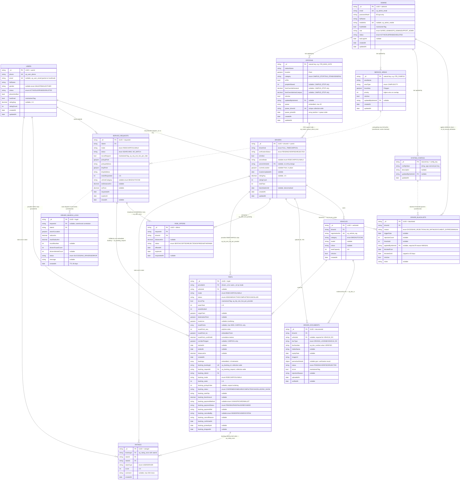
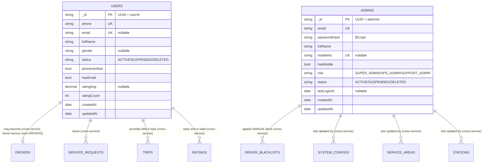
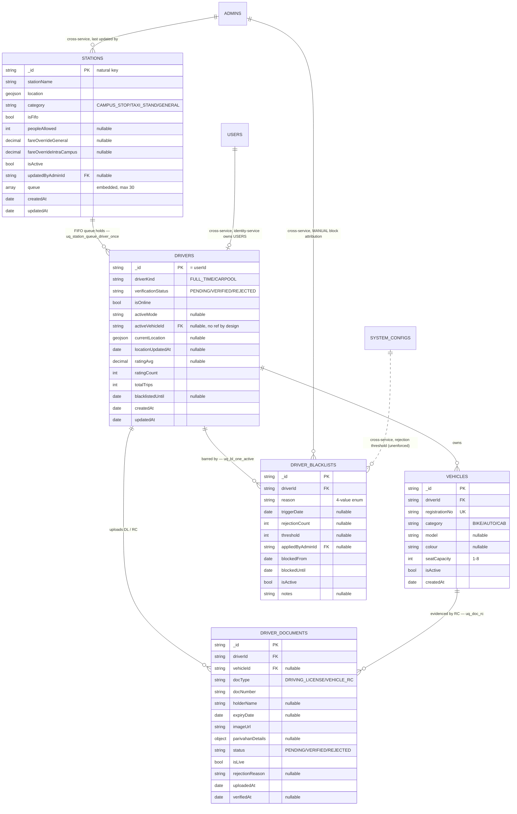
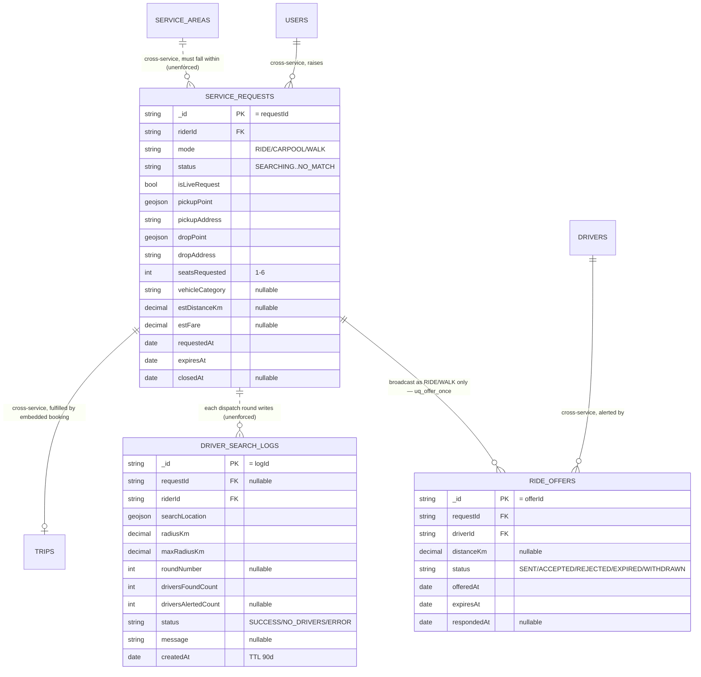
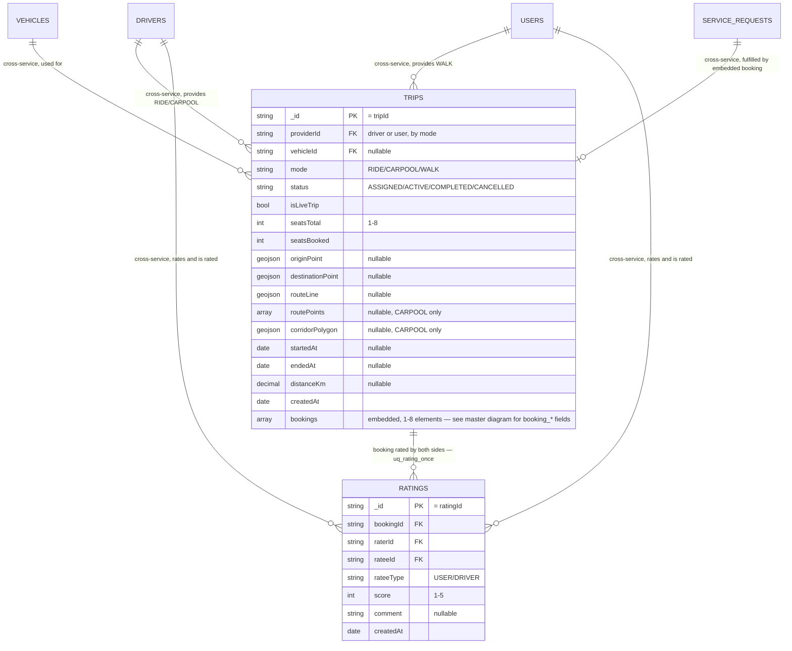
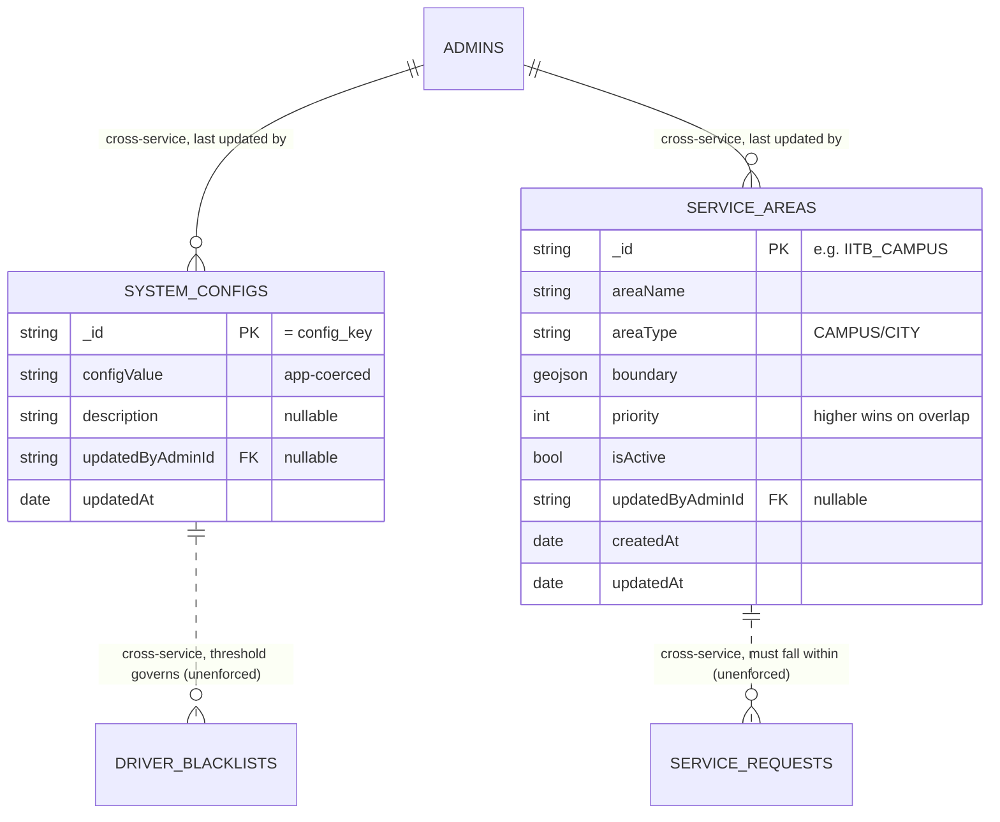

# Tutem — MongoDB Entity Relationship Diagram

> **Source of truth:** [`01-mongodb-schema.md`](01-mongodb-schema.md) — this document is a derived,
> diagram-first view of that schema. Every field, index, and relationship below is transcribed from it;
> if the two ever disagree, `01-mongodb-schema.md` wins and this file is stale and should be regenerated.
> **Scope:** all **24 collections** in the single `tutem` database (14 domain + 5 outbox + 5
> outbox-sequence-counter) — nothing summarized away. See [`old-schema-audit.md`](old-schema-audit.md) for
> the legacy Mongoose schema this replaces.
> **Rendering:** every diagram below is a fenced `mermaid` block (`erDiagram`) — GitHub, GitLab, and any
> Mermaid-aware Markdown viewer render these natively with no extra tooling.

---

## 1. How to read every diagram in this document

**Cardinality** (standard crow's-foot, as Mermaid `erDiagram` renders it):

| Symbol | Meaning |
|---|---|
| `\|\|` | exactly one |
| `o\|` | zero or one |
| `o{` | zero or many |
| `\|{` | one or many |

**Line style** — the one encoding that repeats across every diagram in this document, so it earns a legend:

| Style | Meaning |
|---|---|
| **Solid** (`--`) | A real MongoDB mechanism enforces it at write time — a unique index, a partial unique index, a multikey unique index, or (for outbox edges) a shared ACID transaction. Name of the enforcing index/constraint is given wherever it fits in the diagram label, and always in §5's full catalogue. |
| **Dotted** (`..`) | Application-inferred only. No schema-level `ref`, no index ties the two collections together — MongoDB will not stop this relationship from being violated. This mirrors [`old-schema-audit.md`](old-schema-audit.md)'s own honesty about which of the legacy schema's `ref` declarations were real versus decorative (its §3/§6) — this design does not repeat that mistake by pretending an app-layer correlation is a database guarantee. |

**Attribute prefixes** (three collections embed arrays; MongoDB gives them no separate collection — §4.3/§4.13/H4 of the schema doc):

| Prefix | Embedded in | Array field |
|---|---|---|
| `booking_*` | `trips` | `bookings[]` (1–8 elements) |
| `routePoint_*` | `trips` | `routePoints[]` (≤5000 elements, CARPOOL only) |
| `queue_*` | `stations` | `queue[]` (≤30 elements, FIFO join order) |

**Key markers:** `PK` primary key (always `_id`, a UUID v4 string unless noted), `FK` a cross-collection
reference field (informational — MongoDB has no enforced foreign keys; §1 of the schema doc), `UK` a
uniqueness constraint (global or partial, named in §5/§7 below).

**Owning service** — every collection has exactly one owning service (R4); it is stated on every diagram
and every per-collection reference section rather than color, since a plain-Markdown render has no reliable
color channel across every viewer:

- **identity-service** — `users`, `admins`
- **driver-service** — `drivers`, `vehicles`, `driver_documents`, `driver_blacklists`, `stations`
- **dispatch-service** — `service_requests`, `ride_offers`, `driver_search_logs`
- **trip-service** — `trips`, `ratings`
- **config-service** — `system_configs`, `service_areas`
- **infrastructure** (no single business owner, but physically partitioned 1:1 per owning service) —
  `outbox_events_*`, `outbox_seq_counters_*`

---

## 2. Master diagram — full domain model (14 collections)

---

## 3. Per-service close-up diagrams

The master diagram above is dense by necessity — it is the full picture. The five diagrams in this
section isolate one owning service's own collections plus every *inbound* edge from a collection another
service owns, so an engineer working inside a single service can read just their own corner without the
whole graph. Every edge here is a subset of §2 — nothing new is introduced.

### 3.1 identity-service

*identity-service owns 2 of 14 domain collections and touches 6 others only as the caller behind a JWT
(`role` claim) — it never writes those collections directly; every edge above pointing away from `USERS`/`ADMINS`
is `admins`/`users` being *referenced by* another service's collection, not identity-service reaching into it.*

### 3.2 driver-service

*driver-service is the largest owner by collection count (5 of 14) — the effect of a blacklist
(`blacklistedUntil`) is denormalised onto `DRIVERS` itself (H4) even though the record of *why* lives in
`DRIVER_BLACKLISTS`, so a hot go-online check never has to join across collections.*

### 3.3 dispatch-service

*`driver_search_logs` is dispatch-service's own collection but is the one domain collection in the entire
schema with **no outbox edge at all** — see §4 — because nothing downstream consumes "a search happened" as
a fact. That is a considered exception to R5, not a gap (§4.14 of the schema doc).*

### 3.4 trip-service

*The `booking_*` attribute group is omitted here for width — see §2's master diagram or §7.10's dedicated
field table for the full 17-field embedded booking shape.*

### 3.5 config-service

*Both collections are read by every other service through a Redis-cached snapshot, never a live
cross-service Mongo query — `service_areas`' snapshot is `tutem:config:service-areas:active`, refreshed on
every `ServiceArea*` event; `system_configs`' is `tutem:config:snapshot` (§4.10/§4.12 of the schema doc).*

---

## 4. Event-infrastructure diagram (10 collections)

```mermaid
erDiagram
    OUTBOX_EVENT_SHAPE ||..|| OUTBOX_EVENTS_IDENTITY : "same physical shape"
    OUTBOX_EVENT_SHAPE ||..|| OUTBOX_EVENTS_DRIVER : "same physical shape"
    OUTBOX_EVENT_SHAPE ||..|| OUTBOX_EVENTS_DISPATCH : "same physical shape"
    OUTBOX_EVENT_SHAPE ||..|| OUTBOX_EVENTS_TRIP : "same physical shape"
    OUTBOX_EVENT_SHAPE ||..|| OUTBOX_EVENTS_CONFIG : "same physical shape"

    OUTBOX_SEQ_COUNTERS_IDENTITY ||--o{ OUTBOX_EVENTS_IDENTITY : "mints seqShard+seq for"
    OUTBOX_SEQ_COUNTERS_DRIVER ||--o{ OUTBOX_EVENTS_DRIVER : "mints seqShard+seq for"
    OUTBOX_SEQ_COUNTERS_DISPATCH ||--o{ OUTBOX_EVENTS_DISPATCH : "mints seqShard+seq for"
    OUTBOX_SEQ_COUNTERS_TRIP ||--o{ OUTBOX_EVENTS_TRIP : "mints seqShard+seq for"
    OUTBOX_SEQ_COUNTERS_CONFIG ||--o{ OUTBOX_EVENTS_CONFIG : "mints seqShard+seq for"

    OUTBOX_EVENTS_IDENTITY ||--|| USERS : "same transaction as"
    OUTBOX_EVENTS_IDENTITY ||--|| ADMINS : "same transaction as"

    OUTBOX_EVENTS_DRIVER ||--|| DRIVERS : "same transaction as"
    OUTBOX_EVENTS_DRIVER ||--|| VEHICLES : "same transaction as"
    OUTBOX_EVENTS_DRIVER ||--|| DRIVER_DOCUMENTS : "same transaction as"
    OUTBOX_EVENTS_DRIVER ||--|| DRIVER_BLACKLISTS : "same transaction as"
    OUTBOX_EVENTS_DRIVER ||--|| STATIONS : "same transaction as"

    OUTBOX_EVENTS_DISPATCH ||--|| SERVICE_REQUESTS : "same transaction as"
    OUTBOX_EVENTS_DISPATCH ||--|| RIDE_OFFERS : "same transaction as"

    OUTBOX_EVENTS_TRIP ||--|| TRIPS : "same transaction as"
    OUTBOX_EVENTS_TRIP ||--|| RATINGS : "same transaction as"

    OUTBOX_EVENTS_CONFIG ||--|| SYSTEM_CONFIGS : "same transaction as"
    OUTBOX_EVENTS_CONFIG ||--|| SERVICE_AREAS : "same transaction as"

    OUTBOX_EVENT_SHAPE {
        objectId _id PK "Mongo-native id, infra-only doc"
        int seqShard "hash(aggregateId) mod 16"
        long seq "per-shard monotonic ordering key"
        string aggregateType
        string aggregateId "UUID string, or a config_key"
        string topic
        string partitionKey
        string eventType
        object payload "full envelope incl. eventId UUID"
        object headers
        date occurredAt
        date createdAt
        date publishedAt "nullable, null = unpublished"
        int publishAttempts
    }
    OUTBOX_EVENTS_IDENTITY { string topic "tutem.identity.*.v1" }
    OUTBOX_EVENTS_DRIVER { string topic "tutem.driver.*.v1" }
    OUTBOX_EVENTS_DISPATCH { string topic "tutem.dispatch.*.v1" }
    OUTBOX_EVENTS_TRIP { string topic "tutem.trip.*.v1" }
    OUTBOX_EVENTS_CONFIG { string topic "tutem.config.*.v1" }

    OUTBOX_SEQ_COUNTERS_IDENTITY { int _id PK "shard 0-15" long seq "monotonic per shard" }
    OUTBOX_SEQ_COUNTERS_DRIVER { int _id PK "shard 0-15" long seq "monotonic per shard" }
    OUTBOX_SEQ_COUNTERS_DISPATCH { int _id PK "shard 0-15" long seq "monotonic per shard" }
    OUTBOX_SEQ_COUNTERS_TRIP { int _id PK "shard 0-15" long seq "monotonic per shard" }
    OUTBOX_SEQ_COUNTERS_CONFIG { int _id PK "shard 0-15" long seq "monotonic per shard" }
```

`OUTBOX_EVENT_SHAPE` is **not** one of the 24 real collections — it exists purely so the 13-field shared
shape isn't repeated five times. Every domain write in H3 commits inside one MongoDB transaction alongside
(a) an insert into that service's own `outbox_events_*` row and (b) an `$inc` against one shard document in
that service's own `outbox_seq_counters_*` (never a shared counter — AGENT-4 CRITICAL-2, §5.1, forced by the
~1,250 writes/sec `DriverLocationUpdated` load). No outbox collection is ever paired across two services.

---

## 5. Full relationship catalogue

Every edge in every diagram above, in one table, with the exact enforcing mechanism named — this is the
detail a diagram label can't fully carry.

| # | From | To | Cardinality | Field(s) | Enforced by | Business meaning |
|---|---|---|---|---|---|---|
| 1 | `users` | `drivers` | 1 : 0..1 | shared `_id` | Convention only — no DB mechanism | A driver account is a `users` document that also has a `drivers` document with the same UUID |
| 2 | `users` | `service_requests` | 1 : N | `riderId` | None (informational) | Every request has a rider |
| 3 | `users` | `trips` | 1 : N | `providerId` (WALK) | None (informational) | A walk companion is a `users` document acting as provider |
| 4 | `users` | `ratings` | 1 : N | `raterId`/`rateeId` | `uq_rating_once` (partial — one rating per booking per rater) | Riders rate and are rated |
| 5 | `admins` | `driver_blacklists` | 1 : N | `appliedByAdminId` | `ck_bl_manual_attribution` ($expr — presence only, not existence) | Traces a MANUAL block to the admin who applied it |
| 6 | `admins` | `system_configs` | 1 : N | `updatedByAdminId` | None (nullable, app-layer) | Traces a config change to an admin |
| 7 | `admins` | `service_areas` | 1 : N | `updatedByAdminId` | None (nullable, app-layer) | Traces an area edit to an admin |
| 8 | `admins` | `stations` | 1 : N | `updatedByAdminId` | None (nullable, app-layer) | Traces a station edit to an admin |
| 9 | `drivers` | `vehicles` | 1 : N | `driverId` | `ix_vehicle_driver` (non-unique) | A driver may own several vehicles |
| 10 | `drivers` | `driver_documents` | 1 : N | `driverId` | `uq_doc_licence` (one live DL per driver) | DL + one RC per active vehicle |
| 11 | `drivers` | `driver_blacklists` | 1 : N | `driverId` | `uq_bl_one_active` (one active block at a time) | A driver's block history |
| 12 | `drivers` | `ride_offers` | 1 : N | `driverId` | `uq_offer_one_pending` (one SENT offer at a time) | A driver considers one alert at a time |
| 13 | `drivers` | `trips` | 1 : N | `providerId` (RIDE/CARPOOL) | `uq_trip_one_live_per_provider` (one live trip at a time) | A driver runs at most one trip at once |
| 14 | `drivers` | `ratings` | 1 : N | `raterId`/`rateeId` | `uq_rating_once` (partial) | Drivers rate and are rated |
| 15 | `stations` | `drivers` (via `queue[]`) | 1 : N | `queue.driverId` | `uq_station_queue_driver_once` (multikey unique, collection-wide) | A driver waits at exactly one station at a time |
| 16 | `vehicles` | `driver_documents` | 1 : N | `vehicleId` (VEHICLE_RC) | `uq_doc_rc` (one live RC per vehicle) | Each active vehicle has one verified RC |
| 17 | `vehicles` | `trips` | 1 : N | `vehicleId` | None (informational) | A vehicle used across many trips |
| 18 | `service_requests` | `ride_offers` | 1 : N | `requestId` | `uq_offer_once` (once per driver per request) + `uq_offer_single_accept` (global, one ACCEPTED per request) | Dispatch rounds broadcast a request to several drivers |
| 19 | `service_requests` | `trips` | 1 : 0..1 | `booking_requestId` | `uq_booking_request` (multikey unique, collection-wide) | A request is fulfilled at most once, ever |
| 20 | `service_requests` | `driver_search_logs` | 1 : N | `requestId` | **None** — `ix_search_log_request` is a plain sparse index, not a constraint | Diagnostic correlation only (§4.14) |
| 21 | `service_areas` | `service_requests` | 1 : N | `pickupPoint`/`dropPoint` inside `boundary` | **None** — app-layer `ck_req_within_service_area`, checked against a Redis-cached snapshot, never live Mongo | A request must originate inside a serviceable area |
| 22 | `trips` | `ratings` | 1 : N | `bookingId` | `uq_rating_once` (compound, `bookingId`+`raterId`) | Each embedded booking is rated by both sides |
| 23 | `system_configs` | `driver_blacklists` | — | `driver.rejection.daily_threshold` value vs. `rejectionCount`/`threshold` | **None** — app-layer only, no schema `ref` | The blacklist trigger threshold is centrally tunable |
| 24 | `outbox_events_identity` | `users` | 1 : 1 (per write) | — | Same MongoDB ACID transaction | Every `users` write publishes durably |
| 25 | `outbox_events_identity` | `admins` | 1 : 1 (per write) | — | Same MongoDB ACID transaction | Every `admins` write publishes durably |
| 26–30 | `outbox_events_driver` | `drivers`, `vehicles`, `driver_documents`, `driver_blacklists`, `stations` | 1 : 1 (per write) | — | Same MongoDB ACID transaction | driver-service's 5 collections all publish through one outbox |
| 31–32 | `outbox_events_dispatch` | `service_requests`, `ride_offers` | 1 : 1 (per write) | — | Same MongoDB ACID transaction | dispatch-service's 2 collections publish through one outbox |
| 33–34 | `outbox_events_trip` | `trips`, `ratings` | 1 : 1 (per write) | — | Same MongoDB ACID transaction | trip-service's 2 collections publish through one outbox |
| 35–36 | `outbox_events_config` | `system_configs`, `service_areas` | 1 : 1 (per write) | — | Same MongoDB ACID transaction | config-service's 2 collections publish through one outbox |
| 37–41 | `outbox_seq_counters_<service>` | `outbox_events_<service>` | 1 : N | `seqShard`/`seq` | `$inc` inside the same transaction as #24–36 | Mints the strictly-monotonic, per-shard ordering key |

*Row 20/21/23 are the three deliberately-unenforced relationships in the entire schema — carried over
honestly from the same discipline `old-schema-audit.md` applied to the legacy Mongoose `ref`s, not hidden
behind a solid line that would overstate what MongoDB actually guarantees.*

---

## 6. Sharding & lifecycle summary

One more axis a plain relationship diagram can't show: which collections are sharded, and which ones expire
on their own. From §H6/§H7/§4.x of the schema doc:

| Collection | Shard key (if sharded) | Sharded at launch? | Retention |
|---|---|---|---|
| `users` | `{_id: "hashed"}` (future) | No | Soft-delete only (`status='DELETED'`), never hard-deleted |
| `admins` | — | No, permanently | Soft-delete only |
| `drivers` | `{_id: "hashed"}` | **Yes — the one collection sharded at launch** | Indefinite (one doc per ever-registered driver) |
| `vehicles` | — | No (unique-index conflict) | Indefinite |
| `driver_documents` | — | No (unique-index conflict) | Indefinite |
| `driver_blacklists` | — | No | Indefinite (rare-write) |
| `stations` | — | No | Indefinite (physically bounded) |
| `service_requests` | `{riderId: "hashed"}` (future) | No | Indefinite |
| `ride_offers` | — | **No, permanently** (two conflicting unique indexes — H1's accept race outranks horizontal scale) | Indefinite |
| `driver_search_logs` | — | No | **TTL 90 days** (`ttl_search_log_90d`) |
| `trips` | `{providerId: "hashed"}` (future) | No (unique-index conflict) | Indefinite |
| `ratings` | `{bookingId: "hashed"}` (future) | No | Indefinite (append-only, archive is a future concern) |
| `system_configs` | — | No, permanently | Indefinite (~10 docs) |
| `service_areas` | — | No, permanently | Indefinite (tens of docs) |
| `outbox_events_*` (×5) | — | No — app-level shard-claim instead | Rows retained until published + a grace window (relay-owned, not modelled here) |
| `outbox_seq_counters_*` (×5) | — | N/A — 16 shard-key documents *is* the sharding mechanism | Indefinite, 16 docs each |

---

## 7. Per-collection field reference

The full field list, index list, and shard/retention notes for all 24 collections — the ER diagrams' entity
boxes, expanded into prose-reference form. `?` marks a nullable field.

### 7.1 `users` — identity-service

| Field | Type | Nullable | Notes |
|---|---|---|---|
| `_id` | string (UUID) | | PK, = `userId` |
| `phone` | string | | `uq_user_phone` |
| `email` | string | ✓ | `uq_user_email` (partial, `hasEmail:true`) |
| `fullName` | string | | |
| `gender` | string | ✓ | enum `MALE`/`FEMALE`/`OTHER` |
| `status` | string | | enum `ACTIVE`/`SUSPENDED`/`DELETED` |
| `phoneVerified` | bool | | |
| `hasEmail` | bool | | maintained flag, `ck_user_hasemail_lockstep` |
| `ratingAvg` | decimal | ✓ | 1–5 |
| `ratingCount` | int | | ≥0 |
| `createdAt` / `updatedAt` | date | | |

**Indexes:** `uq_user_phone {phone:1}` unique · `uq_user_email {email:1}` unique partial (`hasEmail:true`).

### 7.2 `admins` — identity-service

| Field | Type | Nullable | Notes |
|---|---|---|---|
| `_id` | string (UUID) | | PK, = `adminId` |
| `email` | string | | `uq_admin_email` |
| `passwordHash` | string | | BCrypt only, never returned |
| `fullName` | string | | |
| `mobileNo` | string | ✓ | `uq_admin_mobile` (partial, `hasMobile:true`) |
| `hasMobile` | bool | | maintained flag |
| `role` | string | | enum `SUPER_ADMIN`/`OPS_ADMIN`/`SUPPORT_ADMIN` |
| `status` | string | | enum `ACTIVE`/`SUSPENDED`/`DELETED` |
| `lastLoginAt` | date | ✓ | |
| `createdAt` / `updatedAt` | date | | |

**Indexes:** `uq_admin_email {email:1}` unique · `uq_admin_mobile {mobileNo:1}` unique partial.

### 7.3 `drivers` — driver-service

| Field | Type | Nullable | Notes |
|---|---|---|---|
| `_id` | string (UUID) | | PK, = `driverId` = `userId` |
| `driverKind` | string | | enum `FULL_TIME`/`CARPOOL` |
| `verificationStatus` | string | | enum `PENDING`/`VERIFIED`/`REJECTED` |
| `isOnline` | bool | | |
| `activeMode` | string | ✓ | enum `RIDE`/`CARPOOL`/`WALK` |
| `activeVehicleId` | string | ✓ | FK, no schema `ref` by design (avoids circularity) |
| `currentLocation` | geojson Point | ✓ | updated in place, never appended |
| `locationUpdatedAt` | date | ✓ | |
| `ratingAvg` | decimal | ✓ | 1–5 |
| `ratingCount` | int | | |
| `totalTrips` | int | | incremented on `TripCompleted` |
| `blacklistedUntil` | date | ✓ | denormalised from `driver_blacklists` |
| `createdAt` / `updatedAt` | date | | |

**Indexes:** `ix_driver_available {currentLocation:"2dsphere"}` partial (`isOnline:true, verificationStatus:"VERIFIED"`).
**Shard key:** `{_id:"hashed"}` — **sharded at launch** (H7, ~1,250 location-ping writes/sec).

### 7.4 `vehicles` — driver-service

| Field | Type | Nullable | Notes |
|---|---|---|---|
| `_id` | string (UUID) | | PK |
| `driverId` | string | | FK |
| `registrationNo` | string | | `uq_vehicle_reg`, max 16 chars |
| `category` | string | | enum `BIKE`/`AUTO`/`CAB` |
| `model` / `colour` | string | ✓ | |
| `seatCapacity` | int | | 1–8, `ck_vehicle_bike`: BIKE ⇒ 1 |
| `isActive` | bool | | |
| `createdAt` | date | | |

**Indexes:** `uq_vehicle_reg {registrationNo:1}` unique · `ix_vehicle_driver {driverId:1, isActive:1}`.

### 7.5 `driver_documents` — driver-service

| Field | Type | Nullable | Notes |
|---|---|---|---|
| `_id` | string (UUID) | | PK |
| `driverId` | string | | FK |
| `vehicleId` | string | ✓ | FK, required when `docType='VEHICLE_RC'` |
| `docType` | string | | enum `DRIVING_LICENSE`/`VEHICLE_RC` |
| `docNumber` | string | | max 40 chars |
| `holderName` | string | ✓ | |
| `expiryDate` | date | ✓ | |
| `imageUrl` | string | | max 512 chars |
| `parivahanDetails` | object | ✓ | government verification result |
| `status` | string | | enum `PENDING`/`VERIFIED`/`REJECTED` |
| `isLive` | bool | | maintained flag, true unless `REJECTED` |
| `rejectionReason` | string | ✓ | max 255 chars |
| `uploadedAt` | date | | |
| `verifiedAt` | date | ✓ | |

**Indexes:** `uq_doc_licence {driverId:1}` unique partial (`docType:"DRIVING_LICENSE", isLive:true`) ·
`uq_doc_rc {vehicleId:1}` unique partial (`docType:"VEHICLE_RC", isLive:true`) · `uq_doc_number
{docType:1, docNumber:1}` unique partial (`status:"VERIFIED"`).

### 7.6 `driver_blacklists` — driver-service

| Field | Type | Nullable | Notes |
|---|---|---|---|
| `_id` | string (UUID) | | PK |
| `driverId` | string | | FK |
| `reason` | string | | enum `EXCESSIVE_REJECTION`/`LOW_RATING`/`DOCUMENT_EXPIRED`/`MANUAL` |
| `triggerDate` | date | ✓ | |
| `rejectionCount` / `threshold` | int | ✓ | |
| `appliedByAdminId` | string | ✓ | FK, required iff `reason='MANUAL'` (`ck_bl_manual_attribution`) |
| `blockedFrom` | date | | |
| `blockedUntil` | date | | ≤30 days after `blockedFrom` (`ck_bl_temporary`) |
| `isActive` | bool | | |
| `notes` | string | ✓ | max 300 chars |

**Indexes:** `uq_bl_one_active {driverId:1}` unique partial (`isActive:true`) · `uq_bl_one_per_day
{driverId:1, triggerDate:1}` unique partial (`reason:"EXCESSIVE_REJECTION"`) · `ix_bl_admin_activity
{appliedByAdminId:1, blockedFrom:-1}` sparse.

### 7.7 `stations` — driver-service

| Field | Type | Nullable | Notes |
|---|---|---|---|
| `_id` | string | | PK, natural station id |
| `stationName` | string | | |
| `location` | geojson Point | | |
| `category` | string | | enum `CAMPUS_STOP`/`TAXI_STAND`/`GENERAL` |
| `isFifo` | bool | | |
| `peopleAllowed` | int | ✓ | `CAMPUS_STOP` only (`ck_station_campus_fields`) |
| `fareOverrideGeneral` | decimal | ✓ | `CAMPUS_STOP` only |
| `fareOverrideIntraCampus` | decimal | ✓ | `CAMPUS_STOP` only |
| `isActive` | bool | | |
| `updatedByAdminId` | string | ✓ | FK |
| `queue[]` | array | | ≤30 elements, FIFO order = array order |
| `queue[].driverId` | string | | `uq_station_queue_driver_once` |
| `queue[].joinedAt` | date | | |
| `createdAt` / `updatedAt` | date | | |

**Indexes:** `ix_station_location {location:"2dsphere"}` partial (`isActive:true`) · `uq_station_queue_driver_once
{"queue.driverId":1}` unique, multikey.

### 7.8 `service_requests` — dispatch-service

| Field | Type | Nullable | Notes |
|---|---|---|---|
| `_id` | string (UUID) | | PK |
| `riderId` | string | | FK |
| `mode` | string | | enum `RIDE`/`CARPOOL`/`WALK` |
| `status` | string | | `SEARCHING`/`MATCHED`/`ONGOING`/`COMPLETED`/`CANCELLED`/`EXPIRED`/`NO_MATCH` |
| `isLiveRequest` | bool | | maintained flag |
| `pickupPoint` / `dropPoint` | geojson Point | | |
| `pickupAddress` / `dropAddress` | string | | max 300 chars |
| `seatsRequested` | int | | 1–6 |
| `vehicleCategory` | string | ✓ | enum `BIKE`/`AUTO`/`CAB` |
| `estDistanceKm` / `estFare` | decimal | ✓ | |
| `requestedAt` / `expiresAt` | date | | `expiresAt > requestedAt` |
| `closedAt` | date | ✓ | |

**Indexes:** `uq_req_one_live_per_rider {riderId:1}` unique partial (`isLiveRequest:true`) · `ix_req_open_pickup
{pickupPoint:"2dsphere"}` partial (`status:"SEARCHING"`) · `ix_req_open_drop {dropPoint:"2dsphere"}` partial ·
`ix_req_rider_history {riderId:1, requestedAt:-1}`.

### 7.9 `ride_offers` — dispatch-service

| Field | Type | Nullable | Notes |
|---|---|---|---|
| `_id` | string (UUID) | | PK |
| `requestId` | string | | FK |
| `driverId` | string | | FK |
| `distanceKm` | decimal | ✓ | |
| `status` | string | | enum `SENT`/`ACCEPTED`/`REJECTED`/`EXPIRED`/`WITHDRAWN` |
| `offeredAt` / `expiresAt` | date | | `expiresAt > offeredAt` |
| `respondedAt` | date | ✓ | non-null unless `status IN (SENT, EXPIRED)` |

**Indexes:** `uq_offer_single_accept {requestId:1}` unique partial (`status:"ACCEPTED"`) — **the accept-race
arbiter, H1** · `uq_offer_one_pending {driverId:1}` unique partial (`status:"SENT"`) · `uq_offer_once
{requestId:1, driverId:1}` unique · `ix_offer_driver_status {driverId:1, status:1, offeredAt:-1}`.
**Shard key:** none — **permanently unsharded** (H6: two conflicting single-field unique indexes make no
shard key safe without weakening H1's guarantee).

### 7.10 `driver_search_logs` — dispatch-service

| Field | Type | Nullable | Notes |
|---|---|---|---|
| `_id` | string (UUID) | | PK |
| `requestId` | string | ✓ | unenforced correlation only |
| `riderId` | string | | |
| `searchLocation` | geojson Point | | |
| `radiusKm` / `maxRadiusKm` | decimal | | |
| `roundNumber` | int | ✓ | |
| `driversFoundCount` | int | | |
| `driversAlertedCount` | int | ✓ | |
| `status` | string | | enum `SUCCESS`/`NO_DRIVERS`/`ERROR` |
| `message` | string | ✓ | max 500 chars |
| `createdAt` | date | | TTL |

**Indexes:** `ttl_search_log_90d {createdAt:1}` TTL, `expireAfterSeconds:7776000` · `ix_search_log_request
{requestId:1}` sparse. **No outbox edge** — never publishes to Kafka (§4.14).

### 7.11 `trips` — trip-service

| Field | Type | Nullable | Notes |
|---|---|---|---|
| `_id` | string (UUID) | | PK |
| `providerId` | string | | FK — driver or user, by `mode` |
| `vehicleId` | string | ✓ | FK |
| `mode` | string | | enum `RIDE`/`CARPOOL`/`WALK` |
| `status` | string | | enum `ASSIGNED`/`ACTIVE`/`COMPLETED`/`CANCELLED` |
| `isLiveTrip` | bool | | maintained flag |
| `seatsTotal` | int | | 1–8 |
| `seatsBooked` | int | | ≤ `seatsTotal` (`ck_trip_seats`) |
| `originPoint` / `destinationPoint` | geojson Point | ✓ | required for CARPOOL |
| `routeLine` | geojson LineString | ✓ | CARPOOL only |
| `routePoints[]` | array | ✓ | ≤5000 elements, CARPOOL only |
| `routePoints[].seq` | int | | polyline order |
| `routePoints[].loc` | geojson Point | | |
| `routePoints[].cumDistM` | decimal | | cumulative metres from origin |
| `corridorPolygon` | geojson Polygon | ✓ | CARPOOL only |
| `startedAt` / `endedAt` | date | ✓ | |
| `distanceKm` | decimal | ✓ | |
| `createdAt` | date | | |
| `bookings[]` | array | | 1 element for RIDE/WALK, ≤8 for CARPOOL |
| `bookings[].bookingId` | string | | `uq_booking_id`, collection-wide unique |
| `bookings[].requestId` | string | | `uq_booking_request`, collection-wide unique |
| `bookings[].riderId` | string | | FK |
| `bookings[].mode` | string | | enum `RIDE`/`CARPOOL`/`WALK` |
| `bookings[].seats` | int | | 1–6 |
| `bookings[].pickupOrder` | int | ✓ | CARPOOL ordering along route |
| `bookings[].status` | string | | `CONFIRMED`/`ONBOARD`/`COMPLETED`/`CANCELLED`/`NO_SHOW` |
| `bookings[].startOtp` | string | ✓ | |
| `bookings[].fareAmount` | decimal | ✓ | |
| `bookings[].paymentMethod` | string | ✓ | `CASH`/`UPI`/`CARD`/`WALLET` |
| `bookings[].paymentStatus` | string | | `PENDING`/`PAID`/`FAILED`/`REFUNDED` |
| `bookings[].paymentRef` | string | ✓ | |
| `bookings[].cancelledBy` | string | ✓ | `RIDER`/`PROVIDER`/`SYSTEM` |
| `bookings[].cancelReason` | string | ✓ | |
| `bookings[].confirmedAt` | date | | |
| `bookings[].pickedUpAt` / `droppedAt` | date | ✓ | |

**Indexes:** `uq_booking_request {"bookings.requestId":1}` unique multikey · `uq_booking_id
{"bookings.bookingId":1}` unique multikey · `uq_trip_one_live_per_provider {providerId:1}` unique partial
(`isLiveTrip:true`) · `ix_trip_provider_history {providerId:1, createdAt:-1}` · `ix_trip_booking_rider_history
{"bookings.riderId":1, "bookings.confirmedAt":-1}` · `ix_trip_route {routeLine:"2dsphere"}` partial
(`isLiveTrip:true`) · `ix_trip_corridor {corridorPolygon:"2dsphere"}` partial (`mode:"CARPOOL", isLiveTrip:true`).

### 7.12 `ratings` — trip-service

| Field | Type | Nullable | Notes |
|---|---|---|---|
| `_id` | string (UUID) | | PK |
| `bookingId` | string | | FK, `uq_rating_once` |
| `raterId` / `rateeId` | string | | FK, `raterId ≠ rateeId` (`ck_rating_self`) |
| `rateeType` | string | | enum `USER`/`DRIVER` |
| `score` | int | | 1–5 |
| `comment` | string | ✓ | max 500 chars |
| `createdAt` | date | | insert-only, never updated |

**Indexes:** `uq_rating_once {bookingId:1, raterId:1}` unique · `ix_rating_ratee_history {rateeId:1, createdAt:-1}`.

### 7.13 `system_configs` — config-service

| Field | Type | Nullable | Notes |
|---|---|---|---|
| `_id` | string | | PK, = `config_key` |
| `configValue` | string | | app-coerced per key, max 200 chars |
| `description` | string | ✓ | max 300 chars |
| `updatedByAdminId` | string | ✓ | FK, nullable (seed-script writes have none) |
| `updatedAt` | date | | |

**Indexes:** none beyond the default `_id` index.

### 7.14 `service_areas` — config-service

| Field | Type | Nullable | Notes |
|---|---|---|---|
| `_id` | string | | PK, natural key (e.g. `IITB_CAMPUS`) |
| `areaName` | string | | |
| `areaType` | string | | enum `CAMPUS`/`CITY` |
| `boundary` | geojson Polygon | | `ck_area_polygon` |
| `priority` | int | | higher wins on overlap |
| `isActive` | bool | | |
| `updatedByAdminId` | string | ✓ | FK |
| `createdAt` / `updatedAt` | date | | |

**Indexes:** `ix_area_boundary {boundary:"2dsphere"}` — cold-start/admin-tooling only; the hot path is a
Redis-cached snapshot, never a live query against this index.

### 7.15–7.19 `outbox_events_identity` / `_driver` / `_dispatch` / `_trip` / `_config` — infrastructure

Identical shape across all five (the representative index list below is shown once against
`outbox_events_driver` in the schema doc; it applies verbatim to the other four with the collection name
swapped):

| Field | Type | Nullable | Notes |
|---|---|---|---|
| `_id` | objectId | | Mongo-native, infra-only document |
| `seqShard` | int | | `hash(aggregateId) mod 16` |
| `seq` | long | | per-shard monotonic ordering key |
| `aggregateType` | string | | max 40 chars |
| `aggregateId` | string | | UUID string, or a `config_key` |
| `topic` | string | | max 200 chars |
| `partitionKey` | string | | |
| `eventType` | string | | max 80 chars |
| `payload` | object | | full envelope, incl. `eventId` UUID |
| `headers` | object | | |
| `occurredAt` / `createdAt` | date | | |
| `publishedAt` | date | ✓ | `null` = unpublished |
| `publishAttempts` | int | | |

**Indexes (per collection):** `ix_outbox_unpublished {publishedAt:1, seqShard:1, seq:1}` partial
(`publishedAt:null`) · `ix_outbox_aggregate_shard {aggregateId:1, seq:1}` partial (`publishedAt:null`).

### 7.20–7.24 `outbox_seq_counters_identity` / `_driver` / `_dispatch` / `_trip` / `_config` — infrastructure

| Field | Type | Notes |
|---|---|---|
| `_id` | int | PK, shard number `0`–`15` (16 documents per collection) |
| `seq` | long | monotonic counter for that shard, `$inc`-ed inside the same transaction as the paired outbox insert |

No secondary indexes — 16 tiny documents per collection, looked up only by `_id`.

---

## 8. Full collection index (recap)

| # | Collection | Owner | Category | §7 ref |
|---|---|---|---|---|
| 1 | `users` | identity-service | Domain | §7.1 |
| 2 | `admins` | identity-service | Domain | §7.2 |
| 3 | `drivers` | driver-service | Domain | §7.3 |
| 4 | `vehicles` | driver-service | Domain | §7.4 |
| 5 | `driver_documents` | driver-service | Domain | §7.5 |
| 6 | `driver_blacklists` | driver-service | Domain | §7.6 |
| 7 | `stations` | driver-service | Domain | §7.7 |
| 8 | `service_requests` | dispatch-service | Domain | §7.8 |
| 9 | `ride_offers` | dispatch-service | Domain | §7.9 |
| 10 | `driver_search_logs` | dispatch-service | Domain | §7.10 |
| 11 | `trips` | trip-service | Domain | §7.11 |
| 12 | `ratings` | trip-service | Domain | §7.12 |
| 13 | `system_configs` | config-service | Domain | §7.13 |
| 14 | `service_areas` | config-service | Domain | §7.14 |
| 15 | `outbox_events_identity` | identity-service | Outbox | §7.15 |
| 16 | `outbox_events_driver` | driver-service | Outbox | §7.15 |
| 17 | `outbox_events_dispatch` | dispatch-service | Outbox | §7.15 |
| 18 | `outbox_events_trip` | trip-service | Outbox | §7.15 |
| 19 | `outbox_events_config` | config-service | Outbox | §7.15 |
| 20 | `outbox_seq_counters_identity` | identity-service | Counter | §7.20 |
| 21 | `outbox_seq_counters_driver` | driver-service | Counter | §7.20 |
| 22 | `outbox_seq_counters_dispatch` | dispatch-service | Counter | §7.20 |
| 23 | `outbox_seq_counters_trip` | trip-service | Counter | §7.20 |
| 24 | `outbox_seq_counters_config` | config-service | Counter | §7.20 |

---

*Generated from [`01-mongodb-schema.md`](01-mongodb-schema.md) — 24 collections, one database `tutem`.
Regenerate this file whenever a field, index, or relationship changes in the source schema; do not hand-edit
the two out of sync.*
