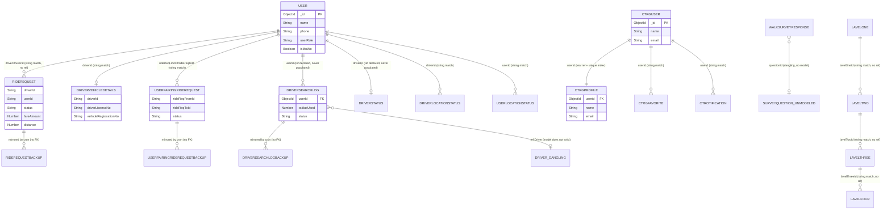

# TUTEM_GA_MONOLITH — Current Database Schema (Reverse-Engineered)

> **Scope note:** This document describes the database schema **as actually implemented in source code today** (Mongoose models in `models/`, plus runtime usage in `controllers/`, `routes/`, `server.js`). It deliberately excludes and ignores anything under `migrate-plan/` (proposed future designs). Where the implementation is messy, duplicated, or inconsistent, that is documented as-is rather than cleaned up.

---

## 1. Executive Summary

The monolith uses **MongoDB via Mongoose**, with **68 model files** registering **66 distinct model names** (two name collisions — see §6). The database serves two largely independent product domains sharing one connection:

- **Tutem ride-hailing/carpooling** — ~40 models covering users/drivers (`User`), ride lifecycle (`RideRequest`, `UserPairingRideRequest`), live location tracking (5+ parallel location-schema variants), fare configuration, driver vehicle/verification data, and admin/config singletons.
- **CTRG conference app** — ~26 models covering attendee profiles, favorites/notifications, and — notably — **at least four competing, non-canonical schemas** for the same "conference day → session → subsession → paper" hierarchy.

**Key structural finding:** this schema is **not relationally normalized in the Mongoose sense**. Only **one `.populate()` call exists in the entire codebase** (`rideRequestController.js`, resolving `RideRequest.driverId`/`userId` against `User`). Every other cross-collection reference — even where a schema declares `ref: "User"` or `ref: "CTRGUser"` — is resolved manually in application code via separate `find`/`findOne` calls keyed on plain `String` IDs. Most "foreign keys" in this system are informal string-matching conventions, not enforced or traversed database relationships.

There are also concrete defects worth flagging up front: two pairs of files register **duplicate Mongoose model names** (`Boundary`, `FifoStationsData`), one dangling `ref` to a model (`Driver`) that does not exist, and three dead model files that are never imported anywhere.

---

## 2. Database Schema

### 2.1 Ride-Hailing Domain

#### `User` (collection: `users`)
Core account for both riders and drivers, distinguished by `userRole`.

| Field | Type | Required | Default | Notes |
|---|---|---|---|---|
| `_id` | ObjectId | auto | — | PK |
| `name` | String | yes | — | |
| `email` | String | no | — | `unique: false` (explicitly declared non-unique) |
| `ostype` | String | no | null | |
| `password` | String | yes | — | stripped from `toJSON` output |
| `genderBasisFilter` | Boolean | no | false | |
| `otp` | String | no | random 4-digit | |
| `mpin` | String | no | null | |
| `deviceId` | String | no | — | |
| `phone` | String | yes | — | |
| `deviceChangeToken` | String | no | null | |
| `deviceChangeExpires` | Date | no | null | |
| `address` | String | no | "Not Available" | |
| `userToUserFareAmount` | Number | no | 0.0 | |
| `dateOfBirth` | Date | no | now | |
| `gender` | String | yes | — | |
| `userRole` | String (enum) | yes | — | `driver`, `user`, `MoWodriver` |
| `createdAt` | Date | no | now | |
| `isVerified` | Boolean | no | false | |
| `verificationToken` | String | no | — | stripped from `toJSON` output |
| `manualVerification` | Boolean | no | false | |
| `carpooling` | Boolean | no | false | |
| `isMoWo` | Boolean | no | false | |
| `organization` | String | no | — | |
| `color` | String | no | "White" | |
| `shuttleService` | Boolean | no | true | |
| `rating` | Number | no | 0 | |
| `fcmToken` | String | no | null | |
| `image` | String | no | — | |
| `paymentQRcode` | String | no | null | |
| `emergencyContact` | String | no | — | |

No indexes/uniqueness beyond default `_id`. No inbound schema-level `ref` declares `User` as its target consistently (see §3).

#### `RideRequest` (collection: `riderequests`, `timestamps: true`)
Primary ride-hailing transaction record. Business logic (fare calc, live-location socket emission) lives in schema statics/hooks.

| Field | Type | Required | Default/Enum |
|---|---|---|---|
| `driverId`, `userId` | String | — | *(not ObjectId/ref — see §4)* |
| `originName`, `originLat`, `originLong`, `destName`, `destLat`, `destLong` | String | — | |
| `status` | String enum | — | `pending`,`assigned`,`driverreached`,`ontrip`,`endtrip`,`reacheddestination`,`cancelledbyuser`,`cancelledbydriver`,`drivernotresponding`; default `"pending"` |
| `driverRating`, `userRating` | Number | — | default 0 |
| `isMoWo` | Boolean | — | default false |
| `organization` | String | — | default "personal" |
| `bitsLocation` | String | — | |
| `distance`, `FinalTraveldistance`, `actualCoveredDistance` | Number | — | |
| `uniqueCode` | Number | — | |
| `fareAmount`, `fareAmountCalculated` | Number | — | default 0.0 |
| `defaultAmtForRange` | Number | — | default 0.0 |
| `gender`, `image`, `userName`, `userPhone` | String | — | |
| `startedAt`,`completedAt`,`cancelledAt`,`driverReachedAt`,`onTripAt`,`reachedDestinationAt` | Date | — | |
| `pathForUserPickupLocation`,`ridePathPrescribed`,`ridePath` | `[{latitude, longitude: Number}]` | — | |
| `reasonForCancelling` | String (trim) | — | |
| `canceledDrivers` | `[String]` | — | default [] |
| `paymentStatus` | String | — | |
| `expectedReachTime` | Date | — | default now+15min |

Hooks: `post("save")`, `post("updateOne")`, `post("findOneAndUpdate")` drive Socket.IO emits; statics include `calculateFareAmount`, `getDistanceInKm`.

#### `RideRequestBackup` (collection: `riderequestbackups`)
Field-for-field mirror of `RideRequest` with no hooks/statics. **Indexes:** `createdAt`, `status`, `userId`, `driverId` (the primary `RideRequest` has none of these explicit indexes).

#### `DriverAssignmentService` (collection: `driverassignmentservices`, `timestamps: true`)
Near-duplicate of `RideRequest` (same field set/enum), appears to be an alternate/legacy ride-assignment record kept in parallel.

#### `UserPairingRideRequest` (collection: `userpairingriderequests`, `timestamps: true`)
Peer-to-peer (driverless) ride record between two riders, includes vehicle fields.

| Field | Type | Default/Enum |
|---|---|---|
| `rideReqFromId` | String, required | |
| `rideReqToId` | String | |
| `originName/Lat/Long`, `destName/Lat/Long` | String | |
| `expectedFareAmontMessage` | String | default "Expected Fare :" |
| `cancelledByIds` | `[{userId:String, cancelledAt:Date default now}]` | default [] |
| `status` | String enum | `pending`,`assigned`,`userreached`,`ontrip`,`endtripbyfromuser`,`endtripbytouser`,`cancelledbyfromuser`,`cancelledbytouser`; default `"pending"` |
| `toUserRating`,`fromUserRating` | Number | default 0 |
| `distance`,`uniqueCode` | Number | |
| `startedAt`,`completedAt` | Date | |
| `rating` | Number (1–5) | |
| `active` | Boolean | default false |
| `secureMyInfo`,`showFare` | Boolean | default false |
| `gender` | String | default "Not Avaliable" |
| `userRole`,`toUserRole` | String | |
| `carpooling` | Boolean | default false |
| `waitingFromTime` | Date | default now |
| `waitingToTime` | Date | default now+15min |
| `userToUserPairingFareAmount`,`calculatedRideuserToUserPairingFareAmount` | Number | default 0.0 |
| `driverLicenseNo`,`vehicleRegistrationNo`(uppercased),`vehicleClass`(enum `Car`/`Two Wheeler`),`vehicleMake`,`vehicleModel`,`vehicleColor`,`drivingLicenseIssueDate` | String/Date | |

#### `UserPairingRideRequestBackup`
Same as above minus the 7 vehicle-detail fields, plus `backupTimestamp` (default now). Own independent copy of live-location hooks/statics (not shared code).

#### `DriverVehicleDetails` (collection: `drivervehicledetails`)
| Field | Type | Required | Default |
|---|---|---|---|
| `driverId` | String | yes | |
| `driverLicenseNo` | String | yes | |
| `vehicleRegistrationNo` | String | yes | uppercased (setter) |
| `vehicleClass`,`vehicleMake`,`vehicleModel`,`vehicleColor` | String | yes | |
| `organization` | String | no | "Personal" |
| `drivingLicenseIssueDate` | Date | no | |
| `drivingLincensePicture` | String | no | *(typo retained in field name)* |

#### `DriverVehicleDetailsUserToUserParing`
| Field | Type | Required | Default/Enum |
|---|---|---|---|
| `senderUserId`,`receiverUserId` | String | — | |
| `driverLicenseNo` | String | — | |
| `vehicleRegistrationNo` | String | yes | uppercased |
| `vehicleClass` | String enum `Car`/`Two Wheeler` | yes | |
| `vehicleMake`,`vehicleModel`,`vehicleColor` | String | yes | |
| `drivingLicenseIssueDate` | Date | — | |
| `pairingStatus` | String enum `pending`/`accepted`/`rejected` | — | default "pending" |
| `createdAt` | Date | — | default now |

#### Location-tracking model family (5 parallel/near-duplicate schemas)
All use GeoJSON `Point` (`type: enum["Point"]`, `coordinates:[Number]`) with a `2dsphere` index and a `createdAt` index, plus a `status` enum and `loginTime`/`logoutTime`:

| Model | Key field | Extra fields | Notes |
|---|---|---|---|
| `DriverLocationStatus` | `driverId` (String, req.) | `accuracy` (default 0), `isMoWo`, `organization` | status enum: `active,inactive,idle,assigned,pending` (default `idle`) |
| `DriverLocationTrack` | `driverId` | *identical to above* | Near-exact duplicate of `DriverLocationStatus` — both are live/required elsewhere |
| `UserLocationRideStatus` | `userId` (String, req.) | `accuracy`, `isMoWo`, `organization` | rider's live location during a ride |
| `UserLocationStatus` | `userId` | *(no `accuracy` field)* | generic user live location |
| `UserPairingLocationStatus` | `userId` | — | for user-to-user pairing rides |
| `UserLocationSchemaFromUser` | `userId` | `recordedAt` | "from" side of a pairing |
| `UserLocationSchemaToUser` | `userId` | `recordedAt` | "to" side of a pairing |

#### `DriverSearchLog` (collection: `driversearchlogs`, `timestamps: true`)
| Field | Type | Required | Default/Enum |
|---|---|---|---|
| `userId` | ObjectId, `ref: "User"` | yes | |
| `socketId` | String | yes | |
| `searchLocation.latitude/longitude` | Number | yes | |
| `searchLocation.destinationLat/destinationLng` | Number | — | |
| `radiusUsed` | Number | yes | |
| `isMumbai` | Boolean | — | false |
| `maxRadius` | Number | yes | |
| `driversFoundCount` | Number | — | 0 |
| `drivers[]` | `{driverId: ObjectId ref "Driver" (dangling — no such model), distance:Number, manualVerification:Boolean, shuttleService:Boolean, gender:String}` | — | |
| `status` | String enum `success,no_drivers,error,user_not_verified` | — | default "success" |
| `message` | String | — | |

#### `DriverSearchLogBackup`
Same shape, all fields optional (no `required: true` anywhere), same dangling `ref: "Driver"`.

#### `DriverStatus`
| Field | Type | Required | Default/Enum |
|---|---|---|---|
| `driverID` | ObjectId, `ref: "User"` (comment shows a stale `ref:"VehicleType"`) | yes | |
| `description` | String | — | |
| `longitude`,`latitude` | Number | yes | |
| `loginTime` | Date | — | now |
| `logoutTime` | Date | — | |
| `status` | String enum `active,inactive,Idle` | — | default "Idle" |

#### `FifoStationData` (collection: `fifostationsdatas`, model name `FifoStationsData`, `timestamps: true`) — **the live one**
| Field | Type | Required | Default/Enum |
|---|---|---|---|
| `driverId` | String | yes, unique | |
| `location` (GeoJSON Point) | — | yes | `2dsphere` index |
| `stationName` | String | — | |
| `stationFifo` | Boolean | yes | true |
| `status` | String enum `idle,active,busy` | — | default "idle" |

#### `Station`
| Field | Type | Required | Default |
|---|---|---|---|
| `stationId` | String | yes, unique | |
| `stationName` | String | yes | |
| `isFifo` | Boolean | — | false |
| `location` (GeoJSON Point) | — | yes | `2dsphere` index |

#### `BitsLocation`
Fixed campus stations for BITS-Hyderabad: `name`, `latitude`, `longitude`, `peopleAllowed`, `fareAmount`, `withinBitsFareAmount` (all required).

#### `MumbaiBoundary` (model name `Boundary`, collection: `boundaries`)
| Field | Type | Required | Notes |
|---|---|---|---|
| `city` | String enum `['MUMBAI']` | yes | uppercased, trimmed |
| `boundaryPoints` | `[{lat,lng:Number, required, range-validated}]` | yes | custom validator requires ≥3 points |
| `createdAt` | Date | — | default now |
Index: `{city:1}`.

#### `FareAmount` (collection: `fareamounts`, `versionKey:false`)
35 required `Number` fields — 7 rate parameters (`DefaultAmt, InitialRatePerKM, RateAfterInitialDistance, MinWaitingTime, WaitingChargePerMin, Surcharge, DistanceForInitialRate`) repeated across 4 categories (`normal`, `mowo`, `personal`, `private`) plus an IITB-specific block (`iITB*` + `iITBMaxFareRate`).

#### `Organization`
| Field | Type | Required | Default |
|---|---|---|---|
| `orgname` | String | yes, unique | |
| `contactperson`,`contactnumber`,`address` | String | — | null |
| `needManualLiceneseVerification` | Boolean | — | false |

#### `DriverType` / `VehicleType`
Simple lookup tables (`driver_type`/`name` + `description`). Both have a `findById` static using the deprecated no-`new` `mongoose.Types.ObjectId(id)` call form — likely broken on the modern mongoose version installed (dead code path unless never called).

#### `VehicleRouteIITB` (schema var misnamed `VehicleColorSchema`)
| Field | Type | Required |
|---|---|---|
| `driverId` | String | yes |
| `colorName` | String | yes, unique, trim |

#### `DriverVehicleDetailsUserToUserParing`, `WalkSurveyResponse`
`WalkSurveyResponse`: `userId` (String, req.), `responses: [{questionId: ObjectId, required, no ref declared; response: String, required}]` — `questionId` implies an unmodeled "walk survey questions" collection with no corresponding file in `models/`.

#### `UserRecentSearchLocationHistory` (model name `UserLocationHistory`)
| Field | Type |
|---|---|
| `userId` | String, required, indexed |
| `recentLocations` | `[{location:{locationName,lat,lng}, timestamp:Date default now}]` — capped at 100 entries via `pre("save")` |
| `homeLocation`,`workLocation` | `{location, lastUpdated:Date}` |

#### Config / singleton models
- **`AccuracyLevel`**: `accuracyLevelAndroid`, `accuracyLevelIos`, `refreshRate` (Number, default 95.0 each); singleton enforced in `pre("save")`.
- **`DriverApplicationControl`**: adds `driverPickupAccuracy` (default 300) to the same 3 fields; also a singleton.
- **`AdminDashboard`**: zone service/ride-service string lists with defaults, plus `tutorialVideos:[{link,thumblin}]`.
- **`CarpoolingAdminData`** (collection `carpoolingAdminData`): percentage/zone-toggle config; compound index `{mumbaiZone:1,hyderabadZone:1}`.
- **`Venue`**: `venues:[{name,lat,long,image,icon}]`, singleton via `initialize()` static.
- **`TempDriverTracking`**: ephemeral cache with **TTL index** (`createdAt`, `expires: 600` seconds) — `trackingRoom`,`driverId` (String), `driverData`/`driverVehicleData`/`driverLocStatusData` (Mixed), `driverDistanceFromSrcToDest` (Number), `status` (String).
- **`ErrorData`**: generic error log — `message`(req.), `headers`(Mixed, default {}), `timestamp`(default now), `additionalData`(Mixed, default {}), `timestampIST` (computed string).
- **`AdminLog`** (file misnamed; model `AdminLog`): `name`,`email`(unique),`role`,`mobNo`,`password`(bcrypt-hashed in `pre("save")`) — all required.

#### Content/CMS models (ride-hailing app shell)
- **`Contact`**: `address`,`email`,`website` (plain String, no options).
- **`ContentData`**: `key`(unique, lowercase, required), `content:{header,message,codeNo}` (all required), `createdAt` default now.
- **`Home`**: `title`,`date`,`location`,`description`,`buttonText`(String), `sponsorLogos:[String]` default []. *(A large commented-out legacy schema remains dead in the same file.)*
- **`Image`**: `fileName`,`filePath`,`fileUrl` (all required String).
- **`Link`** (file `LinkModel.js`): 3× `linkN`/`linkNvisibility`/`linkNlavel` triples (String); `timestamps:true`.
- **`MoWoContent`**: `message`,`heading`(required), `createdAt` default now.

### 2.2 CTRG Conference Domain

#### `CTRGUser` (collection: `ctrgusers`, `timestamps: true`)
Attendee registration record: `slNo`(Number,req.), `regNo`,`category`,`name`(req.),`nameOnBadge`,`instituteName`,`designation`,`gender`,`mobile`/`whatsapp`(Number),`email`(req.),`city`,`nationality`,`state`,`country`,`pinCode`,`address`,`regDate`,`paymentStatus`(String), `deviceId`/`ostype`(default null), `otp`(default random 4-digit).

#### `CTRGProfile` (`timestamps: true`)
| Field | Type | Required | Notes |
|---|---|---|---|
| `userid` | ObjectId, `ref: "CTRGUser"` | yes, unique | the one non-`RideRequest` place a real FK-style ref is declared |
| `name` | String | yes | |
| `title`,`organization`,`phone`,`location`,`imageUrl` | String | — | default "" |
| `email` | String | yes, unique | |

#### `CtrgFavorite`
| Field | Type | Required | Enum |
|---|---|---|---|
| `userId`,`itemId` | String, indexed, trim | yes | |
| `lavelThreeId`,`lavelFourId` | String, trim | — | |
| `level` | Number | yes | enum [2,3,4] |
| `createdAt` | Date | — | default now |
Unique compound index `{userId:1,itemId:1}`. **Defect:** `pre("validate")` hook references `this.metadata`, but `metadata` is not declared as a schema field (commented out in a prior schema revision) — this validation branch is dead/always-undefined logic.

#### `Ctrgotification` *(typo retained in model name)*
`userId`,`title`,`message`(required String), `isRead`(default false), `timestamps:true`.

#### `CtrgContactforallContact`
`category`,`name`,`department`,`place`,`phone`,`email`,`imageUrl` — all required String.

#### `CtegHomeData` *(typo: "Cteg" not "Ctrg")*
`eventShortTitle`,`eventDates`,`eventVenue`,`leftLogo`,`rightLogo`(String), `banners`/`sponsorLogos:[String]`, `cards:[{imageUrl,label,screenKey,externalUrl}]`, `actionButtons:[{label,screenKey,externalUrl,icon}]`.

#### `PlaceOFAttractionCTRG`
`title`,`description`,`imageUrl`(required), `location`(default null), `timestamps:true`.

#### `VenueCtrg`
`name`,`address`(required String), `lat`,`lng`(required Number), `timestamps:true`.

#### `SpeakerCategory`
`title`,`description`,`icon`,`sessionType`,`label`,`keyRole`,`subSession`,`redirectScreen`(String), `createdAt` default now.

#### CTRG session/paper hierarchy — **4 competing schemas** (see §6 for the issue this raises)
- **`OralSession`**: `sessionId,title,date,time,venue,chair,coChair, papers:[{paperId,title,author:[String],abstract,venue,time,pdfUrl(required)}]`.
- **`OralSessionCtrg`**: 3-level embedded, all fields required Strings — `session{title,date,time,venue,subsessions:[{id,title,venue,papers:[{paperId,title,author:String,abstract,chair,coChair}]}]}`.
- **`Session`** (file `sessionModel.js`): same 3-level shape as `OralSessionCtrg` but all optional, and `paperSchema.author` is `[String]` (array, not single String).
- **`ConferenceMaster`**: the largest/superset schema — merges daily schedule + full session/subsession/paper hierarchy, adds `level:Number` on nested subdocs for UI depth, root fields `day,time,activity,screen,icon,schedule:[...],sessions:[...]`. Appears to be the actively-used successor.
- **`ConferenceDay`** — same 4-level hierarchy shape, **dead** (never imported — see §6).

#### Flat, non-embedded parallel hierarchy — `LavelOne` → `LavelTwo` → `LavelThree` → `LavelFour`
Each level is its own top-level collection linked by a **plain String "parent id" field**, not an ObjectId `ref`:
- **`LavelOne`**: `data,paperTitle,time` (String); `timestamps:true`.
- **`LavelTwo`**: `lavelOneId`(String, required — not a ref), `time,venue,paperTitle,chair,coChair,description,fileName`; `timestamps:true`.
- **`LavelThree`**: `lavelTwoId`(String, required), `venue,time,sessionTitle,separator,paperTitle,prefix,separator2,autherPrefix,autherSeparatpr,authors,chair,coChair,description,fileName`; `timestamps:true`.
- **`LavelFour`**: `lavelThreeId`(String, required), `time,venue,sessionTitle,paperSeparator,paperTitle,autherPrefix,autherSeparatpr,authors,chair,coChair,description,fileName`; `timestamps:true`.

No ObjectId/`ref` anywhere in this chain — parent linkage requires manual application-level joins.

#### `keynotectrg.js` → `Keynote`
`title,speakerName,affiliation,bio,date,time,venue` — all required String.

#### `workshopModelctrg.js` → `Workshop`
`title`(required), `coordinators,intendedAudience,content:[String]`, `summary,room,venue,time`(String).

#### `conferenceSchudleCtrg.js` → `ConferenceScheduleCtrg`
`day`(String,req.), `schedule:[{time,activity,screen(required); icon default "schedule"}]`.

#### `Event`
`scheduleId`(String, req., indexed), `event`(String,req.), `eventDetails:{guest,speaker,qualification,topic,organization}` (embedded, all required).

#### `Schedule`
`time,event,venue` (plain String, no options).

---

## 3. Entity Relationships

Because almost no schema-level `ref` is ever traversed via `.populate()` (see §5), "relationships" here mostly describe **application-enforced, string-ID-matched associations**, not database-enforced ones.

| Relationship | Type | Enforcement |
|---|---|---|
| `User` (driver) ↔ `RideRequest` | One-to-Many | **Application-level only.** `RideRequest.driverId`/`userId` are plain `String`, matched manually against `User._id.toString()` in controller code. |
| `User` (driver) ↔ `DriverVehicleDetails` | One-to-One | Application-level, matched on `driverId` String. |
| `User` ↔ `UserPairingRideRequest` (as `rideReqFromId`/`rideReqToId`) | One-to-Many (×2 roles) | Application-level String match. |
| `User` ↔ `DriverSearchLog.userId` | One-to-Many | **Schema declares `ref:"User"`** but is never `.populate()`d. |
| `DriverSearchLog.drivers[].driverId` ↔ *(no `Driver` model)* | Dangling FK | `ref:"Driver"` declared, but no `Driver` model exists anywhere — drivers are `User` docs. This ref can never resolve. |
| `DriverStatus.driverID` ↔ `User` | One-to-One | `ref:"User"` declared, never populated. |
| `CTRGUser` ↔ `CTRGProfile.userid` | One-to-One | **The only schema `ref` in the codebase that is semantically a real FK** (unique index enforces 1:1) — still never `.populate()`d in code, resolved manually. |
| `RideRequest` ↔ `RideRequestBackup` | Mirror/snapshot, not a relationship | Populated by cron/backup jobs, not FK-linked. |
| `LavelOne` → `LavelTwo` → `LavelThree` → `LavelFour` | One-to-Many chain | Entirely application-level string-ID matching (`lavelOneId`, `lavelTwoId`, `lavelThreeId` fields) — no ObjectId/ref at any level. |
| `WalkSurveyResponse.responses[].questionId` ↔ *(unmodeled collection)* | Dangling FK | `ObjectId`, no `ref` declared, and no corresponding "survey question" model file exists. |

**Embedded (subdocument) relationships** — these are the only "real," enforced (structurally, not referentially) relationships in the schema:
- `RideRequest`/`RideRequestBackup`/`DriverAssignmentService`/`UserPairingRideRequest`: embedded path arrays (`ridePath`, `pathForUserPickupLocation`, `ridePathPrescribed`) as `[{latitude,longitude}]`.
- `AdminDashboard.tutorialVideos`, `CtegHomeData.cards`/`actionButtons`, `Venue.venues`, `ConferenceScheduleCtrg.schedule`, `Event.eventDetails`: simple embedded arrays/objects.
- CTRG hierarchy schemas (`OralSession`, `OralSessionCtrg`, `Session`, `ConferenceMaster`): 2–4 levels of nested embedded subdocuments (session → subsession → paper).
- `UserRecentSearchLocationHistory`: embedded `recentLocations[]` (capped at 100), `homeLocation`, `workLocation`.
- `UserPairingRideRequest.cancelledByIds[]`: embedded array of `{userId, cancelledAt}`.

**No junction/many-to-many tables exist anywhere** — the closest analog is `CtrgFavorite`, which is a flat collection keyed by `{userId, itemId}` (unique compound index) rather than a true junction table with FK columns to two other collections.

**No cascade rules are implemented anywhere** — there is no `pre("remove")`/`pre("findOneAndDelete")` cascade-delete logic found in any model; deletions (where they occur) are handled ad hoc in controllers, if at all.

---

## 4. Mermaid ER Diagram

This diagram represents the current implementation, using dashed relationships to explicitly mark associations that are enforced only in application code (string-ID matching) rather than by a real Mongoose `ref`.

---

## 5. Schema Validation Notes

- **Model registration is the source of truth for names**, since two file/model-name pairs diverge from their filenames: `FifoStationData.js` registers model `"FifoStationsData"` (plural — matches the *other*, dead file's name); `MumbaiBoundary.js` registers model `"Boundary"` (not `"MumbaiBoundary"`).
- **Ref declarations were cross-checked against `.populate()` usage** across `controllers/`, `routes/`, and `server.js`. Only one call site populates anything: `rideRequestController.js` populating `RideRequest.driverId`/`userId` against `User` — done via an explicit query-time `model: "User"` override, since the schema itself has no `ref` on those fields. This means schema-declared `ref`s (`DriverSearchLog.userId`, `DriverStatus.driverID`, `CTRGProfile.userid`) are effectively **decorative** — they'd work if populated, but nothing in the runtime code does so.
- **Where multiple near-duplicate schemas exist** (`DriverLocationStatus`/`DriverLocationTrack`; `FareAmount`'s repeated-block-per-category; CTRG's 4-way session hierarchy), this document treats each as documented in code, without assuming one supersedes another unless a `require()` trace confirmed one file is unused.
- **Assumption:** where a model has no explicit collection name (third arg to `mongoose.model()`), Mongoose's default pluralized-lowercase collection naming is assumed (e.g. `RideRequest` → `riderequests`). Not independently verified against a live database dump — labeled as an assumption because no DB introspection was performed, only source-code reading.

---

## 6. Identified Issues

1. **Duplicate Mongoose model name `"Boundary"`** — declared in both `Boundary.js` and `MumbaiBoundary.js`. Whichever loads last at `require()` time wins (or a `mongoose.OverwriteModelError` is thrown, depending on load order/strict mode). Only `MumbaiBoundary.js` is actually imported anywhere; `Boundary.js` is dead but still a collision risk if ever required.
2. **Duplicate Mongoose model name `"FifoStationsData"`** — declared in both `FifoStationData.js` (singular filename, the live one, imported by `driverController.js`/`server.js`) and `FifoStationsData.js` (plural filename, dead/never imported). Same collision risk as above.
3. **Dangling `ref: "Driver"`** in `DriverSearchLog.drivers[].driverId` and `DriverSearchLogBackup` — no `Driver` model is ever registered; drivers are `User` documents with `userRole: "driver"`. This ref can never successfully populate.
4. **Dangling/unmodeled ref** in `WalkSurveyResponse.responses[].questionId` — typed `ObjectId`, required, but no `ref` is declared and no corresponding "survey question" model exists in `models/`.
5. **Three confirmed dead model files** (never `require()`d outside `models/`): `Boundary.js`, `FifoStationsData.js` (plural), `ConferenceDay.js`.
6. **Foreign keys are almost universally implemented as untyped `String` fields, not `ObjectId`+`ref`** — e.g. `RideRequest.driverId/userId`, `UserPairingRideRequest.rideReqFromId/rideReqToId`, all four `Lavel*` parent-id fields. This means MongoDB/Mongoose provide zero referential integrity: a `RideRequest` can reference a `driverId` that doesn't exist in `users`, and nothing prevents it.
7. **Near-duplicate schemas doing the same job**, increasing maintenance/consistency risk:
   - `DriverLocationStatus` vs. `DriverLocationTrack` (identical shape, both live).
   - `RideRequest` vs. `DriverAssignmentService` (near-identical ride record shape).
   - CTRG session/paper hierarchy modeled **4 separate, incompatible ways**: `ConferenceMaster` (superset, likely canonical), `OralSession`, `OralSessionCtrg`, `Session` (`sessionModel.js`), plus a *5th*, structurally different flat chain (`LavelOne`→`LavelFour`). Any consumer of "session data" must know which of these five a given endpoint actually uses.
8. **Typos baked into permanent identifiers** — field/model names that are unlikely to be safely renameable without a migration: `Ctrgotification` (model name, missing 'r'), `CtegHomeData` (file/model, "Cteg" vs "Ctrg"), `drivingLincensePicture` (field, `DriverVehicleDetails`), `autherPrefix`/`autherSeparatpr` (fields, `LavelThree`/`LavelFour`), `thumblin` (field, `AdminDashboard.tutorialVideos`).
9. **Dead validation logic**: `CtrgFavorite`'s `pre("validate")` hook references `this.metadata`, a field that isn't declared in the current schema revision (a leftover from an earlier, commented-out version) — the branch is unreachable/always-undefined in its current form.
10. **Backup pattern is inconsistent and duplicates logic rather than sharing it** — only 3 of ~40 ride-domain models have a `*Backup` counterpart (`RideRequest`, `DriverSearchLog`, `UserPairingRideRequest`), and each backup schema independently re-implements hooks/statics rather than importing shared logic, so the two copies can (and likely will) drift.
11. **Missing indexes on high-traffic query paths**: `RideRequest` (the live/hot collection) has **no explicit indexes** on `driverId`, `userId`, or `status`, while its backup counterpart does — meaning the actively-queried table is likely doing full collection scans for common lookups that its own backup is indexed for.
12. **`User.email` is explicitly `unique: false`** — despite being an account-identifying field, duplicate emails are permitted by schema; any uniqueness is enforced (if at all) only in application logic.
13. **Deprecated Mongoose API usage**: `DriverType.findById` and `VehicleType.findById` statics call `mongoose.Types.ObjectId(id)` without `new`, which throws in the Mongoose/driver versions where the constructor requires `new` — these code paths are likely broken (dead unless never invoked).
14. **No cascade-delete rules anywhere** — e.g., deleting a `User` does not clean up their `RideRequest`, `DriverVehicleDetails`, `DriverSearchLog`, or location-tracking documents; orphaned records are an expected, unmitigated outcome of any user deletion today.

---

## 7. Assumptions

- **Collection naming**: assumed to follow Mongoose's default (lowercase, pluralized model name) wherever no explicit collection name was passed to `mongoose.model()`. Not verified against a live database — no DB introspection was available/performed, only static source reading. Labeled here because it affects how confidently this doc's "collection:" annotations should be trusted.
- **"Live" vs. "dead" model determination**: based on `grep`-level `require()` tracing across `controllers/`, `routes/`, `server.js`, `crons/`, `utils/`, `config/`. It's possible (though not found) that a model is loaded dynamically (e.g., via a computed `require(path)` string) in a way static grep would miss — flagged as a residual risk on the 3 models named dead in §6, not a certainty.
- **`ConferenceMaster` as the "canonical" CTRG session schema**: inferred from it being the largest/superset schema and structurally including fields the other four lack (`level` depth markers). Not confirmed by checking which specific route/controller each of the 5 competing schemas serves — flagged as an interpretation, not a verified fact, and worth a follow-up controller-level audit if this schema needs to be consolidated.
