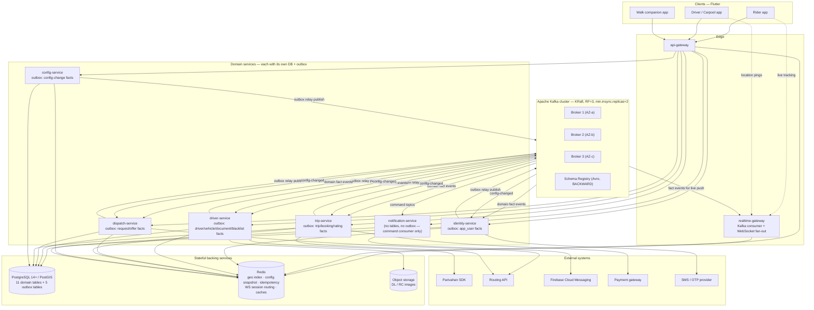

# Tutem — Kafka Architecture (Step 3)

> **Status:** APPROVED, with a surgical D8 amendment applied in place (2026-07-28) to §7 (Retry & DLQ
> architecture) — the blanket 3-tier-retry-for-every-topic policy is replaced by a selective one (§7.0).
> The DLQ contract, backoff durations, and max-attempt cap are unchanged; only *which* topics get retry
> tiers changes. No other section of this document is affected.
> **Input:** [00-architecture-baseline.md](00-architecture-baseline.md) (APPROVED, IMMUTABLE) — naming
> conventions (§0), service/table ownership (§2), the 20 flows (§5), open questions (§7), proposed schema
> additions (§10, NOT approved).
> **Scope of this step:** the Kafka **platform** — cluster topology, delivery semantics, the transactional
> outbox pattern, partitioning model, consumer model, retry/DLQ architecture, schema management, Redis's
> role, realtime fan-out, security, failure tolerance, provisioning, and observability hooks.
> **Explicitly NOT this step:** the topic list (Step 4), the event catalogue and payload schemas (Step 5),
> sequence diagrams (Step 6), per-consumer/per-producer detail (Steps 7–8). Every topic and event name
> below is an **illustrative example only**, conformant to the §0.2/§0.4 grammar, pending Step 4/5
> ratification.
> **Database and business logic are unchanged.** Nothing here adds, removes, or redefines a table, a
> column, or a business rule. §10 of the baseline remains unapproved and every capability gated on it
> (departure-time matching, guaranteed `pickup_order`, the tip) is treated as **unavailable**, exactly as
> the baseline instructs.

---

## 1. Why Kafka here

The baseline's own reading (§1, §5.1) is the starting point: Kafka earns its place wherever a flow step is
**fan-out-heavy, latency-tolerant, or a slow external call**, and it is deliberately kept **out** of every
step that is a single-writer, correctness-critical transaction. This section makes that split explicit,
flow by flow.

### 1.1 What becomes event-driven, and why

| Flow | ASYNC-CANDIDATE steps moved onto Kafka | Why Kafka is the right tool |
|---|---|---|
| F-01 onboarding | "user registered" fact (step 4) | Fan-out to no one specific yet — future consumers (analytics, growth) shouldn't block registration. |
| F-03 document verification | submitted/verified/rejected facts, Parivahan call | Parivahan is a slow, flaky third-party call (baseline: "must never block the upload response"). Kafka decouples the upload response from the verification outcome. |
| F-04/F-05 online/offline | went-online / went-offline facts | Nobody needs to wait for these; multiple consumers (matching readiness, analytics) want them independently. |
| F-06 location ping | ping ingestion → persistence → geo refresh → rider fan-out | Highest volume flow in the system (§2). A lost ping is superseded by the next one — the definition of latency-tolerant. |
| F-07 dispatch round | candidate alerting, offer creation, push | One request fans out to N drivers; broadcasting via Kafka + notification-service avoids N synchronous push calls inline in the request thread. |
| F-08/F-12 accept race | **notification only** (winner/losers), never the `UPDATE` itself | See §1.2 — the race stays a DB constraint. Only the already-settled outcome is broadcast. |
| F-09/F-11 trip execution | rating prompts, `driver.total_trips` increment, cross-service status hops (`service_request` status applied on trip/booking facts) | Cross-aggregate propagation that tolerates seconds of lag; the rider already sees the authoritative state from the aggregate that owns it. |
| F-10 carpool | offer-created → matching → matches-generated → notify-matched-riders → seat-count fan-out | The entire matching pipeline is asynchronous by nature: driver publishes, a background computation finds candidates, notification is delivered whenever it completes. |
| F-13/F-14 blacklist & expiry | evidence facts from both the reject path and the expiry sweep | Two independent triggers converging on one idempotent evaluation — exactly what a topic + idempotent consumer is for. |
| F-15 blacklist expiry | "may work again" notice | Fire-and-forget notification. |
| F-16 payment | non-cash gateway callbacks, refund facts | Gateway callbacks are inherently asynchronous webhooks; Kafka gives them a durable, replayable landing zone. |
| F-17 cancellation | notifications, re-dispatch trigger, cross-service status hops | Same shape as F-08/F-09 hops. |
| F-18 rating | rating-average propagation to `app_user`/`driver` | Cross-context, eventually-consistent by the baseline's own design (§5, F-18 step 3). |
| F-20 config change | change-notification fan-out to every service's snapshot | One writer, many independent readers refreshing a cache — a textbook pub/sub use. |

### 1.2 What stays synchronous, and why — the accept race is the canonical example

The baseline's §5.1 table is authoritative and this document does not relitigate it. Restated for the
record, because it is the single most important boundary in this design:

> **The accept race is settled by `uq_offer_single_accept` (NewSchema §4.6) — a partial unique index and
> one conditional `UPDATE` — never by Kafka, a lock, or a saga.** Kafka's only role in F-08/F-12 step 2–4 is
> to **broadcast the outcome after the database has already decided it.** No design in this document, nor
> any later step, may route the accept decision itself through a topic, a consumer, or an event handler.
> The same applies to the carpool atomic seat reservation (F-10 step 8) and its cancellation counterpart
> (F-10 step 14): `ck_trip_seats` and the single transaction are the arbiter, not a Kafka transaction.

Also kept strictly synchronous, and never turned into a request published to a topic and awaited via a
reply-topic pattern: OTP generation/verification, all CHECK-constraint-governed status transitions, the
fare estimate shown before a rider confirms, go-online eligibility validation, and every uniqueness
enforcement (`uq_req_one_live_per_rider`, `uq_trip_one_live_per_provider`, `uq_booking_request`). These are
request/response by nature — the caller needs the answer to render the next screen — and turning them into
"publish a command, await a correlated reply on another topic" would only add latency and a second failure
mode (reply timeout) without buying anything Kafka is good at.

### 1.3 What Kafka is explicitly NOT used for

| Anti-pattern | Why it is rejected here |
|---|---|
| Routing the accept `UPDATE` through a topic/consumer | Would turn a single-row conditional write into a distributed race with none of `uq_offer_single_accept`'s guarantees. **Never.** |
| A request/reply pattern over Kafka for anything in §1.2's list | Adds a broker hop and a correlation/timeout mechanism to a call that already has a synchronous answer. Use REST/internal APIs instead (as the baseline's §2 internal-API list already does — `POST /internal/v1/drivers/nearby`, the trip↔dispatch reads). |
| A saga/orchestrator service coordinating multi-step business transactions | Rejected at the service-design level already (baseline §2.9): flows are choreographed between the five owning services via events, and every cross-service hop the baseline flags is **idempotent and eventually consistent by design**, not compensated by a saga. |
| Kafka as a system of record | PostgreSQL/PostGIS remain authoritative for every fact (§9 below). Kafka topics (other than the outbox's own delivery guarantee) are not queried for current state; they are replayed into services' own stores. |
| Using Kafka to enforce `ck_trip_seats`-class invariants | Those are database constraints. Kafka propagates the fact that they held; it does not adjudicate them. |
| Auto-creating topics in any non-local environment | See §13 — provisioning is explicit and reviewed. |

---

## 2. Cluster topology & HA

| Parameter | Decision | Justification |
|---|---|---|
| Controller mode | **KRaft** (no ZooKeeper) | ZooKeeper is deprecated for new Kafka deployments and adds a second stateful cluster to operate, monitor, and secure — unaffordable overhead for a 3-developer team. KRaft consolidates metadata management into Kafka itself, halves the operational surface, and is the direction every current Kafka distribution ships by default. |
| Node roles | **3 nodes running in combined mode** (broker + controller) for the base deployment; **dedicated controller quorum (3 controller-only nodes) is the documented upgrade path** once broker count grows past ~6, so metadata traffic does not compete with client traffic. | Combined mode is the pragmatic default at this scale (50k concurrent users, not 50k TPS — Assumption A-10). Splitting controllers out on day one is premature operational complexity for 3 engineers; the upgrade path is written down so it isn't a surprise later. |
| Broker count | **3** (minimum for RF=3 with `min.insync.replicas=2`) | Anything below 3 cannot honor RF=3 at all; 3 is the smallest cluster that tolerates one full node loss without under-replication. Scale out brokers (not controllers) as partition/throughput needs grow — see §2.2. |
| Replication factor | **3**, on every topic except explicitly compacted operational topics (still RF=3) | Standard production floor: tolerates one broker loss with zero data loss. |
| `min.insync.replicas` | **2** | With RF=3, `acks=all` and `min.insync.replicas=2`, one broker can be down or slow and producers still get a durable acknowledgment; losing two simultaneously (rare, and itself an incident) is the only scenario that blocks writes — which is the correct trade for a mobility app where losing an event silently is worse than a brief write stall. |
| Rack/AZ awareness | **`broker.rack` set to the AZ** in every broker config; 3 brokers spread across 3 AZs | With RF=3 and 3 racks, Kafka's rack-aware replica placement guarantees each partition's 3 replicas land in 3 different AZs — a single AZ outage never drops below `min.insync.replicas`. |
| Client-facing endpoint | One logical bootstrap per environment (§13) behind the cluster's own load-balanced listener; TLS on every listener (§11) | Simplifies every service's Kafka client config to one bootstrap list per environment. |

### 2.1 Message-rate sizing (back-of-envelope, F-06-driven)

The baseline's own scale reading is the input: **50k concurrent users is dominated by driver location
pings and offer fan-out, not by transactional writes** (§1, §6 A-10). Stated inputs, all assumptions
(none of this is given in the source documents, so every number is explicit and revisable):

| Input | Value | Basis |
|---|---|---|
| Concurrent app users | 50,000 (given) | use-case non-functional target |
| Concurrent **online drivers** (all three modes combined) | 5,000 (10% of concurrent users) | Typical rider:driver concurrency ratio for an on-demand mobility app; stated as an assumption, not derived from any source document. |
| Location ping interval | 4 seconds | Common GPS-tracking cadence balancing battery life and tracking smoothness; the baseline states no specific interval, so this is an explicit input. |
| **F-06 ping rate** | 5,000 drivers ÷ 4 s = **1,250 msg/s** produced to `tutem.driver.driver.location-updated.v1` | Direct arithmetic from the two inputs above. |
| Concurrent active searches (RIDE + WALK) at peak | 500 | ~1% of concurrent users actively searching at any instant — a conservative peak assumption. |
| Drivers alerted per dispatch round | 5 (`dispatch.max_drivers_per_round` default, per `system_config`) | From NewSchema's seeded config keys. |
| Average rounds per request before a match | 1.5 | Assumption — most requests match in round 1, some need a second, wider round. |
| **F-07 offer-creation rate at peak** | 500 × 5 × 1.5 = 3,750 `ride_offer` rows / peak minute ≈ **62 msg/s** sustained-peak equivalent | Illustrative — this is a burst pattern (offers created in a tight window per request), not a steady rate; the cluster must absorb the burst, not just the average. |
| Push notifications per offer round | ~2× the offer count (WebSocket fact + FCM command per D3) | Direct multiplier from §10's dual-delivery decision. |
| **Derived total steady-state topic throughput** | **~1,300–1,500 msg/s** across all topics at peak, dominated **>80% by F-06 across the full stated range** (1,250 of 1,300 ≈ 96%; 1,250 of 1,500 ≈ 83%) | Sum of the above; F-06 is the sizing driver, matching the baseline's own claim. |

**Sizing consequence:** at ~1,500 msg/s of small (<1 KB) messages, a 3-broker cluster with modest hardware
(8 vCPU / 32 GB / NVMe per broker) has enormous headroom — this workload is an order of magnitude below
where partition count or broker count becomes the bottleneck. The real constraints are (a) partition count
per §5, chosen for *ordering and consumer parallelism*, not raw throughput, and (b) `driver.current_location`
write amplification into PostgreSQL, which the baseline already isolates behind a single indexed `UPDATE`
per ping and a Redis geo mirror. **The 50k-user target is a connection-count and fan-out problem for
realtime-gateway (§10), not a Kafka throughput problem.**

### 2.1.1 Alternative considered and rejected — publishing every raw ping vs. writing directly and publishing only a derived/sampled event

Because F-06 is **>80% of all cluster traffic across the whole stated range** (§2.1), this is the one
design decision worth making explicit and locatable, in the same style §4.2 uses for the relay mechanism,
rather than leaving it implied by §1.1's flow table and §13.1's retention choice:

| Option | Verdict | Why |
|---|---|---|
| **Publish every raw ping** to `tutem.driver.driver.location-updated.v1`, with driver-service and realtime-gateway each independently consuming it to update PostGIS/Redis and to fan out to riders respectively | **CHOSEN** | One fact, one topic, reused by every current and future consumer of "where is this driver right now" — driver-service's own write and realtime-gateway's fan-out are two independent consumers of the *same* published fact (§9, §10), which is the same consumer model every other live-update flow in this document uses. The cost is accepted and bounded deliberately, not accidentally: it is the reason F-06 dominates §2.1's sizing and it is exactly why §13.1 gives this one topic the shortest retention window (24 hours) of any class in the system — retention, not suppression at the source, is the cost-control lever here. |
| **Write PostGIS/Redis directly from the ingest point** (skip Kafka for the raw ping) and **publish only a derived or sampled fan-out event** (e.g. every Nth ping, or only while a rider is actively watching a trip) | **Rejected** | Would cut Kafka volume by roughly the same >80% it currently accounts for, but at real cost: it creates a second, parallel write path for the same fact (a direct DB/Redis write, decoupled from a separate decision about when to also publish) instead of the one-fact/one-topic model used everywhere else; any future consumer of raw position (an anomaly detector, a breadcrumb store, an analytics pipeline) has no single place to attach without re-deriving the ingest path; and realtime-gateway's live-tracking fan-out (§10) would need bespoke plumbing rather than reusing the same Kafka-consumer pattern as every other fan-out in this document. **Not adopted** — the accepted cost is a short-retention topic, not a second pipeline. |

### 2.2 Scale-out path

Documented, not built on day one (3-developer team, current load is far from any ceiling):

1. Add brokers (not controllers) when per-broker disk or network saturates, or when partition counts (§5)
   need to grow past what 3 brokers can host with headroom.
2. Split controllers into a dedicated 3-node quorum once total broker count exceeds ~6, so controller
   election and metadata propagation never compete with client I/O.
3. Re-partition (§5) only for the F-06 topic family if driver counts grow an order of magnitude — partition
   count can only be increased, never decreased, so it is deliberately set with headroom (§5).

---

## 3. Delivery semantics

| Event class | Guarantee | Producer settings | Why |
|---|---|---|---|
| **All domain fact events** (`tutem.<domain>.<aggregate>.<event-name>.v<major>`) | **At-least-once**, consumer-side idempotent | `acks=all`, `enable.idempotence=true`, `retries=Integer.MAX_VALUE` (bounded by `delivery.timeout.ms`), `max.in.flight.requests.per.connection=5` (safe with idempotence enabled) | At-least-once is the Kafka default that keeps producers simple; every consumer is required to be idempotent by design (§0.7 idempotency keys, §6 below), so duplicates are a non-issue by construction — no need to pay for transactions on the read side. |
| **Command topics** (`tutem.<domain>.<action>.command.v<major>`) | **At-least-once**, executing consumer idempotent | Same producer settings as above | Commands (e.g. `SendPushCommand`) are naturally idempotent to execute (a duplicate push is a UX nuisance, not a correctness bug) and are de-duplicated by `tutem:notification:sent:<idempotencyKey>` (§0.8) regardless. |
| **The outbox-relay publish itself** (every owning service's own outbox → its own topics) | **At-least-once delivery to Kafka**; idempotent + transactional producer settings guarantee only that the relay's *own retries within one publish attempt* cannot duplicate that attempt's records — there is no atomic two-system commit | `enable.idempotence=true` **and** `transactional.id=<service-name>-outbox-relay-<instance>`, using `KafkaTransactionManager`/`kafkaTemplate.executeInTransaction(...)` | The Kafka transaction covers only what Kafka can enlist — the produced record(s) — never the subsequent `UPDATE outbox_event SET published_at = ...`, which is a **separate, later Postgres statement** (§4.2). A crash between the two leaves the row `published_at IS NULL`, so the next poll republishes it: a **duplicate delivery, not a duplicate fact**, absorbed by consumer-side `eventId` de-duplication (baseline §0.7) exactly like any other at-least-once redelivery. The honest end-to-end guarantee here is at-least-once with idempotent consumers, the same as every other row in this table — see §4.2. |
| **Retry/DLQ republishing** | **At-least-once**, same idempotency guarantees as the original topic | Standard idempotent producer | A redrive is defined (§0.3) to preserve the original `eventId`, so consumer-side de-dup still applies; no exactly-once machinery is needed here. |

**Why exactly-once is not used end-to-end:** true end-to-end EOS (transactional producer *and* consumer
reading with `isolation.level=read_committed` *and* every downstream side effect inside the same Kafka
transaction) only pays off when a consumer's side effect is itself another Kafka publish in a
consume-transform-produce pipeline. None of Tutem's consumers are pure Kafka-to-Kafka transforms — every
one ends in a database write, an external call (FCM, Parivahan, payment gateway), or a WebSocket push, none
of which participate in a Kafka transaction. Chasing EOS there would require the **outbox pattern again on
the consumer side** for no additional correctness (idempotent consumers with a DB unique index or a Redis
de-dup key already deliver the same effective guarantee, §0.7). The transactional producer used by the
outbox relay (§4.2) is therefore **not** end-to-end exactly-once either — it only prevents the relay's own
retries from duplicating a single publish attempt; it cannot and does not make "publish" and "mark
`published_at`" one atomic operation (no XA across Kafka and Postgres exists). The genuinely end-to-end
guarantee, everywhere in this platform including the outbox relay, is **at-least-once delivery with
idempotent consumers** — the narrow transactional-producer setting is a cheap hardening of the relay's own
retry behavior, not a claim of exactly-once beyond that.

---

## 4. The transactional outbox pattern (core decision)

Every one of the five table-owning services (identity, driver, dispatch, trip, config) must guarantee that
its database write and its Kafka publish **never permanently disagree** — a rider must never permanently
see "trip created" in the database with no corresponding event ever arriving, nor an event whose row was
never actually committed. This is **not** a single atomic two-system commit (Kafka and Postgres cannot be
enlisted in one transaction without XA, which Kafka does not support — see §3 and §4.2 for the exact,
sequential mechanism and its crash-window consequence). It is the single most important integration
decision in this document precisely because it delivers that guarantee **without** requiring the atomicity
a naive reading might assume.

### 4.1 Outbox table shape

One `outbox_event` table **per owning service's own schema** — never shared across services, consistent
with the single-writer-per-table rule (§2.0 of the baseline):

```sql
CREATE TABLE outbox_event (
    id               BIGINT GENERATED BY DEFAULT AS IDENTITY PRIMARY KEY, -- monotonic; the envelope's eventId (§0.10) lives inside payload, not here — see the ordering note below
    aggregate_type   VARCHAR(40)  NOT NULL,             -- §0.2.1 registry aggregate token, e.g. 'Trip'
    aggregate_id     TEXT         NOT NULL,             -- the envelope's aggregateId; TEXT because config's aggregate id is config_key (VARCHAR(64)), not a UUID
    topic            VARCHAR(200) NOT NULL,             -- fully rendered topic name (§0.2)
    partition_key    TEXT         NOT NULL,             -- the §0.6 record key, pre-rendered as text (also not always a UUID — see config_key)
    event_type       VARCHAR(80)  NOT NULL,             -- §0.4 PascalCase class name — mirrors the header
    payload          JSONB        NOT NULL,             -- the full envelope (Avro/JSON per §8, kept as JSONB here for outbox durability + operability)
    headers          JSONB        NOT NULL,             -- traceparent/tracestate + any envelope fields also carried as headers
    occurred_at      TIMESTAMPTZ  NOT NULL,
    created_at       TIMESTAMPTZ  NOT NULL DEFAULT now(),
    published_at     TIMESTAMPTZ,                       -- NULL until the relay confirms the Kafka publish
    publish_attempts INT          NOT NULL DEFAULT 0
);

CREATE INDEX ix_outbox_unpublished ON outbox_event (aggregate_id, id) WHERE published_at IS NULL;
```

> **Corrected at DDL-derivation time (2026-07-29), applied in `Implementation\migrations\`:** `id` is a
> monotonic `BIGINT GENERATED BY DEFAULT AS IDENTITY`, not a UUID, and `aggregate_id`/`partition_key` are
> `TEXT`, not `UUID`/`VARCHAR(100)`. Rationale and the full ordering consequence are stated where the
> sharded relay claim is designed — `06-producers.md` §8–§9 — and carried into the final ADR §5/§14/§25.
> The `id` column is **not** the envelope's `eventId`; that UUID lives inside `payload` exactly as before.

- **Same transaction, same statement batch, same commit** as the domain write it accompanies: e.g.
  trip-service's F-08-step-5 transaction that inserts `trip` and `booking` also inserts the corresponding
  `outbox_event` row(s) — one commit, both facts durable together, or neither is.
- `payload` carries the full §0.10 envelope (`eventId`, `eventType`, `schemaVersion`, `correlationId`,
  `causationId`, `occurredAt`, `producerService`, `aggregateType`/`aggregateId`, `idempotencyKey`), so the
  relay is a dumb forwarder — it does not construct envelope semantics, only serializes and ships what the
  domain transaction already decided.

### 4.2 Relay mechanism — **polling publisher**, chosen over Debezium CDC and over a library-embedded
(Spring-Modulith-style) in-process publisher

| Option | Verdict | Why |
|---|---|---|
| **Polling publisher** (a scheduled query against `outbox_event WHERE published_at IS NULL ORDER BY created_at LIMIT n FOR UPDATE SKIP LOCKED`, then produce, then mark published, wrapped per §3's outbox transaction) | **CHOSEN** | Zero new infrastructure: it is a Spring `@Scheduled` job plus the Kafka client already in every service. For a 3-developer team this is the entire relevant skill: SQL, Spring, Kafka producer — no new operational component to run, patch, or monitor. Latency (poll interval, e.g. 200 ms–1 s) is more than acceptable for every ASYNC-CANDIDATE flow step in §5 of the baseline, none of which has a sub-second SLA. |
| **Debezium CDC** (log-tailing the Postgres WAL, publishing outbox inserts automatically via Kafka Connect) | **Rejected for now, documented as the upgrade path** | Debezium gives lower latency and offloads the poll loop, but it introduces a **third stateful system** (Kafka Connect workers) that the team must deploy, secure, and operate, plus WAL-level coupling to Postgres internals (replication slots, `wal_level=logical`) that raises the bar on every schema migration. For a 3-developer team with sub-second latency needs already met by polling, this is complexity bought with no requirement behind it. **Revisit when:** poll-loop latency becomes visibly the bottleneck for a real flow (none is today), or the team grows enough to own a Kafka Connect cluster. |
| **Spring-Modulith-style in-process publisher** (publish to Kafka synchronously inside the same transaction boundary as the domain write, no separate table) | **Rejected** | This only works if the publish itself can be made transactional with the DB write, which it cannot for a Kafka producer without XA (unsupported by Kafka) — so in practice it degrades to "write DB, then try to publish, and hope the process doesn't crash in between," which is exactly the dual-write problem the outbox pattern exists to solve. It also couples publish latency (network round-trip to Kafka) into the caller's request latency for flows the baseline explicitly marked ASYNC-CANDIDATE precisely to avoid that. |

**Relay implementation detail:** each owning service runs its own outbox-relay component (a Spring
`@Scheduled` task or a lightweight dedicated thread pool) **inside the same deployable**, not a separate
service — consistent with D2's deployable-count discipline. It uses `SELECT ... FOR UPDATE SKIP LOCKED` so
multiple instances of the same service can run relays concurrently without double-publishing the same row,
publishes each row transactionally (§3), and only then sets `published_at`. A row that fails to publish
after `publish_attempts` exceeds a bound is alerted on (§14), never silently dropped — it stays
`published_at IS NULL` and is retried by the next poll.

### 4.3 Ordering guarantees the outbox preserves

- **Within one aggregate's outbox rows**, publishing `ORDER BY created_at` (with `FOR UPDATE SKIP LOCKED`
  batching that respects insertion order per key) preserves the **commit order** of facts about that
  aggregate, which — combined with the §0.6 partition key sending all of one aggregate's events to one
  partition — reproduces the transaction's own ordering on the Kafka side.
- **Across aggregates**, no ordering is claimed or needed; this matches §0.6's own statement that ordering
  is per-partition-key only.
- **The three deliberate exceptions** (`offer`→`request_id`, `booking`→`trip_id`, and `config`→`config_key`)
  are handled by the outbox row carrying the pre-rendered `partition_key` column (§4.1) computed by the
  domain code at write time — the relay never re-derives it, it only reads and produces with it. This is
  what "co-locates siblings" in practice: every `ride_offer` row for one `service_request`, regardless of
  which driver it targets, lands in the same outbox batch keyed by that request's id, and therefore the
  same Kafka partition.

### 4.4 Interaction with the single-writer-per-table rule

The outbox table is written **only by its owning service**, in the **same transaction** as the domain
tables that service already owns exclusively (§2.0 of the baseline). It introduces no new writer to any of
the 11 domain tables and no cross-service write anywhere — the relay reads and updates only its own
service's `outbox_event` rows. This is a strict refinement of the existing rule, not an exception to it.

### 4.5 The outbox table is infrastructure, not a domain table

**Explicit statement, because this is easy to misread as an 12th table:** `outbox_event` (×5, one per
owning service) does **not** violate the 11-table schema, and does not reopen NewSchema §6's "deliberately
left out" list, for three reasons:

1. It carries **no business meaning of its own** — it is not queried by any business capability, appears
   in no rider/driver-facing API, and has no foreign key to or from any of the 11 domain tables. Its sole
   purpose is transport reliability between a committed fact and a published record.
2. NewSchema §6 excludes an **audit log** (a durable record of *what happened, for humans to review later*).
   `outbox_event` is the opposite: rows are **transient by design** — published rows are candidates for
   deletion/archival on a short retention window (e.g. 24–72 hours) once `published_at` is set, purely to
   bound table size. Nobody reads it as history; `trip`, `booking`, `service_request` already are the
   history (§8, F-19).
3. It lives in the **same PostgreSQL instance and schema as its owning service's domain tables** (§2.0's
   "one PostgreSQL instance, schema-per-service" deployment note), so it adds zero new infrastructure
   surface beyond a table — no new database, no new connection pool, no new backup policy distinct from
   what already exists.

**Recommendation carried forward:** each service's migration adds `outbox_event` under its own schema,
outside of and never referenced by `NewSchema.md`. This document proposes it as **Kafka platform
infrastructure**, not a schema change to the 11-table domain model — no §10-style approval gate applies to
it, because it makes no business claim NewSchema.md would need to arbitrate.

---

## 5. Partitioning & ordering model

### 5.1 Partition counts per topic class

| Topic class | Example | Partition count | Justification |
|---|---|---|---|
| Highest-volume, per-driver-keyed (`driver` aggregate: location, online-state) | `tutem.driver.driver.location-updated.v1` | **24** | Sized for §2.1's ~1,250 msg/s sustained plus 5–10× headroom for driver-base growth, and to give `driver-service.geo-index-maintenance.v1`-class consumer groups enough partitions to run many concurrent consumer instances (consumer parallelism ≤ partition count). |
| Race-arbiter / high-fan-out per-request (`offer`, `request`) | `tutem.dispatch.offer.created.v1`, `tutem.dispatch.request.matched.v1` | **12** | Bursty, not sustained-high; 12 gives enough parallelism for the dispatch-alerting consumer group without over-fragmenting a request's own offers (all of one request's offers still land on the same partition via the `request_id` key — partition count doesn't change that co-location, it only changes how many *different* requests' partitions exist). |
| Trip/booking lifecycle (`trip`, `booking`) | `tutem.trip.trip.created.v1`, `tutem.trip.booking.confirmed.v1` | **12** | Moderate volume (one per accepted ride/carpool-booking/walk, not one per ping); 12 balances parallelism against the fact that ordering only matters within one `trip_id`. |
| Low-volume, per-driver lifecycle (`vehicle`, `document`, `blacklist`) | `tutem.driver.blacklist.blacklist-applied.v1` | **6** | Orders of magnitude lower volume than location pings; 6 avoids empty-partition overhead while still allowing a few parallel consumers. |
| Identity / rating | `tutem.identity.user.registered.v1`, `tutem.trip.rating.submitted.v1` | **6** | Low volume, no fan-out pressure. |
| Config | `tutem.config.config.changed.v1` | **3** | `system_config` is a ~10-row table (§0.6); more partitions would only fragment the already-tiny `config_key` keyspace and cost more than it buys. |
| Command topics | `tutem.notification.send-push.command.v1` | **12** | Keyed by `user_id` for per-recipient ordering (§0.6); sized to the same order as the trip/booking class since push volume roughly tracks trip volume × 2 (§2.1). |
| DLQ / retry topics | `<topic>.dlq` (every topic); `<topic>.retry-<n>` (only topics qualifying under **D8**, §7.0 — 3 of the 39 base topics as of Step 4/5's catalogue) | **matches the source topic's partition count** | Keeps the same key-to-partition mapping on redrive, so a redriven record's ordering relationship to its siblings is preserved. Applies identically to the reduced retry-topic set — D8 changes *which* topics get a `.retry-<n>` series, never the sizing rule for the ones that do. |

Partition counts are set with headroom because **Kafka partitions can only be increased, never decreased**,
and increasing later reshuffles key-to-partition assignment for existing keys — disruptive mid-flight for
an `offer`/`request`/`trip`/`booking`-keyed topic where siblings must stay co-located. Sizing generously
now (relative to §2.1's modest throughput) avoids ever needing that operation.

### 5.2 What ordering is actually guaranteed

**Per-partition only — no design in this document, nor any later step, may assume global ordering across
partitions.** This restates and does not relax §0.6 of the baseline. Concretely:

| Needs ordering? | Flows | Mechanism |
|---|---|---|
| **Yes — genuinely required** | F-06 (driver location, last-write-wins by `occurredAt`); F-08/F-12 accept race outcome + sibling withdrawal (must be seen as one atomic-looking sequence per request); F-10/F-11 carpool seat-count changes on one `trip`; F-13/F-14 blacklist evidence per driver-day | `driver_id` key (driver), `request_id` key (offer + request, §0.6's first deliberate exception), `trip_id` key (booking, §0.6's second exception), `driver_id` key (blacklist/document) |
| **No — order-independent by construction** | F-01 registration facts; F-03 document-submitted/verified facts across *different* documents; F-18 rating submissions from *different* raters; F-20 config-change notifications (idempotent full-snapshot refresh, not a delta apply) | No cross-event ordering requirement stated or implied anywhere in the baseline for these. |

### 5.3 Consequence of the 3 key exceptions

`offer`→`request_id` and `booking`→`trip_id` are **deliberate co-location keys, not aggregate-id keys**
(§0.6). The direct consequence for this design:

- **All `ride_offer` events for one `service_request`** — one per candidate driver, plus the eventual
  accept/withdraw outcomes — land on **one partition**, in commit order (via the outbox, §4.3). A consumer
  processing that partition sees the whole accept race's aftermath (winner accepted, all siblings withdrawn)
  as a strictly ordered sequence, which is exactly what the sibling-withdraw fan-out (F-08 step 4) needs to
  reason about without re-sorting by timestamp.
- **All `Booking` events for one `Trip`** — every carpool seat reservation, cancellation, onboard, and
  drop-off on that trip — land on **one partition**, ordered with that trip's own lifecycle events
  (`TripCreated`, `TripSeatsExhausted`, `TripCompleted`). This is what lets a single consumer (e.g. the
  seat-count fan-out in realtime-gateway, or trip-service's own `history` read-model projector) maintain a
  strictly ordered view of one carpool trip's evolving seat state without joining across partitions.
- **The cost accepted:** a very high-volume `service_request` (many candidate drivers) or a very
  high-booking-count carpool `trip` (many riders) cannot spread its own events across more than one
  partition — hot-partition risk is bounded by realistic values (`dispatch.max_drivers_per_round` default
  5–10, carpool `seats_total` bounded by vehicle capacity), so this is an accepted, deliberate trade, not an
  oversight.

---

## 6. Consumer model

| Aspect | Decision |
|---|---|
| Consumer groups | Exactly the §0.5 grammar: `<service-name>.<purpose>.v<major>`. Each distinct **use case** a service implements over a topic gets its own group, so e.g. trip-service's `trip-provisioning` handler and its `history-projection` handler read `tutem.dispatch.offer.accepted.v1` independently, at independent offsets. |
| Concurrency | Consumer instances per group ≤ partition count for that topic (§5.1); each service runs enough pods/threads to keep pace with its own topic's partition count, capped so no group ever has idle consumers (a consumer beyond the partition count receives no partitions and does nothing). |
| At-least-once + idempotent consumers | **Mandatory on every consumer, no exceptions** (Assumption A-09). Two layers: (1) DB unique indexes wherever the business already has one (`uq_booking_request`, `uq_bl_one_per_day`, etc. — §0.7's "the database wins over Redis" rule); (2) `tutem:ops:idem:<consumer-group>:<eventId>` (§0.8) for the remainder, most notably the two unbackstopped counters flagged in §16 below. |
| Offset commit strategy | **Manual acknowledgment**, committed only after the consumer's side effect (DB write, external call, or both) has durably completed. Auto-commit is disabled everywhere — auto-commit-before-processing is exactly how a crash turns "at-least-once" into "silently lost." |
| `max.poll.interval.ms` / rebalance | Set generously (e.g. 5 minutes) for any consumer that makes a slow external call synchronously inside the poll (should be none — see next row), and tightly (default ~30s–1 min) for pure DB-writing consumers, so a genuinely stuck consumer is rebalanced away promptly rather than masking a real problem. `session.timeout.ms` tuned in step with `heartbeat.interval.ms` (Kafka's separate consumer heartbeat thread, so a long processing call doesn't itself trip a session timeout — only a stuck poll loop does). |
| Keeping slow external calls off the poll loop | **Rule, not a suggestion:** any consumer whose handling involves Parivahan, FCM, the payment gateway, or the Routing API **hands the call off to a bounded worker pool / async executor** and acknowledges the Kafka offset only once that call's outcome (success, retryable failure, or terminal failure) is known and persisted (e.g. `driver_document.status`, `booking.payment_status`). The poll loop's only job is to pull the record and dispatch it; it must never block on a network call to a third party whose latency the service does not control. This is what keeps `max.poll.interval.ms` predictable and prevents one slow Parivahan response from stalling an entire partition's throughput. |

---

## 7. Retry & DLQ architecture

Per §0.3 of the baseline (immutable naming): one `.dlq` per source topic — every topic, no exception.
`.retry-<n>` tiers are **not** blanket-provisioned; per **D8 (user decision, 2026-07-28, amending this
section)**, they exist only where they buy something a bounded in-process retry cannot. §7.0 states the
qualifying test; §7.1/§7.2 are rewritten to it; §7.3/§7.4 (the DLQ header contract and redrive procedure)
are unchanged by D8.

### 7.0 D8 — the qualifying test for a retry-tier topic

**A topic gets `.retry-1/2/3` if and only if that topic's consumer's failure handling makes a retryable
call to one of four external systems:** the **Parivahan SDK**, **Firebase Cloud Messaging (FCM)**, the
**payment gateway**, or the **Routing API** — the same four systems §6's "keep slow external calls off the
poll loop" rule already names. The rationale is narrow and deliberate: non-blocking retry tiers earn their
keep only when a failure is plausibly transient *because the dependency is slow or flaky*, and the tiered
backoff (30s / 5min / 30min, §7.2) exists to avoid hammering exactly that kind of dependency without
stalling the source partition. A consumer whose entire failure surface is its own database has neither
property:

- A **pure-DB consumer failure** is either transient (a connection-pool blip, a lock wait) — which a
  **bounded in-process retry with local backoff** resolves in milliseconds, well inside the same poll — or
  it is a **poison record** (a constraint violation, a referenced row that will never exist), for which
  routing through three delayed topics only adds consumer-group lag and delays the operator's DLQ signal
  for no benefit.
- Every other topic in this catalogue — every topic whose consumer only reads/writes Postgres, Redis, or
  another owned table — therefore retries **in-process, bounded, with backoff**, and on exhaustion publishes
  **directly to `<topic>.dlq`**, skipping the retry tiers entirely. This is not a downgrade: the DLQ header
  contract (§7.3), the redrive procedure (§7.4), and consumer-side idempotency (§6, baseline §0.7) all still
  apply unchanged; only the non-blocking-retry *hop* is removed for these topics.
- The topic-by-topic qualifying list (which topics get tiers, which consumer, which external system) is
  Step 4's responsibility and lives in `02-kafka-topics.md` §3 — this section fixes the *rule*, not the
  *inventory*, exactly as this document's original scope statement intends.

### 7.1 Retryable vs terminal (poison) errors

| Category | Examples | Treatment |
|---|---|---|
| **Retryable, external-dependency (qualifies for retry tiers, §7.0)** | Parivahan/FCM/payment-gateway/Routing-API timeout or 5xx | Route to `<topic>.retry-1` → `<topic>.retry-2` → `<topic>.retry-3` with increasing backoff, then `.dlq` if still failing. |
| **Retryable, local (does NOT qualify for retry tiers)** | A temporary DB connection-pool exhaustion in the consumer's own service; a Redis blip on the idempotency check | Bounded **in-process** retry with backoff (no separate topic), then `.dlq` directly on exhaustion. |
| **Terminal (poison)** | Deserialization failure (schema mismatch the registry should have prevented, §8); a business-rule violation that will never resolve by retrying (e.g. a referenced `driver_id` that genuinely does not exist); a bug that throws deterministically on this exact payload | Route directly to `.dlq` — retrying a deterministic failure, in-process or via a retry topic, only wastes capacity and delays operator visibility. |
| **Ambiguous on first sight** | An external call that failed with an unclear status code | Default to retryable up to the attempt cap (retry-tier if the topic qualifies per §7.0, otherwise in-process); escalate to `.dlq` once attempts are exhausted — never loop indefinitely. |

### 7.2 Backoff policy and attempt cap

- **For qualifying topics only (§7.0): 3 retry tiers** (`.retry-1`, `.retry-2`, `.retry-3`), each a
  **separate topic** consumed by a **separate, delayed** consumer (non-blocking retry: the main consumer
  never sleeps in-loop; a failed record is republished to the next retry topic and the main partition keeps
  moving).
- **For every other topic: no retry topics exist.** The consumer's own bounded in-process retry (same
  backoff shape, no separate hop) runs inline; on exhaustion the record is published straight to `.dlq`.
- Backoff (unchanged by D8, applies identically whether the hop is a retry topic or an in-process retry):
  **exponential**, e.g. attempt-1 after 30s, attempt-2 after 5 min, attempt-3 after 30 min — chosen so a
  brief external-dependency blip (seconds) self-heals on the first attempt, while a longer outage (Parivahan
  down for an hour) is caught by the third without hammering the dependency.
- **Max attempts: 3, then `.dlq`** (unchanged by D8). `x-retry-count` (§0.3) is incremented on each hop —
  retry-topic hop or in-process attempt alike — and is what a redrive tool and the alerting in §14 both
  read.

### 7.3 The DLQ record contract

Exactly the baseline's §0.3 contract, restated as the binding contract for this step: the original key,
value, and every §0.10 envelope header are forwarded **unmodified**, and the failing consumer adds the 8
`x-`-prefixed headers at DLQ time only: `x-original-topic`, `x-original-partition`, `x-original-offset`,
`x-consumer-group`, `x-exception-class`, `x-exception-message`, `x-failed-at`, `x-retry-count`. Because the
DLQ family is `x-`-prefixed and the envelope family is not (§0.10's reconciliation table), nothing here
introduces a new naming risk.

### 7.4 Redrive procedure

1. An operator (or an automated redrive tool, once one exists) reads the failing record's `x-*` headers to
   identify `x-original-topic`, `x-consumer-group`, and the exception class/message.
2. The underlying cause is fixed (a code deploy, a config change, a downstream dependency recovering).
3. The record is **republished to its `x-original-topic`** with its original key and value byte-for-byte,
   carrying the same `eventId` — so the target consumer's own idempotency check (§0.7/§6) makes a
   redundant redrive (e.g. one that raced with a since-recovered retry) a safe no-op rather than a
   duplicate side effect.
4. `traceparent` is preserved end-to-end (§0.11c), so the redriven record's entire history — original
   attempt, each retry hop, the DLQ landing, and the redrive — remains one trace for post-incident review.
5. Redrive is always **manual-trigger, batch-scoped** (by time range or by a specific set of `eventId`s) —
   never an automatic "replay everything in the DLQ on a timer," which would silently reintroduce whatever
   caused the failure in the first place.

---

## 8. Schema management & evolution

| Decision | Choice | Justification |
|---|---|---|
| **Serialization format** | **Apache Avro** | Avro's schema-evolution rules (add-optional-field, remove-with-default, etc.) are the most mature or of the three mainstream options for exactly the "grow the payload without breaking old consumers" problem this platform will face constantly (Steps 4–5 will add fields as flows mature); it is compact on the wire, which matters at §2.1's F-06 volume; and it has first-class support in the Confluent/Apicurio Schema Registry ecosystem that this design already needs for compatibility enforcement. Protobuf was considered and is a reasonable second choice, but its `.proto`-first workflow duplicates the class-generation story already implied by §0.4's Java class naming (`RideOfferAccepted`, etc.) less naturally in a Spring/Java-first team than Avro's schema-to-POJO generation. JSON Schema was rejected outright: no compact binary encoding, materially larger payloads at F-06 volume, and weaker compatibility tooling than either binary format. |
| **Schema Registry** | **One registry per environment** (co-located with that environment's Kafka cluster, §13) | Every producer registers/validates against the registry before publish; every consumer resolves the writer schema by the ID embedded in the Avro payload. One registry per environment, not one global registry, keeps a prod-breaking schema change impossible to accidentally register against staging or vice versa. |
| **Compatibility mode** | **`BACKWARD`** (a new schema can read data written with the previous schema) per subject, enforced by the registry at registration time | `BACKWARD` is the correct mode for this platform's pattern of "add an optional field, keep consuming old records" (e.g. how §10's proposed columns, once approved, would surface as new optional event fields) — it lets producers deploy new schema versions ahead of all consumers upgrading, which matches this team's rolling-deploy reality. `FULL` (both directions) was considered and rejected as unnecessarily strict for a 3-developer team's deploy cadence; `NONE` was rejected as unsafe. |
| **Subject naming** | `<topic-name>-value` (registry default), one subject per topic | Keeps the registry's own naming mechanical and topic-derivable, matching the spirit of §0.2's fixed-arity design. |

### 8.1 `.v<major>` topic suffix vs `schemaVersion` — two different mechanisms, stated precisely

These are deliberately **not the same axis**, and conflating them is the single most common Kafka
schema-versioning mistake:

| Mechanism | Granularity | Governs | Changed by |
|---|---|---|---|
| **`.v<major>` topic suffix** (§0.2) | **Topic identity** | Whether two schema versions are even allowed to coexist in the same log at all. A `.v1` and `.v2` topic are **physically different topics with independent partitions, offsets, and consumer groups.** | A **breaking** change — anything the Avro `BACKWARD` rule would reject (removing a required field, changing a field's type incompatibly, renaming without an alias). Per §0.2.2: "a breaking schema change publishes `.v2` alongside `.v1`, never mutates `.v1`." |
| **`schemaVersion` envelope field** (§0.10) | **Record identity within one topic** | The **compatible evolution** of the payload contract inside one `.v<major>` topic — e.g. `1.0` → `1.3` as optional fields are added over time, still `BACKWARD`-compatible, still the same topic, same registry subject. | Any additive, `BACKWARD`-compatible change (new optional field, new enum value appended where the reader tolerates unknowns). |

**In practice:** the Schema Registry's `BACKWARD` check operates *within* a `.v<major>` topic's subject — it
is the mechanism that keeps `schemaVersion` bumps safe. The moment a change would fail that check, the
correct move is not to force it through the registry but to **cut a new topic** (`.v2`) with its own fresh
subject, run producers and consumers side by side during migration, and retire `.v1` only once every
consumer has moved — exactly the pattern §0.2.2 already mandates by naming convention. Step 4/5 will decide
the concrete first `schemaVersion` values per event; this step only fixes the mechanism.

---

## 9. Redis's role alongside Kafka

Every Redis key below is drawn verbatim from the baseline's §0.8 inventory — **no new key is introduced by
this step.** Restated here to make Redis's relationship to Kafka explicit:

| Redis responsibility | Key(s) | Relationship to Kafka |
|---|---|---|
| Consumer-side idempotency de-dup | `tutem:ops:idem:<consumer-group>:<eventId>` | The **fallback** idempotency layer (§0.7) for events with no DB unique index to lean on — most notably the two unbackstopped counters in §16. Kafka delivers at-least-once; Redis (or a DB constraint, preferred where one exists) is what makes a duplicate delivery a no-op. |
| Driver geo index | `tutem:driver:geo:<active_mode>` | **Fixed now (§1.1, §2.1.1):** every raw ping reaches this key only by way of `tutem.driver.driver.location-updated.v1` — driver-service never writes it from a path that bypasses Kafka. **Left to Step 7:** whether the *same* consumer handler that writes `driver.current_location` also updates this key in one invocation, or a second, independent consumer group does — an implementation-parallelism choice within one Kafka-mediated pipeline, not an alternate pipeline. As a **derived read model** it is never itself the input to a Kafka publish and is fully rebuildable from PostGIS if lost. |
| Offer TTL | `tutem:dispatch:offer-ttl:<offerId>` | Drives the F-14 expiry sweep's *triggering*, but the sweep's actual `SENT → EXPIRED` transition — and therefore the blacklist-evidence fact it publishes to Kafka — reads and writes `ride_offer.expires_at` in Postgres, not Redis. Losing this key only delays expiry to the periodic reconciling sweep (baseline F-14 step 1). |
| Config snapshot | `tutem:config:snapshot` | Refreshed by every service **consuming** `tutem.config.config.changed.v1` (F-20) — the read side of the one place config-service's write fans out via Kafka to many caches. |
| Active-trip cache | `tutem:trip:active-by-user:<userId>` | A read-through cache trip-service maintains for its own most-polled screen; not itself a Kafka consumer or producer input. |
| WebSocket session routing | `tutem:ops:ws-route:<userId>`, `tutem:ops:presence:<userId>`, `tutem:ops:fanout:<tripId>` | The mechanism by which realtime-gateway, **after consuming from Kafka**, finds which gateway instance holds a given user's socket (§10 below) — Redis here is purely a routing table for Kafka-sourced fan-out, never a durability layer for the event itself. |

**Explicit statement, carried forward from the baseline (A-08) and binding for every later step:** Redis is
**never the source of truth** for any of the above. PostgreSQL/PostGIS remain authoritative for every fact
this platform propagates; a full Redis flush is a latency/availability event, never a data-loss event (see
§12.5).

---

## 10. Realtime fan-out (realtime-gateway)

1. **Kafka consumption.** realtime-gateway runs its own consumer groups (per §0.5, e.g.
   `realtime-gateway.driver-location-fanout.v1`, `realtime-gateway.offer-countdown-fanout.v1`,
   `realtime-gateway.carpool-seat-fanout.v1`) against exactly the topics whose facts need a live push:
   `tutem.driver.driver.location-updated.v1`, `tutem.dispatch.offer.*.v1`, `tutem.trip.trip.*.v1`,
   `tutem.trip.booking.*.v1`, `tutem.trip.trip.seats-exhausted.v1`.
2. **Per-instance groups, not one shared group per topic.** Each realtime-gateway pod is a member of the
   same consumer group, so Kafka's own partition assignment spreads the topic's partitions across running
   pods — this is standard consumer-group scaling (§6), not a bespoke mechanism. A pod that receives a
   partition may hold sockets for users who are *not* the ones affected by every record on that partition,
   which is exactly why routing (next point) is needed.
3. **Finding a user's socket — `tutem:ops:ws-route:<userId>`.** When a consumed record needs to reach a
   specific user (or, for a carpool trip, several — driver plus every rider currently viewing it), the
   consuming pod looks up `tutem:ops:ws-route:<userId>` to find **which realtime-gateway instance** currently
   holds that user's live connection. If it's a different instance, the record is handed off via
   `tutem:ops:fanout:<tripId>` (Redis pub/sub) so the instance that actually owns the socket pushes it — this
   is the cross-instance fan-out mechanism named in §0.8, and it is what lets any pod consume any partition
   while still reaching a socket held by any other pod.
4. **Scaling.** realtime-gateway scales horizontally on **socket count**, not on Kafka partition count — the
   two are decoupled by the Redis routing/pub-sub layer in step 3, so adding gateway pods to handle more
   concurrent connections does not require re-partitioning any topic, and vice versa.
5. **Client-side de-duplication against FCM by `eventId` (D3).** Every WebSocket push and every
   `SendPushCommand`-driven FCM push for the same underlying fact carry the **same `eventId`** (the envelope
   field is copied into both the WebSocket payload and the FCM data payload). The Flutter client tracks
   recently-seen `eventId`s and discards the second delivery of a fact it already rendered — this is the
   concrete mechanism behind D3's "both paths, de-duplicated on the client," and it requires no server-side
   coordination between realtime-gateway and notification-service: they are two independent Kafka consumers
   of the same fact, deliberately not synchronized with each other.

---

## 11. Security

| Concern | Decision |
|---|---|
| Transport encryption | **TLS on every broker listener, every producer, every consumer, every environment** — no plaintext listener anywhere, including inter-broker traffic. |
| Authentication | **mTLS for service-to-broker connections** (each of the 8 deployables holds its own client certificate, issued per service per environment) — chosen over SASL/SCRAM because the deployment already needs a certificate-issuance story for TLS itself, and mTLS gets authentication "for free" off the same PKI rather than running a second, separate SASL credential lifecycle for a fixed, known set of 8 internal services. SASL/SCRAM remains the documented fallback if the team's infra does not want to run internal PKI. |
| Authorization (ACLs) | **Per-service, least-privilege, aligned exactly to §0.2.3's producer-cardinality rule:** each domain's owning service gets `WRITE`/`Describe` on exactly the event topics it is the sole producer for (e.g. dispatch-service: `WRITE` on `tutem.dispatch.*`, nothing else); every service that legitimately consumes a topic gets `READ` + its own consumer-group ACL; command topics grant `WRITE` to every service the baseline names as a producer (§0.2.3's three-service list for `send-push`) and `READ` to notification-service alone. No service holds a wildcard ACL across domains it does not own — a driver-service credential physically cannot publish to `tutem.trip.*`, which is the ACL layer enforcing the same rule §0.2.3 states in naming. |
| PII in event payloads — what must **NOT** appear | Phone numbers, raw document numbers (`doc_number`), `image_url`s pointing at DL/RC images, and precise location coordinates are **never placed in a Kafka payload in cleartext**, even though they exist in the owning tables. Events carry **identifiers** (`userId`, `driverId`, `documentId`) that a consumer resolves via the owning service's own sync API (already the pattern the baseline uses for cross-service reads, §2) if it genuinely needs the detail — Kafka is a fact bus, not a PII replication channel. The one deliberate, narrow exception the baseline's own flows require: `tutem.driver.driver.location-updated.v1` **must** carry the coordinate (that is the entire content of the fact) — mitigated by (a) short retention on that topic (§13 — it is a stream, not a compacted log of history) and (b) ACLs restricting `READ` to only driver-service and realtime-gateway, never a broadly-granted topic. |
| Encryption at rest | Broker disks encrypted at the infrastructure/volume layer (cloud-provider-managed disk encryption); Schema Registry storage likewise. This is infrastructure configuration, not a Kafka-specific setting. |
| Topic-level authorization for command topics | Because command topics permit multiple producers (§0.2.3's sole exception), their ACLs are **explicitly enumerated per producer**, never granted by wildcard-matching a domain prefix — e.g. `tutem.notification.send-push.command.v1` grants `WRITE` individually to dispatch-service, trip-service, and driver-service (the three named in §0.2.3), and `READ` + its consumer-group ACL to notification-service alone. Any future service needing to produce to that command topic requires an explicit ACL grant and a corresponding update to §0.2.3's producer list — never an implicit grant via a broader pattern. |

---

## 12. Failure scenarios & fault tolerance

| Scenario | What happens | Why the system survives it |
|---|---|---|
| **Broker loss (one node)** | The affected partitions' leadership fails over to an in-sync replica automatically (KRaft controller quorum drives the election); producers with `acks=all` see a brief retry window, then resume. | RF=3 + `min.insync.replicas=2` (§2) means losing one broker never drops a partition below its insync floor; no manual intervention needed. |
| **Broker loss (two of three simultaneously)** | Any partition whose remaining replica set drops below `min.insync.replicas=2` **stops accepting writes** (by design) until a replica recovers. | This is the deliberate trade of `min.insync.replicas=2`: correctness over availability in a genuinely rare double-failure — the outbox (§4) means no domain write is lost even though its *publish* stalls; the outbox row simply stays unpublished until the cluster recovers, then the relay's next poll catches up. |
| **Partition leader election** | Automatic via the KRaft controller quorum; typically sub-second for a small, well-provisioned cluster. | No ZooKeeper split-brain class of failure exists in KRaft mode (§2's justification). |
| **Consumer lag (a slow consumer group falls behind)** | Detected via the lag metric (§14); the group keeps consuming — nothing is dropped, because Kafka retains records for the configured retention window (§13) regardless of consumer position. | This is exactly why Kafka (a durable log) rather than a fire-and-forget queue was chosen for facts that matter — a lagging consumer is a performance problem to fix, not a data-loss event, up to the retention window. |
| **Producer unavailability (the owning service's Kafka client can't reach the cluster)** | The **outbox relay's publish attempt fails and simply doesn't advance `published_at`**; the domain write it accompanies already committed (§4's whole point) and is completely unaffected. The relay retries on its next poll. | This is the outbox pattern's core guarantee: a Kafka outage degrades *event latency*, never *data durability*. The rider/driver-facing transaction already succeeded before the relay ever ran. |
| **Redis loss (full flush or instance failure)** | Geo lookups fall back to a direct PostGIS query (slower, but `ix_driver_available` still serves it — baseline §6); config reads fall back to a direct `system_config` query until the snapshot rebuilds; WebSocket routing keys are rebuilt as clients reconnect (they are ephemeral by design, §0.8); idempotency de-dup keys are the one case where a loss has a real (bounded) consequence — see below. | Consistent with A-08: nothing in Redis is the system of record. The one nuance: if `tutem:ops:idem:*` is lost mid-flight, a consumer that has **no DB unique index backstop** (§16's two counters, and the carpool `pickup_order` invariant) could double-apply an event that a DB constraint would otherwise have caught. This is exactly why §16 flags those three as needing a Step 9 mitigation beyond Redis alone. |
| **Poison records** | Routed to `.dlq` after exhausting retries (§7), never left to loop or to block the partition indefinitely. | Non-blocking retry topics (§7.2) mean a poison record never stalls its siblings on the same partition — the main consumer moves on to the next offset after handing the failure off. |
| **Replay/reprocessing safety** | Any topic can be replayed from an earlier offset (a new consumer group starting at `earliest`, or an existing group's offset reset) with the **same correctness guarantee as first delivery** — because every consumer is required to be idempotent (§6, A-09). | This is the direct payoff of insisting on idempotent consumers everywhere rather than treating it as optional: replay becomes a normal operational tool (backfilling a new read model, recovering from a bug fix) instead of a hazard. |
| **"No event lost" argument, end to end** | (1) The domain write and its outbox row commit atomically **in one Postgres transaction** (§4) — nothing is lost before Kafka is even involved. (2) The relay's Kafka publish and its subsequent `published_at` update are **two separate, sequential steps, not one atomic commit** (§3, §4.2) — a crash between them causes a **duplicate delivery on the next poll, never a loss**, and that duplicate is exactly what consumer-side `eventId` de-duplication exists to absorb. (3) RF=3 / `min.insync.replicas=2` (§2) — nothing is lost once acknowledged by the cluster, even across a broker failure. (4) Retention (§13) keeps it available until every consumer group has processed it. (5) Idempotent consumers (§6) mean at-least-once delivery — including the occasional relay-crash duplicate from (2) — never becomes a correctness bug on the read side. | Every link in the chain is independently justified above; this row exists to state the composed argument in one place, because it is the property every other section in this document ultimately serves. The chain guarantees **at-least-once, never-lost delivery**, not exactly-once — that distinction is deliberate, see §3. |

---

## 13. Multi-environment & topic provisioning

| Aspect | Decision |
|---|---|
| **Topic creation** | **No auto-create, in any environment, ever** (`auto.create.topics.enable=false` cluster-wide). Every topic is created by an explicit, reviewed provisioning step (Terraform/GitOps-managed topic definitions, or an equivalent declarative tool) — Step 4's topic list becomes the source of the provisioning manifest. This is what prevents a typo'd topic name in a new consumer from silently creating a mis-configured (default partition count, default retention) topic that then has to be cleaned up. |
| **Environment strategy — decided: cluster-per-environment, not a topic-name prefix or a shared-cluster namespace** | Each environment (dev, staging, prod) runs its **own physically separate Kafka cluster** (its own brokers, its own Schema Registry). The topic name itself carries **no environment segment** — `tutem.trip.trip.created.v1` is spelled identically in every environment, because §0.2's grammar is fixed at 5 dot-separated segments with no env slot, and inventing a 6th segment (or an env prefix before `tutem.`) would break every consumer's positional parsing rule (§0.2's stated rationale for fixed arity) and every example in §0.2.4. Physical cluster separation also gives the cleanest security boundary (§11) — a staging credential simply cannot reach production's bootstrap servers, full stop, rather than relying on topic-name-pattern ACLs to enforce the same thing within one shared cluster. |
| **Retention/compaction per class** | See §13.1 below. |

### 13.1 Retention and compaction per topic class

| Class | Retention policy | Retention window | Why |
|---|---|---|---|
| **Domain fact events** (`trip`, `booking`, `offer`, `request`, `driver` lifecycle, `document`, `blacklist`, `rating`, `user`) | **`delete`** (time-retained log, not compacted) | 7 days | These are **events**, not a current-state store — consumers project them into their own database or read model; Kafka does not need to hold them forever. 7 days comfortably covers any reasonable consumer outage plus manual investigation/replay window without unbounded disk growth. |
| **High-volume location pings** (`tutem.driver.driver.location-updated.v1`) | **`delete`** | 24 hours | This is the one topic where "last known position" is the only thing anyone cares about, and it is already mirrored into `driver.current_location` (Postgres) and the Redis geo set within milliseconds of ingestion (§9). A short window bounds the highest-volume topic's disk footprint without any loss of business value — nobody replays yesterday's GPS breadcrumbs (NewSchema §6 explicitly excludes a breadcrumb table). |
| **Config change notifications** (`tutem.config.config.changed.v1`) | **`compact`** (log-of-current-state, keyed by `config_key`) | N/A — compaction, not time-based | This is the one topic class that is genuinely a "current value per key" store rather than an event stream: `system_config` has ~10 rows (§0.6), and compaction means a newly-joining consumer (or one recovering from a long outage) can read the topic from the beginning and land on exactly the current snapshot per key, without needing a separate bootstrap-from-database step. This is the deliberate exception to the "delete" default and is called out explicitly per this section's requirement. |
| **Command topics** | **`delete`** | 3 days | Commands are actioned promptly (push delivery); a short window is ample for retry/replay and keeps command-topic disk footprint minimal. |
| **DLQ topics** | **`delete`** | 30 days | Poison records need a longer investigation and redrive window than the happy path — incidents are not always triaged same-day. |
| **Retry topics** (`.retry-1/2/3`) — **only the topics qualifying under D8, §7.0** | **`delete`** | 7 days | Matches the domain topic default; a record should never sit in a retry topic for anywhere near this long (§7.2's backoff caps at 30 minutes before DLQ). Every non-qualifying topic has **no retry-topic retention line at all** — its bounded in-process retry leaves no separate Kafka log. |

---

## 14. Observability hooks

**Naming only, per §0.11 of the baseline — the alerting plan (thresholds, on-call routing, runbooks) is
explicitly Step 9 work and is not designed here.** The metrics that matter for the Kafka platform, all
following the `tutem_<subject>_<unit>` grammar with the standard label set (`service`, `env`, `instance`,
plus `topic`/`consumer_group`/`event_type`/`outcome`/`mode` where applicable):

| Metric | What it tells an operator |
|---|---|
| `tutem_kafka_consumer_lag_records` (label: `topic`, `consumer_group`, `partition`) | Whether a consumer group is keeping up — the leading indicator for every "is this flow healthy" question. |
| `tutem_kafka_dlq_published_total` (label: `topic`, `consumer_group`, `event_type`) | DLQ depth/rate — the leading indicator for a poison-record incident or a systemic downstream outage (Parivahan/FCM/payment gateway). |
| `tutem_outbox_unpublished_records` / `tutem_outbox_publish_lag_seconds` (label: `service`) | Outbox relay health — how far behind the relay is, and how many domain facts are committed but not yet visible on any topic. This is the single most important new metric this step introduces, because it is the leading indicator for the outbox pattern's own health (§4). |
| `tutem_kafka_e2e_latency_seconds` (label: `topic`, `event_type`) | Time from `occurredAt` (§0.10, when the fact became true in the producer's transaction) to the consumer's processing completion — the metric that answers "how stale is the rider's/driver's live view," directly relevant to F-06's realtime promise. |
| `tutem_kafka_consumed_total` / `tutem_kafka_consume_duration_seconds` (label: `outcome` = success/retry/dlq/skipped-duplicate) | Throughput and processing cost per consumer, and — via the `skipped-duplicate` outcome value — a direct measurement of how often idempotent de-dup is actually firing, which is a health signal for at-least-once delivery. |
| `tutem_kafka_broker_under_replicated_partitions` / `tutem_kafka_controller_active_count` | Cluster-health basics (§2/§12) — under-replication and controller-quorum state. |

---

## 15. Architecture diagram



> Topic and event names are illustrative; the authoritative list is Step 4.

---

## 16. Decisions, assumptions, open questions

### 16.1 Decisions table

| Decision | Choice | Why | Alternative rejected |
|---|---|---|---|
| Controller mode | KRaft | No second stateful ZooKeeper cluster for a 3-developer team; consolidated metadata management | ZooKeeper — deprecated path, doubles ops surface |
| Broker/RF baseline | 3 brokers, RF=3, `min.insync.replicas=2`, rack-aware across 3 AZs | Smallest cluster tolerating one full-node/one-AZ loss with zero data loss | Fewer brokers (can't reach RF=3); RF=2 (no tolerance for concurrent replica loss) |
| Outbox relay mechanism | Polling publisher (in-process, per service) | Zero new infrastructure component; latency more than sufficient for every ASYNC-CANDIDATE flow; matches 3-dev team's existing skillset | Debezium CDC (extra Kafka Connect infra + WAL coupling); in-process synchronous publish (reintroduces the dual-write problem) |
| Serialization format | Avro + Schema Registry, `BACKWARD` compatibility | Compact wire format at F-06 volume; mature evolution rules; idiomatic with Spring/Java class generation matching §0.4 | Protobuf (less natural fit to this team's Spring-first workflow); JSON Schema (larger payloads, weaker tooling) |
| Delivery semantics | At-least-once + idempotent consumers everywhere; transactional producer scoped to the outbox relay only | Matches Kafka's natural model; DB constraints already provide the strongest idempotency guarantee where they exist | Full end-to-end exactly-once (no consumer is a pure Kafka-to-Kafka transform, so it buys nothing) |
| Partition-count scheme | Per topic-class, sized to §2.1's volume with 5–10× headroom; F-06-class topics highest (24), config lowest (3) | Partitions can only grow, never shrink, and growing reshuffles co-located siblings — size generously once | Uniform partition count across all topics (wastes parallelism on low-volume topics, under-provisions F-06) |
| Environment strategy | Cluster-per-environment; topic names carry no env segment | §0.2's grammar is fixed-arity with no env slot; physical cluster separation is the cleanest security boundary | Env-prefixed topic names (breaks positional parsing); shared cluster with ACL-only isolation (weaker boundary) |
| Authentication | mTLS service-to-broker | Reuses the TLS PKI the cluster needs anyway, for a small fixed set of 8 known service identities | SASL/SCRAM (a second, separate credential system) — documented as acceptable fallback |
| Outbox table status | Infrastructure, not a domain table; no §10-style approval gate | No business meaning, no FK to domain tables, transient/short-retention rows, lives in the owning service's own schema | Treating it as a 12th domain table requiring schema sign-off |

### 16.2 Assumptions (new in this step; the baseline's 16 assumptions still stand and are not repeated)

| # | Assumption | Impact if wrong |
|---|---|---|
| **K-01** | Concurrent online drivers ≈ 10% of concurrent users (5,000 of 50,000), used as the §2.1 sizing input. | Directly rescales the F-06 message-rate estimate and therefore the partition/broker headroom in §2/§5; a materially higher driver ratio would push toward re-checking whether 24 partitions on the location topic still has enough headroom. |
| **K-02** | Location ping interval is 4 seconds. | A shorter interval (e.g. 2s) roughly doubles F-06 throughput; still well within the sizing headroom stated in §2.1, but worth re-stating if product settles on a different cadence. |
| **K-03** | Outbox-relay poll interval (200ms–1s) is fast enough for every flow the baseline tagged ASYNC-CANDIDATE. | No flow in §5 of the baseline states a sub-second latency SLA for an async step; if one is later introduced, the polling publisher's latency profile (§4.2) would need revisiting before Debezium becomes necessary. |
| **K-04** | Three Kafka environments (dev, staging, prod), each its own physical cluster, is an acceptable operational cost for a 3-developer team. | If infra budget or on-call capacity cannot support three independently-operated clusters, a shared-cluster-with-ACL-isolation model (§13, rejected alternative) becomes the fallback, at the cost of a weaker security boundary. |
| **K-05** | mTLS PKI (certificate issuance/rotation) is an acceptable operational addition for the team, given TLS is already mandatory. | If certificate lifecycle management proves too heavy, SASL/SCRAM (already documented as the fallback in §11) becomes the default instead. |

### 16.3 Open questions (new in this step)

| # | Question | Why it matters | Recommended default |
|---|---|---|---|
| **K-Q1** | Should the outbox-relay's poll interval differ per service, or be a single platform-wide default? | Dispatch-service's offer fan-out is more latency-sensitive to a rider's perceived "searching" experience than, say, config-service's change notifications. A single default may under-serve the former or over-poll the latter. | Start with one platform-wide default (e.g. 500ms) via a shared `tutem-events` library setting; let per-service overrides be a Step 7/8 tuning decision once real latency data exists, not a Step 3 guess. |
| **K-Q2** | Exactly which consumer groups need dedicated worker-pool offload (§6) for slow external calls, versus which are safe to process inline? | Getting this wrong either stalls a partition (inline call to a slow dependency) or over-engineers a fast-path consumer with unneeded async plumbing. | Defer to Step 7/8 per-consumer design; the rule (never block the poll loop on Parivahan/FCM/payment/Routing calls) is fixed now, the per-consumer implementation choice is not. |
| **K-Q3** | Does the eventual Kafka Connect / Debezium upgrade path (§4.2) get triggered by a latency SLO, an operational-cost threshold, or a team-size milestone? | Without a stated trigger, "revisit later" risks never being revisited, or being revisited too early. | Recommend tying it to a concrete SLO once one exists (e.g. "p99 outbox-to-topic latency must be under Xms") rather than a vague future review — a Step 9 (Failure Design) input. |

### 16.4 Carried-forward Step 9 inputs — the two unbackstopped counters and the carpool ordering invariant

Restated verbatim in intent from the baseline, because this step's idempotency design (§0.7, §6, §9) is
where they must be tracked, not silently assumed solved:

1. **`driver.total_trips` increment (F-09 step 5).** Applied by driver-service on the trip-completed fact.
   At-least-once delivery makes a naive increment double-count on redelivery; **no database unique index
   backstops this**. Under this step's design, the mitigation is the Redis idempotency key
   `tutem:ops:idem:driver-service.total-trips-increment.v1:<eventId>` (§0.7/§0.8) — but Redis is
   non-authoritative (§9, §12.5), so a Redis loss concurrent with a redelivery is a genuine, if narrow,
   double-count risk. Flagged again here as a Step 9 mitigation-design input, not resolved by this document.
2. **The same class of increment in F-11 step 6** (carpool's per-trip completion, same mechanism, same
   caveat).
3. **The carpool `pickup_order` invariant** (baseline §10 Item 3, **unapproved**). Because two riders
   booking concurrently can be assigned the same `pickup_order` with no database backstop today, any
   consumer that fans out seat/pickup-sequence information (e.g. the seat-count/pickup-order view
   realtime-gateway pushes, §10 of this document) is propagating a value the baseline already documents as
   "a hint, not a key" (F-11 step 2). This step's design does not — and cannot — fix that with Kafka
   mechanics; it is a database-constraint gap, and it is repeated here only so Step 9 inherits it explicitly
   rather than discovering it independently.

---

**End of Step 3.** Awaiting Orchestrator confirmation before Step 4 (topic list) proceeds.
