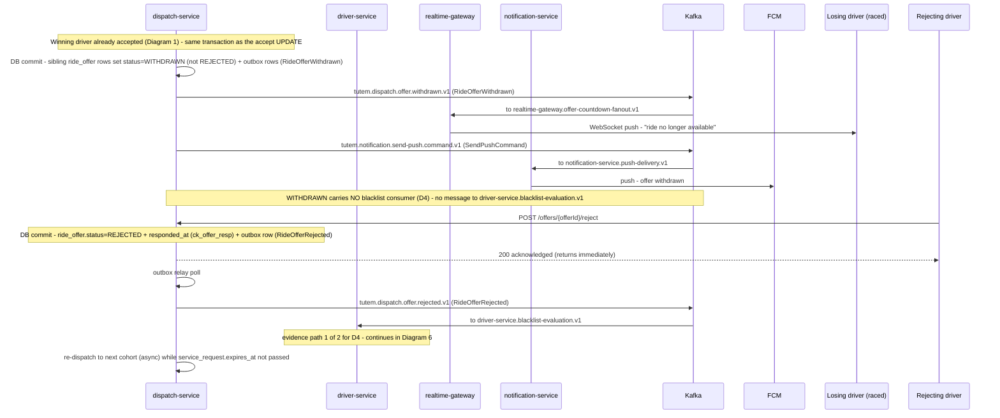
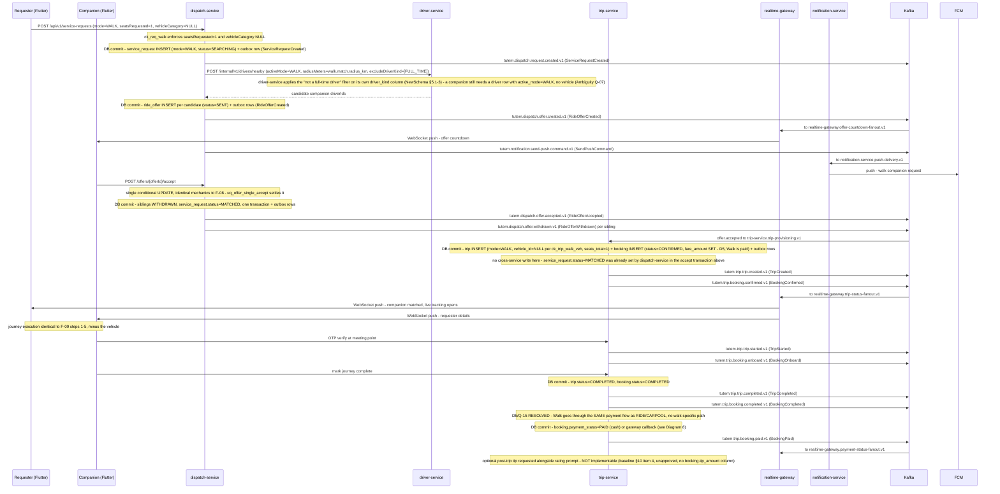
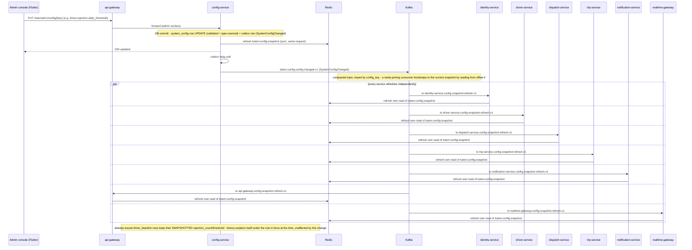

# Tutem — Event Flow Sequence Diagrams (Step 6)

> **Status:** DRAFT — awaiting Orchestrator confirmation.
> **Input:** [00-architecture-baseline.md](00-architecture-baseline.md) (APPROVED) — §5 the 20 flows;
> [01-kafka-architecture.md](01-kafka-architecture.md) (APPROVED) — outbox pattern, realtime fan-out, D3;
> [02-kafka-topics.md](02-kafka-topics.md) (APPROVED) — 39 base topics, consumer groups, partition keys;
> [03-kafka-events.md](03-kafka-events.md) (APPROVED) — 39 event classes, envelope, payload fields.
> **Immutable:** every topic name, event class name, consumer-group name, service name and partition key
> below is copied verbatim from Steps 4/5. Nothing is renamed, abbreviated or invented. Where a diagram
> needed a fact Step 5 does not provide, it is recorded in §3 (Unresolved) instead of being invented.
> **Never redesigned:** the accept race, the outbox pattern, and every D1–D7 user decision are drawn exactly
> as Steps 2–5 specify — this step only visualises them.

---

## 1. Diagram index

| # | Diagram | Flows covered (baseline §5) | Key topics involved |
|---|---|---|---|
| 1 | Book a Ride — end to end | F-07, F-08, F-09 | `dispatch.request.created`, `dispatch.offer.created`, `dispatch.offer.accepted`, `trip.trip.created`, `trip.booking.confirmed`, `trip.trip.started`, `trip.booking.onboard`, `trip.trip.completed`, `trip.booking.completed`, `notification.send-push.command` |
| 2 | Book a Ride — losing driver (WITHDRAWN) and rejection (REJECTED) | F-08, F-12, F-13, F-14 | `dispatch.offer.withdrawn`, `dispatch.offer.rejected`, `dispatch.offer.expired`, `driver.blacklist.blacklist-applied` |
| 3 | Carpool — offer, corridor match, seat booking, seat-count fan-out | F-10, F-11 | `trip.trip.created`, `trip.booking.confirmed`, `trip.trip.seats-exhausted`, `trip.booking.onboard`, `trip.trip.completed` |
| 4 | Walk — companion match, journey, payment | F-12, F-09 (shared mechanics), F-16 | `dispatch.offer.created/accepted/withdrawn`, `trip.trip.created`, `trip.booking.confirmed`, `trip.booking.paid` |
| 5 | Driver Verification — DL/RC upload, Parivahan, effect on going online | F-03, F-04 (eligibility effect) | `driver.document.submitted/verified/rejected`, `notification.send-push.command` |
| 6 | Blacklisting — rejection path + expiry path, threshold, forced offline, expiry | F-13, F-14, F-15 | `dispatch.offer.rejected`, `dispatch.offer.expired`, `driver.blacklist.blacklist-applied`, `driver.blacklist.blacklist-expired` |
| 7 | Trip Completion — state updates, cross-service propagation, history | F-09, F-11, F-18 (rating prompt only) | `trip.trip.completed`, `trip.booking.completed`, `trip.rating.submitted` |
| 8 | Payments — fare, PENDING→PAID/FAILED/REFUNDED, cash vs gateway, tip degradation | F-16 | `trip.booking.paid`, `trip.booking.payment-failed`, `trip.booking.refunded` |
| 9 | Driver location ping (F-06) — highest-volume path | F-06 | `driver.driver.location-updated` |
| 10 | Config change propagation (F-20) | F-20 | `config.config.changed` |

---

## 2. Sequence diagrams

### 2.1 Diagram 1 — Book a Ride, end to end

```mermaid
sequenceDiagram
    participant Rider as Rider (Flutter)
    participant GW as api-gateway
    participant DSP as dispatch-service
    participant DRVSVC as driver-service
    participant TRP as trip-service
    participant NOTSVC as notification-service
    participant RTG as realtime-gateway
    participant KAFKA as Kafka
    participant REDIS as Redis
    participant ROUTING as Routing API
    participant FCM as FCM
    participant WinDriver as Winning driver (Flutter)

    Rider->>GW: POST /api/v1/service-requests (pickup, drop, vehicleCategory)
    GW->>DSP: forward request
    DSP->>ROUTING: distance/ETA for fare estimate
    ROUTING-->>DSP: distance, ETA
    Note over DSP: DB commit - service_request INSERT (mode=RIDE, status=SEARCHING) + outbox row (ServiceRequestCreated)
    DSP-->>Rider: 202 "searching" (est fare shown)
    DSP->>DSP: outbox relay poll (SELECT ... FOR UPDATE SKIP LOCKED)
    DSP->>KAFKA: tutem.dispatch.request.created.v1 (ServiceRequestCreated)
    KAFKA->>TRP: to trip-service.history-projection.v1

    DSP->>DRVSVC: POST /internal/v1/drivers/nearby (activeMode=RIDE, pickupPoint, radiusMeters)
    DRVSVC-->>DSP: candidate driverIds + distanceKm
    Note over DSP: DB commit - ride_offer INSERT per candidate (status=SENT) + outbox rows (RideOfferCreated)
    DSP->>DSP: outbox relay poll
    DSP->>KAFKA: tutem.dispatch.offer.created.v1 (RideOfferCreated) x N candidates
    KAFKA->>RTG: to realtime-gateway.offer-countdown-fanout.v1
    RTG->>REDIS: tutem:ops:ws-route:<userId> lookup per candidate driver
    RTG->>WinDriver: WebSocket push - offer countdown
    DSP->>KAFKA: tutem.notification.send-push.command.v1 (SendPushCommand) x N candidates
    KAFKA->>NOTSVC: to notification-service.push-delivery.v1
    NOTSVC->>FCM: push - new ride offer
    Note over RTG,FCM: D3 - dual delivery, de-duplicated on client by eventId

    WinDriver->>GW: POST /offers/{offerId}/accept
    GW->>DSP: forward accept
    Note over DSP: DB commit - single conditional UPDATE ride_offer SET status=ACCEPTED WHERE status=SENT AND expires_at greater than now() (uq_offer_single_accept)
    alt 0 rows updated - too slow or offer expired
        DSP-->>WinDriver: "ride already taken"
    else 1 row updated - this driver won
        Note over DSP: same transaction - siblings set WITHDRAWN, service_request.status=MATCHED + outbox rows (RideOfferAccepted, RideOfferWithdrawn xN, ServiceRequestMatched)
        DSP-->>WinDriver: 200 "you won"
        DSP->>DSP: outbox relay poll
        DSP->>KAFKA: tutem.dispatch.offer.accepted.v1 (RideOfferAccepted)
        DSP->>KAFKA: tutem.dispatch.offer.withdrawn.v1 (RideOfferWithdrawn) per sibling
        KAFKA->>RTG: to realtime-gateway.offer-countdown-fanout.v1 (winner+losers)
        DSP->>KAFKA: tutem.notification.send-push.command.v1 (SendPushCommand) - winner and losers
        KAFKA->>NOTSVC: to notification-service.push-delivery.v1
        NOTSVC->>FCM: push - winner/loser outcome
        KAFKA->>TRP: tutem.dispatch.offer.accepted.v1 to trip-service.trip-provisioning.v1
        Note over TRP: DB commit - trip INSERT (mode=RIDE, status=ASSIGNED, seats_total=1) + booking INSERT (status=CONFIRMED, start_otp) + outbox rows (TripCreated, BookingConfirmed)
        TRP->>TRP: outbox relay poll
        TRP->>KAFKA: tutem.trip.trip.created.v1 (TripCreated)
        TRP->>KAFKA: tutem.trip.booking.confirmed.v1 (BookingConfirmed)
        KAFKA->>DSP: booking.confirmed to dispatch-service.request-status-sync.v1 (idempotent no-op - already MATCHED for RIDE)
        KAFKA->>RTG: trip.created/booking.confirmed to realtime-gateway.trip-status-fanout.v1
        RTG->>Rider: WebSocket push - driver, vehicle, ETA, OTP context
        RTG->>WinDriver: WebSocket push - rider details
    end

    Note over WinDriver,Rider: F-06 location pings stream throughout (see Diagram 9)

    WinDriver->>GW: POST /bookings/{id}/start-otp (rider-read OTP)
    GW->>TRP: verify OTP
    Note over TRP: DB commit - trip.status=ACTIVE + started_at, booking.status=ONBOARD + picked_up_at
    TRP->>KAFKA: tutem.trip.trip.started.v1 (TripStarted)
    TRP->>KAFKA: tutem.trip.booking.onboard.v1 (BookingOnboard)
    KAFKA->>DSP: to dispatch-service.request-status-sync.v1 - service_request.status=ONGOING
    KAFKA->>RTG: to realtime-gateway.trip-status-fanout.v1

    WinDriver->>GW: POST /trips/{id}/complete
    GW->>TRP: mark arrival
    Note over TRP: DB commit - booking.status=COMPLETED + dropped_at, trip.status=COMPLETED + ended_at + distance_km (one transaction)
    TRP->>KAFKA: tutem.trip.trip.completed.v1 (TripCompleted)
    TRP->>KAFKA: tutem.trip.booking.completed.v1 (BookingCompleted)
    KAFKA->>DSP: to dispatch-service.request-status-sync.v1 - service_request.status=COMPLETED
    KAFKA->>DRVSVC: to driver-service.total-trips-increment.v1 - driver.total_trips += 1
    Note over DRVSVC: unbackstopped counter (no DB unique index) - mitigated by tutem:ops:idem:<consumer-group>:<eventId> Redis de-dup key only
    KAFKA->>RTG: to realtime-gateway.trip-status-fanout.v1
    DSP->>KAFKA: tutem.notification.send-push.command.v1 (SendPushCommand) - rating prompt (F-09.5)
    KAFKA->>NOTSVC: to notification-service.push-delivery.v1
    NOTSVC->>FCM: push - rate your trip
    Note over TRP: Payment settlement follows Diagram 8; rating follows Diagram 7
```

---

### 2.2 Diagram 2 — Book a Ride, the losing driver's path and the rejection path



---

### 2.3 Diagram 3 — Carpool: driver-initiated offer, corridor match, seat booking, seats-exhausted

```mermaid
sequenceDiagram
    participant CDriver as Carpool driver (Flutter)
    participant CRider as Matched rider (Flutter)
    participant TRP as trip-service
    participant DSP as dispatch-service
    participant RTG as realtime-gateway
    participant NOTSVC as notification-service
    participant KAFKA as Kafka
    participant ROUTING as Routing API
    participant FCM as FCM

    CDriver->>TRP: POST create carpool offer (source, destination, seats, vehicle)
    Note over TRP: departure time requested by driver but has NO column today (baseline §10 item 1, unapproved) - not persisted, not returnable later
    TRP->>ROUTING: fetch polyline for route_line
    ROUTING-->>TRP: polyline (or ST_MakeLine straight-line fallback)
    Note over TRP: DB commit - trip INSERT (mode=CARPOOL, status=ASSIGNED = offer open, seats_total, seats_booked=0, route_line) + outbox row (TripCreated)
    TRP->>TRP: outbox relay poll
    TRP->>KAFKA: tutem.trip.trip.created.v1 (TripCreated)
    KAFKA->>DSP: to dispatch-service.carpool-matching.v1

    DSP->>TRP: GET internal - trip route_line and endpoints (sync)
    Note over DSP: corridor match (§4.12-B) over own service_request table - ST_DWithin + ST_LineLocatePoint ordering
    Note over DSP: DEGRADATION - departure-time-window ranking needs §10 items 1 and 2 (unapproved); matching is corridor-only today; rider preferences (§10 item 5, unapproved) not considered
    Note over DSP: matches computed and notify decision made in the SAME consumer transaction - no separate "matches-generated" topic exists (Step 4 §0/§6)
    DSP->>KAFKA: tutem.notification.send-push.command.v1 (SendPushCommand) - matched riders ONLY, never a city-wide broadcast
    KAFKA->>NOTSVC: to notification-service.push-delivery.v1
    NOTSVC->>FCM: push - carpool offer matching your route
    Note over DSP,RTG: see §3 Unresolved - no domain-fact topic gives realtime-gateway a WebSocket leg for this specific "matched riders" notice; FCM is the only evidenced leg here

    CRider->>TRP: GET view offer (driver, vehicle, route, fare estimate, seats remaining)
    Note over TRP: seats remaining = seats_total - seats_booked, read-time only; departure time cannot be displayed (§10 item 1 dependency)
    CRider->>TRP: POST book a seat (seatsRequested)
    Note over TRP: ATOMIC one-transaction reservation - verify trip.status=ASSIGNED, verify seats_booked+seatsRequested less-or-equal seats_total, increment seats_booked, insert booking (status=CONFIRMED, pickup_order, start_otp), commit. ck_trip_seats is the backstop, not Kafka.
    TRP-->>CRider: 200 booked
    TRP->>TRP: outbox relay poll
    TRP->>KAFKA: tutem.trip.booking.confirmed.v1 (BookingConfirmed)
    KAFKA->>DSP: to dispatch-service.request-status-sync.v1 - service_request.status=MATCHED
    KAFKA->>RTG: to realtime-gateway.carpool-seat-fanout.v1
    RTG->>CDriver: WebSocket push - "rider booked N seats", seats-remaining updates live
    RTG->>CRider: WebSocket push - seat confirmed
    DSP->>KAFKA: tutem.notification.send-push.command.v1 (SendPushCommand) - driver notified of new booking (F-10.10)
    KAFKA->>NOTSVC: to notification-service.push-delivery.v1
    NOTSVC->>FCM: push - new booking

    opt seats_booked now equals seats_total
        Note over TRP: derived state - "FULL" is computed, never persisted (D6)
        TRP->>KAFKA: tutem.trip.trip.seats-exhausted.v1 (TripSeatsExhausted)
        KAFKA->>RTG: to realtime-gateway.carpool-seat-fanout.v1
        RTG->>CRider: WebSocket push - offer removed from search results
    end

    loop while status=ASSIGNED and seats remain
        CRider->>TRP: another rider books a seat
    end

    CDriver->>TRP: start trip
    Note over TRP: DB commit - trip.status=ACTIVE + started_at
    TRP->>KAFKA: tutem.trip.trip.started.v1 (TripStarted)

    loop for each booking, ordered by (pickup_order, confirmed_at)
        Note over TRP: confirmed_at tiebreak mandatory - pickup_order alone has no uniqueness backstop (§10 item 3, unapproved)
        CDriver->>TRP: OTP verify at pickup
        Note over TRP: DB commit - booking.status=ONBOARD + picked_up_at
        TRP->>KAFKA: tutem.trip.booking.onboard.v1 (BookingOnboard)
        KAFKA->>DSP: to dispatch-service.request-status-sync.v1 - service_request.status=ONGOING
        KAFKA->>RTG: to realtime-gateway.trip-status-fanout.v1
    end

    CDriver->>TRP: end trip (last booking terminal)
    Note over TRP: DB commit - trip.status=COMPLETED + ended_at + distance_km; every live booking COMPLETED
    TRP->>KAFKA: tutem.trip.trip.completed.v1 (TripCompleted)
    TRP->>KAFKA: tutem.trip.booking.completed.v1 (BookingCompleted) per rider
    KAFKA->>DSP: to dispatch-service.request-status-sync.v1 per rider - service_request.status=COMPLETED
    KAFKA->>RTG: to realtime-gateway.trip-status-fanout.v1
    Note over TRP: continued in Diagram 7 (cross-service propagation)
```

---

### 2.4 Diagram 4 — Walk: companion match, accept, journey, completion, payment



---

### 2.5 Diagram 5 — Driver Verification: DL/RC upload, Parivahan, effect on going online

```mermaid
sequenceDiagram
    participant Driver as Driver (Flutter)
    participant GW as api-gateway
    participant DRVSVC as driver-service
    participant OBJSTORE as Object storage
    participant PARIVAHAN as Parivahan SDK
    participant KAFKA as Kafka
    participant NOTSVC as notification-service
    participant FCM as FCM

    Driver->>GW: POST request upload slot
    GW->>DRVSVC: forward
    DRVSVC-->>Driver: presigned object-storage URL
    Driver->>OBJSTORE: PUT DL/RC image (client-to-storage, bypasses services)
    Driver->>GW: POST register document (docType, docNumber, holderName, expiryDate, imageUrl, vehicleId)
    GW->>DRVSVC: forward
    Note over DRVSVC: DB commit - driver_document INSERT (status=PENDING) + outbox row (DriverDocumentSubmitted)
    DRVSVC-->>Driver: 202 accepted (response never blocks on Parivahan)
    DRVSVC->>DRVSVC: outbox relay poll
    DRVSVC->>KAFKA: tutem.driver.document.submitted.v1 (DriverDocumentSubmitted)
    KAFKA->>DRVSVC: self-consumed by driver-service.parivahan-verification.v1 (async worker pool, off the poll loop)

    DRVSVC->>PARIVAHAN: verify DL/RC (external call, unknown latency, retries with backoff on transient failure)
    PARIVAHAN-->>DRVSVC: verified / rejected response

    alt verified
        Note over DRVSVC: DB commit - driver_document.status=VERIFIED + verified_at (ck_doc_verified) + parivahan_details JSONB + outbox row (DriverDocumentVerified)
        DRVSVC->>KAFKA: tutem.driver.document.verified.v1 (DriverDocumentVerified)
    else rejected
        Note over DRVSVC: DB commit - driver_document.status=REJECTED + rejection_reason (ck_doc_rejected) + outbox row (DriverDocumentRejected)
        DRVSVC->>KAFKA: tutem.driver.document.rejected.v1 (DriverDocumentRejected)
    end
    KAFKA->>DRVSVC: to driver-service.verification-status-recompute.v1

    opt all required documents now VERIFIED (DL always, RC for the intended vehicle)
        Note over DRVSVC: DB commit - driver.verification_status=VERIFIED
    end

    DRVSVC->>KAFKA: tutem.notification.send-push.command.v1 (SendPushCommand) - verification outcome (F-03.8)
    KAFKA->>NOTSVC: to notification-service.push-delivery.v1
    NOTSVC->>FCM: push - document verified/rejected
    Note over DRVSVC,FCM: see §3 Unresolved - no realtime-gateway consumer is evidenced for document.verified/rejected; FCM is the only leg shown here

    Driver->>GW: POST go-online (activeMode, activeVehicleId)
    GW->>DRVSVC: forward
    Note over DRVSVC: SYNC-CRITICAL eligibility check - verification_status=VERIFIED, no live blacklist, vehicle owned+active, ck_driver_vehicle, ck_driver_online
    alt not VERIFIED yet
        DRVSVC-->>Driver: rejected - verification pending
    else VERIFIED and eligible
        Note over DRVSVC: DB commit - driver.is_online=TRUE + outbox row (DriverWentOnline)
        DRVSVC-->>Driver: 200 online
    end
```

---

### 2.6 Diagram 6 — Blacklisting: rejection path AND expiry path, threshold, forced offline, expiry

```mermaid
sequenceDiagram
    participant Driver as Driver (Flutter)
    participant DSP as dispatch-service
    participant DRVSVC as driver-service
    participant KAFKA as Kafka
    participant REDIS as Redis
    participant NOTSVC as notification-service
    participant FCM as FCM

    rect rgb(245,245,245)
    Note over DSP: PATH 1 - driver-response (explicit rejection, F-13)
    Driver->>DSP: POST /offers/{offerId}/reject
    Note over DSP: DB commit - ride_offer.status=REJECTED + responded_at (ck_offer_resp) + outbox row (RideOfferRejected)
    DSP->>KAFKA: tutem.dispatch.offer.rejected.v1 (RideOfferRejected)
    KAFKA->>DRVSVC: to driver-service.blacklist-evaluation.v1
    end

    rect rgb(245,245,245)
    Note over DSP: PATH 2 - offer-expiry sweep (F-14 step 1a) - a TIMER, not a driver action
    DSP->>DSP: SCHEDULED sweep - UPDATE ride_offer SET status=EXPIRED WHERE status=SENT AND expires_at less-or-equal now()
    Note over DSP: DB commit - one evidence-bearing fact PER AFFECTED DRIVER (not per offer) + outbox row (RideOfferExpired)
    DSP->>KAFKA: tutem.dispatch.offer.expired.v1 (RideOfferExpired)
    KAFKA->>DRVSVC: to driver-service.blacklist-evaluation.v1
    Note over KAFKA: D4 - EXPIRED counts as evidence, same as REJECTED. WITHDRAWN never reaches this consumer group at all (Diagram 2).
    end

    Note over DRVSVC: identical evaluation for both paths
    DRVSVC->>DRVSVC: SELECT COUNT(*) FROM ride_offer WHERE driver_id=driverId AND status IN (REJECTED, EXPIRED) AND offered_at greater-or-equal CURRENT_DATE
    DRVSVC->>REDIS: read tutem:config:snapshot for driver.rejection.daily_threshold
    alt count below threshold
        Note over DRVSVC: no action - driver continues normally
    else count reaches threshold
        Note over DRVSVC: DB commit - driver_blacklist INSERT (reason=EXCESSIVE_REJECTION, trigger_date, rejection_count and threshold SNAPSHOTTED, blocked_until capped 30 days by ck_bl_temporary) + driver.blacklisted_until SET + driver.is_online=FALSE, one transaction + outbox row (DriverBlacklistApplied)
        Note over DRVSVC: uq_bl_one_per_day makes a duplicate insert (e.g. from a redelivered event) a harmless no-op - naturally idempotent
        DRVSVC->>DRVSVC: outbox relay poll
        DRVSVC->>KAFKA: tutem.driver.blacklist.blacklist-applied.v1 (DriverBlacklistApplied)
        KAFKA->>DRVSVC: to driver-service.blacklist-geo-sync.v1
        DRVSVC->>REDIS: evict driver from tutem:driver:geo:<active_mode>
        DRVSVC->>KAFKA: tutem.notification.send-push.command.v1 (SendPushCommand) - blacklist notice (F-13.5)
        KAFKA->>NOTSVC: to notification-service.push-delivery.v1
        NOTSVC->>FCM: push - temporary bar and its expiry
        Note over DRVSVC,FCM: see §3 Unresolved - no realtime-gateway consumer is evidenced for blacklist.* topics; FCM is the only leg shown here
        Driver->>DSP: any subsequent offer/go-online is rejected while blacklisted_until is in the future
    end

    rect rgb(245,245,245)
    Note over DRVSVC: Blacklist EXPIRY (F-15)
    DRVSVC->>DRVSVC: SCHEDULED nightly job OR lazy check on go-online (NewSchema §5.1-6)
    Note over DRVSVC: DB commit - driver_blacklist.is_active=FALSE + driver.blacklisted_until=NULL + outbox row (DriverBlacklistExpired)
    DRVSVC->>KAFKA: tutem.driver.blacklist.blacklist-expired.v1 (DriverBlacklistExpired)
    KAFKA->>DRVSVC: to driver-service.blacklist-geo-sync.v1 (eligible to rejoin geo set on next go-online)
    DRVSVC->>KAFKA: tutem.notification.send-push.command.v1 (SendPushCommand) - "you may work again" (F-15.3)
    KAFKA->>NOTSVC: to notification-service.push-delivery.v1
    NOTSVC->>FCM: push - blacklist lifted
    end
```

---

### 2.7 Diagram 7 — Trip Completion: state updates, cross-service propagation, history

```mermaid
sequenceDiagram
    participant TRP as trip-service
    participant DSP as dispatch-service
    participant DRVSVC as driver-service
    participant IDSVC as identity-service
    participant RTG as realtime-gateway
    participant NOTSVC as notification-service
    participant KAFKA as Kafka
    participant REDIS as Redis
    participant FCM as FCM

    Note over TRP: trigger - last booking on a trip goes terminal (RIDE/WALK single booking, or CARPOOL last live booking)
    Note over TRP: DB commit - trip.status=COMPLETED + ended_at + distance_km (ck_trip_done, ck_trip_times); booking.status=COMPLETED + dropped_at per rider, one transaction + outbox rows (TripCompleted, BookingCompleted)
    TRP->>TRP: outbox relay poll
    TRP->>KAFKA: tutem.trip.trip.completed.v1 (TripCompleted)
    TRP->>KAFKA: tutem.trip.booking.completed.v1 (BookingCompleted) per rider

    par cross-service propagation
        KAFKA->>DSP: trip.completed/booking.completed to dispatch-service.request-status-sync.v1
        Note over DSP: DB commit - service_request.status=COMPLETED + closed_at (idempotent WHERE status=ONGOING - safe at-least-once)
    and
        KAFKA->>DRVSVC: trip.completed to driver-service.total-trips-increment.v1
        DRVSVC->>REDIS: check tutem:ops:idem:driver-service.total-trips-increment.v1:<eventId>
        Note over DRVSVC: unbackstopped counter - no DB unique index; Redis de-dup is the only safeguard against double-count on redelivery (baseline §16.4 item 1/2)
        DRVSVC->>DRVSVC: DB commit - driver.total_trips += 1
    and
        KAFKA->>RTG: trip.completed/booking.completed to realtime-gateway.trip-status-fanout.v1 (all modes)
        RTG->>REDIS: tutem:ops:ws-route:<userId> lookup
        RTG->>RTG: WebSocket push to rider(s) and provider - trip completed
    end

    TRP->>KAFKA: tutem.notification.send-push.command.v1 (SendPushCommand) - rating prompt, both parties (F-09.5/F-11 step 6)
    KAFKA->>NOTSVC: to notification-service.push-delivery.v1
    NOTSVC->>FCM: push - rate your trip

    Note over TRP: history is now queryable (F-19) - a plain paged read over booking/trip/service_request, no new topic needed

    opt rider or driver submits a rating
        Note over TRP: DB commit - rating INSERT (uq_rating_once, ck_rating_self) + outbox row (RatingSubmitted)
        TRP->>KAFKA: tutem.trip.rating.submitted.v1 (RatingSubmitted)
        KAFKA->>IDSVC: to identity-service.rating-average-recompute.v1
        Note over IDSVC: DB commit - app_user.rating_avg/rating_count recomputed (ratee is a rider)
        KAFKA->>DRVSVC: to driver-service.rating-average-recompute.v1
        Note over DRVSVC: DB commit - driver.rating_avg/rating_count recomputed (ratee is a driver) - cross-context, eventually consistent by design
    end
```

---

### 2.8 Diagram 8 — Payments: fare, status transitions, cash vs gateway, tip degradation

```mermaid
sequenceDiagram
    participant Driver as Driver/Provider (Flutter)
    participant Rider as Rider (Flutter)
    participant TRP as trip-service
    participant PAYGW as Payment gateway
    participant RTG as realtime-gateway
    participant KAFKA as Kafka

    Note over TRP: fare computed at completion - from the estimate or recomputed from trip.distance_km (rule unspecified, Ambiguity Q-05) - written to booking.fare_amount, status starts PENDING

    alt CASH
        Driver->>TRP: POST mark collected
        Note over TRP: DB commit - booking.payment_status=PAID, payment_method=CASH, payment_ref NULL (ck_booking_cash) + outbox row (BookingPaid)
        TRP->>KAFKA: tutem.trip.booking.paid.v1 (BookingPaid)
    else UPI / CARD / WALLET
        TRP->>PAYGW: create payment intent
        PAYGW-->>Rider: payment UI (client completes it)
        PAYGW->>TRP: webhook callback (async, idempotent on payment_ref)
        alt callback success
            Note over TRP: DB commit - booking.payment_status=PAID + payment_ref + outbox row (BookingPaid)
            TRP->>KAFKA: tutem.trip.booking.paid.v1 (BookingPaid)
        else callback failure
            Note over TRP: DB commit - booking.payment_status=FAILED + outbox row (BookingPaymentFailed)
            TRP->>KAFKA: tutem.trip.booking.payment-failed.v1 (BookingPaymentFailed)
        end
    end

    KAFKA->>RTG: to realtime-gateway.payment-status-fanout.v1
    RTG->>Rider: WebSocket push - payment status
    RTG->>Driver: WebSocket push - payment status
    Note over KAFKA,RTG: no notification.send-push.command producer is evidenced for F-16 payment events - see §3 Unresolved; only the WebSocket leg is shown here

    opt refund required
        Note over TRP: DB commit - booking.payment_status=REFUNDED, no partial-refund and no ledger (NewSchema §6) + outbox row (BookingRefunded)
        TRP->>KAFKA: tutem.trip.booking.refunded.v1 (BookingRefunded)
        KAFKA->>RTG: to realtime-gateway.payment-status-fanout.v1
        RTG->>Rider: WebSocket push - refunded
    end

    Note over TRP: DEGRADATION - optional post-trip tip (D5) is NOT implementable today. booking has only fare_amount, payment_method, payment_status, payment_ref; no booking.tip_amount column exists (baseline §10 item 4, unapproved). ck_booking_paid already couples payment_status=PAID to a non-null fare_amount, so folding a tip into fare_amount after settlement is not free of consequences either. Nothing else in this diagram depends on the tip.
    Note over TRP: applies identically to RIDE, CARPOOL and WALK (D5 - Walk is paid, no special case)
```

---

### 2.9 Diagram 9 — Driver location ping (F-06), highest-volume path

```mermaid
sequenceDiagram
    participant DriverApp as Driver (Flutter)
    participant RTG as realtime-gateway
    participant DRVSVC as driver-service
    participant KAFKA as Kafka
    participant REDIS as Redis
    participant RiderApp as Rider watching this trip (Flutter)

    loop every ping interval (approx 4s)
        DriverApp->>RTG: WebSocket - position ping (lat, lon)
        Note over RTG: ingest only - realtime-gateway never writes driver.current_location itself
        RTG->>DRVSVC: forward ping (sync internal call)
        Note over DRVSVC: DB commit - single indexed UPDATE driver SET current_location, location_updated_at (one row, no history table, must never share a transaction with anything else) + outbox row (DriverLocationUpdated)
        DRVSVC->>DRVSVC: outbox relay poll
        DRVSVC->>KAFKA: tutem.driver.driver.location-updated.v1 (DriverLocationUpdated)
        Note over KAFKA: PII exception (Step 3 §11) - the coordinate IS the fact; mitigated by 24h retention and ACLs restricted to driver-service + realtime-gateway only

        par
            KAFKA->>DRVSVC: self-consumed by driver-service.geo-index-maintenance.v1
            DRVSVC->>REDIS: refresh tutem:driver:geo:<active_mode> GEO set (derived read model - PostGIS stays source of truth)
        and
            KAFKA->>RTG: to realtime-gateway.driver-location-fanout.v1
            RTG->>REDIS: tutem:ops:ws-route:<userId> lookup for each rider watching this driver's trip
            opt driver is on an ACTIVE trip
                RTG->>REDIS: tutem:ops:fanout:<tripId> pub/sub if the socket is held by a different gateway instance
                RTG->>RiderApp: WebSocket push - live position
            end
        end
    end
    Note over DRVSVC,REDIS: ordering per-driver, last-write-wins by occurredAt (never publish time) - a lost ping is superseded by the next one
```

---

### 2.10 Diagram 10 — Config change propagation (F-20)



---

## 3. Unresolved / needs an event

Two categories of gap surfaced while drawing these diagrams. Neither invents an event — both are recorded
here per the rule that a missing fact must stop the diagram, not manufacture a name.

1. **D3's "both WebSocket and FCM, always" rule is not evidenced for every user-facing alert in Steps 4/5.**
   D3 (baseline §2.2) states every user-facing alert goes out on both paths. Checking each alert against
   the actual topic list (02-kafka-topics.md) and realtime-gateway's declared subscription set
   (01-kafka-architecture.md §10.1: `driver.driver.location-updated`, `dispatch.offer.*`, `trip.trip.*`,
   `trip.booking.*`, `trip.trip.seats-exhausted`), three alerts have an evidenced FCM leg
   (`tutem.notification.send-push.command.v1`) but **no** evidenced WebSocket leg, because the domain-fact
   topic that carries them is not in realtime-gateway's subscription list:
   - **F-10 step 6** — carpool matched-rider notification (Diagram 3). Confirmed explicitly by
     02-kafka-topics.md §0/§6: the "matches-generated" fact is not a topic at all; only
     `tutem.notification.send-push.command.v1` is produced for this step.
   - **F-03 step 8** — document verification outcome (Diagram 5). `tutem.driver.document.verified.v1` /
     `.rejected.v1` have no realtime-gateway consumer in the topic catalogue.
   - **F-13 step 5 / F-15 step 3** — blacklist applied / lifted notice (Diagram 6).
     `tutem.driver.blacklist.blacklist-applied.v1` / `.blacklist-expired.v1` have no realtime-gateway
     consumer either.

   These diagrams show FCM-only for these three steps rather than inventing a WebSocket-carrying event or a
   realtime-gateway subscription that Steps 3–5 never declared. Resolving this needs either a Step 4/5
   amendment (add these topics to realtime-gateway's subscription set) or a product decision that these
   three alerts are FCM-only by design, superseding D3's blanket statement for this narrow set. **Not
   decided here.**

2. **The reverse gap — F-16 payment events have no `tutem.notification.send-push.command.v1` producer.**
   `tutem.trip.booking.paid.v1` / `.payment-failed.v1` / `.refunded.v1` are consumed only by
   `realtime-gateway.payment-status-fanout.v1` (02-kafka-topics.md row 34–36); no service is listed among
   `tutem.notification.send-push.command.v1`'s producers for a payment event (baseline §0.2.3's enumerated
   list does not include a payment-status push, and 02-kafka-topics.md's D3-extension note only adds the
   three F-17 cancellation call-sites). Diagram 8 shows the WebSocket leg only and flags the missing FCM leg
   inline rather than inventing a producer call-site Steps 3–5 never declared.

No diagram required inventing a persisted field, a topic, or an event class beyond what Steps 4/5 provide.

---

## 4. Coverage check

| Required by prompt | Diagram(s) | Baseline F-numbers |
|---|---|---|
| Book a Ride | 1, 2 | F-06 (referenced), F-07, F-08, F-09 |
| Carpool | 3 | F-10, F-11 |
| Walk | 4 | F-09 (shared mechanics), F-12, F-16 |
| Driver Verification | 5 | F-03, F-04 (eligibility effect) |
| Blacklisting | 6 | F-13, F-14, F-15 |
| Trip Completion | 7 | F-09, F-11, F-18 (rating prompt) |
| Payments | 8 | F-16 |
| Driver location ping (F-06) | 9 | F-06 |
| Config change propagation (F-20) | 10 | F-20 |

All 7 flows named in the Step 6 prompt are present (Book a Ride, Carpool, Walk, Driver Verification,
Blacklisting, Trip Completion, Payments), plus the 2 explicitly required extras (F-06 location ping, F-20
config propagation), plus a dedicated losing-driver/rejection diagram because the prompt calls out that this
path differs from the winning path and is the sole source of blacklist evidence (D4).

---

## 5. Closing note — every §10 degradation annotated above

Every one of baseline §10's five proposed-and-unapproved schema items is annotated inline, at the exact
diagram step it would otherwise silently depend on, never assumed available:

| §10 item | Column/index proposed | Where annotated | What degrades today |
|---|---|---|---|
| Item 1 | `trip.departure_time` | Diagram 3 (offer creation, corridor match, rider view) | Carpool offers can be created and booked but not matched, ranked, or displayed by departure time — matching is corridor-only |
| Item 2 | `service_request.departure_after`/`departure_before` | Diagram 3 (corridor match) | Rider's departure window cannot be expressed; matching considers corridor and seats only |
| Item 3 | `uq_booking_pickup_order` (unique index, no new column) | Diagram 3 (multi-pickup loop) | `pickup_order` alone is a hint, not a key; the `confirmed_at` tiebreak is load-bearing, not optional |
| Item 4 | `booking.tip_amount` | Diagrams 4 and 8 (post-trip tip) | The optional post-trip tip cannot be recorded for any mode, including Walk (D5) |
| Item 5 | `service_request.preferences` (JSONB) | Diagram 3 (corridor match) | Rider preferences play no part in carpool matching ranking |

No diagram depends on any of these five items being available; each is drawn as explicitly absent, per
baseline §10's own contract ("degrade explicitly — visibly absent, not quietly broken").

---

**End of Step 6.** Awaiting Orchestrator approval before Step 7 proceeds.
