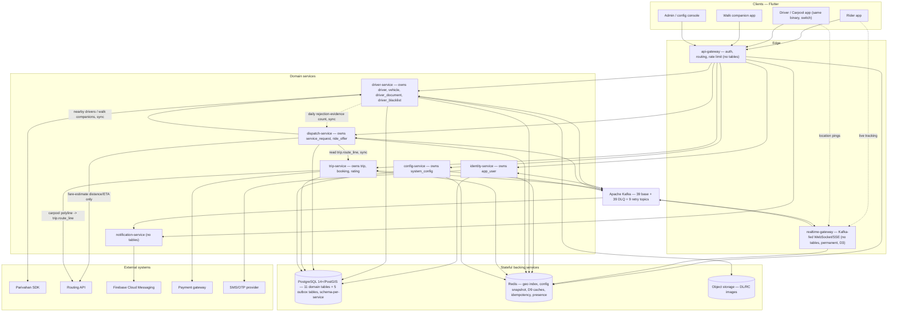
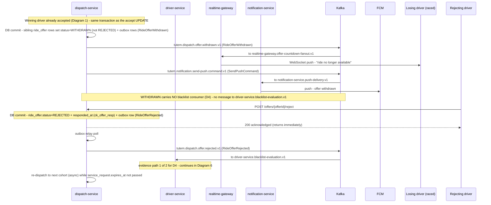
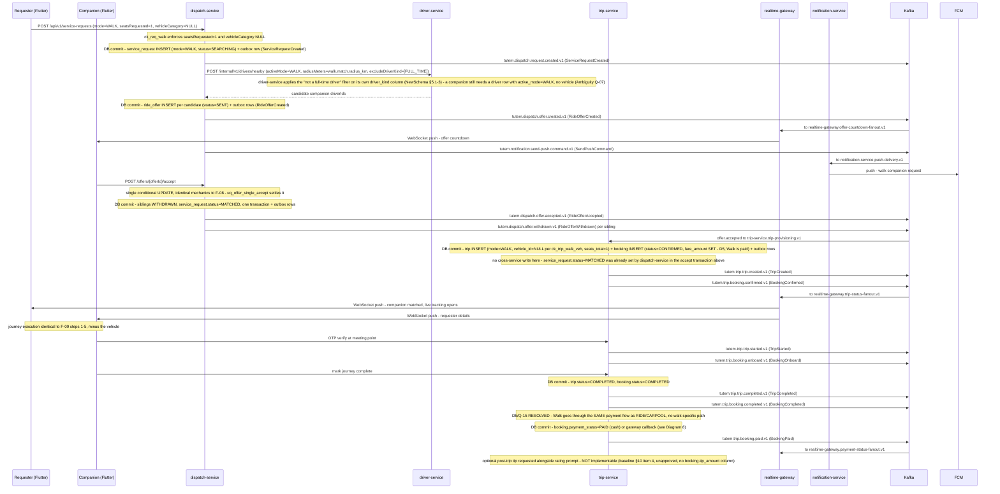
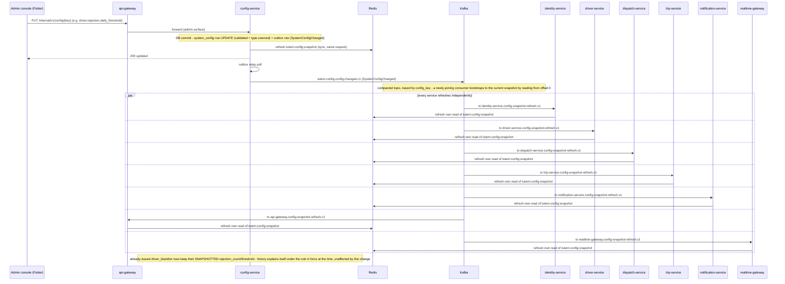

# ADR — Tutem Kafka-Based Event-Driven Architecture (Final Deliverable, Step 10)

> **Status:** CONSOLIDATED. This is a merge-only document. It introduces **no new architecture** — no
> service, topic, event, consumer group, Redis key, table, column, or setting beyond what Steps 2–9
> (`00-architecture-baseline.md` through `07-failure-design.md`) already specify. Where two approved
> documents disagree, the discrepancy is recorded in §25 (Open Risks) rather than resolved by invention; the
> later-approved step wins on detail, the baseline wins on naming. Where something required by a section was
> never designed, this document says so explicitly rather than filling the gap.
> **Schema source of truth:** `../NewSchema.md` and `../use-case.md` — neither is edited by this document or
> by any of Steps 2–9.

---

## Document provenance

| ADR section | Merged from |
|---|---|
| 1. Executive Summary | Synthesis of all 8 steps |
| 2. System Overview | `00-architecture-baseline.md` §1, §3 |
| 3. Architecture Overview | `00-architecture-baseline.md` §4; `01-kafka-architecture.md` §1, §15 |
| 4. Microservices | `00-architecture-baseline.md` §2, §2.0–§2.9 |
| 5. Kafka Architecture | `01-kafka-architecture.md` §2–§4, §8 |
| 6. Kafka Topics | `02-kafka-topics.md` §1–§7 |
| 7. Event Catalogue | `03-kafka-events.md` §1–§7 |
| 8. Producer Catalogue | `06-producers.md` §0–§10 |
| 9. Consumer Catalogue | `05-consumers.md` §1–§7 |
| 10. Consumer Groups | `05-consumers.md` §0, §8, §9; `01-kafka-architecture.md` §7.0 |
| 11. Event Flows | `00-architecture-baseline.md` §5, §5.1 |
| 12. Mermaid Sequence Diagrams | `04-event-flows.md` §1–§2 |
| 13. Partition Strategy | `01-kafka-architecture.md` §5; `02-kafka-topics.md` §7 |
| 14. Ordering Strategy | `01-kafka-architecture.md` §5.2–§5.3; `06-producers.md` §9; `07-failure-design.md` §3 |
| 15. Retry Strategy | `01-kafka-architecture.md` §7.0–§7.2; `02-kafka-topics.md` §3 |
| 16. Dead Letter Queue Strategy | `01-kafka-architecture.md` §7.3–§7.4; `02-kafka-topics.md` §2 |
| 17. Idempotency Strategy | `00-architecture-baseline.md` §0.7; `05-consumers.md` §11; `07-failure-design.md` §1 |
| 18. Redis Integration | `00-architecture-baseline.md` §0.8; `01-kafka-architecture.md` §9; `05-consumers.md` (D9 keys) |
| 19. Database Ownership | `00-architecture-baseline.md` §2.0, §3; `01-kafka-architecture.md` §4 |
| 20. Deployment Architecture | `01-kafka-architecture.md` §2, §13; `06-producers.md` §8–§9 |
| 21. Monitoring & Observability | `00-architecture-baseline.md` §0.11; `01-kafka-architecture.md` §14; `07-failure-design.md` §12 |
| 22. Security | `01-kafka-architecture.md` §11 |
| 23. Failure Scenarios | `01-kafka-architecture.md` §12; `07-failure-design.md` §1–§10 |
| 24. Scaling Strategy | `01-kafka-architecture.md` §2.1–§2.2; `06-producers.md` §9.4 |
| 25. Open Risks | `00-architecture-baseline.md` §6–§7; `07-failure-design.md` §11, §13–§15 |
| 26. Future Improvements | `00-architecture-baseline.md` §10; `01-kafka-architecture.md` §4.2; `07-failure-design.md` §13 |

---

## 1. Executive Summary

Tutem is an Uber-style mobility application (Book a Ride / Car Pool / Walk) built as **8 Spring Boot
deployables** communicating through **Apache Kafka** with **PostgreSQL/PostGIS** as the sole system of
record and **Redis** as a derived-read-model/operational cache layer only. The design is choreographed, not
orchestrated: there is no saga engine and no central workflow service. Every cross-service consistency
requirement that must be atomic (the ride-accept race, the carpool seat reservation) is settled by a single
database constraint inside one transaction; Kafka's only role there is to broadcast an already-decided
outcome. Everywhere else, at-least-once delivery plus idempotent consumers is the deliberate, explicit
end-to-end guarantee — **no exactly-once claim is made anywhere in this system**, because no consumer is a
pure Kafka-to-Kafka transform and the DB write / Kafka publish are two separate, sequential steps (a
transactional outbox with a polling relay, never an atomic two-system commit).

The catalogue is **39 base topics** (38 event + 1 command), **39 DLQ topics**, and **9 retry topics** = **87
topics total**, carried by **918 partitions** (423 base + 423 DLQ + 72 retry) across a **3-broker, RF=3,
KRaft** cluster (~306 partitions/broker). **39 event classes** are produced by **5 outbox relays** (one per
table-owning service) and consumed by **30 consumer groups** across 7 of the 8 services. `outbox_event` —
one per owning service's own schema — is the **only new table** in the entire architecture; the 11 domain
tables in `NewSchema.md` are unchanged.

Ten user decisions (D1–D10) are the load-bearing choices that make this design buildable by a 3-developer
team without inventing complexity NewSchema.md deliberately deferred (§4, §26). Nine findings and
recommendations from the Step 9 risk register remain open and require explicit sign-off before launch (§25),
most prominently a single-instance PostgreSQL SPOF, an unowned re-dispatch-after-cancellation gap (RC-02),
and a compound Redis-failure thundering-herd risk (TH-02).

---

## 2. System Overview

**Product** (verbatim from `00-architecture-baseline.md` §1, itself derived from `use-case.md`): three
service modes sharing one identity and one history.

1. **Book a Ride** — rider requests a journey; nearby drivers are alerted; exactly one can accept
   (`uq_offer_single_accept`); excessive same-day rejections/expiries temporarily blacklist a driver
   (tunable threshold).
2. **Car Pool** — a user becomes a `CARPOOL` driver, publishes a route (**D7: driver-initiated — the offer
   *is* the `trip` row**), and matched riders book seats directly; no `ride_offer` is ever created for
   carpool.
3. **Walk** — a user requests a companion; a fellow app user (never a `FULL_TIME` driver) is alerted, one
   accepts, and the pair completes the journey together. **Walk is paid (D5)**, exactly like a ride.

**Cross-cutting requirements:** every ride/walk/carpool is recorded per user (soft delete only,
`ON DELETE RESTRICT` on every history FK — no hard delete anywhere); the system targets **50,000 concurrent
users**, which this design reads (baseline A-10) as a connection-count and fan-out problem dominated by
driver location pings (>80% of cluster traffic) and offer fan-out, not a raw-TPS problem.

**Non-negotiable design invariants preserved throughout Steps 2–9:**

| Invariant | Mechanism | Consequence for this architecture |
|---|---|---|
| Only one driver can win an offer (RIDE/WALK) | `uq_offer_single_accept` (NewSchema §4.6), one conditional `UPDATE` | No distributed lock, no `SELECT...FOR UPDATE`, no Kafka arbitration — Kafka only broadcasts the settled outcome |
| A request is served at most once, ever | `uq_booking_request` (unconditional `UNIQUE`) | Booking creation is idempotent under event replay; also the direct cause of RC-02 (§25) |
| Losing the race never blacklists a driver | `WITHDRAWN` vs `REJECTED`/`EXPIRED` | Blacklist evidence reads `status IN ('REJECTED','EXPIRED')` only (D4); `WITHDRAWN` never counts |
| Carpool never uses `ride_offer` | Riders book the `trip` row directly (D7) | `uq_offer_single_accept`/`uq_offer_one_pending` guard RIDE/WALK only; carpool contributes zero blacklist evidence |
| Threshold configurable from backend | `system_config` + Redis snapshot + `SystemConfigChanged` fan-out | Runtime-tunable without redeploy (F-20) |
| Carpool "going my way" | PostGIS corridor test (`ST_DWithin` + `ST_LineLocatePoint`) | Needs `trip.route_line`, i.e. the Routing API with a straight-line fallback |
| Full history per user | Soft delete + `ON DELETE RESTRICT` | No service may hard-delete a user/request/trip/booking |
| Simplicity budget | No audit-log tables, no ledger, no ENUM types, no partitioning | Not reintroduced anywhere in Steps 2–9 |

---

## 3. Architecture Overview

Kafka is used exactly where the baseline's flow analysis (§5) marks a step **[ASYNC-CANDIDATE]** or
**[SCHEDULED]** — fan-out-heavy, latency-tolerant, or a slow external call — and deliberately kept out of
every **[SYNC-CRITICAL]** step (`01-kafka-architecture.md` §1):

| Kept synchronous (never a topic/consumer/saga) | Made event-driven |
|---|---|
| The accept `UPDATE` and its 0-vs-1-row verdict | Alerting drivers (push + realtime) |
| The carpool atomic seat reservation and its cancellation counterpart | Carpool matching, matched-rider notification, seat-count fan-out |
| Sibling-offer `WITHDRAWN` + request `MATCHED` (same transaction) | Parivahan verification, blacklist evaluation |
| `trip`+`booking` creation and `seats_booked` accounting | Location ping persistence and geo-index refresh |
| OTP generation/verification, every CHECK-governed status transition | Rating-average propagation, non-cash payment callbacks |
| Fare estimate, go-online eligibility, uniqueness enforcement | Notifications of every kind, config-snapshot refresh |
| History reads | Offer/request/blacklist expiry sweeps |

Kafka is explicitly **not** used as: an arbiter for the accept race or the seat count, a request/reply bus
for anything synchronous, a saga orchestrator, or a system of record (PostgreSQL/PostGIS remain
authoritative for every fact; Kafka topics are replayed into services' own stores, never queried for current
state — except the one compacted config topic, §6).



---

## 4. Microservices

**8 deployables, of which only 5 own tables** (`00-architecture-baseline.md` §2, §9 item 2):

| # | Service | Bounded context | Tables owned | Owns no tables? | Key responsibility |
|---|---|---|---|---|---|
| 1 | `api-gateway` | Edge/transport only | none | Yes | TLS termination, auth, rate limiting, correlation-id injection, REST routing |
| 2 | `realtime-gateway` | Edge/transport only | none | Yes | WebSocket/SSE, Kafka-fed live fan-out (offer countdown, driver location, seat counts), permanent per D3/Q-08 |
| 3 | `identity-service` | Identity & Profile | `app_user` | No | Registration, OTP verification, profile CRUD, soft-delete lifecycle, session tokens, rating average |
| 4 | `driver-service` | Driver Onboarding, Compliance & Availability | `driver`, `vehicle`, `driver_document`, `driver_blacklist` | No | Go-online eligibility, location ping ingestion, `POST /internal/v1/drivers/nearby` (sole owner of §4.12-A), Parivahan orchestration, blacklist decision (D4) |
| 5 | `dispatch-service` | Demand & Matching | `service_request`, `ride_offer` | No | Fare estimate, dispatch rounds, the accept-race `UPDATE`, carpool corridor matching (§4.12-B, sole owner), expiry sweeps, blacklist-evidence count |
| 6 | `trip-service` | Journey Execution, Fulfilment & Feedback | `trip`, `booking`, `rating` | No | Trip+booking creation, carpool offer-is-the-trip-row (D6/D7), atomic seat reservation, OTP verify, payment module, rating module, history |
| 7 | `notification-service` | Outbound Notification | none | Yes | Anti-corruption adapter over FCM; template rendering; device-token mirror; the sole executing consumer of the command topic |
| 8 | `config-service` | Platform Configuration | `system_config` | No | Read/write config, Redis snapshot, change-notification fan-out |

**Internal modules folded into a host deployable (D2), never separate services:** `matching`, `pricing`,
`routing` (dispatch-service); `carpool`, `booking`, `payment`, `rating`, `history` (trip-service);
`tracking` (driver-service write side + realtime-gateway fan-out side). D2 rationale: the carpool seat
decrement must stay in one transaction on one database — splitting Carpool/Booking into their own services
would force a distributed lock or a reservation saga, which NewSchema's own no-lock/no-saga philosophy
rejects.

**Table ownership map** — every table has exactly one writer; every cross-service need is satisfied via the
owner's sync API or its published events, never cross-schema SQL:

| # | Table | Owner | Cross-service access |
|---|---|---|---|
| 1 | `app_user` | identity-service | sync API + `identity` events |
| 2 | `driver` | driver-service | driver-service APIs/events |
| 3 | `vehicle` | driver-service | driver-service API (snapshot copied at assignment) |
| 4 | `driver_document` | driver-service | driver-service API; verification published as event |
| 5 | `driver_blacklist` | driver-service | never read externally; surfaces as `driver.blacklisted_until` |
| 6 | `service_request` | dispatch-service | dispatch-service API/events |
| 7 | `ride_offer` | dispatch-service | dispatch-service only — the race arbiter, single writer |
| 8 | `trip` | trip-service | trip-service API/events |
| 9 | `booking` | trip-service | trip-service API/events |
| 10 | `rating` | trip-service (`rating` module) | trip-service API; average pushed to identity/driver as events |
| 11 | `system_config` | config-service | sync API + change event; all services read a Redis snapshot |
| — | `outbox_event` ×5 | each owning service, own schema | infrastructure only — never read cross-service |

**Deployment note on the physical database (baseline A-06/Q-12, flagged not decided):** database-per-service
is enforced as *one PostgreSQL instance, one schema per owning service, one DB role per service* — not a
physically separate database per service — because NewSchema's cross-context FKs (e.g. `booking →
service_request`) and the `ON DELETE RESTRICT` history requirement depend on those FKs existing inside one
instance. This is the origin of the CRITICAL PostgreSQL SPOF in §25.

---

## 5. Kafka Architecture

**Cluster topology & HA** (`01-kafka-architecture.md` §2): **KRaft** (no ZooKeeper), **3 nodes** in combined
broker+controller mode, **RF=3**, **`min.insync.replicas=2`**, `broker.rack` set per AZ across **3 AZs**.
Dedicated 3-node controller-only quorum is the documented upgrade path once broker count exceeds ~6 (§26).

**Delivery semantics** (§3): **at-least-once, idempotent consumers everywhere** — this is the sole
end-to-end guarantee. `enable.idempotence=true` + `transactional.id=<service-name>-outbox-relay-<instance>`
on every outbox relay covers **only** that relay's own retry-within-one-publish-attempt deduplication; it
does **not** make "publish to Kafka" and "`UPDATE outbox_event SET published_at=...`" one atomic operation —
no XA across Postgres and Kafka exists. **No exactly-once claim is made anywhere in this platform.**

**The transactional outbox pattern** (§4) is the core integration decision. One `outbox_event` table **per
owning service's own schema** (identity, driver, dispatch, trip, config — 5 total), written in the **same
transaction and commit** as the domain write it accompanies. A **polling publisher** relay (chosen over
Debezium CDC and over an in-process synchronous publisher — see §26) runs `SELECT ... FOR UPDATE SKIP
LOCKED` inside each service, publishes, then marks `published_at`. `outbox_event` is explicitly
**infrastructure, not a 12th domain table** — no business meaning, no FK to any of the 11 domain tables,
transient rows on a short retention window, lives in the owning service's own schema.

**Outbox table shape (identical in all 5 owning-service schemas):**

```sql
id               BIGINT GENERATED BY DEFAULT AS IDENTITY PRIMARY KEY  -- monotonic; NOT the envelope's eventId
aggregate_type   VARCHAR(40)  NOT NULL
aggregate_id     TEXT         NOT NULL   -- holds a UUID or config_key (VARCHAR(64)) alike
topic            VARCHAR(200) NOT NULL
partition_key    TEXT         NOT NULL   -- holds a UUID or config_key alike
event_type       VARCHAR(80)  NOT NULL
payload          JSONB        NOT NULL   -- the full envelope, including the eventId UUID
headers          JSONB        NOT NULL
occurred_at      TIMESTAMPTZ  NOT NULL
created_at       TIMESTAMPTZ  NOT NULL DEFAULT now()
published_at     TIMESTAMPTZ
publish_attempts INTEGER      NOT NULL DEFAULT 0
-- INDEX ix_outbox_unpublished ON outbox_event (aggregate_id, id) WHERE published_at IS NULL
```

**D10 — sharded relay claim** (`06-producers.md` §9, approved 2026-07-29): every relay instance's claim
query adds `AND abs(hashtext(aggregate_id::text)) % :totalShards = :myShard` so all outbox rows for one
`aggregate_id` are always claimed by the same instance, making per-aggregate publish order a genuine
guarantee outside of a resharding window (§14). `ix_outbox_unpublished` is re-shaped from
`(created_at) WHERE published_at IS NULL` to `(aggregate_id, id) WHERE published_at IS NULL` to serve this
predicate efficiently — infrastructure-only, no `NewSchema.md` impact.

> **Derivation-time corrections (2026-07-29), applied in `Implementation\migrations\`.** Generating
> executable DDL from the design above exposed two real defects, corrected as follows: **(1)**
> `aggregate_id`/`partition_key` are `TEXT`, not `UUID` — a `UUID`-typed column would have made
> config-service physically unable to write its own outbox rows, since the `config` aggregate's key is
> `config_key` (`VARCHAR(64)`), not a UUID (baseline §0.6). **(2)** `id` is a monotonic
> `BIGINT GENERATED BY DEFAULT AS IDENTITY`, not a `UUID` — D10's claim query orders by `id`
> (`ORDER BY id ... FOR UPDATE SKIP LOCKED`) to derive commit order; a random UUID primary key carries no
> ordering information at all, so it would have **silently voided D10's per-aggregate ordering guarantee
> while appearing implemented**. The envelope's `eventId` is unaffected — it remains a UUID, carried inside
> `payload`, never as the primary key. Both corrections originated from generating executable DDL, not from
> design review; neither changes any topic, event, consumer group, Redis key, domain table, or count. See
> §14 and §25 for the ordering consequence and the risk-register entry.

**Schema management** (§8): **Apache Avro** + **Schema Registry, one per environment**, **`BACKWARD`**
compatibility per subject, subject naming `<topic-name>-value`. The `.v<major>` topic suffix (breaking
changes, new topic) and the `schemaVersion` envelope field (additive changes, same topic) are two distinct
axes and must never be conflated.

**Cluster-per-environment:** each environment runs its own physically separate cluster and Schema Registry;
topic names carry **no environment segment** (fixed 5-segment grammar, §6). No topic auto-create in any
environment (`auto.create.topics.enable=false`) — every topic is provisioned explicitly.

---

## 6. Kafka Topics

Two fixed-arity grammars: **event** `tutem.<domain>.<aggregate>.<event-name>.v<major>`; **command**
`tutem.<domain>.<action>.command.v<major>`. `<domain>`/`<aggregate>` are drawn only from the aggregate
registry (§0.2.1 of the baseline): `identity`/`user`, `driver`/`driver`|`vehicle`|`document`|`blacklist`,
`dispatch`/`request`|`offer`, `trip`/`trip`|`booking`|`rating`, `config`/`config`, `notification`/(none —
command only).

**Totals (post-D8):**

| Kind | Count |
|---|---|
| Event topics | 38 |
| Command topics | 1 |
| **Base topics** | **39** |
| DLQ topics (one per base topic) | 39 |
| Retry topics (3 qualifying topics × 3 tiers) | 9 |
| **Grand total topics** | **87** |

| Partition class | Subtotal |
|---|---|
| Base topics | 423 |
| DLQ topics (match source) | 423 |
| Retry topics (qualifying only) | 72 |
| **Grand total partitions** | **918** |
| Per broker (3 brokers) | ~306 |

### 6.1 Base topic catalogue (39/39)

| # | Topic | Domain/Aggregate | Kind | Producer | Consumer group(s) | Partition key | Part. | Retention | Ordering | Flow |
|---|---|---|---|---|---|---|---|---|---|---|
| 1 | `tutem.identity.user.registered.v1` | identity/user | event | identity-service | `trip-service.rider-directory-cache.v1` | `user_id` | 6 | delete 7d | not required | F-01 |
| 2 | `tutem.identity.user.profile-updated.v1` | identity/user | event | identity-service | `trip-service.rider-directory-cache.v1` | `user_id` | 6 | delete 7d | not required | F-01 |
| 3 | `tutem.identity.user.deleted.v1` | identity/user | event | identity-service | `dispatch-service.user-deletion-cleanup.v1`, `trip-service.rider-directory-cache.v1` | `user_id` | 6 | delete 7d | not required | F-01 |
| 4 | `tutem.driver.driver.created.v1` | driver/driver | event | driver-service | `notification-service.driver-welcome.v1` | `driver_id` | 6 | delete 7d | not required | F-02 |
| 5 | `tutem.driver.driver.went-online.v1` | driver/driver | event | driver-service | `realtime-gateway.driver-presence-fanout.v1` | `driver_id` | 24 | delete 7d | per-driver LWW | F-04 |
| 6 | `tutem.driver.driver.went-offline.v1` | driver/driver | event | driver-service | `realtime-gateway.driver-presence-fanout.v1` | `driver_id` | 24 | delete 7d | per-driver LWW | F-05 |
| 7 | `tutem.driver.driver.location-updated.v1` | driver/driver | event | driver-service | `driver-service.geo-index-maintenance.v1`, `realtime-gateway.driver-location-fanout.v1` | `driver_id` | 24 | delete 24h | per-driver, `occurredAt` LWW | F-06 |
| 8 | `tutem.driver.vehicle.registered.v1` | driver/vehicle | event | driver-service | `trip-service.vehicle-snapshot-cache.v1` | `driver_id` | 6 | delete 7d | per-driver | F-02 |
| 9 | `tutem.driver.vehicle.deactivated.v1` | driver/vehicle | event | driver-service | `trip-service.vehicle-snapshot-cache.v1` | `driver_id` | 6 | delete 7d | per-driver | F-02 |
| 10 | `tutem.driver.document.submitted.v1` | driver/document | event | driver-service | `driver-service.parivahan-verification.v1` | `driver_id` | 6 | delete 7d | per-driver | F-03 |
| 11 | `tutem.driver.document.verified.v1` | driver/document | event | driver-service | `driver-service.verification-status-recompute.v1` | `driver_id` | 6 | delete 7d | per-driver | F-03 |
| 12 | `tutem.driver.document.rejected.v1` | driver/document | event | driver-service | `driver-service.verification-status-recompute.v1` | `driver_id` | 6 | delete 7d | per-driver | F-03 |
| 13 | `tutem.driver.blacklist.blacklist-applied.v1` | driver/blacklist | event | driver-service | `driver-service.blacklist-geo-sync.v1` | `driver_id` | 6 | delete 7d | per-driver | F-13, F-14 |
| 14 | `tutem.driver.blacklist.blacklist-expired.v1` | driver/blacklist | event | driver-service | `driver-service.blacklist-geo-sync.v1` | `driver_id` | 6 | delete 7d | per-driver | F-15 |
| 15 | `tutem.dispatch.offer.created.v1` | dispatch/offer | event | dispatch-service | `realtime-gateway.offer-countdown-fanout.v1` | `request_id` | 12 | delete 7d | yes | F-07, F-12 |
| 16 | `tutem.dispatch.offer.accepted.v1` | dispatch/offer | event | dispatch-service | `realtime-gateway.offer-countdown-fanout.v1`, `trip-service.trip-provisioning.v1` | `request_id` | 12 | delete 7d | yes | F-08, F-12 |
| 17 | `tutem.dispatch.offer.rejected.v1` | dispatch/offer | event | dispatch-service | `driver-service.blacklist-evaluation.v1` | `request_id` | 12 | delete 7d | yes | F-13 |
| 18 | `tutem.dispatch.offer.expired.v1` | dispatch/offer | event | dispatch-service | `driver-service.blacklist-evaluation.v1`, `realtime-gateway.offer-countdown-fanout.v1` | `request_id` | 12 | delete 7d | yes | F-14 |
| 19 | `tutem.dispatch.offer.withdrawn.v1` | dispatch/offer | event | dispatch-service | `realtime-gateway.offer-countdown-fanout.v1` | `request_id` | 12 | delete 7d | yes | F-08, F-12, F-17 |
| 20 | `tutem.dispatch.request.created.v1` | dispatch/request | event | dispatch-service | `trip-service.history-projection.v1` | `request_id` | 12 | delete 7d | yes | F-07, F-12 |
| 21 | `tutem.dispatch.request.matched.v1` | dispatch/request | event | dispatch-service | `trip-service.history-projection.v1` | `request_id` | 12 | delete 7d | yes | F-08, F-10, F-12 |
| 22 | `tutem.dispatch.request.expired.v1` | dispatch/request | event | dispatch-service | `trip-service.history-projection.v1`, `realtime-gateway.offer-countdown-fanout.v1` | `request_id` | 12 | delete 7d | yes | F-14 |
| 23 | `tutem.dispatch.request.cancelled.v1` | dispatch/request | event | dispatch-service | `trip-service.history-projection.v1` | `request_id` | 12 | delete 7d | yes | F-17 |
| 24 | `tutem.trip.trip.created.v1` | trip/trip | event | trip-service | `dispatch-service.carpool-matching.v1`, `realtime-gateway.trip-status-fanout.v1` | `trip_id` | 12 | delete 7d | yes | F-08, F-10, F-12 |
| 25 | `tutem.trip.trip.started.v1` | trip/trip | event | trip-service | `dispatch-service.request-status-sync.v1`, `realtime-gateway.trip-status-fanout.v1` | `trip_id` | 12 | delete 7d | yes | F-09, F-11 |
| 26 | `tutem.trip.trip.completed.v1` | trip/trip | event | trip-service | `dispatch-service.request-status-sync.v1`, `driver-service.total-trips-increment.v1`, `realtime-gateway.trip-status-fanout.v1` | `trip_id` | 12 | delete 7d | yes | F-09, F-11 |
| 27 | `tutem.trip.trip.cancelled.v1` | trip/trip | event | trip-service | `dispatch-service.request-status-sync.v1`, `realtime-gateway.trip-status-fanout.v1` | `trip_id` | 12 | delete 7d | yes | F-17 |
| 28 | `tutem.trip.trip.seats-exhausted.v1` | trip/trip | event | trip-service | `realtime-gateway.carpool-seat-fanout.v1` | `trip_id` | 12 | delete 7d | yes | F-10 |
| 29 | `tutem.trip.booking.confirmed.v1` | trip/booking | event | trip-service | `dispatch-service.request-status-sync.v1`, `realtime-gateway.carpool-seat-fanout.v1` | `trip_id` | 12 | delete 7d | yes | F-08, F-10, F-12 |
| 30 | `tutem.trip.booking.onboard.v1` | trip/booking | event | trip-service | `dispatch-service.request-status-sync.v1`, `realtime-gateway.trip-status-fanout.v1` | `trip_id` | 12 | delete 7d | yes | F-09, F-11 |
| 31 | `tutem.trip.booking.completed.v1` | trip/booking | event | trip-service | `dispatch-service.request-status-sync.v1`, `realtime-gateway.trip-status-fanout.v1` | `trip_id` | 12 | delete 7d | yes | F-09, F-11 |
| 32 | `tutem.trip.booking.cancelled.v1` | trip/booking | event | trip-service | `dispatch-service.request-status-sync.v1`, `realtime-gateway.carpool-seat-fanout.v1` | `trip_id` | 12 | delete 7d | yes | F-10, F-17 |
| 33 | `tutem.trip.booking.no-show.v1` | trip/booking | event | trip-service | `realtime-gateway.carpool-seat-fanout.v1` | `trip_id` | 12 | delete 7d | yes | F-11 |
| 34 | `tutem.trip.booking.paid.v1` | trip/booking | event | trip-service | `realtime-gateway.payment-status-fanout.v1` | `trip_id` | 12 | delete 7d | yes | F-16 |
| 35 | `tutem.trip.booking.payment-failed.v1` | trip/booking | event | trip-service | `realtime-gateway.payment-status-fanout.v1` | `trip_id` | 12 | delete 7d | yes | F-16 |
| 36 | `tutem.trip.booking.refunded.v1` | trip/booking | event | trip-service | `realtime-gateway.payment-status-fanout.v1` | `trip_id` | 12 | delete 7d | yes | F-16 |
| 37 | `tutem.trip.rating.submitted.v1` | trip/rating | event | trip-service | `identity-service.rating-average-recompute.v1`, `driver-service.rating-average-recompute.v1` | `booking_id` | 6 | delete 7d | yes | F-18 |
| 38 | `tutem.config.config.changed.v1` | config/config | event | config-service | `<service>.config-snapshot-refresh.v1` ×7 | `config_key` | 3 | **compact** | yes, per key | F-20 |
| 39 | `tutem.notification.send-push.command.v1` | notification (executing consumer) | command | dispatch-service, trip-service, driver-service | `notification-service.push-delivery.v1` | `user_id` | 12 | delete 3d | per-recipient | F-03,07,08,09,10,12,13,14,15,17,18 |

**DLQ topics:** exactly one `<topic>.dlq` per source topic above — **all 39** — partitions matching the
source, retention 30 days, `delete`. Shared by every consumer of that topic; the failing consumer is read
from the `x-consumer-group` header, never the topic name.

**Retry topics (D8, selective — 9 total, only these 3 qualify):**

| Source topic | Consumer | External system | Partitions | Tiers |
|---|---|---|---|---|
| `tutem.driver.document.submitted.v1` | `driver-service.parivahan-verification.v1` | Parivahan SDK | 6 | `.retry-1/2/3` |
| `tutem.driver.driver.created.v1` | `notification-service.driver-welcome.v1` | FCM | 6 | `.retry-1/2/3` |
| `tutem.notification.send-push.command.v1` | `notification-service.push-delivery.v1` | FCM | 12 | `.retry-1/2/3` |

The other 36 base topics retry **in-process, bounded**, then publish straight to `.dlq` — no retry-topic hop
(§15).

**Compacted topics:** exactly one — `tutem.config.config.changed.v1`, keyed by `config_key`.

---

## 7. Event Catalogue

39 event classes (38 domain facts + 1 command), each mapped 1:1 to a topic and to exactly the aggregate
registry's PascalCase root name (§0.4 of the baseline). Full per-field Avro schemas, worked examples, and
BACKWARD/breaking-change guidance for every event live in `03-kafka-events.md` §1–§6 and are incorporated
here by reference; the table below is the complete developer-facing index — event class, topic, producer,
consumers, partition key, idempotency key shape, and trigger.

| Event class | Topic | Producer | Consumer(s) | Partition key | Idempotency key | Trigger flow |
|---|---|---|---|---|---|---|
| `AppUserRegistered` | `identity.user.registered.v1` | identity-service | trip-service | `user_id` | `user:<id>:registered` | F-01.4 |
| `AppUserProfileUpdated` | `identity.user.profile-updated.v1` | identity-service | trip-service | `user_id` | `user:<id>:profile-updated:<date>` | F-01.6 |
| `AppUserDeleted` | `identity.user.deleted.v1` | identity-service | dispatch-service, trip-service | `user_id` | `user:<id>:deleted` | F-01.6 |
| `DriverCreated` | `driver.driver.created.v1` | driver-service | notification-service | `driver_id` | `driver:<id>:created` | F-02.3 |
| `DriverWentOnline` | `driver.driver.went-online.v1` | driver-service | realtime-gateway | `driver_id` | `driver:<id>:went-online:<ts>` | F-04.4 |
| `DriverWentOffline` | `driver.driver.went-offline.v1` | driver-service | realtime-gateway | `driver_id` | `driver:<id>:went-offline:<ts>` | F-05.1/.4 |
| `DriverLocationUpdated` | `driver.driver.location-updated.v1` | driver-service | driver-service, realtime-gateway | `driver_id` | `driver:<id>:location-updated:<ts>` | F-06.2 |
| `VehicleRegistered` | `driver.vehicle.registered.v1` | driver-service | trip-service | `driver_id` | `vehicle:<id>:registered` | F-02.2 |
| `VehicleDeactivated` | `driver.vehicle.deactivated.v1` | driver-service | trip-service | `driver_id` | `vehicle:<id>:deactivated` | vehicle-mgmt |
| `DriverDocumentSubmitted` | `driver.document.submitted.v1` | driver-service | driver-service | `driver_id` | `document:<id>:submitted` | F-03.3 |
| `DriverDocumentVerified` | `driver.document.verified.v1` | driver-service | driver-service | `driver_id` | `document:<id>:verified` | F-03.6 |
| `DriverDocumentRejected` | `driver.document.rejected.v1` | driver-service | driver-service | `driver_id` | `document:<id>:rejected` | F-03.6 |
| `DriverBlacklistApplied` | `driver.blacklist.blacklist-applied.v1` | driver-service | driver-service | `driver_id` | `blacklist:<id>:blacklist-applied:<date>` | F-13.4, F-14.1a |
| `DriverBlacklistExpired` | `driver.blacklist.blacklist-expired.v1` | driver-service | driver-service | `driver_id` | `blacklist:<id>:blacklist-expired` | F-15.1/.2 |
| `RideOfferCreated` | `dispatch.offer.created.v1` | dispatch-service | realtime-gateway | `request_id` | `offer:<id>:created` (envelope, not derivable from key) | F-07.6, F-12.4 |
| `RideOfferAccepted` | `dispatch.offer.accepted.v1` | dispatch-service | realtime-gateway, trip-service | `request_id` | `offer:<id>:accepted` | F-08.2-4, F-12.5 |
| `RideOfferRejected` | `dispatch.offer.rejected.v1` | dispatch-service | driver-service | `request_id` | `offer:<id>:rejected` | F-13.1 |
| `RideOfferExpired` | `dispatch.offer.expired.v1` | dispatch-service | driver-service, realtime-gateway | `request_id` | `offer:<id>:expired` | F-14.1 |
| `RideOfferWithdrawn` | `dispatch.offer.withdrawn.v1` | dispatch-service | realtime-gateway | `request_id` | `offer:<id>:withdrawn` | F-08.4, F-12.5, F-17.1 |
| `ServiceRequestCreated` | `dispatch.request.created.v1` | dispatch-service | trip-service | `request_id` | `request:<id>:created` | F-07.3, F-12.1 |
| `ServiceRequestMatched` | `dispatch.request.matched.v1` | dispatch-service | trip-service | `request_id` | `request:<id>:matched` | F-08.4, F-10.8 hop |
| `ServiceRequestExpired` | `dispatch.request.expired.v1` | dispatch-service | trip-service, realtime-gateway | `request_id` | `request:<id>:expired` | F-14.3 |
| `ServiceRequestCancelled` | `dispatch.request.cancelled.v1` | dispatch-service | trip-service | `request_id` | `request:<id>:cancelled` | F-17.1 |
| `TripCreated` | `trip.trip.created.v1` | trip-service | dispatch-service, realtime-gateway | `trip_id` | `trip:<id>:created` | F-08.5, F-10.2, F-12.6 |
| `TripStarted` | `trip.trip.started.v1` | trip-service | dispatch-service, realtime-gateway | `trip_id` | `trip:<id>:started` | F-09.2, F-10.13, F-11.1 |
| `TripCompleted` | `trip.trip.completed.v1` | trip-service | dispatch-service, driver-service, realtime-gateway | `trip_id` | `trip:<id>:completed` | F-09.4, F-10.13, F-11.5 |
| `TripCancelled` | `trip.trip.cancelled.v1` | trip-service | dispatch-service, realtime-gateway | `trip_id` | `trip:<id>:cancelled` | F-17.2/.6 |
| `TripSeatsExhausted` | `trip.trip.seats-exhausted.v1` | trip-service | realtime-gateway | `trip_id` | `trip:<id>:seats-exhausted:<seatsBooked>` | F-10.11 (derived, D6) |
| `BookingConfirmed` | `trip.booking.confirmed.v1` | trip-service | dispatch-service, realtime-gateway | `trip_id` (envelope carries `bookingId`) | `booking:<id>:confirmed` | F-08.5, F-10.8, F-12.6 |
| `BookingOnboard` | `trip.booking.onboard.v1` | trip-service | dispatch-service, realtime-gateway | `trip_id` | `booking:<id>:onboard` | F-09.2, F-11.2 |
| `BookingCompleted` | `trip.booking.completed.v1` | trip-service | dispatch-service, realtime-gateway | `trip_id` | `booking:<id>:completed` | F-09.4, F-11.4 |
| `BookingCancelled` | `trip.booking.cancelled.v1` | trip-service | dispatch-service, realtime-gateway | `trip_id` | `booking:<id>:cancelled` | F-10.14, F-17.2/.5/.6 |
| `BookingNoShow` | `trip.booking.no-show.v1` | trip-service | realtime-gateway | `trip_id` | `booking:<id>:no-show` | F-11.3 |
| `BookingPaid` | `trip.booking.paid.v1` | trip-service | realtime-gateway | `trip_id` | `booking:<id>:paid` | F-16.2/.3 |
| `BookingPaymentFailed` | `trip.booking.payment-failed.v1` | trip-service | realtime-gateway | `trip_id` | `booking:<id>:payment-failed:<ts>` | F-16.3 |
| `BookingRefunded` | `trip.booking.refunded.v1` | trip-service | realtime-gateway | `trip_id` | `booking:<id>:refunded` | F-16.4 |
| `RatingSubmitted` | `trip.rating.submitted.v1` | trip-service | identity-service, driver-service | `booking_id` | `rating:<id>:submitted` | F-18.2 |
| `SystemConfigChanged` | `config.config.changed.v1` | config-service | 7 services | `config_key` | `config:<key>:changed:<ts>` | F-20.2-3 |
| `SendPushCommand` | `notification.send-push.command.v1` | dispatch-service, trip-service, driver-service | notification-service | `user_id` | `notify:<userId>:<templateCode>:<causingEventId>` | any of 12 call-sites |

**§10-blocked fields (baseline §10, unapproved — never appear in the wire payload today):**
`TripCreated.departureTime`, `BookingConfirmed.tipAmount`, `BookingPaid.tipAmount`. Each is annotated at its
exact event and will be added as an additive optional field once its underlying column is approved (§26).

**Self-check (carried from `03-kafka-events.md` §8):** 39/39 topics used by ≥1 event; every event topic
exists in the catalogue; no duplicate names; every event topic has exactly one producer except the command
topic's approved 3; every partition key matches §14's rules including all exceptions.

---

## 8. Producer Catalogue

Per the baseline's producer-cardinality rule (§0.2.3): **every event topic has exactly one producer** — the
domain-owning service — and **the command topic is the sole exception** with 3 producers naming 1 executing
consumer.

| Producer | Kind | Event topics owned | Also produces to command topic? | `transactional.id` |
|---|---|---|---|---|
| identity-service | outbox relay | 3 (`user.*`) | No | `identity-service-outbox-relay-<instance>` |
| driver-service | outbox relay | 11 (`driver.*`) | Yes — F-03.8, F-15.3 | `driver-service-outbox-relay-<instance>` |
| dispatch-service | outbox relay | 9 (`offer.*`, `request.*`) | Yes — F-07.7, F-08.6, F-10.6, F-13.5, F-14.3, F-17.1, F-17.5 | `dispatch-service-outbox-relay-<instance>` |
| trip-service | outbox relay | 14 (`trip.*`, `booking.*`, `rating.*`) | Yes — F-09.5, F-10.10, F-17.6 | `trip-service-outbox-relay-<instance>` |
| config-service | outbox relay | 1 (`config.changed`, compacted) | No | `config-service-outbox-relay-<instance>` |
| dispatch-service, trip-service, driver-service | multi-producer command path | — | `tutem.notification.send-push.command.v1` only | each producer's own outbox relay id |

3 + 11 + 9 + 14 + 1 = **38 event topics**, each with exactly one producer; + the 1 command topic's 3-producer
set = **39 base topics, all accounted for.**

**Producer configuration** (applies uniformly to all 5 relays and to the 3 command-topic producers):

| Config | Value | Why |
|---|---|---|
| `acks` | `all` | Matches `min.insync.replicas=2` |
| `enable.idempotence` | `true` | Dedups the relay's own retries within one publish attempt |
| `max.in.flight.requests.per.connection` | `5` | Ceiling at which idempotent-producer sequencing still holds |
| `retries` | `Integer.MAX_VALUE` (bounded by `delivery.timeout.ms`) | Transient failures are not terminal at the producer layer |
| `request.timeout.ms` | `30,000` | Kafka default; nothing in this platform's latency profile requires overriding it |
| `delivery.timeout.ms` | `120,000` | Must satisfy `>= linger.ms + request.timeout.ms` (`120,000 >= 20 + 30,000` holds) |
| `compression.type` | `lz4` | Balances CPU vs wire savings at F-06 volume |
| `linger.ms` | `20` | Small batching delay, matches relay's own per-poll batching |
| `batch.size` | `32,768` bytes | Amortizes request overhead for the F-06-class high-volume producer |
| `transactional.id` | `<service-name>-outbox-relay-<instance>` | Stable per instance (pod ordinal), unique per concurrent instance |

**Outbox relay design** (per service, identical shape): poll interval 500ms platform-wide default; batch
`LIMIT 200` (identity/dispatch/trip/config) or `LIMIT 500` (driver-service, sized to its outsized F-06
share); claim query is the **D10 sharded claim** (§5, §14); published rows purged on a 24–72h housekeeping
window (never an audit log).

---

## 9. Consumer Catalogue

Complete per-consumer-group attribute table — purpose, topics, retry strategy, DLQ, ordering need,
idempotency mechanism, Redis usage, database writes, and failure handling are fully specified per group in
`05-consumers.md` §1–§7; the table below is the dense index every group traces to.

| Consumer group | Owning service | Topic(s) | DB write(s) | Idempotency backstop | Retry tier? |
|---|---|---|---|---|---|
| `geo-index-maintenance.v1` | driver-service | `driver.location-updated` | `driver.current_location`, `location_updated_at` | Conditional `UPDATE ... WHERE location_updated_at < :occurredAt` (DB) | No |
| `parivahan-verification.v1` | driver-service | `driver.document.submitted` | `driver_document.status`, `verified_at`/`rejection_reason` | `ck_doc_verified`/`ck_doc_rejected` CHECK + Redis | **Yes (Parivahan)** |
| `verification-status-recompute.v1` | driver-service | `driver.document.verified`, `.rejected` | `driver.verification_status` | Full recompute (naturally idempotent) | No |
| `blacklist-geo-sync.v1` | driver-service | `driver.blacklist.blacklist-applied`, `.expired` | none (Redis only) | Idempotent GEO op | No |
| `blacklist-evaluation.v1` | driver-service | `dispatch.offer.rejected`, `.expired` | `driver_blacklist` INSERT, `driver.blacklisted_until` | `uq_bl_one_per_day` (DB) | No |
| `total-trips-increment.v1` | driver-service | `trip.trip.completed` | `driver.total_trips` | **Redis only — no DB backstop (DUP-01, §17/§25)** | No |
| `rating-average-recompute.v1` | driver-service | `trip.rating.submitted` | `driver.rating_avg`/`rating_count` | Full recompute (naturally idempotent) | No |
| `config-snapshot-refresh.v1` | driver-service | `config.config.changed` | none | Keyed upsert | No |
| `rating-average-recompute.v1` | identity-service | `trip.rating.submitted` | `app_user.rating_avg`/`rating_count` | Full recompute | No |
| `config-snapshot-refresh.v1` | identity-service | `config.config.changed` | none | Keyed upsert | No |
| `user-deletion-cleanup.v1` | dispatch-service | `identity.user.deleted` | `service_request.status`, `closed_at` | Conditional `UPDATE ... WHERE status='SEARCHING'` | No |
| `carpool-matching.v1` | dispatch-service | `trip.trip.created` | none (read-only spatial query + fan-out) | Idempotent by construction (re-run recomputes same set) | No |
| `request-status-sync.v1` | dispatch-service | 7 `trip.trip.*`/`trip.booking.*` topics | `service_request.status`, `closed_at` | Conditional `UPDATE ... WHERE status=<prior>` | No |
| `config-snapshot-refresh.v1` | dispatch-service | `config.config.changed` | none | Keyed upsert | No |
| `rider-directory-cache.v1` | trip-service | 3 `identity.user.*` topics | none (Redis `tutem:trip:rider-directory:<user_id>`, D9) | Keyed upsert; cold-start fallback to identity-service sync API | No |
| `vehicle-snapshot-cache.v1` | trip-service | `driver.vehicle.registered`, `.deactivated` | none (Redis `tutem:trip:vehicle-snapshot:<vehicle_id>`, D9) | Keyed upsert; fallback to driver-service sync API | No |
| `trip-provisioning.v1` | trip-service | `dispatch.offer.accepted` | `trip` INSERT, `booking` INSERT | `uq_trip_one_live_per_provider`, `uq_booking_request` (DB) | No |
| `history-projection.v1` | trip-service | 4 `dispatch.request.*` topics | none (Redis `tutem:trip:history-projection:<user_id>`, D9) | Keyed upsert; fallback to F-19's own sync read | No |
| `config-snapshot-refresh.v1` | trip-service | `config.config.changed` | none | Keyed upsert | No |
| `driver-welcome.v1` | notification-service | `driver.driver.created` | none (no tables owned) | `tutem:notification:sent:<idempotencyKey>` (Redis only, accepted) | **Yes (FCM)** |
| `push-delivery.v1` | notification-service | `notification.send-push.command` | none | `tutem:notification:sent:<idempotencyKey>` (Redis only, accepted) | **Yes (FCM)** |
| `config-snapshot-refresh.v1` | notification-service | `config.config.changed` | none | Keyed upsert | No |
| `config-snapshot-refresh.v1` | api-gateway | `config.config.changed` | none | Keyed upsert | No |
| `driver-presence-fanout.v1` | realtime-gateway | `driver.went-online`, `.went-offline` | none | Client `eventId` de-dup | No |
| `driver-location-fanout.v1` | realtime-gateway | `driver.location-updated` | none | Client de-dup + `occurredAt` staleness check | No |
| `offer-countdown-fanout.v1` | realtime-gateway | 5 `dispatch.offer.*`/`.request.expired` topics | none | Client de-dup | No |
| `trip-status-fanout.v1` | realtime-gateway | 6 `trip.trip.*`/`.booking.onboard`/`.completed` topics | none | Client de-dup | No |
| `carpool-seat-fanout.v1` | realtime-gateway | 4 `trip.seats-exhausted`/`booking.confirmed`/`.cancelled`/`.no-show` topics | none | Client de-dup | No |
| `payment-status-fanout.v1` | realtime-gateway | 3 `trip.booking.paid`/`.payment-failed`/`.refunded` topics | none | Client de-dup | No |
| `config-snapshot-refresh.v1` | realtime-gateway | `config.config.changed` | none | Keyed upsert | No |

**Keeping slow external calls off the poll loop** (`05-consumers.md` §9): exactly 3 groups touch an
uncontrolled external system — `parivahan-verification.v1` (Parivahan), `driver-welcome.v1` and
`push-delivery.v1` (FCM). Each hands the call to a bounded async worker pool, commits the offset only after
the outcome is persisted, and runs `max.poll.interval.ms=300,000` (5 min) instead of the default 60,000ms
every other group uses. No other consumer makes an external call — Payment gateway and Routing API calls
are both synchronous, inside the originating REST request, never inside a Kafka consumer.

---

## 10. Consumer Groups

**30 consumer groups total**, by owning service:

| Service | Groups | Count |
|---|---|---|
| driver-service | geo-index-maintenance, parivahan-verification, verification-status-recompute, blacklist-geo-sync, blacklist-evaluation, total-trips-increment, rating-average-recompute, config-snapshot-refresh | 8 |
| identity-service | rating-average-recompute, config-snapshot-refresh | 2 |
| dispatch-service | user-deletion-cleanup, carpool-matching, request-status-sync, config-snapshot-refresh | 4 |
| trip-service | rider-directory-cache, vehicle-snapshot-cache, trip-provisioning, history-projection, config-snapshot-refresh | 5 |
| notification-service | driver-welcome, push-delivery, config-snapshot-refresh | 3 |
| api-gateway | config-snapshot-refresh | 1 |
| realtime-gateway | driver-presence-fanout, driver-location-fanout, offer-countdown-fanout, trip-status-fanout, carpool-seat-fanout, payment-status-fanout, config-snapshot-refresh | 7 |
| **Total** | | **30** |

Every group name follows `<service-name>.<purpose>.v<major>` where `<purpose>` names the use case, never
echoes a topic's `<event-name>` — e.g. `dispatch-service.request-status-sync.v1` handles 7 different topics
under one use-case name.

**Retry-tier qualification (D8):** only 3 of 30 groups qualify — `driver-service.parivahan-verification.v1`,
`notification-service.driver-welcome.v1`, `notification-service.push-delivery.v1`. The other 27 retry
in-process, bounded, then straight to `.dlq`.

**Concurrency guidance (`05-consumers.md` §8, condensed):** recommended instance count is bounded by
partition count per topic (never exceed it). Highest concurrency: `driver-service.geo-index-maintenance.v1`
and `realtime-gateway.driver-location-fanout.v1` (12–24 instances, F-06's 24 partitions). Lowest: the 7
`config-snapshot-refresh.v1` groups (1–3 instances, 3 partitions). `max.poll.interval.ms` is 60,000ms for
every group except the 3 retry-tier groups (300,000ms, to tolerate the offloaded external call without
triggering a rebalance).

---

## 11. Event Flows

20 business flows (`00-architecture-baseline.md` §5), each step tagged `[SYNC-CRITICAL]`,
`[ASYNC-CANDIDATE]`, or `[SCHEDULED]`:

| Flow | Summary | Topics used (§6) |
|---|---|---|
| F-01 | Onboarding & auth (OTP, registration, soft delete) | `user.registered`, `.profile-updated`, `.deleted` |
| F-02 | Become a carpool driver (the switch) | `driver.created`, `vehicle.registered` |
| F-03 | Document upload & Parivahan verification | `document.submitted`, `.verified`, `.rejected`, `send-push.command` |
| F-04 | Driver goes online | `driver.went-online` |
| F-05 | Driver goes offline | `driver.went-offline` |
| F-06 | Location ping (highest-volume flow) | `driver.location-updated` |
| F-07 | Book a Ride — request to match | `request.created`, `offer.created`, `send-push.command` |
| F-08 | Book a Ride — the accept race | `offer.accepted`, `.withdrawn`, `request.matched`, `trip.created`, `booking.confirmed`, `send-push.command` |
| F-09 | Book a Ride — start, execute, complete | `trip.started`, `.completed`, `booking.onboard`, `.completed`, `send-push.command` |
| F-10 | Car Pool — offer, corridor match, seat booking | `trip.created`, `booking.confirmed`, `trip.seats-exhausted`, `booking.cancelled`, `send-push.command` |
| F-11 | Car Pool — multi-pickup execution and completion | `trip.started`/`.completed`, `booking.onboard`/`.completed`/`.no-show` |
| F-12 | Walk — companion match | `offer.*`, `trip.created`, `booking.confirmed`, `booking.paid`, `send-push.command` |
| F-13 | Offer rejection → blacklist evaluation | `offer.rejected`, `blacklist.blacklist-applied`, `send-push.command` |
| F-14 | Offer and request expiry sweeps | `offer.expired`, `request.expired`, `blacklist.blacklist-applied` (2nd path) |
| F-15 | Blacklist expiry | `blacklist.blacklist-expired`, `send-push.command` |
| F-16 | Payment | `booking.paid`, `.payment-failed`, `.refunded` |
| F-17 | Cancellation (rider/provider/system) | `request.cancelled`, `offer.withdrawn`, `booking.cancelled`, `trip.cancelled`, `send-push.command` |
| F-18 | Rating | `rating.submitted`, `send-push.command` |
| F-19 | History retrieval | **none — fully synchronous, zero topics** |
| F-20 | Runtime configuration change | `config.config.changed` |

**F-19 is the only flow needing zero topics** — all three history reads are paged queries over
already-committed, already-published data.

**§5.1 sync/async summary (baseline, restated):**

| Stays strictly synchronous & transactional | Safe to make event-driven |
|---|---|
| The accept `UPDATE` and its 0-vs-1-row verdict | Alerting drivers |
| Carpool atomic seat reservation | Carpool match computation, matched-rider notification, seat-count fan-out |
| Carpool cancellation seat return | Derived-full/seat-available announcements |
| Sibling-offer `WITHDRAWN` + request `MATCHED` | Parivahan verification |
| `trip`+`booking` creation and `seats_booked` accounting | Blacklist evaluation |
| OTP generation and verification | Location ping persistence and geo-index refresh |
| All status transitions and CHECK constraints | Rating-average propagation |
| Fare estimate before rider confirms | Non-cash payment callbacks |
| Go-online eligibility validation | Notifications of every kind |
| `uq_req_one_live_per_rider`/`uq_trip_one_live_per_provider` enforcement | Config-snapshot refresh |
| History reads | Offer/request/blacklist expiry sweeps |

---

## 12. Mermaid Sequence Diagrams

10 diagrams, carried verbatim from `04-event-flows.md` §2 (syntax verified: every arrow is `->>`/`-->>`;
every `alt`/`opt`/`par`/`loop`/`rect` is terminated with `end`; every `Note over` targets only declared
participants).

### 12.1 Diagram 1 — Book a Ride, end to end (F-06, F-07, F-08, F-09)

```mermaid
sequenceDiagram
    participant Rider as Rider (Flutter)
    participant GW as api-gateway
    participant DSP as dispatch-service
    participant DRVSVC as driver-service
    participant TRP as trip-service
    participant NOTSVC as notification-service
    participant RTG as realtime-gateway
    participant KAFKA as Kafka
    participant REDIS as Redis
    participant ROUTING as Routing API
    participant FCM as FCM
    participant WinDriver as Winning driver (Flutter)

    Rider->>GW: POST /api/v1/service-requests (pickup, drop, vehicleCategory)
    GW->>DSP: forward request
    DSP->>ROUTING: distance/ETA for fare estimate
    ROUTING-->>DSP: distance, ETA
    Note over DSP: DB commit - service_request INSERT (mode=RIDE, status=SEARCHING) + outbox row (ServiceRequestCreated)
    DSP-->>Rider: 202 "searching" (est fare shown)
    DSP->>DSP: outbox relay poll (SELECT ... FOR UPDATE SKIP LOCKED)
    DSP->>KAFKA: tutem.dispatch.request.created.v1 (ServiceRequestCreated)
    KAFKA->>TRP: to trip-service.history-projection.v1

    DSP->>DRVSVC: POST /internal/v1/drivers/nearby (activeMode=RIDE, pickupPoint, radiusMeters)
    DRVSVC-->>DSP: candidate driverIds + distanceKm
    Note over DSP: DB commit - ride_offer INSERT per candidate (status=SENT) + outbox rows (RideOfferCreated)
    DSP->>DSP: outbox relay poll
    DSP->>KAFKA: tutem.dispatch.offer.created.v1 (RideOfferCreated) x N candidates
    KAFKA->>RTG: to realtime-gateway.offer-countdown-fanout.v1
    RTG->>REDIS: tutem:ops:ws-route lookup per candidate driver
    RTG->>WinDriver: WebSocket push - offer countdown
    DSP->>KAFKA: tutem.notification.send-push.command.v1 (SendPushCommand) x N candidates
    KAFKA->>NOTSVC: to notification-service.push-delivery.v1
    NOTSVC->>FCM: push - new ride offer
    Note over RTG,FCM: D3 - dual delivery, de-duplicated on client by eventId

    WinDriver->>GW: POST /offers/{offerId}/accept
    GW->>DSP: forward accept
    Note over DSP: DB commit - single conditional UPDATE ride_offer SET status=ACCEPTED WHERE status=SENT AND expires_at greater than now() (uq_offer_single_accept)
    alt 0 rows updated - too slow or offer expired
        DSP-->>WinDriver: "ride already taken"
    else 1 row updated - this driver won
        Note over DSP: same transaction - siblings set WITHDRAWN, service_request.status=MATCHED + outbox rows (RideOfferAccepted, RideOfferWithdrawn xN, ServiceRequestMatched)
        DSP-->>WinDriver: 200 "you won"
        DSP->>DSP: outbox relay poll
        DSP->>KAFKA: tutem.dispatch.offer.accepted.v1 (RideOfferAccepted)
        DSP->>KAFKA: tutem.dispatch.offer.withdrawn.v1 (RideOfferWithdrawn) per sibling
        KAFKA->>RTG: to realtime-gateway.offer-countdown-fanout.v1 (winner+losers)
        DSP->>KAFKA: tutem.notification.send-push.command.v1 (SendPushCommand) - winner and losers
        KAFKA->>NOTSVC: to notification-service.push-delivery.v1
        NOTSVC->>FCM: push - winner/loser outcome
        KAFKA->>TRP: tutem.dispatch.offer.accepted.v1 to trip-service.trip-provisioning.v1
        Note over TRP: DB commit - trip INSERT (mode=RIDE, status=ASSIGNED, seats_total=1) + booking INSERT (status=CONFIRMED, start_otp) + outbox rows (TripCreated, BookingConfirmed)
        TRP->>TRP: outbox relay poll
        TRP->>KAFKA: tutem.trip.trip.created.v1 (TripCreated)
        TRP->>KAFKA: tutem.trip.booking.confirmed.v1 (BookingConfirmed)
        KAFKA->>DSP: booking.confirmed to dispatch-service.request-status-sync.v1 (idempotent no-op - already MATCHED for RIDE)
        KAFKA->>RTG: trip.created/booking.confirmed to realtime-gateway.trip-status-fanout.v1
        RTG->>Rider: WebSocket push - driver, vehicle, ETA, OTP context
        RTG->>WinDriver: WebSocket push - rider details
    end

    Note over WinDriver,Rider: F-06 location pings stream throughout (see Diagram 9)

    WinDriver->>GW: POST /bookings/{id}/start-otp (rider-read OTP)
    GW->>TRP: verify OTP
    Note over TRP: DB commit - trip.status=ACTIVE + started_at, booking.status=ONBOARD + picked_up_at
    TRP->>KAFKA: tutem.trip.trip.started.v1 (TripStarted)
    TRP->>KAFKA: tutem.trip.booking.onboard.v1 (BookingOnboard)
    KAFKA->>DSP: to dispatch-service.request-status-sync.v1 - service_request.status=ONGOING
    KAFKA->>RTG: to realtime-gateway.trip-status-fanout.v1

    WinDriver->>GW: POST /trips/{id}/complete
    GW->>TRP: mark arrival
    Note over TRP: DB commit - booking.status=COMPLETED + dropped_at, trip.status=COMPLETED + ended_at + distance_km (one transaction)
    TRP->>KAFKA: tutem.trip.trip.completed.v1 (TripCompleted)
    TRP->>KAFKA: tutem.trip.booking.completed.v1 (BookingCompleted)
    KAFKA->>DSP: to dispatch-service.request-status-sync.v1 - service_request.status=COMPLETED
    KAFKA->>DRVSVC: to driver-service.total-trips-increment.v1 - driver.total_trips += 1
    Note over DRVSVC: unbackstopped counter (no DB unique index) - mitigated by tutem:ops:idem Redis de-dup key only
    KAFKA->>RTG: to realtime-gateway.trip-status-fanout.v1
    DSP->>KAFKA: tutem.notification.send-push.command.v1 (SendPushCommand) - rating prompt (F-09.5)
    KAFKA->>NOTSVC: to notification-service.push-delivery.v1
    NOTSVC->>FCM: push - rate your trip
    Note over TRP: Payment settlement follows Diagram 8; rating follows Diagram 7
```

### 12.2 Diagram 2 — Book a Ride, losing driver's path and rejection path (F-08, F-12, F-13, F-14)



### 12.3 Diagram 3 — Carpool: driver-initiated offer, corridor match, seat booking, seats-exhausted (F-10, F-11)

```mermaid
sequenceDiagram
    participant CDriver as Carpool driver (Flutter)
    participant CRider as Matched rider (Flutter)
    participant TRP as trip-service
    participant DSP as dispatch-service
    participant RTG as realtime-gateway
    participant NOTSVC as notification-service
    participant KAFKA as Kafka
    participant ROUTING as Routing API
    participant FCM as FCM

    CDriver->>TRP: POST create carpool offer (source, destination, seats, vehicle)
    Note over TRP: departure time requested by driver but has NO column today (baseline §10 item 1, unapproved) - not persisted, not returnable later
    TRP->>ROUTING: fetch polyline for route_line
    ROUTING-->>TRP: polyline (or ST_MakeLine straight-line fallback)
    Note over TRP: DB commit - trip INSERT (mode=CARPOOL, status=ASSIGNED = offer open, seats_total, seats_booked=0, route_line) + outbox row (TripCreated)
    TRP->>TRP: outbox relay poll
    TRP->>KAFKA: tutem.trip.trip.created.v1 (TripCreated)
    KAFKA->>DSP: to dispatch-service.carpool-matching.v1

    DSP->>TRP: GET internal - trip route_line and endpoints (sync)
    Note over DSP: corridor match (§4.12-B) over own service_request table - ST_DWithin + ST_LineLocatePoint ordering
    Note over DSP: DEGRADATION - departure-time-window ranking needs §10 items 1 and 2 (unapproved); matching is corridor-only today; rider preferences (§10 item 5, unapproved) not considered
    Note over DSP: matches computed and notify decision made in the SAME consumer transaction - no separate "matches-generated" topic exists (Step 4 §0/§6)
    DSP->>KAFKA: tutem.notification.send-push.command.v1 (SendPushCommand) - matched riders ONLY, never a city-wide broadcast
    KAFKA->>NOTSVC: to notification-service.push-delivery.v1
    NOTSVC->>FCM: push - carpool offer matching your route
    Note over DSP,RTG: see §25 Open Risks, DLV-01 - no domain-fact topic gives realtime-gateway a WebSocket leg for this specific "matched riders" notice; FCM is the only evidenced leg here

    CRider->>TRP: GET view offer (driver, vehicle, route, fare estimate, seats remaining)
    Note over TRP: seats remaining = seats_total - seats_booked, read-time only; departure time cannot be displayed (§10 item 1 dependency)
    CRider->>TRP: POST book a seat (seatsRequested)
    Note over TRP: ATOMIC one-transaction reservation - verify trip.status=ASSIGNED, verify seats_booked+seatsRequested less-or-equal seats_total, increment seats_booked, insert booking (status=CONFIRMED, pickup_order, start_otp), commit. ck_trip_seats is the backstop, not Kafka.
    TRP-->>CRider: 200 booked
    TRP->>TRP: outbox relay poll
    TRP->>KAFKA: tutem.trip.booking.confirmed.v1 (BookingConfirmed)
    KAFKA->>DSP: to dispatch-service.request-status-sync.v1 - service_request.status=MATCHED
    KAFKA->>RTG: to realtime-gateway.carpool-seat-fanout.v1
    RTG->>CDriver: WebSocket push - "rider booked N seats", seats-remaining updates live
    RTG->>CRider: WebSocket push - seat confirmed
    DSP->>KAFKA: tutem.notification.send-push.command.v1 (SendPushCommand) - driver notified of new booking (F-10.10)
    KAFKA->>NOTSVC: to notification-service.push-delivery.v1
    NOTSVC->>FCM: push - new booking

    opt seats_booked now equals seats_total
        Note over TRP: derived state - "FULL" is computed, never persisted (D6)
        TRP->>KAFKA: tutem.trip.trip.seats-exhausted.v1 (TripSeatsExhausted)
        KAFKA->>RTG: to realtime-gateway.carpool-seat-fanout.v1
        RTG->>CRider: WebSocket push - offer removed from search results
    end

    loop while status=ASSIGNED and seats remain
        CRider->>TRP: another rider books a seat
    end

    CDriver->>TRP: start trip
    Note over TRP: DB commit - trip.status=ACTIVE + started_at
    TRP->>KAFKA: tutem.trip.trip.started.v1 (TripStarted)

    loop for each booking, ordered by (pickup_order, confirmed_at)
        Note over TRP: confirmed_at tiebreak mandatory - pickup_order alone has no uniqueness backstop (§10 item 3, unapproved)
        CDriver->>TRP: OTP verify at pickup
        Note over TRP: DB commit - booking.status=ONBOARD + picked_up_at
        TRP->>KAFKA: tutem.trip.booking.onboard.v1 (BookingOnboard)
        KAFKA->>DSP: to dispatch-service.request-status-sync.v1 - service_request.status=ONGOING
        KAFKA->>RTG: to realtime-gateway.trip-status-fanout.v1
    end

    CDriver->>TRP: end trip (last booking terminal)
    Note over TRP: DB commit - trip.status=COMPLETED + ended_at + distance_km; every live booking COMPLETED
    TRP->>KAFKA: tutem.trip.trip.completed.v1 (TripCompleted)
    TRP->>KAFKA: tutem.trip.booking.completed.v1 (BookingCompleted) per rider
    KAFKA->>DSP: to dispatch-service.request-status-sync.v1 per rider - service_request.status=COMPLETED
    KAFKA->>RTG: to realtime-gateway.trip-status-fanout.v1
    Note over TRP: continued in Diagram 7 (cross-service propagation)
```

### 12.4 Diagram 4 — Walk: companion match, journey, payment (F-09 shared mechanics, F-12, F-16)



### 12.5 Diagram 5 — Driver Verification: DL/RC upload, Parivahan, effect on going online (F-03, F-04)

```mermaid
sequenceDiagram
    participant Driver as Driver (Flutter)
    participant GW as api-gateway
    participant DRVSVC as driver-service
    participant OBJSTORE as Object storage
    participant PARIVAHAN as Parivahan SDK
    participant KAFKA as Kafka
    participant NOTSVC as notification-service
    participant FCM as FCM

    Driver->>GW: POST request upload slot
    GW->>DRVSVC: forward
    DRVSVC-->>Driver: presigned object-storage URL
    Driver->>OBJSTORE: PUT DL/RC image (client-to-storage, bypasses services)
    Driver->>GW: POST register document (docType, docNumber, holderName, expiryDate, imageUrl, vehicleId)
    GW->>DRVSVC: forward
    Note over DRVSVC: DB commit - driver_document INSERT (status=PENDING) + outbox row (DriverDocumentSubmitted)
    DRVSVC-->>Driver: 202 accepted (response never blocks on Parivahan)
    DRVSVC->>DRVSVC: outbox relay poll
    DRVSVC->>KAFKA: tutem.driver.document.submitted.v1 (DriverDocumentSubmitted)
    KAFKA->>DRVSVC: self-consumed by driver-service.parivahan-verification.v1 (async worker pool, off the poll loop)

    DRVSVC->>PARIVAHAN: verify DL/RC (external call, unknown latency, retries with backoff on transient failure)
    PARIVAHAN-->>DRVSVC: verified / rejected response

    alt verified
        Note over DRVSVC: DB commit - driver_document.status=VERIFIED + verified_at (ck_doc_verified) + parivahan_details JSONB + outbox row (DriverDocumentVerified)
        DRVSVC->>KAFKA: tutem.driver.document.verified.v1 (DriverDocumentVerified)
    else rejected
        Note over DRVSVC: DB commit - driver_document.status=REJECTED + rejection_reason (ck_doc_rejected) + outbox row (DriverDocumentRejected)
        DRVSVC->>KAFKA: tutem.driver.document.rejected.v1 (DriverDocumentRejected)
    end
    KAFKA->>DRVSVC: to driver-service.verification-status-recompute.v1

    opt all required documents now VERIFIED (DL always, RC for the intended vehicle)
        Note over DRVSVC: DB commit - driver.verification_status=VERIFIED
    end

    DRVSVC->>KAFKA: tutem.notification.send-push.command.v1 (SendPushCommand) - verification outcome (F-03.8)
    KAFKA->>NOTSVC: to notification-service.push-delivery.v1
    NOTSVC->>FCM: push - document verified/rejected
    Note over DRVSVC,FCM: see §25 Open Risks, DLV-01 - no realtime-gateway consumer is evidenced for document.verified/rejected; FCM is the only leg shown here

    Driver->>GW: POST go-online (activeMode, activeVehicleId)
    GW->>DRVSVC: forward
    Note over DRVSVC: SYNC-CRITICAL eligibility check - verification_status=VERIFIED, no live blacklist, vehicle owned+active, ck_driver_vehicle, ck_driver_online
    alt not VERIFIED yet
        DRVSVC-->>Driver: rejected - verification pending
    else VERIFIED and eligible
        Note over DRVSVC: DB commit - driver.is_online=TRUE + outbox row (DriverWentOnline)
        DRVSVC-->>Driver: 200 online
    end
```

### 12.6 Diagram 6 — Blacklisting: rejection path AND expiry path, threshold, forced offline, expiry (F-13, F-14, F-15)

```mermaid
sequenceDiagram
    participant Driver as Driver (Flutter)
    participant DSP as dispatch-service
    participant DRVSVC as driver-service
    participant KAFKA as Kafka
    participant REDIS as Redis
    participant NOTSVC as notification-service
    participant FCM as FCM

    rect rgb(245,245,245)
    Note over DSP: PATH 1 - driver-response (explicit rejection, F-13)
    Driver->>DSP: POST /offers/{offerId}/reject
    Note over DSP: DB commit - ride_offer.status=REJECTED + responded_at (ck_offer_resp) + outbox row (RideOfferRejected)
    DSP->>KAFKA: tutem.dispatch.offer.rejected.v1 (RideOfferRejected)
    KAFKA->>DRVSVC: to driver-service.blacklist-evaluation.v1
    end

    rect rgb(245,245,245)
    Note over DSP: PATH 2 - offer-expiry sweep (F-14 step 1a) - a TIMER, not a driver action
    DSP->>DSP: SCHEDULED sweep - UPDATE ride_offer SET status=EXPIRED WHERE status=SENT AND expires_at less-or-equal now()
    Note over DSP: DB commit - one evidence-bearing fact PER AFFECTED DRIVER (not per offer) + outbox row (RideOfferExpired)
    DSP->>KAFKA: tutem.dispatch.offer.expired.v1 (RideOfferExpired)
    KAFKA->>DRVSVC: to driver-service.blacklist-evaluation.v1
    Note over KAFKA: D4 - EXPIRED counts as evidence, same as REJECTED. WITHDRAWN never reaches this consumer group at all (Diagram 2).
    end

    Note over DRVSVC: identical evaluation for both paths
    DRVSVC->>DRVSVC: SELECT COUNT(*) FROM ride_offer WHERE driver_id=driverId AND status IN (REJECTED, EXPIRED) AND offered_at greater-or-equal CURRENT_DATE
    DRVSVC->>REDIS: read tutem:config:snapshot for driver.rejection.daily_threshold
    alt count below threshold
        Note over DRVSVC: no action - driver continues normally
    else count reaches threshold
        Note over DRVSVC: DB commit - driver_blacklist INSERT (reason=EXCESSIVE_REJECTION, trigger_date, rejection_count and threshold SNAPSHOTTED, blocked_until capped 30 days by ck_bl_temporary) + driver.blacklisted_until SET + driver.is_online=FALSE, one transaction + outbox row (DriverBlacklistApplied)
        Note over DRVSVC: uq_bl_one_per_day makes a duplicate insert (e.g. from a redelivered event) a harmless no-op - naturally idempotent
        DRVSVC->>DRVSVC: outbox relay poll
        DRVSVC->>KAFKA: tutem.driver.blacklist.blacklist-applied.v1 (DriverBlacklistApplied)
        KAFKA->>DRVSVC: to driver-service.blacklist-geo-sync.v1
        DRVSVC->>REDIS: evict driver from tutem:driver:geo:activeMode
        DRVSVC->>KAFKA: tutem.notification.send-push.command.v1 (SendPushCommand) - blacklist notice (F-13.5)
        KAFKA->>NOTSVC: to notification-service.push-delivery.v1
        NOTSVC->>FCM: push - temporary bar and its expiry
        Note over DRVSVC,FCM: see §25 Open Risks, DLV-01 - no realtime-gateway consumer is evidenced for blacklist.* topics; FCM is the only leg shown here
        Driver->>DSP: any subsequent offer/go-online is rejected while blacklisted_until is in the future
    end

    rect rgb(245,245,245)
    Note over DRVSVC: Blacklist EXPIRY (F-15)
    DRVSVC->>DRVSVC: SCHEDULED nightly job OR lazy check on go-online (NewSchema §5.1-6)
    Note over DRVSVC: DB commit - driver_blacklist.is_active=FALSE + driver.blacklisted_until=NULL + outbox row (DriverBlacklistExpired)
    DRVSVC->>KAFKA: tutem.driver.blacklist.blacklist-expired.v1 (DriverBlacklistExpired)
    KAFKA->>DRVSVC: to driver-service.blacklist-geo-sync.v1 (eligible to rejoin geo set on next go-online)
    DRVSVC->>KAFKA: tutem.notification.send-push.command.v1 (SendPushCommand) - "you may work again" (F-15.3)
    KAFKA->>NOTSVC: to notification-service.push-delivery.v1
    NOTSVC->>FCM: push - blacklist lifted
    end
```

### 12.7 Diagram 7 — Trip Completion: state updates, cross-service propagation, history (F-09, F-11, F-18)

```mermaid
sequenceDiagram
    participant TRP as trip-service
    participant DSP as dispatch-service
    participant DRVSVC as driver-service
    participant IDSVC as identity-service
    participant RTG as realtime-gateway
    participant NOTSVC as notification-service
    participant KAFKA as Kafka
    participant REDIS as Redis
    participant FCM as FCM

    Note over TRP: trigger - last booking on a trip goes terminal (RIDE/WALK single booking, or CARPOOL last live booking)
    Note over TRP: DB commit - trip.status=COMPLETED + ended_at + distance_km (ck_trip_done, ck_trip_times); booking.status=COMPLETED + dropped_at per rider, one transaction + outbox rows (TripCompleted, BookingCompleted)
    TRP->>TRP: outbox relay poll
    TRP->>KAFKA: tutem.trip.trip.completed.v1 (TripCompleted)
    TRP->>KAFKA: tutem.trip.booking.completed.v1 (BookingCompleted) per rider

    par cross-service propagation
        KAFKA->>DSP: trip.completed/booking.completed to dispatch-service.request-status-sync.v1
        Note over DSP: DB commit - service_request.status=COMPLETED + closed_at (idempotent WHERE status=ONGOING - safe at-least-once)
    and
        KAFKA->>DRVSVC: trip.completed to driver-service.total-trips-increment.v1
        DRVSVC->>REDIS: check tutem:ops:idem:driver-service.total-trips-increment.v1:eventId
        Note over DRVSVC: unbackstopped counter - no DB unique index; Redis de-dup is the only safeguard against double-count on redelivery (baseline §16.4 item 1/2)
        DRVSVC->>DRVSVC: DB commit - driver.total_trips += 1
    and
        KAFKA->>RTG: trip.completed/booking.completed to realtime-gateway.trip-status-fanout.v1 (all modes)
        RTG->>REDIS: tutem:ops:ws-route lookup
        RTG->>RTG: WebSocket push to rider(s) and provider - trip completed
    end

    TRP->>KAFKA: tutem.notification.send-push.command.v1 (SendPushCommand) - rating prompt, both parties (F-09.5/F-11 step 6)
    KAFKA->>NOTSVC: to notification-service.push-delivery.v1
    NOTSVC->>FCM: push - rate your trip

    Note over TRP: history is now queryable (F-19) - a plain paged read over booking/trip/service_request, no new topic needed

    opt rider or driver submits a rating
        Note over TRP: DB commit - rating INSERT (uq_rating_once, ck_rating_self) + outbox row (RatingSubmitted)
        TRP->>KAFKA: tutem.trip.rating.submitted.v1 (RatingSubmitted)
        KAFKA->>IDSVC: to identity-service.rating-average-recompute.v1
        Note over IDSVC: DB commit - app_user.rating_avg/rating_count recomputed (ratee is a rider)
        KAFKA->>DRVSVC: to driver-service.rating-average-recompute.v1
        Note over DRVSVC: DB commit - driver.rating_avg/rating_count recomputed (ratee is a driver) - cross-context, eventually consistent by design
    end
```

### 12.8 Diagram 8 — Payments: fare, status transitions, cash vs gateway, tip degradation (F-16)

```mermaid
sequenceDiagram
    participant Driver as Driver/Provider (Flutter)
    participant Rider as Rider (Flutter)
    participant TRP as trip-service
    participant PAYGW as Payment gateway
    participant RTG as realtime-gateway
    participant KAFKA as Kafka

    Note over TRP: fare computed at completion - from the estimate or recomputed from trip.distance_km (rule unspecified, Ambiguity Q-05) - written to booking.fare_amount, status starts PENDING

    alt CASH
        Driver->>TRP: POST mark collected
        Note over TRP: DB commit - booking.payment_status=PAID, payment_method=CASH, payment_ref NULL (ck_booking_cash) + outbox row (BookingPaid)
        TRP->>KAFKA: tutem.trip.booking.paid.v1 (BookingPaid)
    else UPI / CARD / WALLET
        TRP->>PAYGW: create payment intent
        PAYGW-->>Rider: payment UI (client completes it)
        PAYGW->>TRP: webhook callback (async, idempotent on payment_ref)
        alt callback success
            Note over TRP: DB commit - booking.payment_status=PAID + payment_ref + outbox row (BookingPaid)
            TRP->>KAFKA: tutem.trip.booking.paid.v1 (BookingPaid)
        else callback failure
            Note over TRP: DB commit - booking.payment_status=FAILED + outbox row (BookingPaymentFailed)
            TRP->>KAFKA: tutem.trip.booking.payment-failed.v1 (BookingPaymentFailed)
        end
    end

    KAFKA->>RTG: to realtime-gateway.payment-status-fanout.v1
    RTG->>Rider: WebSocket push - payment status
    RTG->>Driver: WebSocket push - payment status
    Note over KAFKA,RTG: no notification.send-push.command producer is evidenced for F-16 payment events - see §25 Open Risks, DLV-01; only the WebSocket leg is shown here

    opt refund required
        Note over TRP: DB commit - booking.payment_status=REFUNDED, no partial-refund and no ledger (NewSchema §6) + outbox row (BookingRefunded)
        TRP->>KAFKA: tutem.trip.booking.refunded.v1 (BookingRefunded)
        KAFKA->>RTG: to realtime-gateway.payment-status-fanout.v1
        RTG->>Rider: WebSocket push - refunded
    end

    Note over TRP: DEGRADATION - optional post-trip tip (D5) is NOT implementable today. booking has only fare_amount, payment_method, payment_status, payment_ref; no booking.tip_amount column exists (baseline §10 item 4, unapproved). ck_booking_paid already couples payment_status=PAID to a non-null fare_amount, so folding a tip into fare_amount after settlement is not free of consequences either. Nothing else in this diagram depends on the tip.
    Note over TRP: applies identically to RIDE, CARPOOL and WALK (D5 - Walk is paid, no special case)
```

### 12.9 Diagram 9 — Driver location ping (F-06), highest-volume path

```mermaid
sequenceDiagram
    participant DriverApp as Driver (Flutter)
    participant RTG as realtime-gateway
    participant DRVSVC as driver-service
    participant KAFKA as Kafka
    participant REDIS as Redis
    participant RiderApp as Rider watching this trip (Flutter)

    loop every ping interval (approx 4s)
        DriverApp->>RTG: WebSocket - position ping (lat, lon)
        Note over RTG: ingest only - realtime-gateway never writes driver.current_location itself
        RTG->>DRVSVC: forward ping (sync internal call)
        Note over DRVSVC: DB commit - single indexed UPDATE driver SET current_location, location_updated_at (one row, no history table, must never share a transaction with anything else) + outbox row (DriverLocationUpdated)
        DRVSVC->>DRVSVC: outbox relay poll
        DRVSVC->>KAFKA: tutem.driver.driver.location-updated.v1 (DriverLocationUpdated)
        Note over KAFKA: PII exception (Step 3 §11) - the coordinate IS the fact; mitigated by 24h retention and ACLs restricted to driver-service + realtime-gateway only

        par
            KAFKA->>DRVSVC: self-consumed by driver-service.geo-index-maintenance.v1
            DRVSVC->>REDIS: refresh tutem:driver:geo:activeMode GEO set (derived read model - PostGIS stays source of truth)
        and
            KAFKA->>RTG: to realtime-gateway.driver-location-fanout.v1
            RTG->>REDIS: tutem:ops:ws-route lookup for each rider watching this driver's trip
            opt driver is on an ACTIVE trip
                RTG->>REDIS: tutem:ops:fanout:tripId pub/sub if the socket is held by a different gateway instance
                RTG->>RiderApp: WebSocket push - live position
            end
        end
    end
    Note over DRVSVC,REDIS: ordering per-driver, last-write-wins by occurredAt (never publish time) - a lost ping is superseded by the next one
```

### 12.10 Diagram 10 — Config change propagation (F-20)



---

## 13. Partition Strategy

Partition counts are set with headroom because **partitions can only be increased, never decreased**, and
increasing later reshuffles key-to-partition assignment (`01-kafka-architecture.md` §5.1):

| Topic class | Example | Partitions | Justification |
|---|---|---|---|
| Highest-volume, per-driver (`driver` aggregate) | `driver.location-updated`, `.went-online`, `.went-offline` | **24** | Sized for ~1,250 msg/s sustained plus 5–10× headroom |
| Race-arbiter/high-fan-out per-request (`offer`, `request`) | `dispatch.offer.*`, `dispatch.request.*` | **12** | Bursty, not sustained-high; co-location by `request_id` unaffected by partition count |
| Trip/booking lifecycle (`trip`, `booking`) | `trip.trip.*`, `trip.booking.*` | **12** | Moderate volume, ordering only matters within one `trip_id` |
| Low-volume per-driver lifecycle (`vehicle`, `document`, `blacklist`) | `driver.blacklist.*` | **6** | Orders of magnitude lower volume |
| Identity/rating | `identity.user.*`, `trip.rating.*` | **6** | Low volume, no fan-out pressure |
| Config | `config.config.changed` | **3** | ~10-row table; more partitions only fragment the keyspace |
| Command | `notification.send-push.command` | **12** | Keyed by `user_id`; sized to trip/booking class (push volume ≈ trip volume × 2) |
| DLQ / retry | `<topic>.dlq` (all 39); `<topic>.retry-<n>` (3 qualifying only) | matches source | Preserves key-to-partition mapping on redrive |

**Partition subtotal by class** (`02-kafka-topics.md` §7):

| Class | Topics | Partitions each | Subtotal |
|---|---|---|---|
| Driver location/online-state (24) | 3 topics | 24 | 72 |
| Offer/request race-arbiter (12) | 9 topics | 12 | 108 |
| Trip/booking lifecycle (12) | 13 topics | 12 | 156 |
| Low-volume driver lifecycle (6) | 8 topics | 6 | 48 |
| Identity/rating (6) | 4 topics | 6 | 24 |
| Config (3, compacted) | 1 topic | 3 | 3 |
| Command (12) | 1 topic | 12 | 12 |
| **Base topic partitions** | 39 topics | | **423** |
| DLQ (matches source) | 39 topics | | **423** |
| Retry, 3 tiers (qualifying only) | 3 topics × 6/6/12 | | **72** |
| **Grand total** | | | **918** (~306/broker across 3 brokers) |

**Message-rate sizing** (`01-kafka-architecture.md` §2.1): ~1,250 msg/s from location pings (5,000 concurrent
online drivers ÷ 4s ping interval) + ~62 msg/s sustained-peak-equivalent offer creation + a 2× push
multiplier ⇒ **~1,300–1,500 msg/s cluster-wide, F-06 alone accounting for >80% of it** (96% at the low end of
the range, 83% at the high end). At this volume a 3-broker cluster with modest hardware has enormous
headroom — partition count is chosen for ordering/consumer parallelism, not raw throughput.

---

## 14. Ordering Strategy

**Per-partition-key only — never global.** The record key is always a single scalar (a UUID, or
`config_key`); never composite, never null.

**Partition-key exceptions (6 of the 13 aggregate tokens key by something other than their own aggregate
id):**

| `<aggregate>` token | Partition key | Why |
|---|---|---|
| `offer` (`RideOffer`) | `request_id` | Co-locates all offers for one request — needed for the accept race and sibling-withdraw fan-out |
| `booking` (`Booking`) | `trip_id` | Co-locates a trip's seat-count/lifecycle events with its bookings |
| `rating` (`Rating`) | `booking_id` | Keeps both directions of one booking's ratings mutually ordered |
| `vehicle`/`document`/`blacklist` | `driver_id` | Keeps a driver's own sub-resource facts ordered against the driver aggregate |
| `config` (`SystemConfig`) | `config_key` | Not a UUID — the natural key of a ~10-row table |
| command topics | `user_id` | Per-recipient ordering, avoids an out-of-order push |
| every other token | own aggregate id | No exception |

**D10 sharded relay claim** (§5, `06-producers.md` §9) makes per-aggregate publish order a **genuine
guarantee** for the two co-located-sibling keys (`offer`→`request_id`, `booking`→`trip_id`) outside of a
resharding window — see ORD-02, §23/§25.

**This guarantee depends entirely on `outbox_event.id` being a monotonic `BIGINT GENERATED BY DEFAULT AS
IDENTITY`, not a UUID.** D10's claim query is `... ORDER BY id ... FOR UPDATE SKIP LOCKED` — it derives
commit order from `id`'s insertion order within a shard. A UUID primary key carries **no ordering
information at all**: two rows for the same aggregate, inserted microseconds apart, can sort in either
direction under a UUID key, which would have **silently defeated D10's entire per-aggregate ordering
mitigation while it still appeared implemented** (the sharding half — no double-publish, one instance per
aggregate — would have held; only the ordering half would have quietly failed). This was caught generating
executable DDL, not in design review, and is corrected in the migrations and in §5's table shape (see the
derivation-time-corrections note there, and §25).

**What is and is not ordered** (`07-failure-design.md` §3.1):

| Ordering need | Mechanism |
|---|---|
| Sibling offer withdraw must not precede the winning accept | `request_id` key + D10 sharded claim |
| Carpool seat-count sequence on one trip stays in commit order | `trip_id` key + D10 sharded claim |
| A driver's location pings apply last-write-wins, not arrival-order | `driver_id` key + `occurredAt`-based conditional `UPDATE` |
| `BookingConfirmed` seen before a later `BookingCancelled` | `trip_id` key |
| Registration/document/rating facts across different subjects | No ordering claimed or needed |

**Unresolved gap (ORD-03, carpool `pickup_order`):** no database object enforces uniqueness of
`booking.pickup_order` per trip — it is a **hint, not a key**, with `confirmed_at` as the mandatory tiebreak
until baseline §10 item 3 is approved. See §25.

---

## 15. Retry Strategy

**D8 (approved 2026-07-28):** a topic gets `.retry-1/2/3` **if and only if** its consumer's failure handling
makes a retryable call to one of four external systems — **Parivahan SDK**, **FCM**, the **payment
gateway**, or the **Routing API**. In this design, only 3 of 39 base topics have a Kafka-consumed handler
that calls one of those systems (payment gateway and Routing API calls are both synchronous, inside the
originating REST request, never inside a Kafka consumer).

| Category | Treatment |
|---|---|
| Retryable, external-dependency (3 qualifying topics) | `.retry-1` (30s) → `.retry-2` (5min) → `.retry-3` (30min) → `.dlq` |
| Retryable, local (36 non-qualifying topics) | Bounded in-process retry, same backoff shape, no separate topic hop, then `.dlq` directly |
| Terminal (poison) | Straight to `.dlq` — deserialization failure, a business-rule violation that will never resolve by retrying |
| Ambiguous on first sight | Default retryable up to the attempt cap, escalate to `.dlq` on exhaustion |

**Max attempts: 3, then `.dlq`, uniformly** — whether the hop is a retry topic or an in-process attempt.
`x-retry-count` increments on each hop. **Confirmed to terminate in all cases** (`07-failure-design.md`
§7.1): no path routes a `.dlq`-bound record back to `.retry-1` automatically, and no infinite loop is
possible; a redrive that fails again lands back in the same `.dlq` a second time (a finite, manually
triggered operational loop, not an infinite one) — flagged as RTL-02 (no redrive-count tracking, §23/§25).

---

## 16. Dead Letter Queue Strategy

**Exactly one `.dlq` per source topic — all 39, no exception**, shared by every consumer of that topic. The
failing consumer is identified from the `x-consumer-group` header, never the topic name. Retention: 30 days,
`delete` (the longest window in the system, for investigation).

**Mandatory DLQ headers (8, added at DLQ time only, by the failing consumer):** `x-original-topic`,
`x-original-partition`, `x-original-offset`, `x-consumer-group`, `x-exception-class`,
`x-exception-message`, `x-failed-at`, `x-retry-count`. These are `x-`-prefixed and therefore can never
shadow an envelope field — three disjoint header families (envelope mirrors, W3C trace context, DLQ
transport metadata) coexist without collision.

**Forwarding rule:** the original record's key, value, and every envelope header are forwarded to `.dlq`
**unmodified**; the 8 `x-` headers are added alongside, never substituted. A redrive republishes the
original key and value byte-for-byte with the same `eventId`, so consumer idempotency still applies.

**Redrive procedure:** (1) read `x-*` headers to identify topic/group/exception; (2) fix the underlying
cause; (3) republish to `x-original-topic` with the original key/value/`eventId`; (4) `traceparent` is
preserved end-to-end so the whole history is one trace; (5) redrive is **always manual-trigger,
batch-scoped** — never an automatic replay-everything-on-a-timer.

**Offset-commit-after-DLQ-publish (PP-02, §23):** a record routed to `.dlq` has its offset committed
immediately after the successful `.dlq` publish — implied by the whole non-blocking-partition design but
never explicitly stated in `05-consumers.md`; flagged as a documentation-only gap.

---

## 17. Idempotency Strategy

**Business idempotency key format:** `<aggregate-token>:<aggregateId>:<event-name>[:<sequenceOrDate>]`. The
`<aggregateId>` segment is always the envelope's `aggregateId` (the event's own aggregate root id) — for
`offer` and `booking`, this is **not** derivable from the record key (which is `request_id`/`trip_id`) and
must be read from the envelope.

**Redis de-dup key:** `tutem:ops:idem:<consumer-group>:<eventId>` — the fallback layer. **The database wins
over Redis wherever a DB object exists.**

**Backstop classes, from strongest to weakest (`05-consumers.md` §11, `07-failure-design.md` §1.2):**

| Backstop class | Example consumers | Duplicate-safe? |
|---|---|---|
| DB unique index rejects the duplicate outright | `trip-service.trip-provisioning.v1` (`uq_trip_one_live_per_provider`, `uq_booking_request`), blacklist INSERT (`uq_bl_one_per_day`) | Yes |
| DB conditional `UPDATE ... WHERE <prior-state>` | `dispatch-service.request-status-sync.v1`, `.user-deletion-cleanup.v1`, `driver-service.geo-index-maintenance.v1` | Yes |
| Full recompute, not an increment | `verification-status-recompute.v1`, both `rating-average-recompute.v1` groups | Yes |
| Redis GEO op, naturally idempotent, no DB write at stake | `blacklist-geo-sync.v1` | Yes |
| **Redis-only, literal `+1` increment, no DB backstop** | **`driver-service.total-trips-increment.v1`** | **No — DUP-01, see §23/§25** |
| Redis-only, accepted by design (no table owned) | `notification-service.driver-welcome.v1`, `.push-delivery.v1` | Accepted — UX nuisance, not a correctness bug |
| Read-only, re-running recomputes the same fan-out | `dispatch-service.carpool-matching.v1` | Yes |
| Client-side `eventId` de-dup (D3) | all 7 `realtime-gateway.*` fanout consumers | Yes |
| Keyed upsert | all 7 `config-snapshot-refresh.v1`, 3 D9 cache consumers | Yes |

**The one genuine unbackstopped correctness risk in the system:** `driver.total_trips` is incremented by a
literal `+1` with **no database unique-index backstop** — the sole mitigation is a Redis idempotency key. A
Redis loss concurrent with a redelivery double-counts with no detection (DUP-01). This single consumer
covers both risk items the baseline originally flagged separately (F-09 step 5 and F-11 step 6) — one topic
(`TripCompleted`), one mechanism, one caveat, for RIDE/WALK and CARPOOL alike. See §25 for remediation
options.

**Replay safety** (RPL-01, `07-failure-design.md` §6): the design's own claim ("any topic can be replayed
with the same correctness guarantee as first delivery") holds for every DB-backstopped, conditional-`UPDATE`,
full-recompute, and keyed-upsert consumer — but is **false** for `driver-service.total-trips-increment.v1`,
which would double-increment on a deliberate historical replay since the Redis TTL is not designed to
survive a deliberate replay window. This is the one documented exception to the blanket replay-safety claim.

---

## 18. Redis Integration

Redis is **never the source of truth** for anything (baseline A-08) — PostgreSQL/PostGIS remain
authoritative for every fact; a full Redis flush is a latency/availability event, never a data-loss event.

**Complete key inventory** (baseline §0.8, plus the 3 D9 keys added at Step 7 — **the baseline §0.8 table
must be read together with this addendum**, since the D9 keys post-date it):

| Key | Owner (sole writer) | Structure | Holds |
|---|---|---|---|
| `tutem:driver:geo:<active_mode>` | driver-service | GEO set | Online drivers per mode, derived from PostGIS |
| `tutem:driver:online:<driverId>` | driver-service | string | Online-state cache |
| `tutem:driver:last-ping:<driverId>` | driver-service | string (ts) | Backs the 2-minute stale-ping rule |
| `tutem:driver:rejection-count:<driverId>:<date>` | driver-service | counter | Read cache; `COUNT(*)` on `ride_offer` is authoritative |
| `tutem:dispatch:offer-ttl:<offerId>` | dispatch-service | string+TTL / ZSET | Prompt offer expiry without a table scan |
| `tutem:dispatch:alerted:<requestId>` | dispatch-service | set | Drivers already offered this request |
| `tutem:dispatch:route-cache:<coordHash>` | dispatch-service | string | Routing-API response cache |
| `tutem:trip:active-by-user:<userId>` | trip-service | string | Active-trip lookup cache |
| `tutem:identity:otp:<phone>` | identity-service | string+TTL | OTP challenge — never persisted to Postgres |
| `tutem:identity:profile:<userId>` | identity-service | hash | Public-profile read cache |
| `tutem:identity:jwks` | identity-service | string | Signing-key set |
| `tutem:identity:session-denylist:<userId>` | identity-service | set+TTL | Revoked sessions |
| `tutem:notification:tokens:<userId>` | notification-service | set | FCM device-token mirror (no push-token table) |
| `tutem:notification:sent:<idempotencyKey>` | notification-service | string+TTL | Delivered-notification de-dup |
| `tutem:config:snapshot` | config-service | hash | `system_config` mirror (singleton, no discriminator) |
| `tutem:ops:idem:<consumer-group>:<eventId>` | every consumer | string+TTL | Consumer de-duplication |
| `tutem:ops:ratelimit:<scope>:<subject>` | api-gateway, identity-service, notification-service, trip-service | counter+TTL | All rate limiting |
| `tutem:ops:ws-route:<userId>` | realtime-gateway | string | Socket-holding instance routing |
| `tutem:ops:presence:<userId>` | realtime-gateway | string+TTL | Socket heartbeat |
| `tutem:ops:fanout:<tripId>` | realtime-gateway | pub/sub channel | Cross-instance fan-out |
| **`tutem:trip:rider-directory:<user_id>`** | trip-service | hash | **NEW (D9)** — Kafka-fed rider-display cache; cold-start fallback: sync call to identity-service |
| **`tutem:trip:vehicle-snapshot:<vehicle_id>`** | trip-service | hash | **NEW (D9)** — Kafka-fed vehicle-detail cache (resolves Q-21); fallback: sync call to driver-service |
| **`tutem:trip:history-projection:<user_id>`** | trip-service | hash/list | **NEW (D9)** — Kafka-fed rider-history read model (resolves Q-18(b)); fallback: F-19's existing synchronous read |

**D9 (user decision):** every Kafka-fed read model in this architecture is a **Redis cache with a
synchronous cold-start/cache-miss fallback to the owning service's authoritative store** — never a new
Postgres table. `outbox_event` remains the only new table anywhere in this system. Each of the 3 new caches
degrades to latency, never correctness, on a cache miss or full flush — but see TH-02 (§23/§25) for the
compound risk when all three fail over simultaneously.

---

## 19. Database Ownership

**11 domain tables** (from `NewSchema.md`, none added, none removed) plus **`outbox_event` ×5 — the only new
table in the entire architecture**:

| # | Table | Owner | Purpose (one line) |
|---|---|---|---|
| 1 | `app_user` | identity-service | Every person — rider, driver, walk companion are the same row |
| 2 | `driver` | driver-service | 1:1 optional extension; online state, active mode, live location, blacklist |
| 3 | `vehicle` | driver-service | Cars/bikes/autos a driver owns |
| 4 | `driver_document` | driver-service | DL/RC details + Parivahan verification state |
| 5 | `driver_blacklist` | driver-service | Temporary bar with snapshotted evidence |
| 6 | `service_request` | dispatch-service | A rider's demand |
| 7 | `ride_offer` | dispatch-service | One row per alerted driver — the race arbiter and the rejection-evidence source |
| 8 | `trip` | trip-service | A journey a provider performs — also the carpool "offer" (D6/D7) |
| 9 | `booking` | trip-service | A rider's seat on a trip |
| 10 | `rating` | trip-service (`rating` module) | Post-trip score in both directions |
| 11 | `system_config` | config-service | Backend-tunable numbers |
| — | `outbox_event` (×5) | each owning service, own schema | Kafka platform infrastructure — no business meaning, no FK to any domain table, transient rows |

**Single writer per table, enforced by grants and code review** — every cross-service read is via the
owner's sync API or its published events, never cross-schema SQL. Physical deployment is **one PostgreSQL
instance, one schema and one role per owning service** (not a physically separate database per service) —
this is the origin of the CRITICAL PostgreSQL SPOF in §25.

**§10 PROPOSED / NOT APPROVED — never treated as existing schema anywhere in this ADR:**
`trip.departure_time`, `service_request.departure_after`/`departure_before`, `uq_booking_pickup_order` +
`ck_booking_order_mode` (index/CHECK only, no column), `booking.tip_amount`,
`service_request.preferences`. See §26 for the full proposal detail and degradation contract.

---

## 20. Deployment Architecture

**What Steps 2–9 actually specified:**

- **Cluster topology:** 3 Kafka brokers in combined broker+controller (KRaft) mode, one per AZ across 3
  AZs, RF=3, `min.insync.replicas=2`. Dedicated 3-node controller-only quorum is the documented upgrade path
  past ~6 brokers (§26).
- **Environment strategy:** **cluster-per-environment** — each of dev/staging/prod runs its own physically
  separate Kafka cluster and its own Schema Registry; topic names carry no environment segment.
- **Topic provisioning:** **no auto-create in any environment** — every topic is created by an explicit,
  reviewed provisioning step (Terraform/GitOps-managed topic definitions); the topic catalogue (§6) is the
  source of that manifest.
- **Relay instances and shard assignment:** each of the 5 outbox relays runs **inside its owning service's
  own deployable** (never a separate service, per D2), and multiple pod instances of the same service share
  the relay workload via `SELECT ... FOR UPDATE SKIP LOCKED` plus the D10 sharded claim, with `:myShard`
  derived from each instance's stable pod-ordinal identity (the same identity `transactional.id` already
  requires).
- **Service replica considerations:** `api-gateway` and `realtime-gateway` are stateless/horizontally scaled
  with no tables owned; `realtime-gateway` scales on socket count, decoupled from Kafka partition count via
  the Redis routing/pub-sub layer (§18); consumer-group instance counts are bounded by partition count
  per-topic (§13).
- **Security topology:** TLS on every listener, mTLS service-to-broker (§22).

**Gaps — deployment detail never designed in Steps 2–9, named explicitly rather than invented:**

- **Kubernetes manifests** (Deployment/StatefulSet specs, resource requests/limits, HPA policies) — not
  designed anywhere; the pod-ordinal-based shard identity (D10) *assumes* a StatefulSet-like stable identity
  but no manifest is specified.
- **CI/CD pipeline** for topic provisioning, schema registration, and service deployment — not designed;
  only the *policy* ("explicit, reviewed provisioning step," "registry write-access restricted to CI/CD, not
  ad-hoc") is stated, not the pipeline itself.
- **Postgres HA topology** — whether the single physical instance has a streaming-replication standby and
  automated failover is **explicitly flagged as unanswered** (baseline A-06/Q-12, deepened as a CRITICAL
  SPOF in `07-failure-design.md` §5 and carried to §25 here). This is infrastructure, not a Kafka/schema
  decision, but it is named here as the single largest gap in deployment readiness.
- **Schema Registry HA/replication story** — "one registry per environment" is decided; its own
  backup/replication topology is not (§25).
- **Load-balancer/ingress configuration** for api-gateway/realtime-gateway — not designed.

---

## 21. Monitoring & Observability

**Naming grammar** (baseline §0.11): metrics `tutem_<subject>_<unit>` (Prometheus-style, snake_case);
standard label set `service`, `env`, `instance`, plus `topic`/`consumer_group`/`event_type`/`outcome`/`mode`
where applicable — bounded-cardinality only, `user_id`/`driver_id`/`trip_id`/`request_id`/`eventId`/
`correlationId` never appear as labels. Log MDC fields are camelCase, mirroring the envelope field names.

**Metrics** (`01-kafka-architecture.md` §14 + `07-failure-design.md` §12.1 additions):

| Metric | Purpose |
|---|---|
| `tutem_kafka_consumer_lag_records` | Per-group, per-partition lag — primary lag signal |
| `tutem_kafka_dlq_published_total` | DLQ arrival rate |
| `tutem_outbox_unpublished_records` / `tutem_outbox_publish_lag_seconds` | Outbox relay health — "the single most important new metric this step introduces" |
| `tutem_kafka_e2e_latency_seconds` | `occurredAt` → consumer-completion latency |
| `tutem_kafka_consumed_total` (label `outcome`) | Throughput; `skipped-duplicate` measures de-dup firing rate |
| `tutem_kafka_broker_under_replicated_partitions` / `tutem_kafka_controller_active_count` | Cluster-health basics |
| **NEW** `tutem_dlq_redrive_total` (labels `topic`, `outcome`) | Redrive rate/success — feeds RTL-02 |
| **NEW** `tutem_outbox_shard_reassignment_total` (label `service`) | Correlates ORD-02 with a recent relay scale/deploy event |
| **NEW** `tutem_idempotency_cache_miss_total` (label `consumer_group`) | Direct measurement of how often the Redis-only backstop is relied upon |
| **NEW** `tutem_redis_fallback_total` (labels `service`, `cache`) | Direct measurement of TH-02's compound cache-miss load |

**Alert thresholds & severities** (`07-failure-design.md` §12.2):

| Alert | Threshold | Severity |
|---|---|---|
| Lag — latency-critical (`realtime-gateway.driver-location-fanout.v1`, `.offer-countdown-fanout.v1`) | >5s sustained 1min | P1 |
| Lag — correctness-adjacent (`geo-index-maintenance.v1`, `blacklist-evaluation.v1`, `trip-provisioning.v1`) | >30s sustained 2min | P2 |
| Lag — safe-to-lag class | >5min sustained 10min | P3 |
| DLQ depth spike, any topic | >10/min sustained 5min | P2 |
| DLQ depth spike, `send-push.command.v1.dlq` | any sustained rate >15min | P1 |
| Outbox publish lag, any service | >60s | P2 |
| Outbox publish lag, driver-service | >30s | P1 |
| Broker under-replication | >0 for >2min | P1 |
| Idempotency-cache-miss spike (`total-trips-increment.v1`) | >10x baseline | P2 |
| Redis fallback rate spike (across 3 D9 caches + geo) | >10x baseline for >1min | P1 |
| Chronic redrive, same topic | `outcome=failed-again` >3x/24h | P3 |

**SLOs:** offer delivery within TTL (99% within 3s of `occurredAt`); location freshness (99% within 2s);
payment settlement (99.5% within 10s); blacklist evaluation freshness (95% within 30s).

**Dashboards:** platform health (30-group lag heatmap, DLQ depth, outbox lag, broker under-replication);
F-06 dominance dashboard; accept-race/dispatch dashboard; carpool dashboard (including a derivable
`pickup_order`-collision-rate metric — direct ORD-03 visibility); Redis/cache health dashboard; redrive/DLQ
dashboard.

**Runbook triggers:** P1 broker under-replication → check AZ health, do not force leader election unless the
controller quorum is confirmed healthy; P1 driver-service outbox lag → check pod/connection-pool health
first, not Kafka; P1 Redis fallback spike → confirm planned vs unplanned, watch identity/driver-service
capacity; P2 blacklist-evaluation lag → check dispatch-service health, manually flag high-rejection drivers
if prolonged; P3 chronic redrive → escalate to on-call, do not redrive again without a fix.

---

## 22. Security

| Concern | Decision |
|---|---|
| Transport encryption | TLS on every broker listener, every producer, every consumer, every environment, including inter-broker traffic |
| Authentication | mTLS for service-to-broker connections (each of the 8 deployables holds its own client cert per environment); SASL/SCRAM is the documented fallback |
| Authorization (ACLs) | Per-service, least-privilege, aligned to the producer-cardinality rule: each domain's owner gets `WRITE`/`Describe` on exactly its own event topics; every legitimate consumer gets `READ` + its own consumer-group ACL; the command topic grants `WRITE` individually to dispatch-service, trip-service, driver-service (never a wildcard) and `READ` to notification-service alone |
| PII in event payloads | Phone numbers, raw `doc_number`, `image_url`s, and precise coordinates are never placed in a Kafka payload in cleartext — with **one deliberate exception**: `tutem.driver.driver.location-updated.v1` carries the raw coordinate (it *is* the fact), mitigated by 24h retention and ACLs restricted to driver-service + realtime-gateway only |
| Encryption at rest | Broker disks and Schema Registry storage encrypted at the infrastructure/volume layer |
| Command-topic ACLs | Explicitly enumerated per producer (dispatch-service, trip-service, driver-service), never wildcard-matched by domain prefix |

**PII exclusions per topic family** (`02-kafka-topics.md` §8): `identity.user.*` excludes `phone`/`email`/
`gender`; `driver.document.*` excludes `doc_number`/`holder_name`/`image_url`/`parivahan_details`;
`dispatch.offer.*`/`.request.*` exclude free-text addresses and raw geometry beyond identifiers;
`trip.trip.*`/`.booking.*` exclude full profile fields, raw `route_line` geometry, and `payment_ref`;
`trip.rating.submitted.v1` excludes the free-text `comment`.

---

## 23. Failure Scenarios

Findings register, carried verbatim from `07-failure-design.md` §1–§10 with IDs and severities.

| ID | Category | Finding | Severity |
|---|---|---|---|
| DUP-01 | Duplicate events | `driver.total_trips` (+1 increment) has no DB backstop — Redis idempotency key alone; a Redis loss concurrent with redelivery double-counts | MEDIUM |
| RC-01 | Race condition | The accept race — confirmed settled by `uq_offer_single_accept` + one conditional `UPDATE`, never by Kafka; every consumer of `RideOfferAccepted` only reacts to an already-committed fact | Confirmed safe |
| RC-02 | Race condition | Re-dispatch-after-cancellation has **no owning consumer** — `uq_booking_request` is unconditional, so a provider-cancelled RIDE/WALK booking's `service_request` can never be re-served, and no document names who originates a cloned request | **HIGH** |
| RC-03/RC-04 | Race condition | Carpool seat reservation — oversell is genuinely prevented by `ck_trip_seats` at commit time, but the seat-check step is described narratively, not as an explicit `SELECT...FOR UPDATE`, and the loser's UX on a CHECK violation is unspecified | LOW |
| RC-05 | Race condition | D4 blacklist double-trigger (F-13 + F-14 same day) — confirmed **safe**: `uq_bl_one_per_day` (keyed on `(driver_id, trigger_date)` filtered by `reason`, not `is_active`) settles it permanently, not just while active | Confirmed safe |
| ORD-01 | Ordering | What is/is not ordered — restated and confirmed per mechanism | — |
| ORD-02 | Ordering | The D10 resharding window can briefly invert sibling publish order for `offer`/`request_id` or `booking`/`trip_id` during a rolling deploy/scale event on dispatch-service or trip-service | LOW |
| ORD-03 | Ordering | Carpool `pickup_order` has **no ordering guarantee at all** — two concurrent bookings can share a rank; `confirmed_at` tiebreak is the only mitigation | **MEDIUM** |
| LAG-01 | Consumer lag | `driver.driver.location-updated.v1`'s two consumer groups are the highest-risk lag class — near partition-ceiling concurrency already, and the shortest (24h) retention in the system | MEDIUM |
| SPOF (Kafka) | SPOF | 2-of-3 broker loss stalls all 5 relays simultaneously — no data loss (outbox absorbs it), full-platform async-delivery stall | HIGH (availability), not correctness |
| SPOF (Schema Registry) | SPOF | No stated HA/replication story; an outage during a schema-version rollout can route valid records to `.dlq` as false poison-pills | HIGH |
| SPOF (Redis) | SPOF | Full flush/failover cascades across the geo index + 3 D9 caches + all idempotency keys simultaneously — see TH-02 | HIGH (compound) |
| **SPOF (PostgreSQL)** | SPOF | **Single physical instance for all 5 owning services** — a Postgres outage stalls every synchronous write (accept, seat reservation, OTP, payment) directly, with no Kafka mitigation possible | **CRITICAL** |
| SPOF (outbox relay) | SPOF | Relay-only failure without a full pod crash is unlikely (in-process, multi-instance) | LOW |
| SPOF (api-gateway) | SPOF | Down = no synchronous request reaches any service; in-flight async flows continue | CRITICAL for new requests |
| SPOF (realtime-gateway WebSocket routing) | SPOF | If `tutem:ops:ws-route:<userId>`/`tutem:ops:fanout:<tripId>` (Redis) is unavailable, cross-instance push handoff fails — only sockets held by the consuming instance itself still receive the push; FCM (D3) is the parallel, independent path, so this degrades to FCM-only, never zero delivery | MEDIUM |
| SPOF (object storage) | SPOF | DL/RC image upload fails at the client-to-storage hop, before any service or topic is involved; document registration requires `image_url`, so submission is blocked entirely during an outage. No fallback is documented anywhere in Steps 2–8 | MEDIUM, blocks driver onboarding only, no live-trip impact |
| SPOF (external systems) | SPOF | Parivahan/FCM/payment gateway/Routing API down — each has a documented, intended degradation path (retry tiers, DLQ, straight-line fallback, CASH fallback) | LOW–MEDIUM, accepted |
| RPL-01 | Replay | Replay is genuinely safe for every DB-backstopped/conditional-UPDATE/recompute/keyed-upsert consumer; **`total-trips-increment.v1` is the one documented exception** — would double-increment past the Redis TTL window | MEDIUM |
| RTL-01/RTL-02 | Retry loop | Retry termination confirmed in all cases (max 3, then `.dlq`); **no redrive-count tracking** exists to detect a chronically re-driven, never-fixed poison record | LOW |
| DLK-01 | Deadlock | No deadlock scenario identified across any of the 30 consumer groups; a forward-looking lock-ordering rule is recommended for future multi-row consumers | LOW (confirmed-safe) |
| **TH-01** | Thundering herd | 50k concurrent users' sockets drop and reconnect simultaneously on a realtime-gateway/Redis-routing failure — **no documented client-side jitter/backoff** | **HIGH** |
| **TH-02** | Thundering herd | A single Redis flush/failover cascades a compound synchronous-load spike onto identity-service and driver-service (all 3 D9 cache fallbacks + geo fallback firing at once) — a cross-cutting risk no single per-cache document catches | **HIGH** |
| TH-03 | Thundering herd | Offer-TTL expiry storms — already correctly budgeted for in the 12-partition sizing; no new exposure | LOW |
| PP-01/PP-02 | Poison pill | Deserialization failure → terminal, straight to `.dlq`, confirmed to terminate in one attempt; offset-commit-after-DLQ-publish is implied but never explicitly stated | LOW |
| PP-03 | Poison pill | Avro `BACKWARD` incompatibility at runtime — registry enforcement is preventive, `.dlq` is the detective control | LOW |
| PP-04 | Poison pill | An event referencing a hard-deleted row — structurally prevented by soft-delete + `ON DELETE RESTRICT`; already correctly categorized as terminal/DLQ if it somehow occurs | LOW |

**Failure-tolerance mechanisms** (`01-kafka-architecture.md` §12): broker loss (1 of 3) — automatic failover,
no data loss; broker loss (2 of 3) — affected partitions stop accepting writes, outbox absorbs the stall
without data loss; consumer lag — never a data-loss event up to retention; producer unavailability — outbox
relay simply doesn't advance `published_at`, domain write unaffected; Redis loss — every consumer falls back
to a synchronous or PostGIS source except the idempotency-key case (DUP-01); poison records — routed to
`.dlq`, never block the partition; replay — safe for every idempotent consumer except the one documented
exception (RPL-01). **The composed "no event lost, ever" argument holds end-to-end** — but it is an
**at-least-once**, never an exactly-once, guarantee.

---

## 24. Scaling Strategy

**Kafka cluster:** documented, not built on day one (`01-kafka-architecture.md` §2.2) — (1) add brokers, not
controllers, when disk/network saturates or partition counts need to grow past 3-broker headroom; (2) split
controllers into a dedicated 3-node quorum once total broker count exceeds ~6; (3) re-partition only the
F-06 topic family if driver counts grow an order of magnitude — partition count can only be increased, never
decreased.

**realtime-gateway:** scales on **socket count**, not Kafka partition count — decoupled via the Redis
routing/pub-sub layer (§18), so adding gateway pods to handle more connections does not require
re-partitioning any topic, and vice versa. This is explicitly named as the 50k-concurrent-user bottleneck
(a connection-count/fan-out problem for realtime-gateway, not a Kafka throughput problem).

**Outbox relay:** scales by adding pod instances of the owning service; `SELECT ... FOR UPDATE SKIP LOCKED`
plus the D10 sharded claim let multiple instances share the claim workload without double-publishing or
(outside a resharding window) reordering a single aggregate's rows. **The D10 resharding window (§14, §23
ORD-02)** is the direct scaling cost of this mechanism: a rolling deploy or scale event on dispatch-service
or trip-service can briefly invert sibling publish order for one aggregate's rows — bounded to the rollout
duration (seconds to low minutes), self-correcting, no data-loss consequence. Recommended discipline: deploy
relay-instance-count changes during low-traffic windows and prefer scaling by whole multiples/divisors that
minimize hash-modulo remapping disruption.

**Consumer groups:** instance count is bounded by partition count per topic (§13); the 3 retry-tier groups
additionally decouple their async external-call worker-pool size from poll-thread concurrency (e.g.
`push-delivery.v1` runs 12 poll threads matched to 12 partitions but a 50–100-slot FCM-call executor).

**Database:** pgbouncer + Redis geo mirror for the proximity hot path (per NewSchema); PostGIS
`ix_driver_available` remains the synchronous source of truth. **No horizontal database scaling strategy is
designed** — the single-physical-instance decision (§4, §19) has no stated read-replica or sharding story;
this is named as a gap in §20/§25, not invented here.

---

## 25. Open Risks

### 25.1 User decisions D1–D10 (load-bearing choices, with rationale)

| # | Decision | Rationale |
|---|---|---|
| **D1** | The naming grammars fixed in §6/§7/§10/§14 are immutable; fixed arity (a repeated segment like `tutem.trip.trip.created.v1`) is intentional | Fixed arity lets any consumer parse a topic name by position without a lookup table; worth more than brevity |
| **D2** | Exactly 8 deployables — the proposed Carpool/Matching/Booking services were folded into modules inside dispatch-service and trip-service | The carpool atomic seat decrement must stay in one transaction on one database; splitting it would force a distributed lock or a reservation saga, which NewSchema's own no-lock/no-saga philosophy rejects |
| **D3** | WebSocket **and** FCM are both required for every user-facing alert, neither optional, neither a fallback for the other; client de-dups by `eventId` | In-app live updates (WebSocket) and background/offline delivery (FCM) serve genuinely different client states |
| **D4** | Blacklist evidence = `ride_offer.status IN ('REJECTED','EXPIRED')`; `WITHDRAWN` never counts; the expiry sweep also triggers evaluation | `EXPIRED` is produced by a timer, not a driver action — losing a race a driver never responded to must never penalise them, but silently ignoring an alert must count. **Overrides NewSchema §7.3's suggested "kinder default."** |
| **D5** | Walk is paid like a ride, plus an optional post-trip tip (tip blocked on §26 item 4) | No unpaid-mode special case anywhere in the payment module |
| **D6** | Carpool reuses `trip`/`booking`; "full" is derived (`seats_booked == seats_total`), never persisted; offer-open = `trip.status='ASSIGNED'`, under way = `'ACTIVE'` | Minimal schema change — no `CarpoolOffer` table, no new status |
| **D7** | Carpool is driver-initiated — riders book seats directly; carpool never uses `ride_offer` | `uq_offer_single_accept`/`uq_offer_one_pending` guard RIDE and WALK only |
| **D8** | One DLQ per base topic (unconditionally); retry **topics** only for the 3 topics whose consumers call an external system | A blanket 3-tier policy on all 39 topics would have produced 117 retry topics (195 total, ~705 partitions/broker) for zero correctness gain on 36 topics whose failure surface is only their own database |
| **D9** | Read models are Kafka-fed Redis caches, not tables, each with a synchronous cold-start fallback to the owning service | Keeps `outbox_event` the only new table in the architecture; resolves Q-18(b) and Q-21 without a schema change |
| **D10** | The outbox relay claim is sharded by `abs(hashtext(aggregate_id::text)) % :totalShards` so per-aggregate publish order holds | `SKIP LOCKED` alone guarantees no double-publish but not per-aggregate ordering across instances; a brief shard-disagreement window remains during scale-out/in and rolling deploys (ORD-02) |

### 25.0 Derivation-time corrections to `outbox_event` (2026-07-29 — already implemented, not open)

Recorded here for traceability, not as an open item: generating executable DDL from the approved design
exposed two real defects in the `outbox_event` shape, both already corrected in `Implementation\migrations\`
and reflected in §5/§14 above and in `01-kafka-architecture.md` §4.1 and `06-producers.md` §9.2. **(1)**
`aggregate_id`/`partition_key` are `TEXT`, not `UUID` — required because `config`'s partition key is
`config_key` (`VARCHAR(64)`), not a UUID. **(2)** `id` is a monotonic
`BIGINT GENERATED BY DEFAULT AS IDENTITY`, not a `UUID` — required because D10's `ORDER BY id` claim query
derives commit order from `id`, and a UUID carries no ordering information; a UUID primary key would have
silently voided D10's per-aggregate ordering guarantee while appearing implemented. Neither correction
changes any service, topic, event, consumer group, Redis key, domain table, or count in this document.

### 25.1a DLV-01 — D3's dual-delivery rule is not evidenced for four alerts (sourced from `04-event-flows.md` §3)

**Finding DLV-01.** D3 is a **user decision** requiring every user-facing alert to go out on **both**
WebSocket (via realtime-gateway consuming the domain-fact topic) and FCM (via
`tutem.notification.send-push.command.v1`). Checking each alert against the actual topic catalogue (§6) and
realtime-gateway's declared subscription set (`01-kafka-architecture.md` §10.1: only
`driver.driver.location-updated`, `dispatch.offer.*`, `trip.trip.*`, `trip.booking.*`,
`trip.trip.seats-exhausted`), the topic/consumer catalogue **does not currently satisfy D3 for four cases**:

**(a) FCM leg evidenced, WebSocket leg absent** — the domain-fact topic carrying the alert is outside
realtime-gateway's subscription set:
- **F-10 step 6** — carpool matched-rider notification. The "matches-generated" fact is not a topic at all;
  only `SendPushCommand` is produced (§6, §12 Diagram 3).
- **F-03 step 8** — document verification outcome. `tutem.driver.document.verified.v1` /
  `.rejected.v1` have no realtime-gateway consumer (§12 Diagram 5).
- **F-13 step 5 / F-15 step 3** — blacklist applied / lifted notice. `tutem.driver.blacklist.blacklist-applied.v1`
  / `.blacklist-expired.v1` have no realtime-gateway consumer (§12 Diagram 6).

**(b) The reverse gap — WebSocket leg evidenced, FCM leg absent:**
- **F-16 payment events.** `tutem.trip.booking.paid.v1` / `.payment-failed.v1` / `.refunded.v1` are consumed
  only by `realtime-gateway.payment-status-fanout.v1` (§6, §9); no service is listed among
  `tutem.notification.send-push.command.v1`'s producers for a payment event (§8, §12 Diagram 8).

**Severity: MEDIUM** — no correctness or data-loss consequence (the underlying fact is always durable and
correctly written); the consequence is a backgrounded/offline client missing an alert case (a), or an
app-closed client missing a payment-status alert case (b) — a real UX gap for the affected user, not a
platform-wide one.

**This is REQUIRING USER DECISION, not resolved here.** Per `04-event-flows.md` §3, exactly two resolution
paths exist, framed by the source and not chosen between by this document:
1. **Amend Steps 4/5** to add `tutem.driver.document.verified.v1`/`.rejected.v1` and
   `tutem.driver.blacklist.blacklist-applied.v1`/`.blacklist-expired.v1` to realtime-gateway's subscription
   set, add a carpool "matched riders" WebSocket-carrying event, and add a payment `SendPushCommand`
   producer call-site to trip-service — i.e. make the catalogue satisfy D3 as originally stated for all
   cases; **or**
2. **A product decision** that these four specific alerts are single-path by design — narrowly superseding
   D3's blanket statement for this set only, with everything else D3 governs unchanged.

No subscription, topic, event, or producer call-site is added by this document — doing so would be
inventing architecture, which is out of scope for a merge-only step.

### 25.2 Prioritised remediation table (from `07-failure-design.md` §13, carried faithfully)

| ID | Severity | Recommendation | Needs §26 schema change? | Needs approval? |
|---|---|---|---|---|
| RC-02 | HIGH | Confirm/assign an explicit re-dispatch-after-cancellation owner | No | **Yes — v1** |
| SPOF (PostgreSQL) | **CRITICAL** | Confirm HA/failover story for the single physical Postgres instance | No | **Yes — v1** |
| TH-02 | HIGH | Request-coalescing/single-flight on identity/driver-service fallback endpoints; staggered cache repopulation; capacity sizing for compound cache-flush | No | **Yes — v1** |
| TH-01 | HIGH | Client reconnect jitter/backoff; api-gateway rate-limit tuning for reconnect bursts | No | **Yes — v1** |
| SPOF (Schema Registry) | HIGH | Document Schema Registry HA topology; confirm client-side schema caching | No | Yes — v1 |
| ORD-03 (`pickup_order`) | MEDIUM | Approve §26 item 3 (`uq_booking_pickup_order` + `ck_booking_order_mode`) | **YES** | **Yes — v1, cheapest fix in the whole register** |
| DUP-01/RPL-01 (`total_trips`) | MEDIUM | Convert to a `COUNT(*)`-based recompute, matching `rating_avg`/`rating_count`'s proven shape | No | Yes — v1 |
| §25.3 item 1 (blacklist rejection-count hop) | MEDIUM | Approve `GET /internal/v1/offers/rejection-count`; decide fail-open vs fail-closed | No | **Yes — v1** |
| §25.3 item 2 (carpool route-line hop) | MEDIUM | Name and approve `GET /internal/v1/trips/{tripId}/route` | No | **Yes — v1** |
| DLV-01 (D3 dual-delivery gap, 4 alerts) | MEDIUM | Either amend Steps 4/5's subscription/producer set, or make a product decision narrowly superseding D3 for these 4 alerts | No (pending which option is chosen) | **Yes — v1** |
| LAG-01 | MEDIUM | Adopt the lag-budget table (§21) as the alerting SLO basis | No | No |
| RC-04 (seat-check locking) | LOW | Document explicit `SELECT ... FOR UPDATE` + clean-rejection handling | No | No |
| ORD-02 (resharding window) | LOW | Add `tutem_outbox_shard_reassignment_total`; no design change | No | No |
| RTL-02 (redrive tracking) | LOW | Add `redriveCount`/`lastRedrivenAt` tooling-side tracking | No | No — later |
| PP-02 (offset-commit-after-DLQ) | LOW | One clarifying sentence in consumer design | No | No |

### 25.3 The two unresolved internal-API hops (never named/approved anywhere in Steps 2–8)

1. **`driver-service.blacklist-evaluation.v1` → dispatch-service rejection-count.** Proposed, not approved:
   `GET /internal/v1/offers/rejection-count?driverId={driverId}&since={date}` →
   `{ "driverId": "...", "count": <int>, "windowStart": "<date>" }`, `COUNT(*)` over `ride_offer.status IN
   ('REJECTED','EXPIRED')` per D4. **Failure behavior when dispatch-service is down: fail-open** — blacklist
   evaluation stalls (in-process retry → `.dlq`), and a driver who should be blacklisted keeps receiving
   offers during the outage. Severity MEDIUM; whether fail-open is the correct default vs. a fail-closed
   posture is a product/policy decision, not decided here.
2. **`dispatch-service.carpool-matching.v1` → trip-service `route_line` read.** **No concrete endpoint has
   ever been proposed** (the more open of the two gaps) — recommended shape:
   `GET /internal/v1/trips/{tripId}/route` → `{routeLine, originPoint, destinationPoint}`. **Failure
   behavior when trip-service is down:** carpool corridor matching stalls platform-wide (latency, not a lost
   match — no `expires_at` exists on a carpool `trip` the way it does on `ride_offer`/`service_request`).
   Severity MEDIUM.

### 25.4 Every still-open baseline Q-item (16 fully open + half of Q-13)

| # | Question | Status |
|---|---|---|
| Q-01 | Auth mechanism beyond phone+OTP | Open — recommended default: phone+OTP only |
| Q-02 | SMS/OTP provider | Open — pluggable port, no domain impact |
| Q-03 | Token strategy | Open — recommended: JWT+JWKS+Redis denylist |
| Q-04 | Payments provider | Open — recommended: cash-first, one gateway behind a port |
| Q-05 | Fare/pricing rules, final-fare recomputation, carpool fare split | Open — no formula specified anywhere |
| Q-06 | Verification completeness for a multi-vehicle driver | Open — recommended: DL + RC of the vehicle being driven |
| Q-07 | Walk companion identity — does a companion get a `driver` row | Open — recommended: yes, `active_mode='WALK'`, no vehicle |
| Q-09 | Multi-device push | Open — recommended: FCM device groups |
| Q-10 | Driver goes offline mid-trip | Open — recommended: reject go-offline while a live trip exists |
| Q-11 | DL/RC image retention & access (regulated PII) | Open — recommended: private bucket, SSE, short-lived presigned reads |
| Q-12 | Database topology — schema-per-service vs. physical database-per-service | Open — directly underlies the CRITICAL PostgreSQL SPOF |
| **Q-13** | Carpool offer lifecycle when nobody books | **Half-settled** (trip-before-booking sequence, D7); **still open**: the unfilled-offer release mechanism, blocked on §26 item 1 |
| Q-17 | `LOW_RATING` blacklist rule | Open — recommended: leave the enum value unused for v1 |
| Q-18 | History assembly across contexts | **Resolved by D9** (Kafka-fed Redis cache with sync fallback) — retained here for traceability |
| Q-19 | Re-dispatch after provider cancellation | Open — **this is RC-02**, now a HIGH-severity, must-fix-before-launch functional gap |
| Q-20 | `route_line` sourcing | Resolved in design (trip-service calls Routing API) but the internal-API contract dispatch-service reads it through is unnamed — §25.3 item 2 |
| Q-21 | Rider-visible driver/vehicle identity — live fetch vs. snapshot | **Resolved by D9** (Kafka-fed cache + live fallback) — retained here for traceability |

### 25.5 Compound / cross-cutting risks requiring explicit sign-off before launch

- **TH-01 — thundering-herd reconnect storm.** All ~50,000 concurrent WebSocket sessions can drop and
  reconnect simultaneously on a realtime-gateway or Redis-routing failure, with no documented client-side
  jitter/backoff or gateway-side burst tolerance, despite realtime-gateway being explicitly named the
  highest-connection-count component in the system.
- **TH-02 — compound Redis-failure thundering herd.** A single Redis flush/failover simultaneously
  invalidates the geo index, all 3 D9 read-model caches, the notification-token mirror, and every consumer's
  idempotency check — three individually low-severity "degrade to a live call" decisions (D9) compose into
  one large synchronous-load spike on identity-service and driver-service that no per-cache document
  addresses in isolation.
- **SPOF — PostgreSQL single instance.** The single largest correctness-path SPOF in the architecture:
  every `[SYNC-CRITICAL]` step (accept, seat reservation, OTP, payment) depends on one physical instance,
  and no Kafka mechanism mitigates a Postgres outage.
- **DLV-01 — D3's dual-delivery rule unsatisfied for 4 alerts.** See §25.1a. Requires an explicit product/
  architecture decision (amend the catalogue, or narrow D3) before launch — not a resiliency issue, a
  policy-vs-catalogue mismatch.

---

## 26. Future Improvements

**§10 schema proposals — PROPOSED, NOT APPROVED anywhere in Steps 2–9; never treated as existing schema
above.** All five are additive (nullable columns / index-only) and keep the 11-table count unchanged:

| Item | Proposed change | Unlocks | Nullable-additive? | Recommendation |
|---|---|---|---|---|
| 1 | `trip.departure_time TIMESTAMPTZ` + `ck_trip_departure` + `ix_trip_carpool_departure` | Departure-time matching/ranking/display; Q-13's remaining half | Yes | **Approve — highest value in this section** |
| 2 | `service_request.departure_after`/`departure_before` + 2 CHECKs + 1 partial index | The rider's half of departure-window matching (inert without item 1) | Yes | Approve with item 1, or neither |
| 3 | `uq_booking_pickup_order` + `ck_booking_order_mode` (index/CHECK only, no column) | Guaranteed carpool pickup sequencing under concurrent direct bookings | N/A (no column) | **Approve — cheapest item, the only correctness hole in §26** |
| 4 | `booking.tip_amount NUMERIC(10,2)` + 2 CHECKs | The optional post-trip tip for all three modes | Yes | Approve as a new column; do not fold into `fare_amount`; tip settlement stays a deferred ledger concern |
| 5 | `service_request.preferences JSONB` + 1 CHECK | Preference-aware carpool ranking | Yes | Defer until the preference vocabulary is settled in product review |

**Deferred by explicit design choice, not oversight:**

- **The ledger/tip settlement.** NewSchema §6 explicitly excludes an earnings/commission/payout ledger;
  §26 item 4's `tip_amount` records only the amount the rider chose to give, never a separately-settled
  transaction. Revisit when money actually moves to drivers.
- **Debezium CDC as the outbox-relay upgrade path.** The polling publisher was chosen over Debezium
  specifically because Debezium introduces a third stateful system (Kafka Connect workers) plus WAL-level
  coupling (replication slots, `wal_level=logical`) that a 3-developer team cannot justify today. Revisit
  when poll-loop latency becomes a visible bottleneck for a real flow (none is today), or the team grows
  enough to own a Kafka Connect cluster.
- **Dedicated controller quorum.** 3 nodes in combined broker+controller mode is the pragmatic default at
  current scale; splitting into a dedicated 3-node controller-only quorum is the documented upgrade path
  once total broker count exceeds ~6, so metadata traffic never competes with client I/O.
- **In-process synchronous publisher.** Rejected outright, not deferred — it reintroduces the dual-write
  problem the outbox pattern exists to solve.

**Other items Steps 2–9 explicitly deferred:**

- A rider-preference vocabulary for carpool ranking (§26 item 5's blocking dependency).
- A `user_role` table for real admin/back-office tooling (NewSchema §6).
- An audit-log service or table (rejected until disputes require a full audit trail).
- A saga/workflow orchestrator (rejected; flows remain choreographed via events unless a flow ever needs
  more than three compensating steps).
- A GPS-breadcrumb table (rejected; `driver.current_location`/`location_updated_at` remain the only
  location state, per-driver, no history).
- Per-service outbox poll-interval tuning (platform-wide 500ms default today; a Step-later tuning pass once
  real latency data exists).
- Redrive-count tracking tooling (RTL-02, §25) — a tooling-maturity item, not a v1 blocker.
